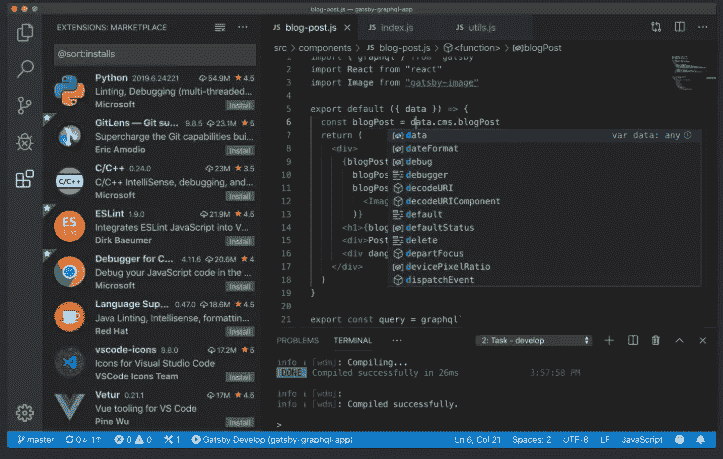
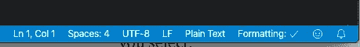
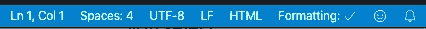
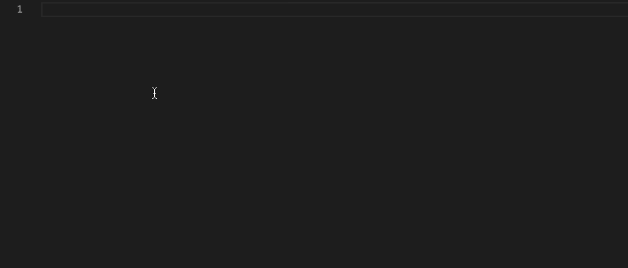
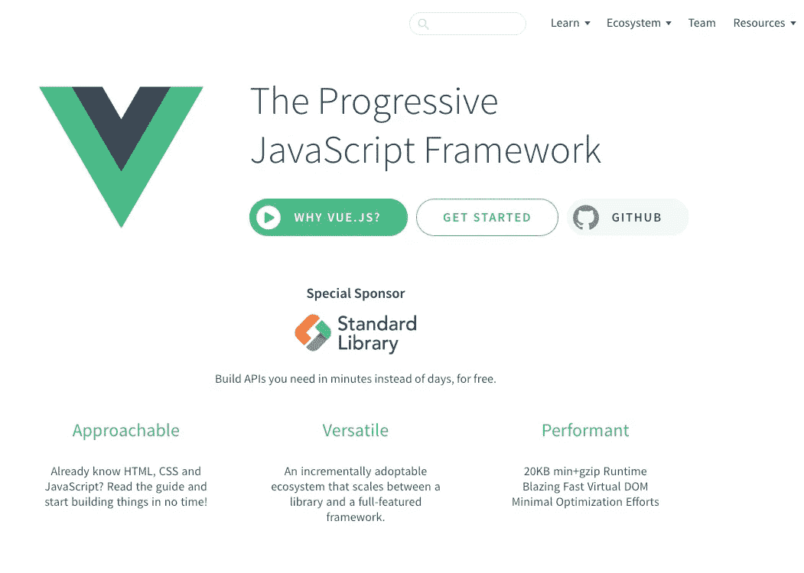
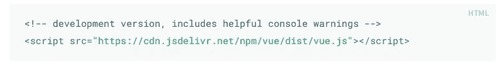
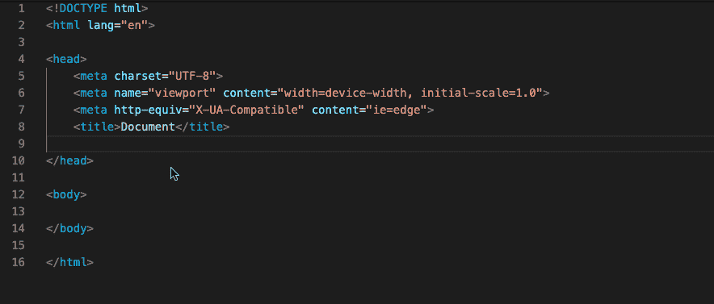
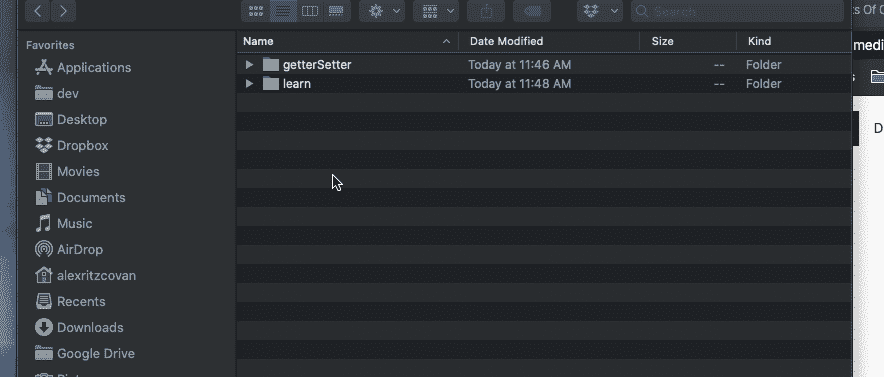
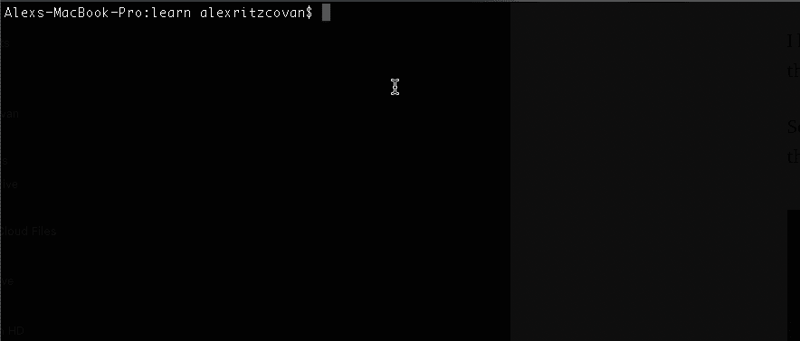
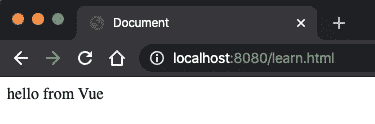

# Vue.js 初学者指南

> 原文：<https://levelup.gitconnected.com/the-beginners-guide-to-vue-js-700c39d823b7>


照片由 [Gia Oris](https://unsplash.com/@giabyte?utm_source=medium&utm_medium=referral) 在 [Unsplash](https://unsplash.com?utm_source=medium&utm_medium=referral) 上拍摄

如果你正在寻找 2020 年要学习的新技能，我认为你应该看看 Vue.js。在这个世界上，许多 JavaScript 框架需要复杂的设置才能运行，Vue 就像一股新鲜空气。Vue 的入门门槛如此之低，以至于它把我带回了 2000 年，那时你只需要在页面上放一个脚本，就可以工作了。啊，美好的旧时光。

诚然，如今 JS 世界的事情要复杂得多，围绕许多框架的工具也很棒，但是如果你只是想学习 Vue 而不需要所有的噪音和仪式，Vue 可以让你做到这一点。

您可以通过 4 个简单的步骤开始使用 Vue。

1.  选择一个编辑器。
2.  创建一个 HTML 文档。
3.  将 Vue 添加到 HTML 文档。
4.  创建主要的 Vue 实例并开始学习！

让我们看看每一步。

## 选择一个编辑器

这一步并不完全必要。你可以在你的电脑上使用文本编辑器，但是如果你使用编辑器，你会做得更好(并且有能力使用一些很酷的功能)。

不想花钱？没问题。如今正在燃烧图表的编辑器是[Visual Studio code](https://code.visualstudio.com/)…而且是免费的。查看并下载您的免费版本。谁不爱免费？



Visual Studio 代码——哦，顺便说一句，它是免费的

## 创建 HTML 文档

假设你已经接受了我明智的建议并下载了 VS 代码，现在是时候创建 HTML 文档来学习一些 Vue 了。启动 VS 代码，选择文件->新文件(mac 上的 Cmd+N)。

你会看到一张空白的画布，你可以在上面创作你的 Vue 杰作。多刺激啊！

现在，选择文件->保存。在弹出的保存文件对话框中，给你的文件起一个聪明的名字，比如 learn.html，然后把它保存在一个文件夹中，记下你选择的文件夹。稍后你需要知道那个文件夹。

单击 save 后，您会注意到 VS 代码在编辑器底部的状态栏中更改了文档类型。它将会是这样的:



像这样:



您可以看到 doctype 从纯文本变成了 HTML。因为您在保存文件时为文件指定了. html 扩展名，所以编辑器现在会将文件识别为 HTML，并在您工作时提供智能感知和自动完成功能。这是在实际的 IDE(集成开发环境)中工作而不是在一般的文本编辑器中工作的巨大好处之一。

现在我们需要添加基本的标签来使它成为一个有效的 HTML 文档。VS 代码可以再次帮助我们。如果你在编辑器中输入文本 *html* ，你会看到一个带有一些选项的智能感知下拉菜单。



创建一个基本的 HTML 文档

你可以看到有几个选项可供选择。你的下拉菜单可能看起来和我的不同，但是你应该有一个 html:5 的。

你可以在上面看到，当我突出显示它并按 Tab 键时，我得到了一个可以使用的基本 HTML 文档。酷！现在让我们将 Vue 添加到页面中。

## 将 Vue 添加到我们的 HTML 文档

打开浏览器，导航到 Vue 网站。[Vuejs.org](https://vuejs.org/)



一旦你在那里，点击标题下面的大按钮开始。这将带你到介绍页面。当您开始接触 Vue 时，您将在这里花费大量时间，但是现在，向下滚动到安装部分，您会看到以下内容:



突出显示此文本，并将其复制到剪贴板。切换回刚刚创建的 HTML 文档，并将其粘贴在 标签之间，如下所示:



向我们的页面添加 Vue

有了这些，我们就可以开始编写 Vue 了！我们走吧。

## 创建主要的 Vue 实例并开始学习！

向下滚动到 HTML 的结尾 body 标签—

在该标签前的一行输入以下代码。

在这段代码中，我们创建了一个新的 Vue 实例，并向它传递了一个对象文字。对象文本包含配置实例的属性。

如果这一切似乎超出了你的理解范围，我建议你访问我们不久前看到的那个[介绍页面](https://vuejs.org/v2/guide/)并通读一遍。另外，如果您不确定 JavaScript 中的对象文字是什么，[查看这里的 MDN 文档](https://developer.mozilla.org/en-US/docs/Learn/JavaScript)。在真正开始使用 Vue 之前，理解 JavaScript 的基础知识是很重要的。

回到代码。你可以在第三行看到

```
el: '#app',
```

这很重要。目前，我们在页面上有 Vue，我们已经创建了它的一个实例。

我们*没有*做的是告诉 Vue 我们的应用程序“*在哪里。”*

我们需要在应用程序所在的 DOM(文档对象模型)中指定一个元素。我们指定的 DOM 元素的所有子元素都将是我们的应用程序的一部分。

在开始的 body 标记后添加以下内容。

```
<div id="app">{{ message }}</div>
```

这个 HTML 元素的 id 属性是 app，这不是巧合。这与我们的 Vue 实例中的 CSS 选择器中使用的名称相同。Vue 现在知道我们的应用程序在页面上的位置，并将在应用程序中为我们提供 ***反应*** 。我们将在另一篇文章中更多地讨论反应。

另外，请注意花括号{{ }}。这些括号将提供 ***文本插值*** 。这意味着，如果在数据对象内的 Vue 实例上有一个名为 ***消息*** 的属性，它将显示在这里。

你知道吗，上面第 5 行有一个消息属性！

剩下要做的就是测试我们的页面，以确保一切设置正确。为此，让我们启动一个 web 服务器。

> 注意:虽然浏览器允许您直接从文件系统中查看文件，但我不会在这里这样做。如果你继续使用 Vue，用不了多久你就需要用 web 服务器测试了。既然如此，推迟不可避免的事情是没有意义的。另外，这很简单。

我在 Mac 上工作，所以我将提供如何在该操作系统上启动服务器的详细信息。如果你使用的是 windows，[查看这个页面来设置服务器](https://www.technig.com/setup-local-web-server-windows-10-mamp/)。

## 启动服务器

还记得我在步骤 2 中说过要记下 HTML 文件的保存位置。你现在需要那个位置。打开一个新的 Finder 窗口，并导航到您存储该文件的文件夹。

我把我的文件放在一个叫“学习”的文件夹里。(我知道…超级聪明)我们想在这个位置打开一个终端窗口。以下是方法。

选择包含您的 HTML 文件的文件夹，进入 Finder 菜单，然后在文件夹中选择服务和新终端。像这样:



从 Finder 打开终端

太好了！现在我们有一个终端窗口，打开我们需要的文件夹。现在在终端中输入以下命令。

```
php -S localhost:8080
```

这将启动一个简单的 PHP 服务器，这样您就可以在浏览器中查看您的页面。下面是运行中命令。



耶！正在运行的服务器

剩下要做的就是在浏览器中导航到 [http://localhost:8080](http://localhost:8080) 并查看我们的页面！



现在，我承认这不是最令人兴奋的一页，但我们已经准备好了所有需要的部分，可以让我们做一些很酷的事情。

既然您已经设置好了，我鼓励您仔细看看 Vue 文档并尝试一下。看看你能不能做出一些很酷的东西。

## 关键要点

1.  开始使用 Vue 既快速又简单。
2.  找一个代码编辑器来工作。这会让你的生活更轻松，过程更愉快。[试用 VS 代码，免费](https://code.visualstudio.com/)。
3.  创建一个基本的 HTML 文档，并记下保存它的位置。
4.  通过脚本标签将 Vue 库添加到页面中。
5.  在页面上创建 Vue 实例。
6.  确定 DOM 中存放应用程序的部分。
7.  在 DOM 中放一些 Vue 相关的东西，这样我们就可以看到它工作正常。
8.  启动本地 web 服务器。
9.  浏览器到您新创建的 HTML 文档，享受成功的荣耀！

一如既往，感谢您的阅读，并请查看我在 Medium 上的其他帖子。

[](https://medium.com/@aritzcovan) [## 亚历克斯·里茨科万—中等

### 阅读 Alex Ritzcovan 在媒体上的文章。前首席技术官，热衷于制作精良的软件，健身爱好者…

medium.com](https://medium.com/@aritzcovan)