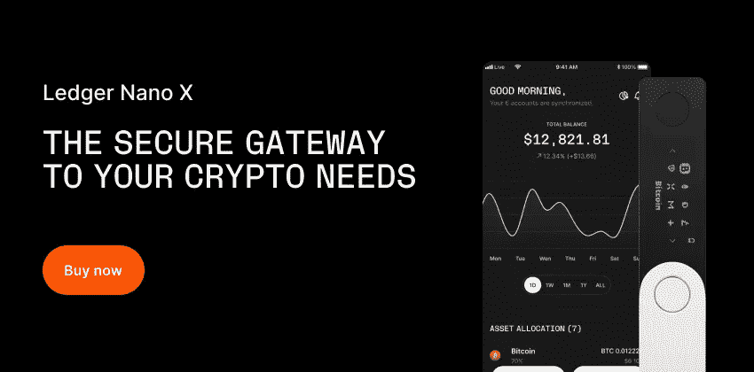

# 2023 年了解比特币的最佳书籍

> 原文：<https://levelup.gitconnected.com/the-best-books-to-learn-about-bitcoin-in-2021-d791be5b8776>

## 开始学习比特币、加密货币和区块链的最佳书籍

这是学习比特币(BTC)、加密货币和区块链的最佳书籍列表。

找到更多关于比特币黑洞的密码书

 [## 比特币洞-比特币书籍、硬件钱包等等。

### 作者:Saifedean Ammous 中央银行的分散化替代方案。虽然比特币是一个新的发明…

thebitcoinhole.com](https://thebitcoinhole.com/) 

***本文包含附属链接。如果你点击代销商链接后购买任何东西，我可能会得到一些补偿。***

# 你需要的唯一一本比特币投资书籍

***加密货币的绝对初学者指南，它将在 2021 年改变世界和你的财务&超越***

*   **作者:**弗里曼出版社
*   **年份:** 2021

**→** [**在亚马逊上立即购买**](https://thebitcoinhole.com/product/the-only-bitcoin-investing-book-youll-ever-need/)**↓**

如果你觉得自己在比特币上“坐失良机”，请三思。因为尽管比特币继续创下历史新高，但这本书将告诉你，投资“数字黄金”还为时不晚。

曾经只在网络的黑暗角落使用的边缘货币现在是地球上增长最快的金融资产。而这仅仅是开始。

你看，比特币作为一个金融实体，我们还只是处于第二局。因此，尽管没有一种金融工具能像比特币那样让人们迅速致富，但只有不到 10%的美国人和全球 2%的人口拥有比特币。

但是现在，主要玩家开始感兴趣了。像亿万富翁对冲基金老板保罗·都铎·琼斯，互联网先驱蒂姆·德雷珀，他是 Hotmail，Tesla 和 Robinhood 等公司的早期投资者，以及社交资本的首席执行官 Chamath Palihapitiya，他预测比特币在未来 15 年内将价值 100 万美元。

因此，即使你到目前为止还不相信，这本书也会给你比特币作为一种金融资产的直接事实…没有任何炒作或噪音。

**→** [**在亚马逊上立即购买**](https://thebitcoinhole.com/product/the-only-bitcoin-investing-book-youll-ever-need/) **←**

 [## 你需要的唯一一本比特币投资书籍

### 如果你觉得自己在比特币上“坐失良机”。重新考虑...因为尽管比特币一直在持续上涨…

thebitcoinhole.com](https://thebitcoinhole.com/product/the-only-bitcoin-investing-book-youll-ever-need/) 

# 比特币标准

***中央银行的分权替代***

*   **作者:**赛菲迪安·阿默斯
*   **年份:** 2018 年

**→** [**在亚马逊上立即购买**](https://thebitcoinhole.com/product/the-bitcoin-standard/) **←**

2008 年，当一位化名的程序员向一个小型在线邮件列表介绍“一种完全点对点的新电子现金系统，没有可信的第三方”时，很少有人关注。十年后，尽管困难重重，这个新贵自主去中心化软件为现代央行提供了一个不可阻挡、全球可用的硬通货替代品。比特币标准分析了比特币兴起的历史背景，允许其快速增长的经济属性，以及可能的经济、政治和社会影响。

**→** [**在亚马逊上立即购买**](https://thebitcoinhole.com/product/the-bitcoin-standard/)**↓**

 [## 比特币标准

### 当一个化名的程序员介绍“一个新的完全点对点的电子现金系统，没有可信的…

thebitcoinhole.com](https://thebitcoinhole.com/product/the-bitcoin-standard/) 

# 比特币和区块链的基础知识

***介绍加密货币及其技术***

*   作者:安东尼·刘易斯
*   **年份:** 2018

**→** [**在亚马逊上立即购买**](https://thebitcoinhole.com/product/the-basics-of-bitcoins-and-blockchains/) **←**

有很多关于加密货币和区块链的信息。但是，对于门外汉来说，这些信息大部分是难以理解的。*《比特币和区块链的基础知识》*旨在为这种新货币以及推动其发展的革命性技术提供一份通俗易懂的指南。

*比特币和区块链的基础知识*涵盖了比特币的历史、比特币区块链以及比特币购买、出售和挖掘等主题。它还回答了如何支付和如何保持交易安全。研究了其他加密货币和加密货币定价，回答了如何对加密货币和数字代币进行估值。

**→** [**在亚马逊上立即购买**](https://thebitcoinhole.com/product/the-basics-of-bitcoins-and-blockchains/)

** [## 比特币和区块链的基础知识

### “安东尼帮助我们清楚地理解了比特币和区块链的机制。”――罗布·芬德利，Next Money #1 创始人…

thebitcoinhole.com](https://thebitcoinhole.com/product/the-basics-of-bitcoins-and-blockchains/) 

# 比特币:你不能乱用的硬通货

***为什么比特币会成为下一个全球储备货币***

*   **作者:**杰森·a·威廉姆斯
*   **年份:** 2020

**→** [**在亚马逊上立即购买**](https://thebitcoinhole.com/product/bitcoin-hard-money-you-cant-fck-with/) **←**

比特币是硬通货，你不能乱用。

没有人控制它。没有政府，没有公司，没有中央银行，没有印钞。这是一场和互联网一样大的革命。而且从来没有被黑过。

企业家和投资者杰森·a·威廉姆斯是第一个将比特币置于 2020 年危机背景下的作者——这是金融灾难和前所未有的货币创造的一年(印钞机 go brrr！)

比特币不仅是 2020 年地球上表现最好的资产，随着世界各地的央行拼命印钱，比特币还悄悄地成为了下一种全球储备货币。

《你不能骗的硬通货》用简单易懂的语言解释了比特币，并描绘了这种“神奇的互联网货币”将如何发展成为我们有史以来最好的货币形式。

**→** [**在亚马逊上立即购买**](https://thebitcoinhole.com/product/bitcoin-hard-money-you-cant-fck-with/) **←**

 [## 比特币:你不能乱用的硬通货

### 比特币是硬通货，你不能乱用。没有人控制它。没有政府，没有公司，没有中央银行，没有钱…

thebitcoinhole.com](https://thebitcoinhole.com/product/bitcoin-hard-money-you-cant-fck-with/) 

# 比特币入门指南

*   **作者:**马修·r·克拉特
*   年份: 2021 年

**→** [**在亚马逊上立即购买**](https://thebitcoinhole.com/product/a-beginners-guide-to-bitcoin/) **←**

学会用比特币赚钱，即使你以前从未交易过。比特币是我们一生中最大的投资机会。

你准备好分一杯羹了吗？

这本书将教你开始投资比特币所需的一切。比特币是自互联网以来最大的革命。这是过去十年中表现最好的资产。

现在投资还来得及吗？

当然不会，如果像许多聪明的投资者认为的那样，比特币在未来 5 年内将达到 50 万美元。

**→** [**亚马逊上立即购买**](https://thebitcoinhole.com/product/a-beginners-guide-to-bitcoin/) **←**

 [## 比特币入门指南

### 比特币是我们一生中最大的投资机会。你准备好分一杯羹了吗？这本书将…

thebitcoinhole.com](https://thebitcoinhole.com/product/a-beginners-guide-to-bitcoin/) 

# 比特币亿万富翁

***天才、背叛和救赎的真实故事***

*   **作者:**本·莫兹里奇
*   **年份:** 2020

**→** [**在亚马逊上立即购买**](https://thebitcoinhole.com/product/bitcoin-billionaires/) **←**

**来自本·莫兹里奇，纽约时报*畅销书作家*意外的亿万富翁*和*打倒房子*，来自*比特币亿万富翁*——泰勒和卡梅隆·文克莱沃斯兄弟在加密货币上的豪赌及其令人眼花缭乱的回报的迷人故事。***

本·莫兹里奇 2009 年的畅销书《意外的亿万富翁》是脸书建国的权威记述，也是奥斯卡获奖电影《社交网络》的基础。故事中的两个标志性人物是哈佛学生泰勒和卡梅隆·文克莱沃斯:同卵双胞胎，奥林匹克赛艇运动员，马克·扎克伯格的陪衬。《比特币亿万富翁》讲述了兄弟俩在与脸书展开史诗般的法律大战后的救赎和复仇故事。

兄弟俩计划开始风险投资生涯，但他们很快发现，在与扎克伯格争吵后，没有人会拿走他们的钱。在伊比沙岛护理他们的伤口时，他们意外地遇到了一个古怪的角色，这个角色告诉他们一个全新的想法:加密货币。他们沉浸在当时一个晦涩、有时甚至险恶的世界中，开始意识到“加密”，用他们自己的话说，“要么是下一个大事件，要么是彻底的牛市——t。”除了打赌，别无选择。

**→** [**在亚马逊上立即购买**](https://thebitcoinhole.com/product/bitcoin-billionaires/) **←**

 [## 比特币亿万富翁

### 来自《纽约时报》畅销书《意外的亿万富翁》和《博得满堂喝彩》的作者本·莫兹里奇…

thebitcoinhole.com](https://thebitcoinhole.com/product/bitcoin-billionaires/) 

[**加入 Kindle Unlimited**](https://www.amazon.com/kindle-dbs/hz/subscribe/ku?linkCode=pf4&linkId=7a9b54a0146496b68341fef3050b6140&_encoding=UTF8&ref_=assoc_tag_ph_1454291293420&tag=dp072021-20&creative=9325&camp=1789&shoppingPortalEnabled=true) 享受大量比特币书籍:

*   [比特币初学者:投资比特币简单指南&了解区块链加密货币](https://thebitcoinhole.com/product/bitcoin-for-beginners/)
*   [新手比特币:投资加密货币和分散投资组合的终极指南](https://thebitcoinhole.com/product/bitcoin-for-beginners-favole/)
*   [感谢上帝赐予比特币:货币的创造、腐败和赎回](https://thebitcoinhole.com/product/thank-god-for-bitcoin/)
*   [初学比特币:关于比特币和其他加密货币的一切](https://thebitcoinhole.com/product/bitcoin-for-beginners-kratter/)
*   [加密投资 2021](https://www.amazon.com/dp/B0924PY12X/?tag=crypto-books-wordpress-20)

# 2023 年学习以太坊的 10 大书籍

 [## 2023 年了解以太坊的最佳书籍

### 开始学习以太坊、加密货币和区块链的最佳书籍

levelup.gitconnected.com](/the-best-books-to-learn-about-ethereum-in-2021-2eb17c555c61)**