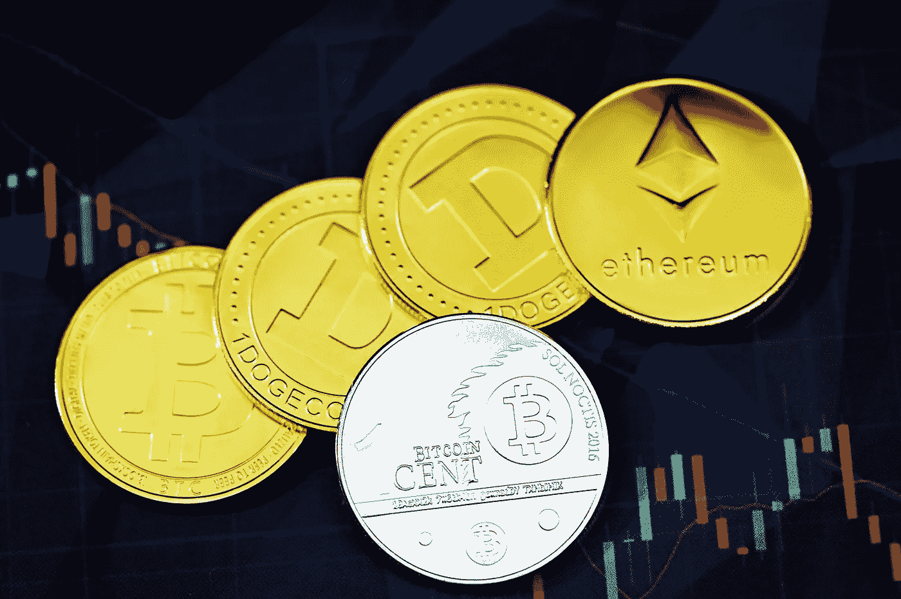
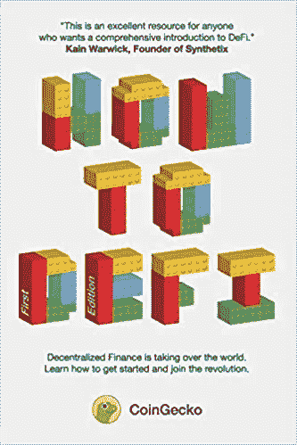
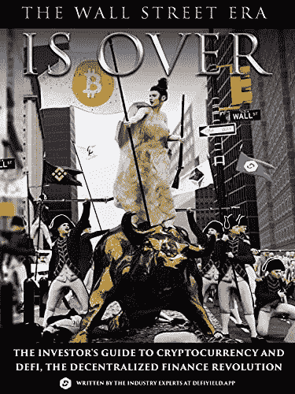
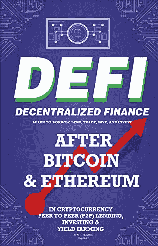
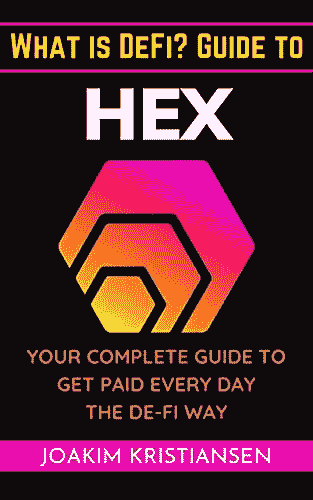
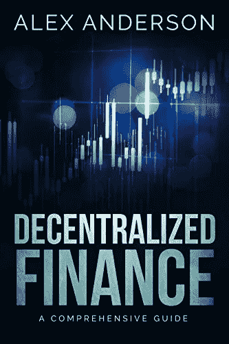
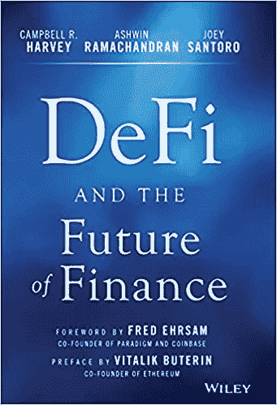

# 2023 年了解分散金融(DeFi)的最佳书籍

> 原文：<https://levelup.gitconnected.com/the-best-books-to-learn-about-decentralized-finance-defi-in-2021-5cbb97421d66>

## 开始学习分散金融(DeFi)的最佳书籍。

这是学习分散金融(DeFi)的最佳书籍列表。

找到更多关于比特币黑洞的密码书

 [## 比特币洞-比特币书籍、硬件钱包等等。

### 作者:Saifedean Ammous 中央银行的分散化替代方案。虽然比特币是一个新的发明…

thebitcoinhole.com](https://thebitcoinhole.com/) 

***本文包含附属链接。如果你点击代销商链接后购买任何东西，我可能会得到一些补偿。***

# 如何定义:初学者

*   作者: CoinGecko，Darren Lau，Daryl Lau，Sze Jin Teh，Kristian Kho，Erina Azmi，TM Lee，Bobby Ong
*   **年份:** 2021

**→** [**在亚马逊上立即购买**](https://www.amazon.com/dp/B098GT2PSG/?tag=crypto-books-wordpress-20)

****

**分散式金融(DeFi)是一个分散式应用程序的生态系统，提供建立在分布式网络之上的金融服务，没有管理权限。在撰写本文时(2020 年 3 月)，DeFi 应用程序已经在智能合约中锁定了价值超过 10 亿美元的加密货币。**

**在这本书里，你会发现:**

*   **什么是 DeFi 及其与传统金融的区别**
*   **什么是以太坊及其在 DeFi 中的作用**
*   **使用各种 DeFi 应用的逐步指南**
*   **DeFi 的真实使用案例以及您如何从该领域的机会中获利**

****→** [**亚马逊上立即购买**](https://www.amazon.com/dp/B098GT2PSG/?tag=crypto-books-wordpress-20) **←****

** [## 如何定义:初学者

### 如何定义:初学者[壁虎，硬币，刘，达伦，刘，达里尔，特，思进，科，克里斯蒂安，阿兹米，埃琳娜，何，本杰明…

www.amazon.com](https://www.amazon.com/dp/B098GT2PSG/?tag=crypto-books-wordpress-20) 

# 华尔街时代结束了

***加密货币和 DeFi 投资者指南，分散金融革命平装***

*   **作者:** DEFIYIELD App
*   **年份:** 2021

**→** [**在亚马逊上立即购买**](https://www.amazon.com/dp/1527295362/?tag=crypto-books-wordpress-20) **←**

您可以从 DeFi——令人兴奋的分散金融世界中获利！
***华尔街时代结束了*解释了如何在引领金融 3.0 革命的 DeFi 行业取得成功并安全投资。**

这本书涵盖了哪些主题？

这一意义深远的资源是“加密货币和 DeFi 投资者指南，去中心化金融革命”。它涵盖了以下关键主题以及更多内容:

*   DeFi 的历史及其在加密中的作用
*   DeFi 与传统金融有何不同
*   最重要的 DeFi 协议
*   DeFi 协议如何获得收入
*   DeFi 投资者规则手册
*   高产农业——什么是高产农业，为什么高产农业如此重要
*   如何在高产农业中取得成功
*   安全投资 DeFi
*   DeFi 骗局以及如何避免它们
*   智能合同审计的作用
*   DeFi 的未来，包括 NFTs 和不断发展的技术

**→** [**在亚马逊上立即购买**](https://www.amazon.com/dp/1527295362/?tag=crypto-books-wordpress-20) **←**

 [## 华尔街时代结束了:投资者指南加密货币和 DeFi，分散…

### 华尔街时代结束了:加密货币和 DeFi 投资者指南，分散金融革命…

www.amazon.com](https://www.amazon.com/dp/1527295362/?tag=crypto-books-wordpress-20) 

# 分散融资

***学习比特币后的借入、借出、交易、储蓄、投资&以太坊在加密货币点对点(P2P)借贷、投资&收益率农***

*   **作者:** NFT 趋势加密艺术
*   **年:** 2021 年

**→** [**亚马逊上立即购买**](https://www.amazon.com/dp/B095JCLL1Z/?tag=crypto-books-wordpress-20) **←**

有兴趣了解金融的未来吗？
DeFi 网络的价值已经从零上升到大约 420 亿美元！

自从比特币和以太坊问世以来，去中心化金融(DeFi)运动一直在稳步发展。

分散融资(DeFi)是一种新的借贷、借贷、交易、储蓄和投资方式。这是一个没有中央权威或中间人的开源金融系统。DeFi 允许您控制自己的资金并做出决定，而不依赖于银行或其他第三方。

这本书将帮助你了解这一切是如何运作的，这样你就可以自己利用这些机会了！

可以用加密货币做抵押贷款！投资加密资产，杠杆高达 10 倍！像股票一样在分散的交易所交易代币！借出你的 ETH 或 BTC 赚取利息！

**→** [**在亚马逊上立即购买**](https://www.amazon.com/dp/B095JCLL1Z/?tag=crypto-books-wordpress-20) **←**

 [## 分散金融(DeFi)学习借入、借出、交易、储蓄和投资后比特币&…

### 亚马逊网站:去中心化金融(DeFi)学习借入、借出、交易、储蓄和投资后，比特币和以太坊在…

www.amazon.com](https://www.amazon.com/dp/B095JCLL1Z/?tag=crypto-books-wordpress-20) 

# 什么是 DeFi？十六进制指南

***你每天领工资的完整指南***

*   **作者:**乔金·克里斯蒂安森
*   **年份:** 2021

**→** [**在亚马逊上立即购买**](https://amzn.to/3GN2FYd) **←**

加密货币是升值最快的资产类别，表现优于股票、房地产和贵金属。很多人想参与进来却不知道从何下手。他们听说过 crypto，也许并不完全理解它，但不想像 crypto 中的一些恐怖故事那样结束。其他人已经开始探索但不知道下一步该走哪一步。外面可能是狂野的西部…

什么是 Defi？导游可以帮忙。在这本书里，你会发现。

*   即使在熊市，你也能获得收益。
*   你可以控制你的财富。
*   你可以在没有高风险交易策略的情况下分享增长最快的资产类别。
*   发现你不知道的关于比特币和加密空间的事情。
*   了解安全但有利可图的投资目前有哪些机会。
*   深入探究区块链最有趣的项目之一。
*   你可以不用整晚看图表了。

**→** [**在亚马逊上立即购买**](https://amzn.to/3GN2FYd) **←**

 [## 什么是 DeFi？六角指南:你的完全指南，每天得到报酬的 DeFi 方式

### 什么是 DeFi？Hex 指南:亚马逊网站上每日以 DeFi 方式获得报酬的完整指南

amzn.to](https://amzn.to/3GN2FYd) 

# 分散金融

***全面指导***

*   **作者:**亚历克斯·安德森
*   **年份:** 2020 年

**→** [**在亚马逊上立即购买**](https://www.amazon.com/dp/B084RQZVZD/?tag=crypto-books-wordpress-20) **←**

分散金融始于加密货币支付，但现在涵盖了更多活动，如借贷、储蓄、分散交易所等。

DeFi 到底是什么？为什么它代表着对传统金融的严峻挑战？为什么现在每个人都在谈论它？

现在，第一次，所有这些和更多的问题将在一个简单，易于理解和全面的指南“DeFi 分散金融-全面指南”中得到回答。

在这本书里，你会学到:

*   什么是分散金融(什么不是)
*   为什么 DeFi 迅速变得更加流行和强大
*   你可以用 DeFi 做什么(你会印象深刻)
*   如何将加密储蓄货币化以获得稳定的加密收入
*   如何取得加密贷款
*   如何投资 DeFi(从它的崛起中获利！)
*   局限性 DeFi 还不能做的事情

此外，您还将获得免费的奖励章节:

*   你需要知道的 12 个最有前途的 DeFi 项目
*   值得关注的基本 DeFi 趋势

**→** [**在亚马逊上立即购买**](https://www.amazon.com/dp/B084RQZVZD/?tag=crypto-books-wordpress-20) **←**

 [## DeFi -分散金融:综合指南

### 分散金融:综合指南。下载一次，然后在…上阅读

www.amazon.com](https://www.amazon.com/dp/B084RQZVZD/?tag=crypto-books-wordpress-20) 

# DeFi 与金融的未来

*   **作者:**坎贝尔·哈维
*   **年份:** 2021

**→** [**在亚马逊上立即购买**](https://www.amazon.com/dp/1119836018/?tag=crypto-books-wordpress-20)**↓**

在 2008 年全球金融危机期间，我们的金融基础设施崩溃了。

政府救助了那些让经济下滑的机构。这一事件促使人们对我们的金融体系进行了认真的反思。股票交易需要两天才能结算，这有什么意义吗？为什么利润微薄的零售商必须为每一次顾客刷卡支付 3%的费用？为什么从银行账户转账到经纪公司或其他公司需要两天时间？为什么储蓄率很低或者是负数？为什么企业家很难从传统银行获得融资？

在《定义和金融的未来》一书中，坎贝尔·r·哈维、阿什温·拉马钱德兰和乔伊·桑托罗介绍了去中心化金融的新世界。这本书认为，当前的金融格局已经到了崩溃的时候，我们正在实时见证金融的重塑。

**→** [**在亚马逊上立即购买**](https://www.amazon.com/dp/1119836018/?tag=crypto-books-wordpress-20) **←**

 [## DeFi 与金融的未来

### DeFi 和金融的未来[哈维，坎贝尔 r，拉玛钱德朗，阿什温，桑托罗，乔伊，布特林，维塔利克，厄尔萨姆…

www.amazon.com](https://www.amazon.com/dp/1119836018/?tag=crypto-books-wordpress-20) 

[**加入 Kindle 无限**](https://www.amazon.com/kindle-dbs/hz/signup?ref_=assoc_tag_ph_1454291293420&_encoding=UTF8&camp=1789&creative=9325&linkCode=pf4&tag=dp072021-20&linkId=f16511787acea579c3def7cd77f2e8b8) ，享受无限图书:

*   [代币工程和 DeFi 的经济学和数学:代币经济学基础](https://www.amazon.com/dp/B08NCP7K7S/?tag=crypto-books-wordpress-20)
*   [DeFi 革命:关于去中心化金融和区块链技术如何颠覆世界，以及如何获利，你需要知道的事情](https://www.amazon.com/dp/B098D6GYCR/?tag=crypto-books-wordpress-20)

如果你对**以太坊或者比特币**感兴趣，也可以阅读以下文章:

 [## 2023 年了解以太坊的最佳书籍

### 开始学习以太坊、加密货币和区块链的最佳书籍

levelup.gitconnected.com](/the-best-books-to-learn-about-ethereum-in-2021-2eb17c555c61)  [## 2023 年了解比特币的最佳书籍

### 开始学习比特币、加密货币和区块链的最佳书籍

levelup.gitconnected.com](/the-best-books-to-learn-about-bitcoin-in-2021-d791be5b8776)**