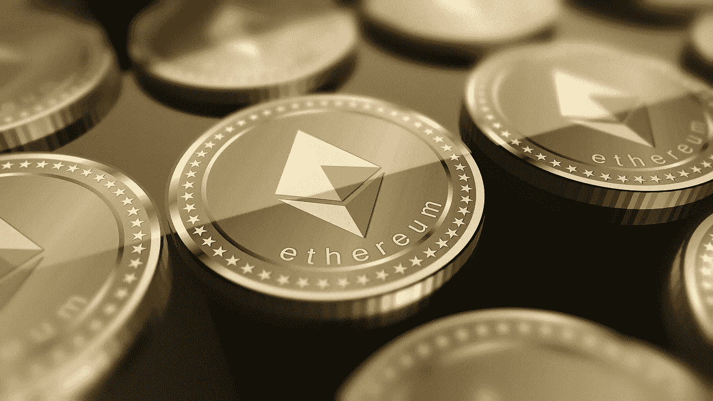
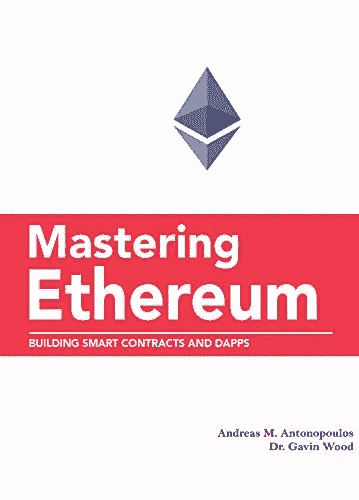
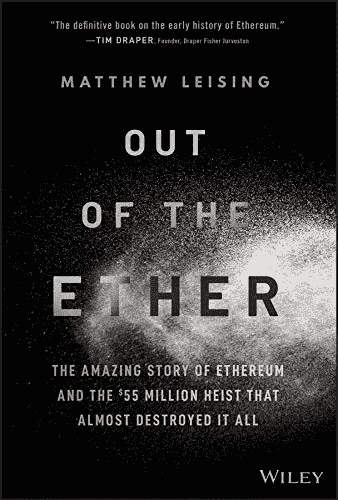
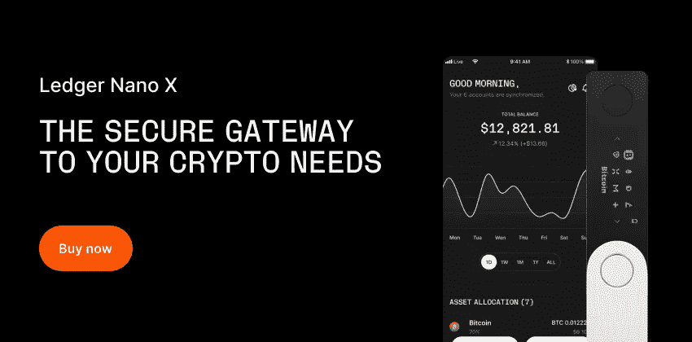
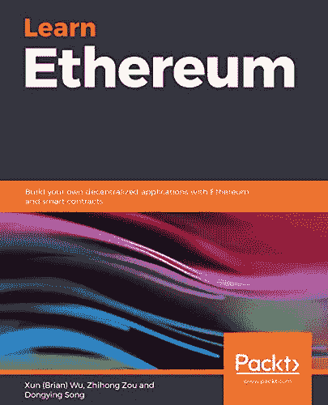
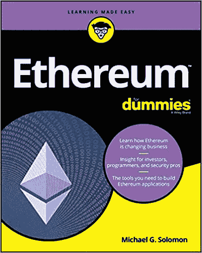
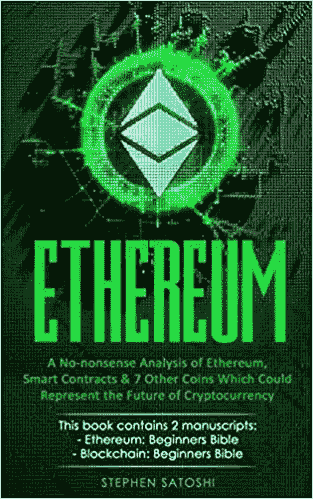
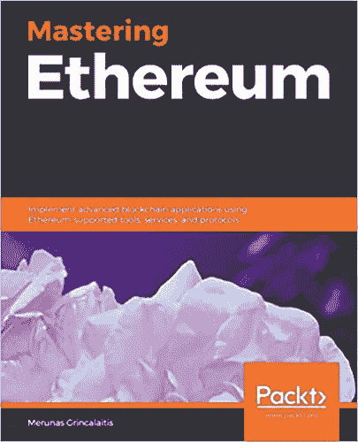

# 2023 年了解以太坊的最佳书籍

> 原文：<https://levelup.gitconnected.com/the-best-books-to-learn-about-ethereum-in-2021-2eb17c555c61>

## 开始学习以太坊、加密货币和区块链的最佳书籍

这是学习以太坊(ETH)、加密货币和区块链的最佳书籍列表。

找到更多关于比特币黑洞的密码书

 [## 比特币洞-比特币书籍、硬件钱包等等。

### 作者:Saifedean Ammous 中央银行的分散化替代方案。虽然比特币是一个新的发明…

thebitcoinhole.com](https://thebitcoinhole.com/) 

***本文包含附属链接。如果你点击代销商链接后购买任何东西，我可能会得到一些补偿。***

# 掌握以太坊

***构建智能合约和 dapp***

*   **作者:**安德烈亚斯·m·安东诺普洛斯&博士加文·伍德
*   **年份:** 2021

**→** [**在亚马逊上立即购买**](https://www.amazon.com/dp/1491971940/?tag=crypto-books-wordpress-20)**↓**

以太坊代表了通往全球分散计算模式的大门。该平台使您能够运行分散式应用程序(DApps)和智能合同，没有中央故障点或控制点，与支付网络集成，并在开放的区块链上运行。在这本实用指南中，Andreas M. Antonopoulos 和 Gavin Wood 提供了在以太坊和其他虚拟机区块链上构建智能合约和 DApps 所需的一切信息。

了解为什么 IBM、微软、纳斯达克和数百个其他组织正在试验以太坊。这本重要的指南向你展示了如何在这个不断发展和令人兴奋的新行业中发展成为一名创新者所必需的技能。

**→** [**在亚马逊上立即购买**](https://www.amazon.com/dp/1491971940/?tag=crypto-books-wordpress-20) **←**

 [## 掌握以太坊:构建智能合约和 DApps

### Amazon.com:掌握以太坊:建立智能合约和 DApps:9781491971949:Antonopoulos，Andreas M .，d .，Gavin…

www.amazon.com](https://www.amazon.com/dp/1491971940/?tag=crypto-books-wordpress-20) 

# 脱离以太

***以太坊的惊人故事和几乎毁掉这一切的 5500 万美元大劫案***

*   **作者:**马修·雷辛
*   **年份:** 2020

**→** [**在亚马逊上立即购买**](https://www.amazon.com/dp/1119602939/?tag=crypto-books-wordpress-20)

****

****了解史上最离奇的盗窃案之一中价值 5500 万美元的加密货币是如何消失的****

***脱离以太:以太坊的惊人故事和几乎摧毁它的 5500 万美元的抢劫*讲述了 2016 年 6 月价值 5500 万美元的加密货币以太失踪的惊人故事。它还记录了区块链以太坊的创建，从发明家 Vitalik Buterin 的想法到他聚集在他周围的一群乌合之众，以建立仅次于比特币的第二大加密宇宙。**

**著名记者兼作家 Matthew Leising 讲述了加密货币历史上最不可思议的篇章之一的完整故事。他也报道了抢劫的后果，解释了盗窃的受害者和以太坊的创造者为了试图限制损失所做的极端努力。该书涵盖:**

*   **以太坊的创建**
*   **区块链和加密货币的本质解释**
*   **由黑客、程序员、投资者和小偷组成的丰富多彩的群体的活动**

****→** [**在亚马逊上立即购买**](https://www.amazon.com/dp/1119602939/?tag=crypto-books-wordpress-20) **←****

** [## 以太之外:以太坊的惊人故事和几乎摧毁它的 5500 万美元的抢劫…

### 以太之外:以太坊的神奇故事...5500 万英镑的抢劫几乎毁掉了一切

www.amazon.com](https://www.amazon.com/dp/1119602939/?tag=crypto-books-wordpress-20) 

# 学习以太坊

***用以太坊和智能合约构建自己的去中心化应用***

*   **作者:**荀(布瑞恩)吴，邹志宏&宋东英
*   **年份:** 2019

**→** [**在亚马逊上立即购买**](https://www.amazon.com/dp/1789954118/?tag=crypto-books-wordpress-20)

****

****探索基于区块链的分散平台，并通过 Dapps 示例了解以太坊如何工作****

## **关键特征**

*   **探索以太坊生态系统，了解平台最新研究**
*   **在实际例子的帮助下，使用智能合同和以太坊构建去中心化应用(Dapps)**
*   **学会让你的分散式应用程序快速且高度安全**

**以太坊是一个基于区块链的分散计算平台，允许运行智能合同。这本书提供了以太坊如何工作，它的生态系统，挖掘过程和共识机制的基本概述。它还演示了构建分散式应用程序的分步方法。**

**这本书从区块链技术的基础开始。然后深入探讨以太坊体系结构、框架及其生态系统中的工具。它还为您提供了以太坊正在进行的研究的概述，例如，第 1 层和第 2 层扩展解决方案，Stablecoin，ICO/STO/IEO 等。接下来，它详细解释了 Solidity 语言，并为设计、开发、测试、部署和监控分散式应用程序提供了分步指导。**

**此外，您还将学习如何使用松露、混音、Infura、Metamask 和许多其他以太坊技术。它还将帮助您从头开始创建 ERC20 和 ERC721 智能合约，从而开发自己的加密货币。最后，我们解释私人区块链，你学习如何通过钱包与智能合同互动。**

****→** [**在亚马逊上立即购买**](https://www.amazon.com/dp/1789954118/?tag=crypto-books-wordpress-20) **←****

** [## 学习以太坊:用以太坊和智能合约构建你自己的去中心化应用程序

### 学习以太坊:用以太坊和智能合约构建自己的去中心化应用[吴，荀(Brian)，邹…

www.amazon.com](https://www.amazon.com/dp/1789954118/?tag=crypto-books-wordpress-20) 

# 假人以太坊

***了解以太坊如何改变商业。投资者、程序员和安全专家的洞察力。构建以太坊应用所需的工具***

*   **作者:**迈克尔·所罗门
*   **年份:** 2019 年

**→** [**在亚马逊上立即购买**](https://www.amazon.com/dp/1119474124/?tag=crypto-books-wordpress-20) **←**

专业人士将以太坊视为一个基于区块链的平台，以开发安全的应用程序和进行安全的交易。理解以太坊如何工作以及它做什么需要一个有知识的指导手，而*虚拟以太坊*提供了这种指导。这本书由区块链社区的主要人物之一和畅销书《傻瓜区块链》的作者撰写，揭示了以太坊的工作原理，并展示了它如何增强安全性、交易和投资。

作为区块链技术的新兴应用，以太坊吸引了广泛的专业人士，包括将它视为增强业务的金融专业人士、希望进行安全交易的安全分析师、开发使用以太坊区块链的应用程序的程序员，以及对加密货币的崛起感兴趣的投资者。虚拟以太坊为所有观众提供了一个起点，因为它简单易懂地解释了使用以太坊的工具和技术。

**→** [**在亚马逊上立即购买**](https://www.amazon.com/dp/1119474124/?tag=crypto-books-wordpress-20) **←**

 [## 假人以太坊

### 亚马逊网站:虚拟以太坊:9781119474128:所罗门，迈克尔·g:书籍

www.amazon.com](https://www.amazon.com/dp/1119474124/?tag=crypto-books-wordpress-20) 

# 以太坊的严肃分析

***以太坊的严肃分析，智能合约&其他 7 种可能代表加密货币未来的硬币***

*   **作者:**斯蒂芬·聪
*   **年份:** 2020 年

**→** [**在亚马逊上立即购买**](https://www.amazon.com/dp/191347061X/?tag=crypto-books-wordpress-20) **←**

在*以太坊:一本严肃的指南*中，你会发现:

*   即使是一个技术恐惧者也可以用你的借记卡或信用卡在 10 分钟内购买以太币(和其他加密货币)。
*   为什么这种所谓低价收购以太坊的方式，长期来看其实会让你赔钱。
*   对全部利用以太坊技术的 7 种高增长潜力加密货币的基本分析。
*   如何安全地存放你的以太坊以避免黑客的风险(这可能是你学到的最重要的东西)
*   被严重低估的以太坊令牌正在颠覆一个 100 亿美元的产业。
*   这种硬币采用的技术比其目前的竞争对手快 10 倍，便宜 50 倍，并将一家财富 500 强公司列为其客户之一。
*   关于以太坊如何工作的简单易懂、无技术术语的解释。
*   你应该和不应该从哪里获得加密货币的消息(在这个市场上，相信错误的消息来源可能会让你损失数千美元)
*   区块链技术实际上是如何工作的，以及为什么你应该比任何传统银行更信任它。
*   分散您的加密组合的低风险方式。这种“两全其美”的方法非常适合那些想参与其中，但又担心市场波动的人。
*   区块链技术如何惠及 30%的 5 岁以下儿童。
*   如何在你不明智地投资一个区块链 ICO 骗局之前发现它。

**→** [**在亚马逊上立即购买**](https://www.amazon.com/dp/191347061X/?tag=crypto-books-wordpress-20)

** [## 以太坊:对以太坊、智能合约和其他 7 种硬币的严肃分析，它们可能代表…

### 以太坊:对以太坊、智能合约和其他 7 种代表未来的硬币的严肃分析…

www.amazon.com](https://www.amazon.com/dp/191347061X/?tag=crypto-books-wordpress-20) 

# 掌握以太坊

***使用以太坊支持的工具、服务和协议实现高级区块链应用***

*   **作者:**梅鲁纳斯·格里卡拉蒂斯
*   **年份:** 2019 年

**→** [**在亚马逊上立即购买**](https://www.amazon.com/dp/B07R6W4L7Y/?tag=crypto-books-wordpress-20) **←**

以太坊是构建区块链应用程序的常用平台之一。这是一个应用程序的分散平台，可以完全按照编程运行，不受欺诈、审查或第三方干扰的影响。

这本书将让你深入了解区块链是如何工作的，这样你就可以发现整个生态系统、核心组件及其实现。您将从理解如何配置和使用各种以太坊协议来开发 dApps 开始。接下来，您将学习编码和创建强大的智能契约，这些契约可以随着 Solidity 和 Vyper 而扩展。然后，您将探索 dApps 架构的构建模块，并通过各种现实世界的示例深入了解如何创建自己的 dApp。这本书甚至会指导你如何使用所需的最佳实践和技术在多个以太坊实例上部署 dApps。接下来的几章将深入探讨高级主题，例如，使用以太坊区块链构建高级智能合约和多页面前端。除了涵盖社交媒体和电子商务等各种领域的几个用例之外，您还将专注于实现机器学习技术来构建分散的自主应用程序。

到本书结束时，你将拥有自信地构建分散式自治应用程序所需的专业知识。

**→** [**在亚马逊上立即购买**](https://www.amazon.com/dp/B07R6W4L7Y/?tag=crypto-books-wordpress-20) **←**

 [## 掌握以太坊:使用以太坊支持的工具实现高级区块链应用程序…

### Amazon.com:掌握以太坊:使用以太坊支持的工具、服务实现高级区块链应用程序

www.amazon.com](https://www.amazon.com/dp/B07R6W4L7Y/?tag=crypto-books-wordpress-20) 

[**加入 Kindle Unlimited**](https://www.amazon.com/kindle-dbs/hz/signup?ref_=assoc_tag_ph_1454291293420&_encoding=UTF8&camp=1789&creative=9325&linkCode=pf4&tag=dp072021-20&linkId=f16511787acea579c3def7cd77f2e8b8) 享受大量以太坊书籍:

*   [以太坊:理解以太坊的完整指南](https://www.amazon.com/dp/B078683DXR/?tag=crypto-books-wordpress-20)
*   [Unblockchain:区块链的大脑友好指南，从比特币到以太坊深度探索](https://www.amazon.com/dp/B091CYTX37/?tag=crypto-books-wordpress-20)
*   [以太坊:以太坊世界的终极指南](https://www.amazon.com/dp/1978012373/?tag=crypto-books-wordpress-20)
*   [赌注的证明:以太坊的制作和区块链哲学](https://amzn.to/3WlN1cj)

要了解比特币，您可以访问我们的新媒体出版物:

 [## 比特币黑洞

### 最好的比特币书籍、硬件钱包、种子备份小工具等等。

blog.thebitcoinhole.com](https://blog.thebitcoinhole.com)******