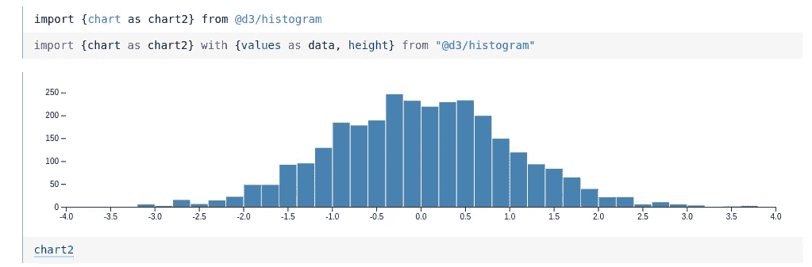

# 用于日常编码的最佳云 ide 和笔记本

> 原文：<https://levelup.gitconnected.com/the-best-cloud-ides-and-notebooks-for-everyday-coding-96731a3673c0>

[万花筒](https://unsplash.com/@kaleidico?utm_source=unsplash&utm_medium=referral&utm_content=creditCopyText)在 [Unsplash](https://unsplash.com/s/photos/collaboration?utm_source=unsplash&utm_medium=referral&utm_content=creditCopyText) 上拍摄的照片

云计算时代已经到来有一段时间了。像 AWS 和 Azure 这样的服务提供商提供一键安装你能想到的任何应用程序。企业经常将工作负载转移到云服务器上以节省成本，而较小的初创公司只需很少甚至没有前期费用就可以访问快速的按需服务器。

但是开发者环境呢？是时候让他们也享受云待遇了吧？

根据您的编程领域和您想要完成的任务，可能会有适合您的云开发环境。一些服务面向数据科学项目，而另一些则是用多种不同语言编写的成熟的 ide。您可能无法获得现代桌面 IDE 的所有功能，但是这些服务在便利性和协作工具方面弥补了不足。能够从任何计算机或位置访问您个人配置的 IDE 有它的好处，特别是如果您在多个不同的主机上工作。

在我们开始之前，值得注意的是，其中一些开发环境可以面向特定的语言或计算机科学领域。像这样的专用环境显然不适合所有人，但确实为它们支持的语言提供了健壮的特性。现在，让我们探索一下这些独特的选项。

## [谷歌合作实验室](https://colab.research.google.com/)

[https://colab.research.google.com/](https://colab.research.google.com/)

**主要语言支持:Python**

Google Colab 之所以上榜第一，是因为它是最简单易用的云编码工具之一。目前，Google Colab 仅支持编写 Python 和 Jupyter 笔记本，但如果您正在使用任何 Python 项目，这将是获得一个出色的云开发环境的超级方便和免费的方式。

编辑新的 Google Colab 笔记本。

由于 Colab 来自谷歌，默认情况下，你把笔记本和文件保存在你的谷歌硬盘里。你可以访问你所有的普通文件，并且可以很容易地从 Colab 中导入和导出文件。这使得起床和跑步变得又快又容易。你甚至不需要创建一个新的账户，你只需要去 Google Colab 开始编码。

Colab 有一个干净、实用的用户界面。您不必摆弄任何复杂的实例分配或分配资源。这也是 Colab 对于刚开始使用 Python 的人或者想要快速与其他人协作的人如此重要的部分原因。Colab 为立即开始编写 Python 提供了一个低门槛。

## 木星实验室

jupyter.org

**主要语言支持:Python，Julia，R，C++，Scheme，Ruby**

Project Jupyter 已经存在有一段时间了，它有非常广泛的特性和支持。这不仅仅是一套工具和开发环境，而是一个完整的标准。这个项目创造了(来自于 [IPython](https://en.wikipedia.org/wiki/IPython) )一种最灵活、最简单的方式来一起显示多种类型的代码和媒体，即 [Jupyter Notebook](https://en.wikipedia.org/wiki/Notebook_interface) 。大多数其他云 IDE 产品都支持运行和编辑 Jupyter 笔记本。你可以在 Jupyter 笔记本上做的事情实在是太多了，但是最新最棒的 Jupyter 项目是 JupyterLab。

在 JupyterLab 中一起编辑一个 Python 笔记本和一个 C++笔记本。

JupyterLab 是 Jupyter 笔记本电脑和更多产品的工作空间。这个界面让你可以添加代码控制台、图形等东西，并把多种文件类型作为数据源来处理。你也可以用许多不同的语言生成笔记本；连 C++都有。在 JupyterLab 中，您可以将所有这些不同的语言和组件编排在一个干净的、功能丰富的布局中。

JupyterLab 界面使用起来不像 Google Colab 那么简单，但是如果你想要大量不同的配置选项和语言支持，这就是适合你的环境。

## [可观察的](https://observablehq.com/)

[https://observablehq.com/](https://observablehq.com/)

**主要语言支持:JavaScript**

Observable 是首批成熟的 JavaScript 笔记本环境之一。这项服务可以让你用 JavaScript 而不是 Python 来组合所有普通 Jupyter 笔记本的图形和文本。Observable 让您可以在每个笔记本中运行实时 JS 代码，并快速轻松地获取您喜欢的数据可视化库。导入和显示不同的组件很直观，类似于编写您在其他地方习惯的 JavaScript。

[https://observablehq.com/@jashkenas/inputs](https://observablehq.com/@jashkenas/inputs)

使用 Observable，你可以得到一个清晰的界面来编写支持多种不同输出格式的代码。与其花时间在浏览器控制台或命令行上摆弄，你可以直接在你的笔记本上测试想法。还有其他服务，如 [CodePen](https://codepen.io/) 或 [JSFiddle](https://jsfiddle.net/) 可以让你在浏览器中运行不同风格的 JavaScript，但它们并没有提供非常精简的开发环境，更适合于测试或代码示例。

【https://observablehq.com/@d3/learn-d3-by-example? 收藏=@d3/learn-d3

Observable 对于通常需要在命令行或浏览器上组合大量不同工具的原型项目也非常有用。您可以测试不同的交互式输入，显示复杂的图形，并将您的所有工作集中在一个地方。你甚至可以在笔记本上撰写和嵌入推文。

## [AWS 云 9](https://aws.amazon.com/cloud9/)

[https://aws.amazon.com/cloud9/](https://aws.amazon.com/cloud9/)

**初级语言支持:** [**链接**](https://docs.aws.amazon.com/cloud9/latest/user-guide/language-support.html)

Cloud9 IDE 是由亚马逊 AWS 托管的全功能云开发环境。该产品是 2016 年 AWS 收购的一部分。在收购之前，Cloud9 提供了一个易于使用的、广泛的云 IDE，任何人都可以注册。收购后，坚如磐石的功能仍然存在，但现在您可以将 Cloud9 直接连接到实例，并将该环境与现有 AWS 基础架构的其他部分相关联。该产品更适合已经融入 AWS 世界的用户，但对于那些没有融入的用户来说，仍然足够简单。

Cloud9 IDE 编辑 Python 测试文件。

当您启动一个新的 Cloud9 IDE 实例时，您可以像常规实例一样调整它的大小，但是这次一旦您运行它，您将直接连接到 Cloud9 接口。这为您提供了一键式开发环境流程。Cloud9 为您提供了灵活性和对每个环境的控制，并允许您从任何地方轻松编写大量不同的代码。

Cloud9 还提供了大量不同的主题、各种各样的语法高亮显示和强大的热键映射。Cloud9 的特性集可以很容易地与现代桌面 IDE 应用程序的特性集相结合。如果你想把你的 IDE 迁移到云中，并使用各种各样的语言和框架，Cloud9 是一个很好的选择。

*感谢您的阅读！为您的下一个项目尝试这些令人敬畏的云环境之一，亲身体验其中的一些好处。如果你喜欢学习这些，但更喜欢更传统的方法，看看:* [*你应该使用 Vim*](https://medium.com/better-programming/3%C2%BD-reasons-why-you-should-be-using-vim-8202360afa3) *的 3 个理由。*