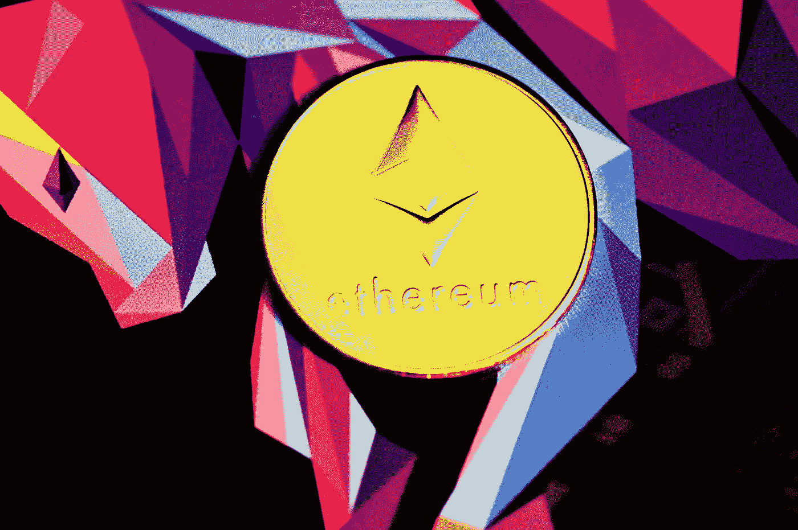
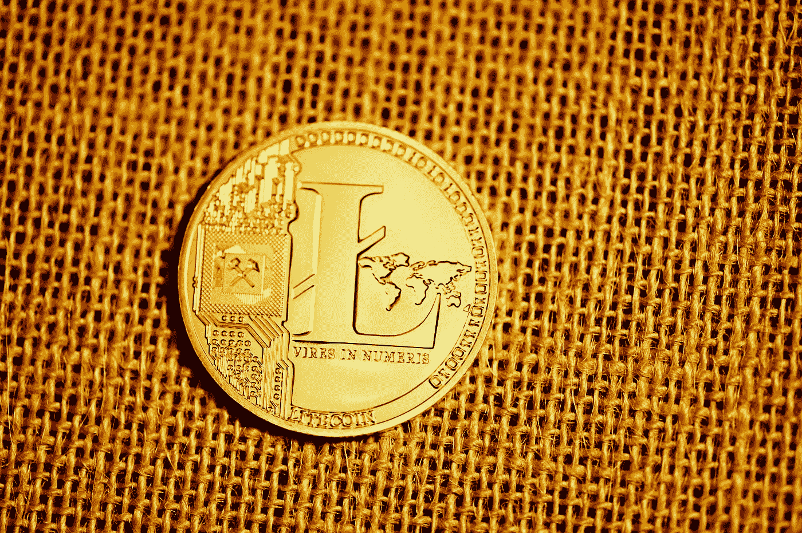
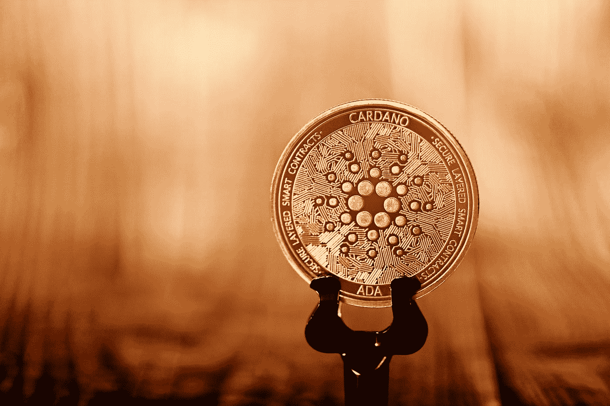

# 迄今为止最好的加密货币

> 原文：<https://levelup.gitconnected.com/the-best-cryptocurrencies-by-far-f7c0da3c5735>

在这篇文章中，我将谈论我认为迄今为止最好的加密货币。在密码领域有很多项目，他们总是在创新或提出新的系统，比如通货紧缩令牌。

我关注 Crypto 已经有一段时间了，这些是目前为止表现最好的一些项目，我也认为它们会有一个美好的未来。

***注。**我不是财务顾问，也不会告诉你投资这些项目。在把你的积蓄投入到一个项目之前，你应该做自己的研究。

[行政长官](https://unsplash.com/@executium?utm_source=medium&utm_medium=referral)在[广场](https://unsplash.com?utm_source=medium&utm_medium=referral)拍照

# 比特币

比特币是 2009 年由一个名叫中本聪的不知名的人或团体创造的，他以“比特币——人民的货币”为名发表了他的白皮书。2010 年 12 月 3 日，第一枚比特币以每枚 0.003 美元的价格售出。从那时起，比特币可以在双方之间进行交换，而无需任何中央机构的参与。没有银行、政府或公司控制这种货币供应。相反，直到 2140 年，总共只有 2100 万个比特币将被开采。

由于供应量有限，一个比特币的价格会随着时间的推移而波动。2014 年，人民币汇率达到了接近 1200 美元的高点，但在中国禁止国内交易所交易后，人民币汇率暴跌了约一半。**在真正的比特币时尚中，历史在某种程度上重演了**2021 年，在达到每枚 64000 美元的高点后，中国禁止开采，价格再次暴跌。它低至 28800 美元，但随后缓慢反弹。在写这篇文章的时候，一个比特币的价格是 44800 美元。

大多数人将 BTC 作为价值储存手段，而不是交易媒介，因为他们希望自己的钱安全。此外，在 2021 年，它是比大多数资产表现更好的资产，尤其是黄金。在 BTC 储存你的储蓄并不是一件坏事，因为由于政府印刷，美元正在慢慢贬值。

[行政长官](https://unsplash.com/@executium?utm_source=medium&utm_medium=referral)在 [Unsplash](https://unsplash.com?utm_source=medium&utm_medium=referral) 上拍照

## 比特币交易

比特币交易在散户交易者和对冲基金等机构交易者中变得更加流行。如今比特币作为一种投资获得成功的首要原因是其波动性。与政府随意印刷钞票、任由通胀侵蚀资本价值的法定货币不同，比特币的供应量严格按照需求增加。

事实上，这就是股票或大宗商品等投资的不同之处——它们的数量总是有限的，而比特币的固定上限是 2100 万单位。正因为如此，它创造了不同于任何其他资产类别的投机机会，因为人们可以随时低买高卖，而不必等到几个月后的收益报告出来。

难怪比特币受到日内交易者的欢迎，他们以每分钟为基础进行交易，寻求在几分钟内，有时是几秒钟内获得几分之一的收益，并利用由此产生的波动，无论是大还是小。

# 以太坊

以太坊由 Vitalik Buterin 于 2015 年发明，旨在创建一个平台，任何人都可以在这个平台上创建名为**智能合约**的程序。一个可编程的合同将允许开发人员构建分散的应用程序，这些应用程序完全按照用户设定的条款执行。

这意味着一旦有人付钱让黑客做某件事，没有黑客能够改变发生的事情。智能合同使区块链技术可以用于数百万不同的行业，如金融、保险和医疗保健等。

[行政长官](https://unsplash.com/@executium?utm_source=medium&utm_medium=referral)在[广场](https://unsplash.com?utm_source=medium&utm_medium=referral)拍照

目前，所有网络的可用令牌总数刚刚超过 1000 亿个。因此，如果我们将这些数字分成小数，这将意味着我剩下不到 0.0000001 个 ETH。这还不足以支付哪怕是最低工资的矿工。所以基本上，当挖掘开始时，每个人都很幸运，找到的块比网络处理它们的速度快。

这种情况一改变，价格就暴跌了。一旦市场意识到短期内不会再有大宗回报，投资者就会迅速回购，希望从未来的利润中获利。不幸的是，网络难度每 2016 个块调整一次，以确保大约每 14 天产生新的块。这使得很难预测何时会有下一个支付期。

以太坊在 2017 年经历了许多变化，包括 7 月加入比特币基地。2017 年底突破 300 美元关口，1400 美元附近见顶。2021 年**发生的许多事件使得价格跃升至每枚硬币 4372 美元**。比特币牛市主要促成了前所未有的高价。目前，购买一套 ETH 需要花费近 3217 美元。

# 它们是如何工作的？他们的目的是什么？

除了用于交换商品或其他商品之外，加密货币在任何方面都不同于传统货币。它们不是由政府或银行发行的。相反，他们使用点对点网络，任何人都可以成为网络的一部分。

这种去中心化允许人们彼此交易，而不需要中间媒介，如中央服务器或第三方支付处理器。这也使得这一过程更加便宜，因为没有人需要为每笔交易支付费用。

区块链基本上只是一个记录所有交易的分类账系统，因此每个人都知道在任何时间点谁拥有什么。

# 莱特币

莱特币由查理·李于 2011 年 10 月推出。他想改进比特币，所以他设计了能够更好地抵御黑客攻击的加密硬币。

这些硬币也需要更长的时间来生产，这意味着交易费用需要增加。由于这些因素，相对于其他加密货币，莱特币往往升值缓慢。如果你选择投资莱特币，期待你的投资组合随着时间的推移逐渐增长，而不是疯狂地上下波动。

[行政长官](https://unsplash.com/@executium?utm_source=medium&utm_medium=referral)在[广场](https://unsplash.com?utm_source=medium&utm_medium=referral)拍照

2012 年 11 月，金融犯罪执法网络发布了指导意见，指出虚拟货币一般应被视为"货币传输服务"，受到与传统支付处理器类似的监管要求的约束。

> 根据 FinCen，仅作为采矿者进行交易以换取直接支付给他的报酬的人，不从事旨在通过向第三方销售货物或提供服务产生收入的活动。

# 什么是 ICO？

首次公开募股是指初创公司在首次公开募股期间发行自己的数字货币，称为“代币”。

代币代表对企业未来收入流的某一部分的所有权。投资者购买代币是因为他们相信从长远来看代币的价值会增加。作为回报，投资者将获得一部分新创造的硬币。

# 卡尔达诺

[行政长官](https://unsplash.com/@executium?utm_source=medium&utm_medium=referral)在[广场](https://unsplash.com?utm_source=medium&utm_medium=referral)拍照

Cardano 的目标是建立一个去中心化的操作系统，它将允许人们创建程序，而不必依赖于中心化的实体。这个项目的市值低于 100 亿美元，是 IOHK 的一个分支，IOHK 是由 Charles Hoskinson 创建的一个组织，他以前在 IBM 和微软工作。

**Cardano 于 2015 年推出**，由于它能够运行复杂的代码，同时保持相对容易理解，因此迅速获得了程序员的青睐。它还像以太坊一样工作，以实现智能合约和分散化应用，这些应用由它的原生硬币 ADA 提供支持。

在撰写本文时，一枚 ADA 硬币的价格是 2.43 美元，我相信现在购买还不算太晚。它的市场主导地位仅为 3.85%，但它仍然是世界上排名第三的加密货币。卡尔达诺有一个光明的未来，它背后的团队将带领它取得更大的成功。

# 什么是 Altcoin？

替代币是比特币之外的数字货币的别称。术语“alt”来自于这些货币是在最初的比特币协议之外创建的。

如今有数百种不同类型的替代货币，包括 LiteCoin、PeerCoin、NameCoin、Decred、MaidSafeCoin、DarkCoin、PrimeCoin、counter partner、Ripple、NXT 等。

# 结束语

这篇文章有点杂乱无章，但我确信信息显示正确，你也从中学到了一些东西。为了确保你已经理解了要点，看一下下面的要点。

*   比特币是 2009 年由一个名叫中本聪的不知名的人或团体创造的。
*   2010 年 12 月 3 日，第一枚比特币以每枚 0.003 美元的价格售出。
*   到 2140 年，总共只有 2100 万个比特币将被开采。
*   如今比特币作为一种投资获得成功的首要原因是其波动性。
*   以太坊是由 Vitalik Buterin 在 2015 年发明的，旨在创建一个平台，任何人都可以创建被称为智能合同的程序。
*   区块链基本上只是一个记录所有交易的分类账系统，因此每个人都知道在任何时间点谁拥有什么。

*   莱特币由查理·李于 2011 年 10 月推出。
*   首次公开募股是指初创公司在首次公开募股期间发行自己的数字货币，称为“代币”。
*   Cardano 于 2015 年推出，由于它能够运行复杂的代码，同时保持相对容易理解，因此迅速获得了程序员的青睐。
*   Cardano 的目标是建立一个去中心化的操作系统，它将允许人们创建程序，而不必依赖于中心化的实体。
*   替代币是比特币之外的数字货币的别称。术语“alt”来自于这些货币是在最初的比特币协议之外创建的。

我花时间把列表做得更长一些，以便你更好地理解这篇文章的内容。请务必关注我和我的时事通讯，因为我经常在 Medium 上发帖。如果你对这篇文章有任何问题，不要犹豫，在下面留下你的评论。