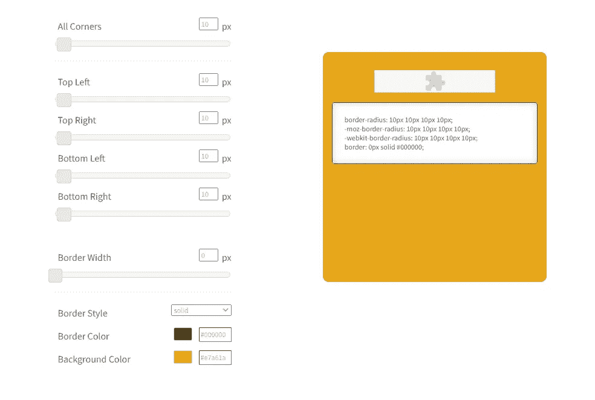

# 开发人员的最佳 CSS 工具| CSS 备忘单

> 原文：<https://levelup.gitconnected.com/the-best-css-tools-for-developers-css-cheat-sheets-4e1c377c73d6>

## web 开发人员最好的朋友！

## 如果你是一名网络开发人员，你需要使用这些工具！

CSS 工具是创建专业网站的好工具，可以让你的工作变得更容易。它们提供了令人惊叹的功能，如动画、自定义样式等。其中一些甚至提供响应式设计选项。

有成百上千的 CSS 编辑器。然而，每一种都有其独特的功能。哪个最好？答案就在你的要求之内。您可能希望创建具有响应性布局的网站，或者创建复杂的动画而无需编写代码。

发挥你的想象力，不时尝试一种新工具。有大量免费的 CSS 编辑器应用程序。只要确保它们支持现代浏览器。你也应该考虑购买带有额外工具的高级软件。

## [CSS Matic](https://www.cssmatic.com/)

这是一个非盈利项目，由开发人员为开发人员制作，因为他们喜欢在自己的网站上做广告。网站上有 4 个工具可以帮助你编写 CSS 代码。

第一个是渐变颜色，你可以在可视化编辑器中设置完美的渐变组合，设置颜色，不透明度，位置，色调等等。然后这些工具会让你准备好代码，点击几下就可以复制并插入到你的网站上。您可以选择 CSS 或 SASS 代码。

第二个工具是边框半径，这是一个简单易用的工具，可以帮助你改变所选元素的边框。这是一个节省时间的方法，我们开发人员喜欢节省时间！

你还可以在这个网站上找到两个更神奇的工具，噪波纹理工具和框阴影工具。要了解更多信息并开始使用它们，请点击[此链接](https://www.cssmatic.com/)进入网站。

## [纽扣制造商](https://css-tricks.com/examples/ButtonMaker/)

顾名思义，这是一个网络工具，将帮助您创建最大的期待，顺利，现代按钮。最棒的是，它有一个很酷的用户界面，使得创建过程非常简单明了。

当你创建了你想要的按钮后，你只需要点击按钮，它会显示‘查看 CSS’以使它更容易理解。这确实有助于你的设计，并节省了大量的时间。你可以点击[这个链接](https://css-tricks.com/examples/ButtonMaker/)来查看这个工具。

## [三角形制造者](http://apps.eky.hk/css-triangle-generator/)

顾名思义，你将再次得到你将在这个工具中制作的三角形的代码。尽管看起来有点复杂，但总体来说还是很简单的。

与上一个工具相比，用户界面可能看起来有点过时，但它会让你的生活轻松十倍。从图片中可以看到，代码直接显示在右侧。要访问该工具的网站，请点击[此链接](http://apps.eky.hk/css-triangle-generator/)。

## [CSS 精灵生成器](https://spritegen.website-performance.org/)

CSS sprites 是一种 web 开发策略，它将多个小图像合并成一个更大的图像，以减少加载所需的 http 请求的数量。这就是为什么这个工具真的很重要，会帮你很多忙。

图像缓存技术可以提高网站性能，尤其是当使用大量较小的图像时。例如，雅虎！主页使用图像缓存正是为了这个目的。你可以通过访问[这个链接](https://spritegen.website-performance.org/)来亲眼看看这个工具。

## [CSS 验证](http://jigsaw.w3.org/css-validator/)

CSS 验证是用来根据样式表验证 HTML 文档的机制。它确保网页看起来像你期望的那样，使用正确的格式或显示正确的信息。

这是一个很棒的工具，它将确保我们在完成代码和交付产品之前，代码中没有任何错误、bug 或差错。您可以通过访问[此链接](http://jigsaw.w3.org/css-validator/)来使用该工具。

## [CSS 箭头](https://cssarrowplease.com/)

这和其他工具一样，它有一个 UI 来帮助你在 CSS 中创建最好的箭头。对于初学者来说，它非常方便，因为他们可能会发现浏览代码和查看代码背后的设计很困难。

这就是为什么这个工具很棒的原因，它会帮你节省一些时间，还会提高你的箭头设计技能。您可以通过前往[此链接](https://cssarrowplease.com/)查看该工具。

# [图像到数据-URI](https://websemantics.uk/tools/image-to-data-uri-converter/)

这个工具将帮助你将图像转换成 base64 数据 URIs，以便将它们直接嵌入到你的网站的 HTML 代码中。这样做的目的是提高页面加载性能并降低 https 连接。

如果你想拥有一个快速响应的网站，这一点尤其重要，因为大多数设计师并不真正关心优化。您可以通过访问[此链接](https://websemantics.uk/tools/image-to-data-uri-converter/)来查看该工具的运行情况。

## [模式化](http://www.patternify.com/)

这是一种工具，它的名字本身就揭示了其中的奥秘。如果你想要任何类型的模式，那么你可以定制你自己的或者使用一些定制的模式，然后立即得到代码。

它确实很有用，有几次我很想在浪费大量时间编写代码之前了解一下这个工具。您可以通过访问[此链接](http://www.patternify.com/)查看该工具。

# 结束语

我希望这篇文章能帮助你们中的一些人找到他们正在寻找的合适的工具。在我的旅程开始时，我希望我知道其中的一些，这会节省我很多时间。

如果你对这篇文章有任何问题或建议，请不要犹豫，在评论区回复。喜欢你读的东西吗？为什么不关注我的媒体简讯，这样你就不会错过我未来的任何文章了？很简单，点击[这里](https://kgabeci.medium.com/subscribe)输入你的邮箱地址，按订阅。

你喜欢阅读媒体上的文章吗？考虑成为会员，有很多功能，你将获得所有创作者的内容，每月只需 5 美元。使用[这个链接](https://kgabeci.medium.com/membership)，你也帮我赚一小笔佣金，点击成为会员，输入你的信息。