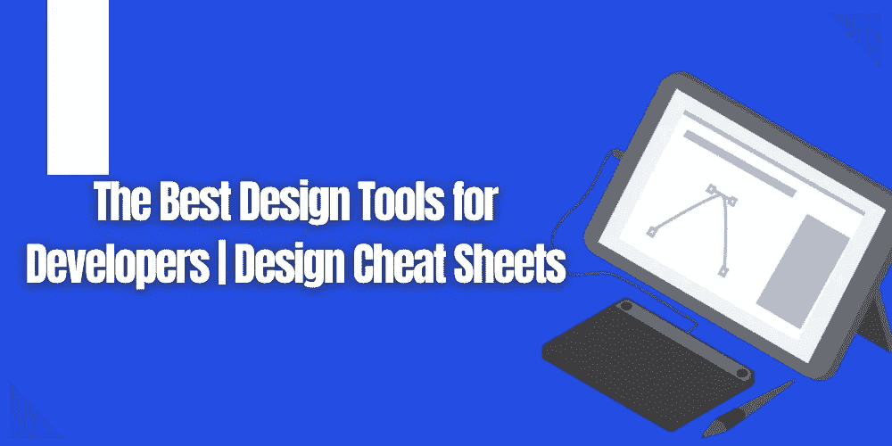
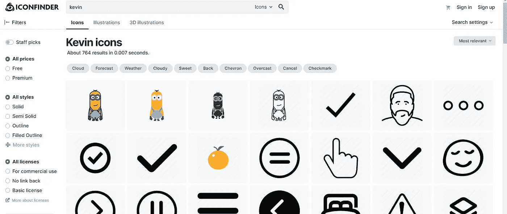
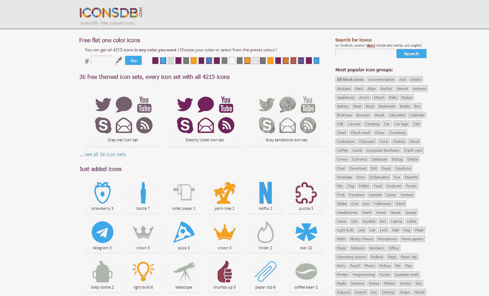
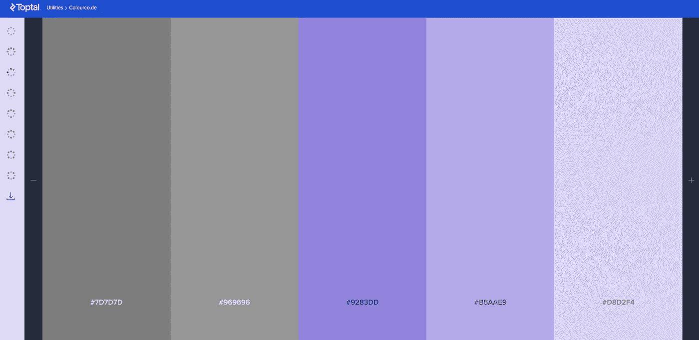
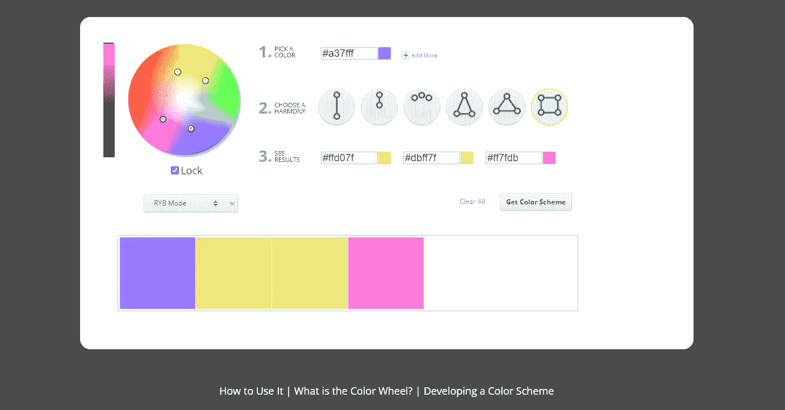
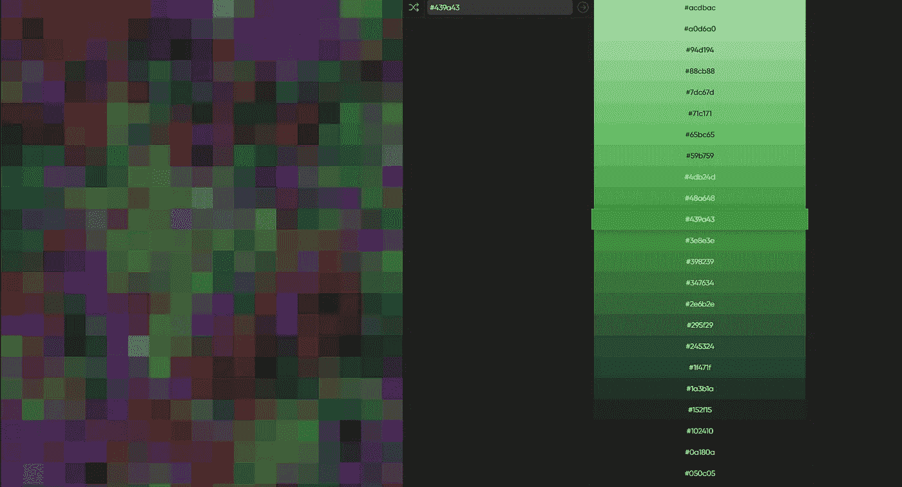
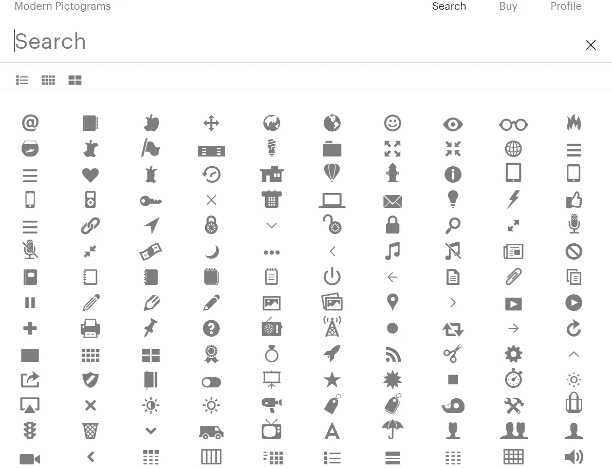
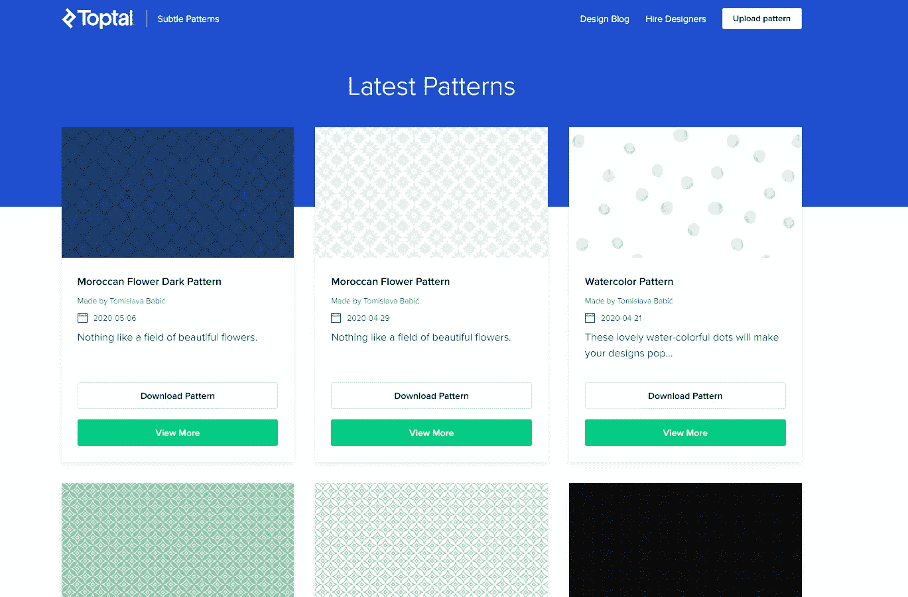

# 开发人员的最佳设计工具|设计备忘单

> 原文：<https://levelup.gitconnected.com/the-best-design-tools-for-developers-design-cheat-sheets-ce42197876c5>

## WEB 开发人员最好的朋友！

## 如果你是一个网页开发者，你需要使用这些设计工具！

这些是开发人员的一些最好的设计工具，它就像一个设计的备忘单。我们开发人员倾向于更多地关注编码和后端，所以拥有一些设计工具是个好主意。

在这个列表中，你可以找到帮助完善你的网站所需的一切，从设计工具为博客制作完美的特色图片，到用于构建登录页面的图标。

我个人已经使用了这些工具中的大部分，所以你知道这些将是一些很好的选择，而其他的我只是采用其他同行的话。另外，我写了一篇关于 JavaScript 和 CSS 的最佳工具的文章，你可以在下面找到。

 [## 开发人员的 5 个最佳 JavaScript 工具| JS 备忘单

### 如果你是一名网络开发人员，你需要使用这些工具！

levelup.gitconnected.com](/the-5-best-javascript-tools-for-developers-js-cheat-sheets-ed103b8a11fb)  [## 开发人员的最佳 CSS 工具| CSS 备忘单

### 如果你是一名网络开发人员，你需要使用这些工具！

levelup.gitconnected.com](/the-best-css-tools-for-developers-css-cheat-sheets-4e1c377c73d6) 

## [图标查找器](https://www.iconfinder.com/)

因此，顾名思义，这个工具将帮助你找到图标，插图，三维插图，艺术，图形，以及更多。这个工具最好的一点是所有的图片都是免费的，你可以用它们做任何事情。

事情是这样的，有一个支付系统，或者你可以支付每个图标 2 美元，每个插图或 3D 插图 5 美元。也就是说，不是所有的东西都是付费的，你也可以找到免费的东西，比如卑鄙的我的爪牙凯文。你可以通过访问[这个链接](https://www.iconfinder.com/)来查看这个网站。

## [图标 DB](https://www.iconsdb.com/)

这是另一个帮助你找到你需要的最佳图标的工具，无论你需要一个干净的 Instagram 图标还是一个中等的图标，你都可以在那里找到。

一些下载量最大的图标是 Twitter one、足球、上传、箭头顶部、Instagram 和图表。你可以从这个网站上免费得到所有的东西，这是一个巨大的好处。你可以通过访问[这个链接](https://www.iconsdb.com/)来检验这个工具。

## [配色方案](https://www.toptal.com/designers/colourcode/monochrome-dark-color-builder)

这是一个由最负盛名的自由职业平台之一 Toptal 制作的工具。他们已经建立了这个神奇的工具，给你选择，并帮助你找出一个配色方案。

有很多选项可供你选择，找出最好的调色板。来自 freebuild、单色、单色深灰色、单色浅灰色、模拟、模拟和补色、三色或四色。您可以通过访问[此链接](https://www.toptal.com/designers/colourcode/monochrome-dark-color-builder)来查看该工具。

## [颜色计算器](https://www.sessions.edu/color-calculator/)

规划下一个设计项目时，使用免费的颜色计算器创建颜色的初始选择，然后使用各种方法探索各种颜色组合，包括颜色协调、模拟色、补色、三原色和调色。

这个工具真的很方便，特别是对于那些必须弄清楚他们的设计颜色的开发者来说。这会帮你摆脱困境，节省很多时间和精力，所以为什么不试一试呢？你可以去[这个链接](https://www.sessions.edu/color-calculator/)查看这个工具。

## [0 到 255](https://www.0to255.com/439a43)

0to255 是一个颜色选择器工具，可以轻松地从数千种颜色中选择任何颜色。要使用它，请通过在颜色网格内单击或使用键盘输入十六进制代码来选择颜色。然后十六进制代码将被复制到您的剪贴板。

一旦你点击颜色，右边会有一个类似调色板的面板。在那里你可以得到一些很酷的变体，并找出哪种颜色最适合你的项目。您可以通过访问[此链接](https://www.0to255.com/439a43)来查看该工具。

## [现代象形文字](https://modernpictograms.com/)

现代象形图是一个易于使用的符号库，专为界面设计，演示图形，标志，动画，等等。此外，Airbnb Design 使用 Lottie 2.x 制作了一些图标的动画。

你只需要 25 美元就可以得到整个现代象形图工具库，我认为这是一个合理的价格，因为你还可以得到一些非常酷的动画。请访问[此链接](https://modernpictograms.com/)查看这款超酷的工具。

## [细微的图案](https://www.toptal.com/designers/subtlepatterns/)

这是 Toptal 的另一个神奇的工具，如果你想找到一个很酷的模式，它可以提供很大的价值。它是完全免费的，你可以下载任何你认为最适合你和你的项目的模式。

如果你是一个熟练的设计师，并且创造了一个很酷的图案，你也可以很容易地上传到他们的网站上。对每个感兴趣的人来说，这绝对是一个必不可少的工具。你可以通过访问[这个链接](https://www.toptal.com/designers/subtlepatterns/)来了解一下。

# 结束语

好吧，我希望这篇文章能帮助你找到合适的工具，无论你现在或将来需要什么样的工具。我已经使用了这些工具中的大部分，并且我已经在我的项目中使用了它们，结果非常好，所以我向你们所有人推荐它们！

如果你对这篇文章有任何问题或建议，请不要犹豫，在评论区回复。喜欢你读的东西吗？为什么不关注我的媒体简讯，这样你就不会错过我未来的任何文章了？很简单，点击[这里](https://kgabeci.medium.com/subscribe)输入你的电子邮件地址，然后点击订阅。

你喜欢阅读媒体上的文章吗？考虑成为会员，有很多功能，你将获得所有创作者的内容，每月只需 5 美元。使用[这个链接](https://kgabeci.medium.com/membership)，你也可以帮我赚一点佣金，点击成为会员，输入你的信息。