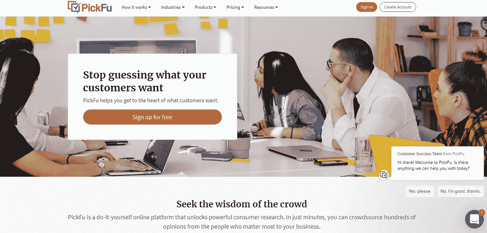
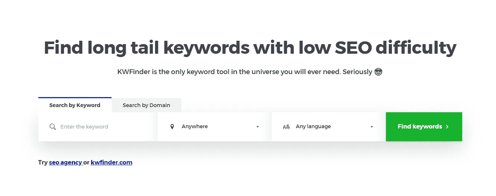
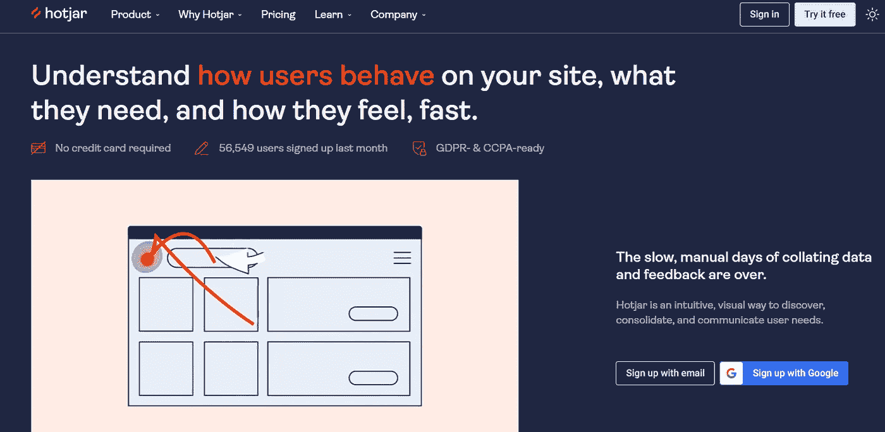

# 最佳数字营销工具|营销人员备忘单

> 原文：<https://levelup.gitconnected.com/the-best-digital-marketing-tools-marketers-cheat-sheet-3f1c74fbf808>

## 销售者最好的朋友！

## 如果你对营销感兴趣，那么你需要使用这些数字营销工具！

我鼓励每个数字营销人员尝试这些工具！如果你知道一些比我在这篇文章中提到的工具更好的选择，不要犹豫，把它们留在下面的评论区。

让我们一起来看看哪些工具效果最好。通过结合我们的经验，我们将获得一份拥有最佳数字营销工具的清单。

> 好的营销让公司看起来很聪明，伟大的营销让客户感觉很聪明。

不再浪费时间，让我们继续这篇文章的剩余部分，我将向你展示一些我用过的最好的数字营销工具。

# [标题生成器](https://www.title-generator.com/)

我要展示的第一个工具是标题生成器。这是一个很棒的工具，可以帮助你找到很酷的内容创意、吸引人的标题、广告活动标题等等。当你觉得自己陷入困境或精疲力尽，想要新的想法时，这尤其有用。

通过使用这个工具，你肯定会激发你大脑中的一些神经元，帮助你找到新的想法。希望你能想出新的、令人敬畏的话题，我们稍后会读到。你可以点击[链接](https://www.title-generator.com/)开始制作标题。

用这个工具启动你的写作之旅，开始通过媒体赚钱吧！我能够在**合作伙伴计划**的 ***第一个月*** 比*多赚**250 美元。你可以使用[这个链接](https://kgabeci.medium.com/membership)加入开始享受媒体和它的功能，它将帮助我们作家，并给我你订阅的一小部分。***

# ***匹克福***

***这是一个不寻常的工具，但它在营销和决策时会非常有用。如果你曾经在选择选项 A 或选项 B 之间犹豫不决，那么这个网站会有很大帮助。***

******

***你可以立即从一个庞大的在线社区获得结果，这太棒了。这肯定会帮助你找出哪个选项是最好的，投票者通常会留下他们为什么做出选择的评论。你可以通过[这个链接](https://www.pickfu.com/)找到这个工具。***

# ***[标题分析器](https://coschedule.com/headline-analyzer)***

***了解你为你的博客或内容选择的标题是否会产生足够的流量，使之值得。事实上，这是一个很大的决定，通过这个工具，你将会看到标题是否值得，以及你可以尝试哪些更有趣的建议。***

******

***这真的很简单，你把标题放在显示的位置，然后按下“立即分析”按钮。然后一份报告将产生你的建议和你的文章如何排名。您可以点击[此链接](https://coschedule.com/headline-analyzer)进入该工具。***

# ***[关键词研究工具](https://kwfinder.com#a621a767efeebf867fc71d22f)***

***现在你应该已经知道，找到最佳关键词是创建在线内容时最重要的事情。这就是为什么有了这个关键词研究工具，你只能找到最好的东西。***

******

***我经常使用这个关键字研究工具，它总是给我提供大量最新的信息。它将向您显示每个关键字有多少搜索，每次点击的成本是多少，排名难度，趋势等等。这是市场上所有其他产品中的最佳选择，你可以在这里找到它。***

# ***[热罐](https://www.hotjar.com/)***

***这个工具将直观地呈现用户与你的内容交互的位置，比如他们在哪里点击，在哪里滚动，悬停等等。这真的很重要，因为它让你知道什么可行，什么不可行。***

******

***数据收集现在是实时完成的，Hotjar 将对此有极大的帮助。这是这个列表中最重要的营销工具之一，尽管它排在最后。您可以通过访问[此链接](https://www.hotjar.com/)了解更多关于它如何工作以及如何设置的信息。***

# ***结束语***

***我希望这篇文章告诉你一些对你的营销生涯有帮助的酷工具。这些在过去确实对我有用，我也经常使用其中的一些，比如[关键词查找](https://kwfinder.com#a621a767efeebf867fc71d22f)工具。正如我在开头所说的，我们非常感谢您的建议。***

***如果你对这篇文章有任何问题或建议，请不要犹豫，在评论区回复。喜欢你读的东西吗？为什么不关注我的媒体简讯，这样你就不会错过我未来的任何文章了？很简单，点击[这里](https://kgabeci.medium.com/subscribe)输入你的电子邮件地址，然后点击订阅。***

***你喜欢阅读媒体上的文章吗？考虑成为会员，有很多功能，你将获得所有创作者的内容，每月只需 5 美元。使用[这个链接](https://kgabeci.medium.com/membership)，你也可以帮我赚取一小笔佣金，点击成为会员，输入你的信息。***