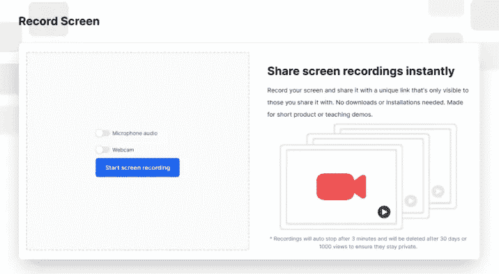

# 最好的工程师像投资者一样思考，而不是建筑商

> 原文：<https://levelup.gitconnected.com/the-best-engineers-think-like-investors-not-builders-cf005e75ab80>

## 你的方法比技术细节更重要

谷歌首席执行官桑德尔·皮帅

我大学期间住在图书馆。

“我学习的教科书理论越多，我就会成为一名更好的工程师，”我想。

然而，当我开始工作时，我注意到业内最优秀的工程师并不一定比应届毕业生懂得更多的理论。他们只是带来了不同的思维方式，投资者的思维方式。

正是这种心态帮助他们提出更聪明的问题，更好地区分优先次序，并使自己与众不同。像投资者一样，他们:

*   专注于回报早于回报晚的工作
*   在投入工作之前，计算一下这项工作是否值得他们花费时间
*   权衡他们工作的机会成本

在这篇文章中，我讨论了每个工程师在职业生涯中都会面临的 3 个常见问题，以及投资者的心态将如何帮助你每次都做出正确的技术决策。

# 1.你的工作什么时候会有回报？

在投资中，有一个概念叫做“金钱的时间价值”这是指现在的钱比以后的钱值钱。你宁愿在一年后收回投资，而不是五年后。

工程工作也有“时间价值”。现在有回报的工程项目比以后有回报的工程项目更有价值。

我们最近在脸书股票上看到了这一点。当高管们透露他们在元宇宙的投资可能在“15 年后”才会有回报时，该指数从历史高点下跌了 50%

Meta 也已经投资了超过 100 亿美元。

正如元宇宙漫长的回报期吓坏了投资者一样，工程师们应该避免那些回报期太遥远的工作。当涉及到工程迁移时，这个错误尤其容易发生。

**为什么迁移比你想象的要昂贵**

从投资的角度来看，工程迁移是有保证的前期成本，未来回报不确定。这些回报并没有像大多数人意识到的那样长久。

考虑下面两年迁移的时间表。

成本有保证，但回报没有。

首先，我们现在花在迁移上的两年时间比我们以后从迁移中获益的两年时间更有价值。因此，迁移的盈亏平衡点比四年后更长。

其次，任何迁移的回报都必须超过工作的成本。花两年去攒两年，没什么意义。那么您还不如根本不进行迁移。

你应该贴现第 3 年和第 4 年的回报，因为这是在未来。

我有一个原则，任何工程工作必须至少有两倍的回报来证明成本的合理性。如果我花一个月的时间进行迁移，就必须节省两个月的时间来回报。

根据这一规则，如果您花费两年时间进行工程迁移，您必须享受双倍迁移时间带来的好处才能实现收支平衡。

因此，2 年迁移的盈亏平衡点实际上是在 4 年后，也就是从迁移开始的 6 年后。

你愿意等 6 年才能看到 2 年迁移的回报吗？

迁移时间越长，可能永远得不到回报的风险就越大。其他风险包括:

*   改变业务优先级—公司可能会贬低团队的服务，使迁移变得过时。
*   退出风险——如果一家初创公司被收购，这些迁移不会影响初创公司的估值，因此提供零商业价值。
*   执行风险—一个简单的执行错误(如数据泄露)就可能抵消迁移的所有回报。

教训是，工程应该偏向于回报早于回报晚的项目，否则可能永远看不到回报。

# 2.这个项目值得你花时间吗？

沃伦·巴菲特曾经说过，一家公司的回报“更多的是取决于你乘坐的商业船只，而不是你划船的效率。”

同样的原理也适用于工程。从事正确的项目(上正确的船)比你写的代码的细节(你划得多努力)更重要。

当涉及到工程中的购买与建造决策时，这一点尤为重要。

虽然我承认我对绿地项目感到兴奋，但重要的是不要一头扎进去，默认为“建造”就像投资者做尽职调查一样，在决定走哪条路之前，工程必须计算成本和收益。

我提出的一些问题包括:

*   如果我们购买了一个解决方案，它的集成和维护有多容易？
*   这个特性是公司的核心竞争力吗？
*   建造这个到底有多贵？

关于最后一个问题——评估任何“构建”提案的成本以确保预期回报与工程努力成比例非常重要。为此建立基线的一种方法是:

1.  估计一个项目需要多少小时。
2.  乘以你每小时的工程费用。
3.  将此作为项目成本的指导原则。

一个项目越深入蓝区或红区，就越有必要分别做出建造或购买的决定。

虽然成本不是唯一的考虑因素，但有时单独做这项工作可以帮助工程人员决定采取哪种方法。

【RecordJoy.com 示例:购买与建造

当我和我的商业伙伴选择花 12000 美元购买一个名为 RecordJoy.com 的屏幕录制网站或者从头开始创建它时，我自己也遇到了这个决定。

我们买的时候 RecordJoy 的截图

我们估计自己建立网站需要两个月，或者 320 个工程小时。假设我们的时间价值 100 美元/小时，那么构建我们自己将花费 32k 美元。

购买 RecordJoy 的选择可以归结为我们是愿意现在花 1.2 万美元购买 RecordJoy，还是花 3.2 万美元自己构建它。买网站比建网站便宜，所以我们买了网站。

从头开始构建 RecordJoy 比购买它要贵得多

回过头来看，这个决定是我们在 RecordJoy 工作期间做出的最重要的工程决策。这让我们能够将精力集中在构建付费功能上，而不是产品本身。

这也降低了工程风险。通过购买 RecordJoy，我们有了一个可以立即使用的有保证的产品，而不是一个我们不能保证两个月后就能完成的产品。

至于 RecordJoy，我们花了几个月的时间把这家公司从零收入发展到每月 700 美元的经常性收入。2022 年 4 月，我们在 Microacquire.com 卖掉了公司。

当我在他们的网站上卖掉我的公司后，Microacquire 送了我一份礼物祝贺我。

# 3.这个项目对公司的影响最大吗？

在投资中，还有一个概念叫做“机会成本”机会成本是你做出选择时所放弃的东西。

例如，如果我想要甜点，并且可以在蛋糕和冰淇淋之间选择，选择蛋糕的成本不仅仅是你支付的费用。蛋糕的成本也是享受冰淇淋的机会。所以每一个选择，一扇门打开，另一扇门关闭。

每一次技术性债务清理都有机会成本。清理一个系统意味着我们不能清理另一个系统。因此，确保我们开展的清理工作产生最大影响至关重要。

我把管理技术债务比作打扫房子。就像你的房子永远不会完全干净一样，完全消除技术债务也是不可能的。然而，你家里的一些房间比其他房间更需要打扫。

如果房子里面不干净，为什么要打扫花园？

如果主卧室不干净，为什么要打扫客房？

干净的客房

类似地，一些清理有助于团队比其他人移动得更快。

计费服务的警报系统比内部工具的警报更有影响力。主页的测试基础设施比其他任何页面都重要。

给工程师的教训是永远考虑你工作的机会成本。

> 在主卧室打扫干净之前，不要打扫客房！

**例子:Doma 从 Heroku 迁移到 Azure**

房地产软件公司 Doma 最近进行了一次技术性债务清理，他们专注于清理主卧室的努力获得了回报。

为了准备 2021 年的 IPO，他们不得不将云基础设施从 Heroku 迁移到 Microsoft Azure。他们给自己半年时间来完成这次迁移。

然而，到最后，Doma 对他们与 Heroku 的合同提出了异议。Heroku 不允许他们以较低的价格续签合同，只给 Doma 提供了另一份长期合同的选择。因此，如果 Doma 没有及时完成向 Azure 的迁移，他们的云基础设施可能会被切断。

他们给自己 41 天的时间来执行迁移，但这个问题将他们的时间表缩短了一个月，降至 11 天。

Doma present on 关于他们迁移到 Azure 的幻灯片。

考虑到他们与 Heroku 的合同有一个迫在眉睫的最后期限，不完成迁移可能会给公司带来数百万美元的损失。与未能及时完成迁移的影响相比，任何其他工程工作都相形见绌。

作为回应，Doma 为他们的工程团队发布了一份全员就绪的通知。每个团队都必须优先考虑 Heroku 的迁移，因为这种迁移的机会成本太高。当主卧室 Heroku migration 着火时，做任何其他工作都相当于打扫客房。

Doma 的关注得到了回报。他们在 8 天内将所有剩余的应用程序迁移到 Azure，留出 3 天时间进行测试。他们的投资者心态允许他们权衡迁移和其他工作的机会成本，避免危机。他们很快就上市了。

## 最后的想法

在工程领域，培养投资者思维会让你比了解最新的技术潮流走得更远。

如果你花更多的时间考虑 1)财务成本 2)回报期和 3)工作的机会成本，你会做出更好的技术决策并节省时间。

# 让我做你一小时的 CTO。

我是麦克，前网飞工程主管。我现在是一名全职工程顾问、演讲者和作家。

如果你是一家有工程、组织或成长问题的初创公司，请给我发信息免费咨询。

[DM 在 Twitter 上公开](https://twitter.com/_michaellin)

[在 LinkedIn 上连接](http://linkedin.com/in/michael-lin-tech)

[点击这里访问我的网站](https://michaellin.io)