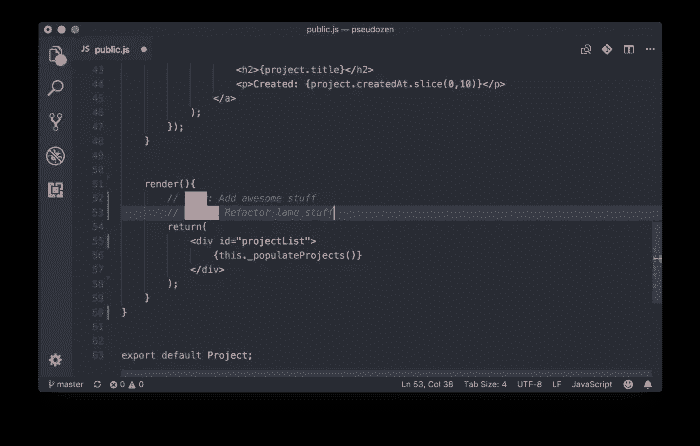

# VS 代码的最佳扩展、技巧和主题！

> 原文：<https://levelup.gitconnected.com/the-best-extensions-tips-and-themes-for-vs-code-7d0724590af>

[Jexo](https://unsplash.com/@jexo?utm_source=medium&utm_medium=referral) 在 [Unsplash](https://unsplash.com?utm_source=medium&utm_medium=referral) 上的照片

## Visual Studio 代码的最佳扩展和主题！

这篇文章列出了我使用和推荐的微软 Visual Studio 代码的扩展和主题。

## 关于 VS 代码

Visual Studio Code 是微软开发和维护的开源编辑器，是目前使用最多、最流行的编辑器之一。其受欢迎程度主要是:

*   对于大量的“智能感知”(自动完成代码的解决方案)。
*   编辑器“调试”的可能性。
*   与 GIT 的集成。
*   许多云集成，如 Azure 和 GCP。
*   可用于 DevOps 解决方案，如 Terraform、Ansible 和 Kubernetes。
*   支持 Windows、Linux 和 Mac。
*   它支持多种语言的开发，如 C++、C#、Java、Python、PHP、Go 和。NET 和 Unity。

 [## Visual Studio 代码-代码编辑。重新定义的

### Visual Studio Code 是一个重新定义和优化的代码编辑器，用于构建和调试现代 web 和云…

code.visualstudio.com](https://code.visualstudio.com/) 

有一个很大的社区帮助微软每天维护和发展这个编辑器，但是在你定制和安装扩展和主题之前，请检查可用的文档。

## 扩展和提示

这是日常使用的扩展、集成和技巧的简短列表。

*   支持 Jupyter 笔记本(*。ipynb)在 VS 代码中:

要启用对 Jupyter 笔记本的支持，您需要安装 Python，安装支持，并创建一个测试文件(例如:test.ipynb)。

 [## Visual Studio 代码中的 Jupyter 笔记本

### Visual Studio 代码中的 Jupyter 笔记本

Codecode.visualstudio.com Visual Studio 中的 Jupyter 笔记本](https://code.visualstudio.com/learn/educators/notebooks) 

*   智能感知:

> IntelliSense 是各种代码编辑功能的统称，包括:代码完成、参数信息、快速信息和成员列表。IntelliSense 功能有时被称为其他名称，如“代码完成”、“内容助手”和“代码提示”。

随着时间的推移，几个智能“向导”开始出现，以协助和补充 VS 代码，其中最有前途的是“Kite”，一个支持 16 种语言的解决方案，使用几个机器学习模型来改善自动完成，将使用期间使用的密钥减少 47%，此外，还可以轻松访问每个新库的文档和搜索重复代码的工具。

 [## kite——Python 的智能编程工具

### 发布关于开发者工具、Kite 产品更新和 Python 的文章。

medium.com](https://medium.com/kitepython) 

#放风筝有几种选择，其中之一是[鼓](https://www.tabnine.com/)。

*   [**GitLens**](https://marketplace.visualstudio.com/items?itemName=eamodio.gitlens)

一组解决方案将使您的日常工作，用 Git 驱动代码版本管理变得更加容易。

*   [待办事宜高亮 ](https://marketplace.visualstudio.com/items?itemName=wayou.vscode-todo-highlight)

一种记住一些总是要做的“待办事项”的方法…

*   [**路径智能感知**](https://marketplace.visualstudio.com/items?itemName=christian-kohler.path-intellisense)

自动完成路径和文件名的扩展。

*   [**通孔**](https://marketplace.visualstudio.com/items?itemName=ms-python.vscode-pylance)

Pylance 是一个扩展，它与 Python 一起在 Visual Studio 代码中提供高性能语言支持。在幕后，Pylance 由微软的静态类型检查工具 Pyright 提供支持。使用 Pyright，Pylance 能够用丰富的类型信息加速您的 Python IntelliSense 体验，帮助您更快地编写更好的代码。

*   [**Visual Studio IntelliCode**](https://visualstudio.microsoft.com/services/intellicode/)

一个“辅助智能感知”，即一个人工智能的助手，以改善自动完成。

*   [**素材主题图标**](https://marketplace.visualstudio.com/items?itemName=PKief.material-icon-theme)

一个巨大的图标目录，可以定制你的编辑器，使你的导航在视觉上更加容易。

*   [**VSCode 大图标**](https://medium.com/hackernoon/vs-code-extensions-for-happier-javascript-coding-e258f72dd9c1#:~:text=Life%20is%20good.-,VSCode%20Great%20Icons,-Adds%20a%20bunch)

定制环境的另一组图标。

*   [**其中 Monokai 主题**](https://marketplace.visualstudio.com/items?itemName=azemoh.one-monokai)

简单实用的主题。

*   [**夜啼**](https://marketplace.visualstudio.com/items?itemName=liviuschera.noctis)

一个让你的眼睛休息的主题。

*   [**远程 WSL**](https://code.visualstudio.com/docs/remote/wsl?WT.mc_id=javascript-36257-gllemos)

这个扩展允许在 Windows Linux 子系统上使用 VS 代码，WSL:

本出版物展示了一组扩展、主题和使用 VS 代码的技巧，但是在您疯狂地安装所展示的一切之前，请阅读文档并记住，随着新扩展的安装，这可能会使您的编辑器变得“沉重”并增加 RAM 消耗。

## 参考资料:

 [## 这里有一些超级秘密 VS 代码黑客来提高你的生产力

### 作为一名编程爱好者、专业人士，甚至是一个月一次的开发人员，你必须知道拥有智能和锐利的工具…

medium.com](https://medium.com/free-code-camp/here-are-some-super-secret-vs-code-hacks-to-boost-your-productivity-20d30197ac76)  [## VS 代码扩展让 JavaScript 编码更快乐

### 作为一名 web 开发人员，拥有一个校准良好的编辑器对工作效率至关重要。视觉上最好的部分之一…

medium.com](https://medium.com/hackernoon/vs-code-extensions-for-happier-javascript-coding-e258f72dd9c1)  [## 15 VS 代码扩展节省您的时间，让您成为更好的开发人员

### 对前端开发人员有用的 VS 代码扩展列表

levelup.gitconnected.com](/15-vs-code-extension-to-save-your-time-and-make-you-a-better-developer-506f79baec53)  [## 2020 年最佳 4 VS 代码扩展

### 我在 2020 年卸载了超过 40 个 VS 代码扩展，只剩下这 4 个。

medium.com](https://medium.com/swlh/best-4-vs-code-extensions-in-2020-d629f37a034)  [## pylance:VS 代码的最佳 Python 扩展

### Microsoft Python 语言服务器的未来以及为什么应该使用它。

towardsdatascience.com](https://towardsdatascience.com/pylance-the-best-python-extension-for-vs-code-ae299f35548c)  [## Visual Studio Code 2020 的 10 个最佳主题

### 无论你是夜猫子还是早起的鸟儿，选择你的武器。

medium.com](https://medium.com/for-self-taught-developers/10-best-themes-for-visual-studio-code-2020-87885ec1576a)  [## 14 Dicas para Turbinar o seu VS Code！

### 你的代码是什么意思，但是你可以用它来解决所有的问题——

glaucia86.medium.com](https://glaucia86.medium.com/14-dicas-para-turbinar-o-seu-vs-code-341cf5f8a353) 

#感谢你的阅读！:)