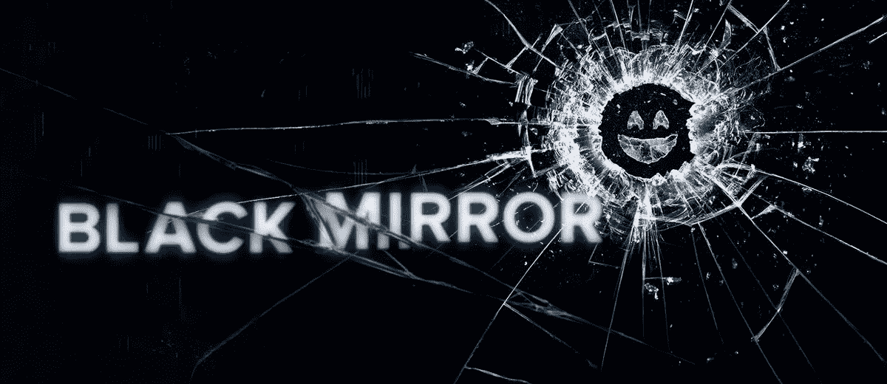
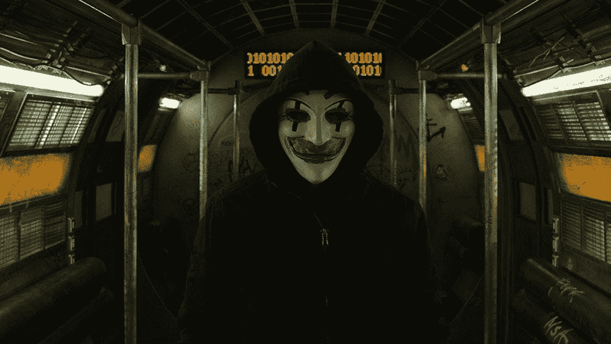
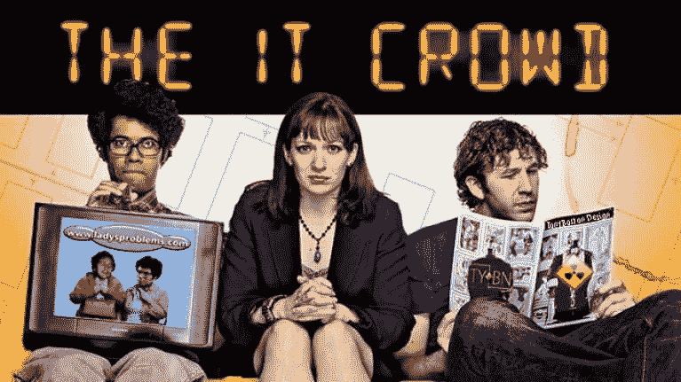
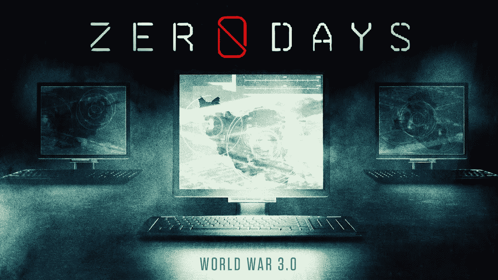

# 软件开发人员的最佳电影和电视节目

> 原文：<https://levelup.gitconnected.com/the-best-movies-and-tv-shows-for-software-developers-8519fa9111d1>

在 [Unsplash](https://unsplash.com/s/photos/movies?utm_source=unsplash&utm_medium=referral&utm_content=creditCopyText) 上由 [Myke Simon](https://unsplash.com/@myke_simon?utm_source=unsplash&utm_medium=referral&utm_content=creditCopyText) 拍摄的照片

我几乎所有的帖子都是关于软件和流程或者一些面试问题的。我真的很喜欢这些话题，并将继续写这些话题，但我觉得偶尔写一些轻松一点的话题并不是一个坏主意。

我最喜欢的无聊消遣之一是看电影或狂看酷电视节目。作为一名工程师，我更喜欢与软件相关的娱乐。

在过去的几年里，我觉得我们在获得大量优秀内容方面已经相当幸运了。看了很多之后，我列出了我最喜欢的与技术和软件相关的电影和电视节目，我想在这里分享一下。

所以，事不宜迟，如果你这个周末需要看些什么，在下面的列表中随机选择一个条目，尽情享受吧！

# 《黑镜》

可能是名单上最知名的项目之一，*黑镜*可能也有最褒贬不一的评论。*黑镜*之所以如此命名，是因为黑镜是机器关闭时的屏幕，这是一个选集系列，围绕着一群人的个人生活以及技术如何操纵他们的行为，其中每一集都独立于所有其他集。

我喜欢这个节目，因为每一集都介绍了一项技术进步，有时感觉它甚至可以在明天或下周出现，它在说明这项技术带来的不可预见的后果方面做了很好的工作。有些剧集超级诡异，让你说“WTF”(第一季第一集)，有些则让你说“我的天啊”(第三季第二集)，但它们都让你乐此不疲。

# 机器人先生

好莱坞因为有可怕的黑客场景而臭名昭著…我最喜欢的是 NCIS 的[两个白痴在一个键盘上。但是随着*机器人先生*，我们终于找到了赢家！](https://youtu.be/u8qgehH3kEQ)

这部剧讲述了埃利奥特·奥尔德逊在黑帽黑客和灰帽黑客之间艰难跋涉的生活。这太棒了，因为它经常显示他的终端，因为他以叙事风格解释他在做什么。

该节目投入了大量时间和精力，尽可能让黑客变得真实可信，甚至在制作期间聘请技术顾问到现场，这意味着软件开发人员可以从看到他们可能认识或在日常工作中听说的东西中获得刺激。

# 我是谁

*我是谁*是一部德国电影，原名 *Kein System ist Sicher，*讲述了一个孤独的计算机专家陷入法律纠纷，在提供社区服务时遇到了另一个计算机专家，两人组成了一个黑客组织。

它充满了动作，典型的黑暗网剧，还有很多“社会工程”。凭借谷歌用户 93%的积极评价，这部电影有一些大的曲折，非常有趣。

# IT 人群

在演播室观众面前拍摄的 *IT 人群*是一部来自英国的喜剧情景喜剧，讲述了一家公司 IT 部门的一些成员的故事。

这是非常有趣的，因为频繁提到的事件和情况在 It 界是很常见的，这也使它非常相关。

“你能帮我吗？我的电脑行为异常”——工作人员

“你试过关机再开机吗？”— IT 专业人员

“哦，现在它工作了！谢谢！”工人

# 零天

这份名单上唯一的“真实”故事，这部纪录片解释了美国和以色列制造的用于攻击伊朗核计划的病毒 [Stuxnet 病毒](https://en.wikipedia.org/wiki/Stuxnet)发布后的事件。

这是一个非常有趣的故事，因为病毒不断传播，最终变得无法控制，造成了大量的破坏，并导致了许多人认为是网络战时代的开始。

# 硅谷

如果你曾经是创业公司的一员，或者了解创业型文化，尤其是在加州的硅谷地区，你无疑会喜欢 HBO 系列*硅谷*。

该节目记录了几名创业工程师的旅程，他们试图在硅谷、投资者和创业文化中的许多陈词滥调中穿行。如果这还不足以让你感兴趣，也许对烂番茄 94%的评分才是。

# 《西部世界》

HBO 真的知道他们在做什么，当谈到制作电视节目时，他们继续他们的连胜。

根据同名电影改编，*西部世界*实际上是一个成人游乐园，游客可以参与到一个狂野的西部风格模拟中，有枪和马，以及介于两者之间的一切。

然而，游乐园中的所有角色都是具有高级人工智能的机器人，正如大多数好莱坞制作的人工智能故事一样，这导致了非常有趣的困境。这是榜单上我最喜欢的节目，更何况[第三季刚刚上映。](https://www.nytimes.com/2020/03/12/arts/television/westworld-season-3-review.html)

# 玛奇纳除外

让人工智能的主题继续下去， *Ex 玛奇纳*提供了一个类似的机器人类型的故事，但在电影格式。

当一名程序员赢得了评估一个由著名技术专家制造的机器人的机会，并且机器人的能力[通过图灵测试](https://en.wikipedia.org/wiki/Turing_test)，事情发生了转折，变得比预期的更加激烈。

这部电影有很多对话，有时很奇怪，但它仍然是一部惊悚片，非常有趣。

# 额外内容— Youtube

以下是一些我觉得有趣的其他软件相关视频:

*   [黑客](https://www.youtube.com/watch?v=KEkrWRHCDQU)
*   [如果编程是一部动漫](https://www.youtube.com/watch?v=pKO9UjSeLew)
*   [开发者的神秘人生](https://www.youtube.com/watch?v=ocwnns57cYQ)
*   [永远的 Java](https://www.youtube.com/watch?v=RnqAXuLZlaE)
*   [有史以来的每一次编码面试](https://www.youtube.com/watch?v=wZR6QFE2m6o)

我在寻找更多有趣的视频和/或电影和电视节目。我在这里错过了哪些？