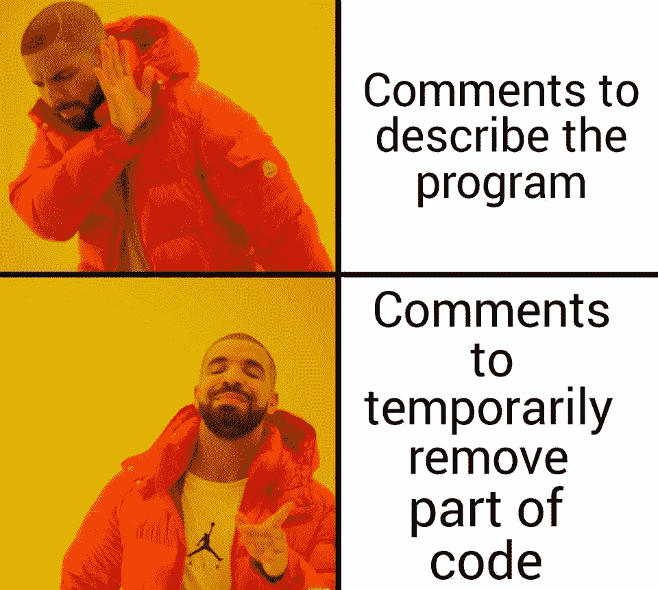

# 最佳编程迷因

> 原文：<https://levelup.gitconnected.com/the-best-programming-memes-b435d1bf918d>

本·怀特在 [Unsplash](https://unsplash.com?utm_source=medium&utm_medium=referral) 上的照片

## 你能联想到这个列表中的迷因吗？

谁不偶尔爱一个好的模因呢？作为一名开发人员，你可能会联想到大量的迷因。这个列表中的一些迷因是我们所有人都会犯的经典错误。其他模因只是暴露了我们中一些人的坏习惯。

坐下来放松一下，是时候享受一些美好的古老文化了！

# 1.诚实的工作

这是一个我笑得太厉害的迷因。对于刚刚起步的开发人员来说，这一点尤其正确。一旦你有了更多的经验，你作为开发者的生活会变得更好。

# 2.你是真正的程序员吗？

我们每隔一段时间都要查阅自己的资料。幸运的是，编程不仅仅是提醒语法。

# 3.你能修理我的电脑吗？

不伙计。做软件工程师和修电脑没关系…

# 4.C++

谁说 C++好学？

# 5.生产中的固定

哦，伙计们…我们可能以前都这样做过。尽管我们都知道这样不好。嗯，有时候你不得不生活在边缘。

# 6.收集

谁没有一台笔记本电脑在你点击“编译”按钮后不会起飞呢？

# 7.合并冲突

合并冲突可能是一种真正的痛苦。

# 8.我只是在删除一些无用的代码

我认为每个开发人员都可以理解这种文化。我们都删除了一些我们认为无用的代码。你一点也不知道…

# 9.评论

注释可能是编程世界中最有争议的话题之一。但是我们中的一些人误用了它们，这就是这个迷因所展示的。

# 10.他们骗了我

并不是你在 StackOverflow 上找到的所有东西都能适用于你的情况。大多数时候，你必须稍微调整一下。

# 11.邪恶的狗

为了结束这个列表，我将把这个留给你。

