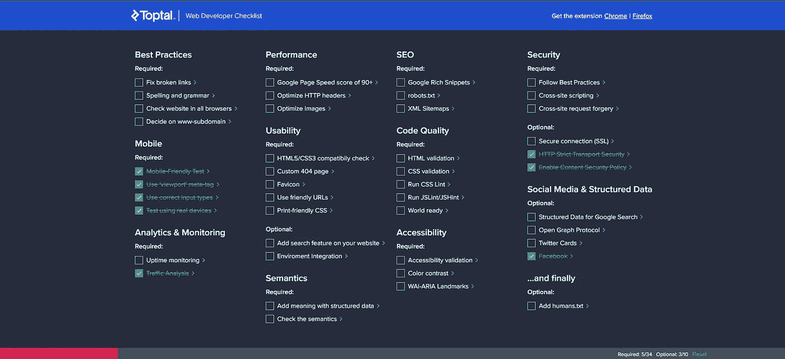

# 开发人员的最佳随机工具|开发人员备忘单

> 原文：<https://levelup.gitconnected.com/the-best-random-tools-for-developers-developers-cheat-sheet-bdb70879ee51>

## WEB 开发人员最好的朋友！

## 如果你是一名网络开发人员，你需要使用这些工具！

作为一名网站开发人员，你永远不知道你会需要什么样的东西，所以拥有一些不同的工具是很重要的。这就是为什么在这篇文章中我将向你展示一些我能找到的最好的随机工具。

我不得不说，在过去的某个项目中，我几乎都使用过它们，我希望它们对你也有用。嗯，这有点像工具的随机汇编，所以请记住，这些是我最喜欢的，也是我用过的。

我为 JavaScript、CSS 和设计工具写过几篇类似的文章。你可以在这里查看:

 [## 开发人员的 5 个最佳 JavaScript 工具| JS 备忘单

### 如果你是一名网络开发人员，你需要使用这些工具！

levelup.gitconnected.com](/the-5-best-javascript-tools-for-developers-js-cheat-sheets-ed103b8a11fb)  [## 开发人员的最佳 CSS 工具| CSS 备忘单

### 如果你是一名网络开发人员，你需要使用这些工具！

levelup.gitconnected.com](/the-best-css-tools-for-developers-css-cheat-sheets-4e1c377c73d6)  [## 开发人员的最佳设计工具|设计备忘单

### 如果你是一个网页开发者，你需要使用这些设计工具！

levelup.gitconnected.com](/the-best-design-tools-for-developers-design-cheat-sheets-ce42197876c5) 

## [TL:法律博士](https://tldrlegal.com/)

太久没有阅读法律，这是一个工具，基本上是这样做的。他们会仔细检查每一个应用程序和网站的法律声明和协议条款，然后给你一个简短的版本。

如果你想了解一家公司或你可能想做的一项行动的合法性，那么检查你之前签署了什么协议是很重要的。此外，我们不想浪费时间阅读所有这些技术和法律的东西，因此需要这个网站。你可以通过访问[这个链接](https://tldrlegal.com/)来访问这个工具。

## [Regexper](https://regexper.com/#%0AImage%3A%20display%20%2C%20maybe%0A%0A)

regexper 创建的图像通常被称为“铁路图”，这是一种直观的方式来说明正则表达式中有时可能很复杂的处理，其中包含嵌套循环和可选元素。

这个工具确保你完全理解它，所以他们在[文档](https://regexper.com/documentation.html)中提供了他们自己的备忘单。你可以通过访问[这个链接](https://regexper.com/#%0AImage%3A%20display%20%2C%20maybe%0A%0A)来了解一下。

## [SQL 篡改](http://www.sqlfiddle.com/)

使用此工具设置数据库问题创建表、插入数据以及准备真实数据库的代表性样本所需的任何其他语句。使用“Text to DDL”从文本中快速构建模式对象。

这对于不想实时弄乱数据库的开发人员来说尤其重要，这样他们就可以摆弄这个工具，直到他们清楚自己想要什么。您可以通过访问[此链接](http://www.sqlfiddle.com/)来查看该工具。

## [游击邮件](https://www.guerrillamail.com/)

你厌倦了收到垃圾邮件吗？如果是这样，这是你的完美工具！Guerrilamail 是一个帮助你打开临时电子邮件的工具，你可以在任何网站上使用它，它的好处是你不必在你的个人账户上接收任何邮件。

如果你把你的电子邮件发送到一个你并不真正信任的网站，并且这个网站将来肯定会向你发送垃圾邮件，这一点尤其重要。为了让你的收件箱保持干净，让你的心情放松，请使用 Guerrilamail。只要你点击[这个链接](https://www.guerrillamail.com/)，你就可以开始创建一个临时电子邮件。

## [网络开发清单](https://www.toptal.com/developers/webdevchecklist)

这是一个相当简单的工具，由自由职业巨头 Toptal 开发。这将是一个非常重要的工具，对于初学者来说，他们并不真正了解事情的流程，并想知道什么是正确的道路。

该工具提供了一个任务清单，web 开发人员应该遵循该清单来确保他们的产品质量。它有必需的和可选的选项，一旦完成，开发者可以把它们勾掉，底部的栏离完成又近了一步。你可以通过[这个链接](https://www.toptal.com/developers/webdevchecklist)获得这个工具。

# 结束语

我希望这些工具在将来会对你有所帮助，因为它们确实对我有所帮助。如果有足够的需求，或者我看到这篇文章表现良好，我会确保用一些其他令人惊讶的工具制作第二部分。

如果你对这篇文章有任何问题或建议，请不要犹豫，在评论区回复。喜欢你读的东西吗？为什么不关注我的媒体简讯，这样你就不会错过我未来的任何文章了？很简单，点击[这里](https://kgabeci.medium.com/subscribe)输入你的邮箱地址，按订阅。

你喜欢阅读媒体上的文章吗？考虑成为会员，有很多功能，你将获得所有创作者的内容，每月只需 5 美元。使用[这个链接](https://kgabeci.medium.com/membership)，你也可以帮我赚取一小笔佣金，点击成为会员，输入你的信息。