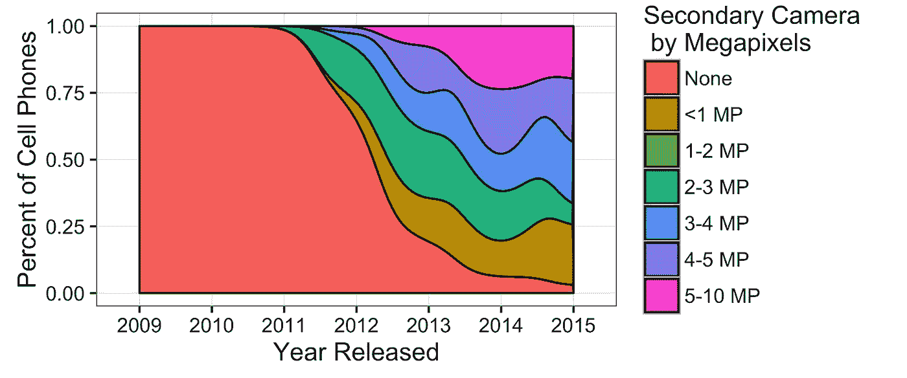
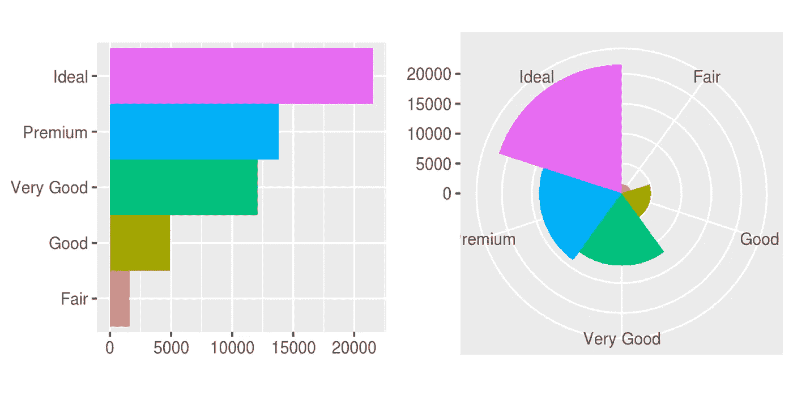
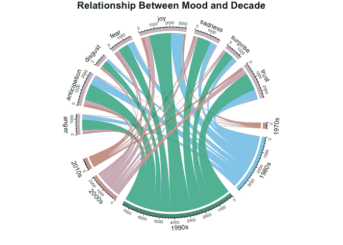

# R 和 RStudio 的最佳资源

> 原文：<https://levelup.gitconnected.com/the-best-resources-for-r-and-rstudio-b57dd306845f>

在一个数据驱动的世界中，组织、使用和分析数据的能力正成为任何程序员都必须具备的一项非常重要的技能。我最近承担了学习 R 和 RStudio 的任务。这些是我找到的最好的资源。

1.  ***【R 为数据科学】***

 [## r 代表数据科学

### 这本书将教你如何用 R 做数据科学:你将学习如何把你的数据放入 R，把它放入最…

r4ds.had.co.nz](https://r4ds.had.co.nz/) 

当我试图学习新的东西时，我通常对教科书作为信息来源持怀疑态度。对于第一次使用的用户来说，内容可能会令人不知所措，而且过于详细。这本教科书完全相反。

RStudio 的首席科学家 [*Hadley Wickham*](http://hadley.nz/) 和 *Garrett Grolemund* 在解释和举例方面非常出色。这本书涵盖了你在 R & RStudio 中需要了解的所有基础知识，包括组织、分析和可视化数据。

它易于阅读，并包括例子，以加强对各种主题的理解。你可以在几天内看完这本书，这为你提供了关于 r。

***2。R'* 中的文本挖掘**

 [## 基于 R 的文本挖掘

### tidy 数据框架中的文本分析指南，使用 tidytext 包和其他 tidy 工具

www.tidytextmining.com](https://www.tidytextmining.com/) 

关于 R 和教科书一定有什么，因为这一本和上一本一样精彩。茱莉亚·西尔格和大卫·罗宾逊写的这本书是学习过程中完美的第二步。

数据科学与数据质量息息相关。这本书教你如何以最有效的方式清理、组织和操作你的数据。文本和情感分析详细介绍了各种例子，保持学习过程中的信息和兴趣。

情绪分析显然是你会遇到的最有趣和最通用的工具之一。一旦你理解了它的技术方面，它就变成了一个智力难题，弄清楚你需要问数据哪些问题来获得最深刻的见解。

情感分析示例。

**3。RStudio 备忘单**

 [## RStudio 备忘单

### oSCR oSCR 包提供了使用空间捕获再捕获模型的功能。加布里埃拉的小抄…

rstudio.com](https://rstudio.com/resources/cheatsheets/) 

r 和 RStudio 已经存在很久了。因此，可用的资源是惊人的。RStudio 提供包含大量信息的简短备忘单。

RStudio 中的自动完成和快捷方式非常强大。花些时间熟悉这些工具是值得的，因为它们能显著提高你的产量和生产率。这些备忘单有助于这一点，因为它们在一个地方包含了您需要的所有快捷键。

各种软件包也有备忘单。这涵盖了这些包的安装和使用，允许您充分利用您决定使用的包。这些表格会不断更新，所以请务必不断查看新的表格！

**4。这些教程:**

 [## 使用 WhatsApp 数据进行文本分析

### rwhatsapp 是一个小而健壮的包，它提供了一些基础设施来处理 R…

cran.r-project.org](https://cran.r-project.org/web/packages/rwhatsapp/vignettes/Text_Analysis_using_WhatsApp_data.html)  [## R 中的整洁情感分析

### 通过艺术家普林斯的生活和时代，在三部分教程的第二-A 部分进行一次感伤之旅…

www.datacamp.com](https://www.datacamp.com/community/tutorials/sentiment-analysis-R#descriptivestatistics) 

当学习是个人的和有趣的时候，学习会容易得多。除了写得非常好和容易跟随之外，这些教程允许你深入研究与你相关的数据。

使用 WhatsApp 数据的文本分析教程可以对任何 WhatsApp 聊天进行文本和情感分析。您可以看到谁发送的信息最多，哪些表情符号使用最频繁，作者使用的最重要的词语等等。

歌词分析教程甚至更容易理解，深入到大量的文本和情感分析概念中。收集你最喜欢的艺术家的数据，看看他们的音乐、情绪和歌词这些年来是如何变化的。

抒情分析情节。

r 和 RStudio 是强大的工具。随着数据价值的不断增加，能够使用这些工具的价值也在增加。这些资源使学习过程变得更加容易和愉快。