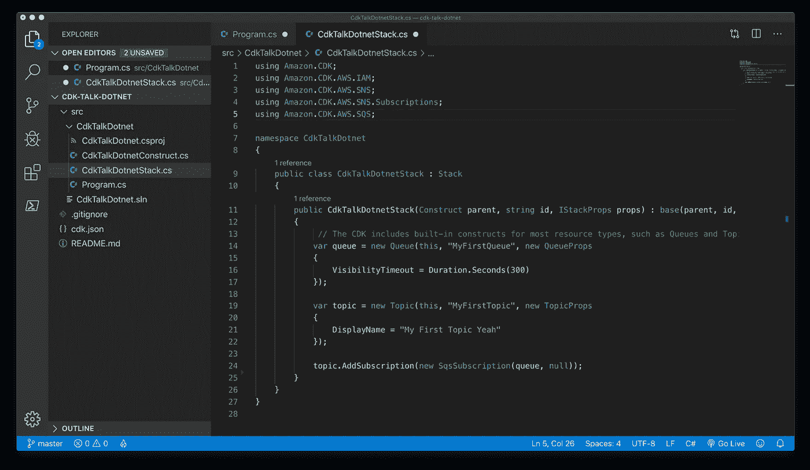

# 我在亚马逊工作时用过的最好的工具

> 原文：<https://levelup.gitconnected.com/the-best-tool-i-learned-about-working-at-amazon-f6153af77d62>

魔法。

在规模只有亚马逊几分之一的公司，内部工具是必须的。如果每个人都以不同的方式做事，或者如果你把所有的重量都放在 Github Actions 上，项目就会变得很大，很难维护。

因此，虽然亚马逊内部有很多开发人员使用的工具，但有一个工具几乎所有亚马逊员工都在使用，它是给程序员的礼物……*而且它不是内部的。*没错:这是一个任何人都可以使用的漂亮的外部工具。

虽然这篇文章读起来像一个很长的广告，但我绝不代表亚马逊说话，也不以任何方式得到他们的赞助。我真的很喜欢这个工具，我写这篇文章是为了让更多的程序员离开 Terraform 的黑暗时代，或者，上帝保佑，*使用 AWS UI。*

# 问题是

我给你讲个故事:一个菜鸟程序员的故事。他们一直在学习 JavaScript 的前端和 Python 的后端，但他们已经准备好与数据库接口。问题是，数据库不是免费的，而且通常很难管理。这种思路将年轻的头脑引向了 *AWS。*随着他们对 AWS *、*的了解，他们接触到了令人眼花缭乱的服务:SNS、SQS、S3、DynamoDB、ECS、Snowball。

每个人都经历过这种情况:这基本上是现代程序员的必经之路。当我在那里时，我想到的是大规模管理这些服务会有多困难。仅运行 ECS、S3 和 RDS 堆栈就花了我几个小时来设置—如果我需要 VPC、ECS 群集或 VPN 怎么办？设置这些将是一件痛苦的事。

所以很快，我转向了 Terraform。Terraform 很棒，做了它该做的事情，但是 *man* 很难用。你必须学习 HCL，一种晦涩难懂的标记语言。没有自动完成功能，所以你要靠自己来确保每件事都做对了。这些概念本身很难学习——HCL 看起来很落后，Terraform land 中的许多规范也很奇怪。奇怪的是，许多人求助于 Terragrunt 来帮助他们管理。

这一切的解决方案是什么？

像所有其他互联网问题一样:亚马逊有一个解决方案。

# AWS CDK

AWS CDK 是一个非凡的工具，据我所知，它干净地解决了地形或手动创建堆栈的所有问题。

通过使用 Typescript(其他语言与 CDK 接口，但 TS 是迄今为止我最喜欢的)，而不是 HCL 或任何其他自定义创建，我们允许程序员在他们的工作流程中感觉更熟悉。你不再是在用一种新的可怕的逆向构造语言工作:你是在用一种感觉不太不同的语言编写和调试直接代码。

一切都是公开的。CDK 里没有隐藏的东西。如果你正在使用 AWS 控制台，甚至*有可能*你会错过一个配置步骤或者在某个地方卡住，你的整个堆栈会变成一堆独立的碎片。Terraform 是朝着正确方向迈出的一步，但是作为一个动态类型的构造，你可以把任何东西放在任何地方，并且 linter 不会告诉你“这个变量是未定义的！”或者“这个参数不存在！”它只会在运行时失败(或者更糟:根本不会失败)。TypeScript 是专门为开发人员设计的第一语言，intellisense 是第一等级的公民，有大量的工具。

如果你反对 AWS(没关系——我也对 AWS 有些不满！)你很幸运——作为代码提供者，有许多奇妙的基础设施，比如*无服务器*和 *Pulumi* 。作为代码的基础设施，一般来说，对程序员和他们的业务主管来说是一个好主意和净收益。

不过，我会避开 Terraform 和 Ansible。在开发人员用来完全绕过它们的工具上投入了太多。事实上，你可以很容易地为你的基础设施编写单元测试，这意味着你不必担心睡觉和意外积累一百万美元的 AWS 账单。

CDK 最大的好处之一是，如果你正在运行多个环境，(beta，alpha，prod，QA，等等。)你所要做的就是将你的 CDK 包在一个`for`循环中，并让你的变量接受一个输入字符串:而不是`vpcName = 'vpc'`，进行一些字符串插值并进行`vpcName = `{stage}-vpc``。

在我在亚马逊学会使用的所有工具中，这个 CDK 是我最喜欢的。效用无可匹敌。如果我再次在云上部署项目，你可以打赌我正在创建一个 CDK 包。