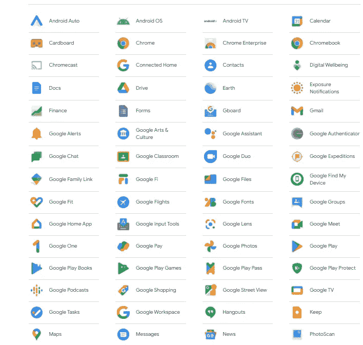

# 自由职业者的最佳工具|自由职业者备忘单

> 原文：<https://levelup.gitconnected.com/the-best-tools-for-freelancers-freelancers-cheat-sheet-655840cbbc42>

## 自由职业者最好的朋友！

## 如果你是自由职业者，你需要使用这些工具！

我自己是一名自由职业者，这是一个我非常热衷的话题！这里展示的所有工具在某种程度上帮助我变得更加系统和实用。

如果你正在努力让自由职业成为你朝九晚五工作的替代品，那么你应该尝试使用这些工具。它们会帮助你更好地组织你的一天，提高一周的工作效率。

> 机会不会凭空出现，而是你自己创造的！

***不是不可能，每个人都可以成为自由职业者*** 。如果你有**的意志力**和**的决心**去得到你想要的，你就会实现它。

让我们来看看对你的自由职业之旅有帮助的一些最好的工具。

# [超级日程/待办事项列表](https://docs.google.com/spreadsheets/d/1PUiZIx6cohW7JEHAT-dDYpHzYw6bpKJz/edit#gid=809501770)

我从我认为最好的“工具”之一开始，这是我做的一个时间表/任务清单。这是我自由职业成功的首要原因。这个时间表帮助我组织和专注于我每天的目标。如果你感兴趣，你可以在这里查看:

 [## 帮助我成为持续写作者的独特策略

### 在我应用了这个策略并开始遵循我自己制定的时间表后，我的写作生活很快就改变了。

medium.com](https://medium.com/swlh/the-unique-strategy-that-helped-me-become-a-consistent-writer-f8de68a2c4bf) 

在那里，你还可以找到“0 天”策略，它和日程表/待办事项清单非常契合。这也将极大地提高你的工作效率和动力，我和我周围的人已经证明了这一点，他们已经在日常生活中使用了这种方法。

我真的很想知道你对它的看法，所以不要犹豫，告诉我你对这个工具的真实想法。我正在考虑在不久的将来制作一个在线工具供大家使用，敬请期待。

# [松弛](https://slack.com/)

Slack 是一个非常有用的应用程序，旨在将你与工作环境联系起来。您可以在不同的渠道即时交流，实时共享文档和文件，并为您的整个工作提供一个有序的空间。

对于我们这些自由职业者来说，这是跟踪多个客户和了解不同项目进展的好方法。这是一个很好的方式，可以省去发送邮件和延迟回复的麻烦。

> 通过这种方式，你可以直接与客户接触，这一点非常重要。

您可以选择直接从浏览器打开 Slack。或者我最喜欢的是安装了应用程序。无论我是在手机上还是在工作，我都会收到客户的实时信息。

# [整个谷歌生态系统](https://about.google/products/)

整个谷歌生态系统是相互同步工作的，因此这对组织来说非常重要。这会让你的生活变得更加轻松，并且提高你的工作效率。

> 简单说谷歌是最好的！

我从一开始就是谷歌的粉丝，我每天都使用谷歌浏览器、电子邮件、驱动、文档和更多的谷歌产品。我从来没有失望过，我相信将来也不会。

我把所有重要的自由职业文件都储存在 Google Drive 里，这样如果我不在家，我就可以在任何地方工作而不会丢失任何信息。我建议你利用谷歌及其服务，你会看到你的自由职业世界有所改善。

作为一名自由职业者，我知道了尽可能足智多谋的重要性。学习如何利用这些工具，让你看起来更专业，在处理客户时更有条理。

我把我所有的成功都归功于使用不同工具来帮助我推进自由职业生涯的能力。我从零开始，作为一个初学者，现在我是一个顶级的自由职业者。我已经和一些客户合作了将近两年，我们都很开心。

> 如果我能做到，每个人都能做到！

# [贝宝](https://www.paypal.com/us/home)

用 PayPal 汇款和收款是你能做的最简单直接的事情之一。这将减少你等待资金从不同的自由职业平台如 Upwork 或 Fiverr 中流出的时间。

由[拍摄的照片](https://unsplash.com/@asyfaul?utm_source=medium&utm_medium=referral)在 [Unsplash](https://unsplash.com?utm_source=medium&utm_medium=referral)

最重要的是，你不会因为使用这些平台而收到费用。即使有点可怕，一旦你找到一个值得信赖的客户贝宝，这将是对你最好的事情。它速度快，费用少，而且你会直接把钱打到你的银行账户上。

# [QuickBooks](https://quickbooks.intuit.com/eu/)

该工具还允许您在任何设备上创建、存储和发送发票。你不需要在电脑上保存任何东西，一切都在云上。作为自由职业者，我们非常重视这一点，因为这给了我们更多的灵活性。

你喜欢你读的东西吗？你可以在不同的领域阅读类似风格的文章。

 [## 开发人员的最佳随机工具|开发人员备忘单

### 如果你是一名网络开发人员，你需要使用这些工具！

levelup.gitconnected.com](/the-best-random-tools-for-developers-developers-cheat-sheet-bdb70879ee51)  [## 开发人员的 5 个最佳 JavaScript 工具| JS 备忘单

### 如果你是一名网络开发人员，你需要使用这些工具！

levelup.gitconnected.com](/the-5-best-javascript-tools-for-developers-js-cheat-sheets-ed103b8a11fb)  [## 开发人员的最佳 CSS 工具| CSS 备忘单

### 如果你是一名网络开发人员，你需要使用这些工具！

levelup.gitconnected.com](/the-best-css-tools-for-developers-css-cheat-sheets-4e1c377c73d6)  [## 开发人员的最佳设计工具|设计备忘单

### 如果你是一个网页开发者，你需要使用这些设计工具！

levelup.gitconnected.com](/the-best-design-tools-for-developers-design-cheat-sheets-ce42197876c5) 

# 结束语

作为一名自由职业者，我不得不说这些是我自由职业生涯中最好也是最重要的工具。我建议你尝试一下，看看它们是否会对你的工作生活产生影响。

如果你对这篇文章有任何问题或建议，请不要犹豫，在评论区回复。喜欢你读的东西吗？为什么不关注我的媒体简讯，这样你就不会错过我未来的任何文章了？很简单，点击[这里](https://kgabeci.medium.com/subscribe)输入你的邮箱地址，然后按订阅。

你喜欢阅读媒体上的文章吗？考虑成为会员，有很多功能，你将获得所有创作者的内容，每月只需 5 美元。使用[这个链接](https://kgabeci.medium.com/membership)，你也帮我赚一小笔佣金，点击成为会员，输入你的信息。