# 2021 年 JavaScript 开发者的最佳 VS 代码扩展

> 原文：<https://levelup.gitconnected.com/the-best-vs-code-extensions-for-javascript-developers-for-2021-cf6731b4ff5>

## 生产率

## 为 JavaScript 开发人员提供最佳 VS 代码扩展的集合

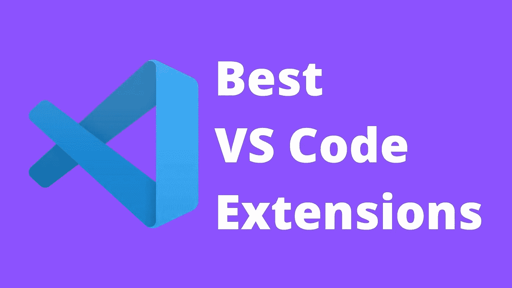

作者图片

几年来，我一直在使用像 PyCharm pro 和 WebStorm 这样的[Jetbrains](https://www.jetbrains.com/)ide 套件，因为这些都很贵，每次我推荐它们，人们都建议我转用 VS 代码，因为它是免费的，很棒。因此，在 Reddit 上就这方面进行了一些讨论后，我承诺将试用 VS Code 几周。

VS 代码的一些大卖点(除了价格，免费)是定制选项和插件生态系统。因为我想在试用期间有一个很好的体验，我需要一些插件来提升我的游戏，所以再次，在 Reddit 上，我被推荐了很多插件。今天我想谈谈那些真的很棒的 VS 代码插件。

现在，我仍然会在我的项目中使用 PyCharm 和 WebStorm，因为这是我喜欢的，我已经使用它们很多年了，它们为我提供了很大的价值。话虽如此，VS 代码还是让我大吃一惊。它使用起来超级简单快捷，总体来说是一次很棒的体验。

# 埃斯林特

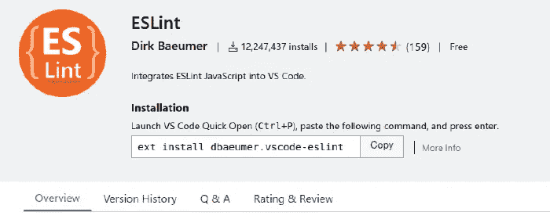

埃斯林特

毫无疑问，ESList 是 JS 开发人员中最受欢迎和喜爱的扩展之一。该扩展对您的代码运行 ESLint 规则，并将结果集成到编辑器中。它允许您快速检测和修复规则失效。这是所有 JS 开发人员的必备工具，因为它有助于提高生产率和代码质量。

[下载 ESLint](https://marketplace.visualstudio.com/items?itemName=dbaeumer.vscode-eslint)

# 较美丽

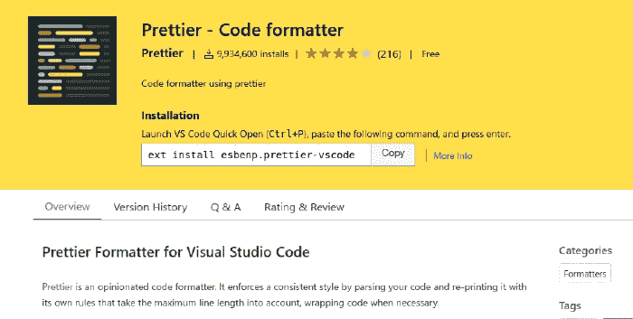

较美丽

Prettier 是一个固执己见的代码格式化程序，它集成了 VS 代码、Visual Studio、Atom、Vim、Sublime Text 等等。这个方便的小扩展使你的代码格式一致，缩进适当，并为可读性更好的代码提供彩色关键字。

它减少了格式化工作，从而提高了生产率。它有助于提高代码的可读性。

[下载更漂亮的](https://marketplace.visualstudio.com/items?itemName=esbenp.prettier-vscode)

# Quokka.js

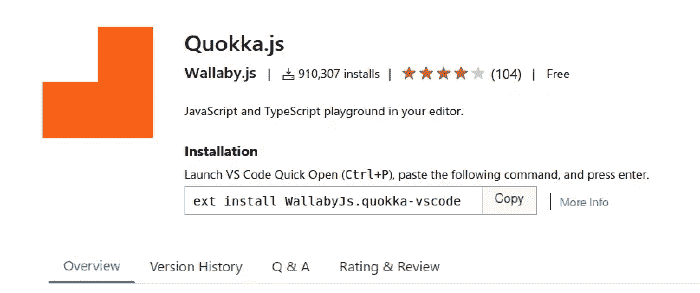

Quokka.js

Quokka.js 在 VS 代码编辑器中提供了快速的 JavaScript 原型。它是 JavaScript 和 TypeScript 的活动场所。它通常被称为 JS 开发人员的现代便签簿。

你有没有想过尝试一些快速的东西，结果却在你的浏览器控制台上运行一些 JS？或者您在终端上启动`node`进程，并在那里进行尝试？这个扩展的主要目的是在 VS 代码编辑器中快速方便地运行代码。

[下载 Quokka.js](https://marketplace.visualstudio.com/items?itemName=WallabyJs.quokka-vscode)

# REST 客户端

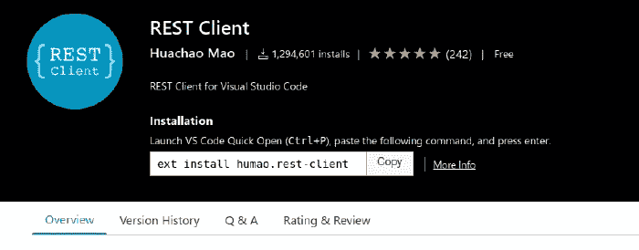

REST 客户端

REST Client 是一个 VS 代码扩展，它允许您发送一个 HTTP 请求，并直接在 VS 代码中查看响应。

它是 VS 代码的 Postman，可以方便地集成到代码编辑器中。REST 客户端支持 REST 和 GraphQL APIs

[下载 REST 客户端](https://marketplace.visualstudio.com/items?itemName=humao.rest-client)

# Chrome 调试器

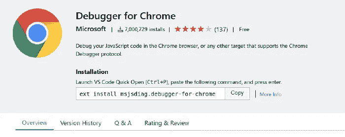

Chrome 调试器

调试 JavaScript 可能会很痛苦。Chrome 和其他浏览器提供了惊人的工具来帮助你完成这项工作。不过，它们通常很难使用，或者总体上不能提供很好的体验，尤其是在使用框架和许多库的时候。

Debugger for Chrome 是微软开发的一个扩展，可以无缝地帮助你调试代码中的每一个小变化。Chrome 控制台调试器非常强大，可以发现错误来自哪个行和函数，还可以查看其数据处理。

在 Chrome 上运行代码，在代码编辑器上调试。

[下载 Chrome 调试器](https://marketplace.visualstudio.com/items?itemName=msjsdiag.debugger-for-chrome)

# 实时服务器

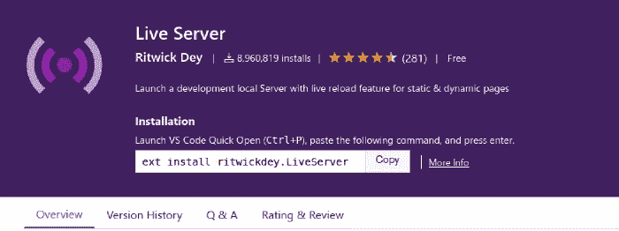

实时服务器

Live Server 允许您为静态和动态页面启动具有实时重新加载功能的本地开发服务器。对于那些使用 React 之类已经设置了实时重载的框架的人来说，这可能不是很相关，但是如果你正在使用其他网页或者静态内容，这个扩展就是一个实时保护程序。

[下载直播服务器](https://marketplace.visualstudio.com/items?itemName=ritwickdey.LiveServer)

# 实时分享

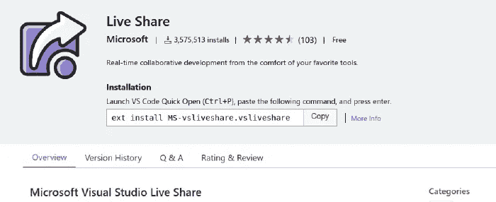

实时分享

这个很神奇，我不确定 WebStorm 有没有类似的东西，但是它允许你和其他人分享你的代码编辑器。它非常适合结对编程，尤其是随着在家工作越来越受欢迎。

我用过，而且我很喜欢。

[下载直播分享](https://marketplace.visualstudio.com/items?itemName=MS-vsliveshare.vsliveshare)

# JavaScript (ES6)代码片段

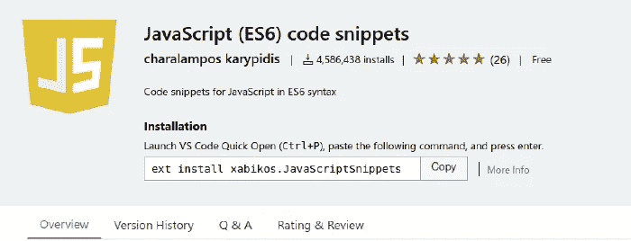

JavaScript (ES6)代码片段

正如您现在所看到的，这个列表中的许多扩展都是生产力的助推器，JavaScrip (ES6)t 代码片段也不例外。

这个标题很容易理解。该扩展允许您通过使用预定义的代码片段集来提高工作效率。您可以通过安装其他软件包或构建自己的软件包来自定义代码片段，以符合您的偏好。

[下载 JavaScript (ES6)代码片段](https://marketplace.visualstudio.com/items?itemName=xabikos.JavaScriptSnippets)

# 巴别塔 JavaScript

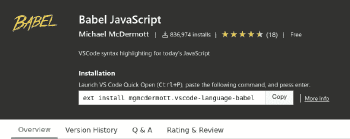

巴别塔 JavaScript

JavaScript 在过去几年里发展了很多，随着 React、Flow、GraphQL 等框架和库的引入，现在允许了许多新类型的“语法”。

Babel JavaScript 为新的 JavaScript 语法和这些特殊的“语言”启用了语法高亮显示，让您的 JavaScript 编辑器保持最新最漂亮的工作状态。

[下载巴别塔 JavaScript](https://marketplace.visualstudio.com/items?itemName=mgmcdermott.vscode-language-babel)

# 一个黑暗职业

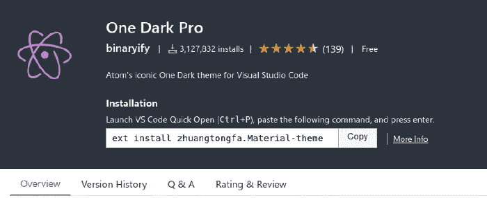

一个黑暗职业

作为开发人员，我们在代码编辑器前花了很多时间，所以我们对它的美感感到满意是至关重要的。One Dark Pro 是 VS 代码的一个主题，让它看起来很漂亮，更像我习惯的样子。

[下载黑暗一族](https://marketplace.visualstudio.com/items?itemName=zhuangtongfa.Material-theme)

# 结论

在尝试了 VS 代码之后，我惊讶地发现它是如此的快速和可靠。然而，在使用扩展对其进行定制后，我也发现了它的强大之处。

因为它是市场上最受欢迎的代码编辑器之一，如果不是最受欢迎的话，在构建工具和扩展的背后有一个巨大的社区来使它变得更好。这也是我喜欢 Jetbrain 产品的原因，也是我现在喜欢 VS Code 的原因。

VS 代码对于任何开发人员来说都是一个可靠的选择，我推荐它。然而对我自己来说，WebStorm 和 PyCharm 在我心中有着特殊的地位。

感谢阅读！