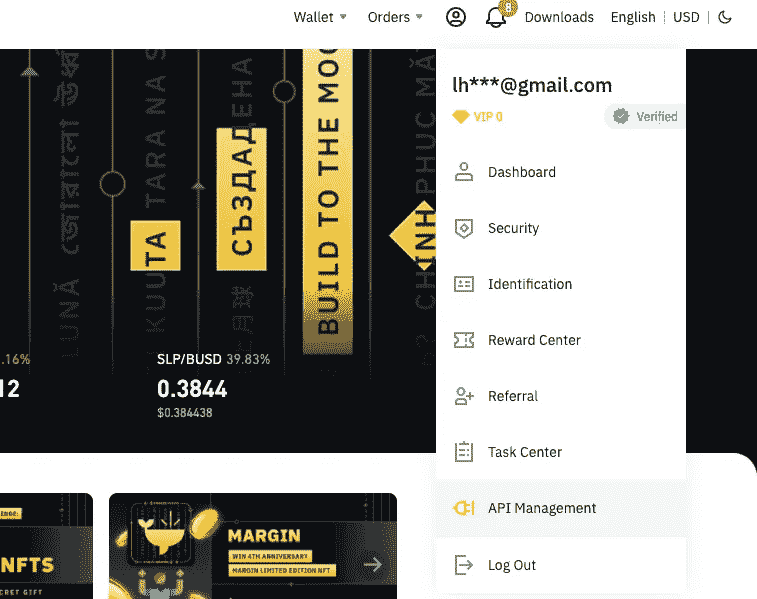
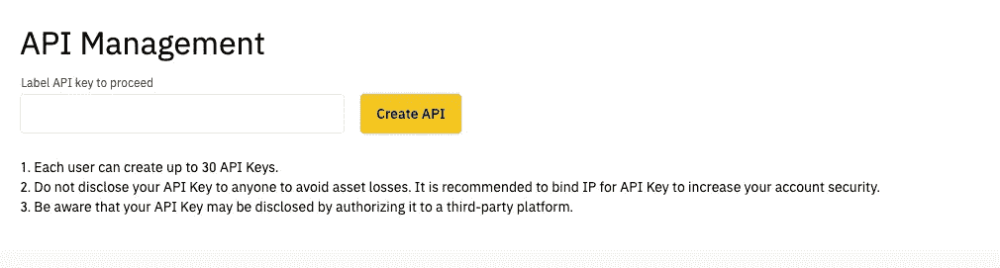
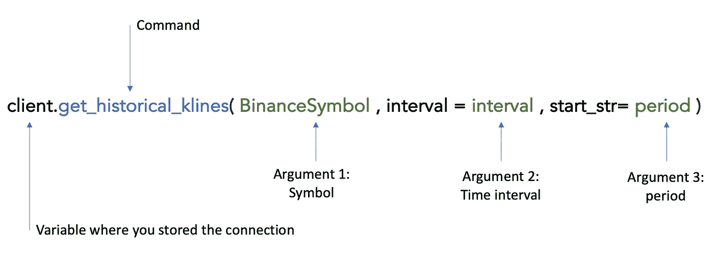
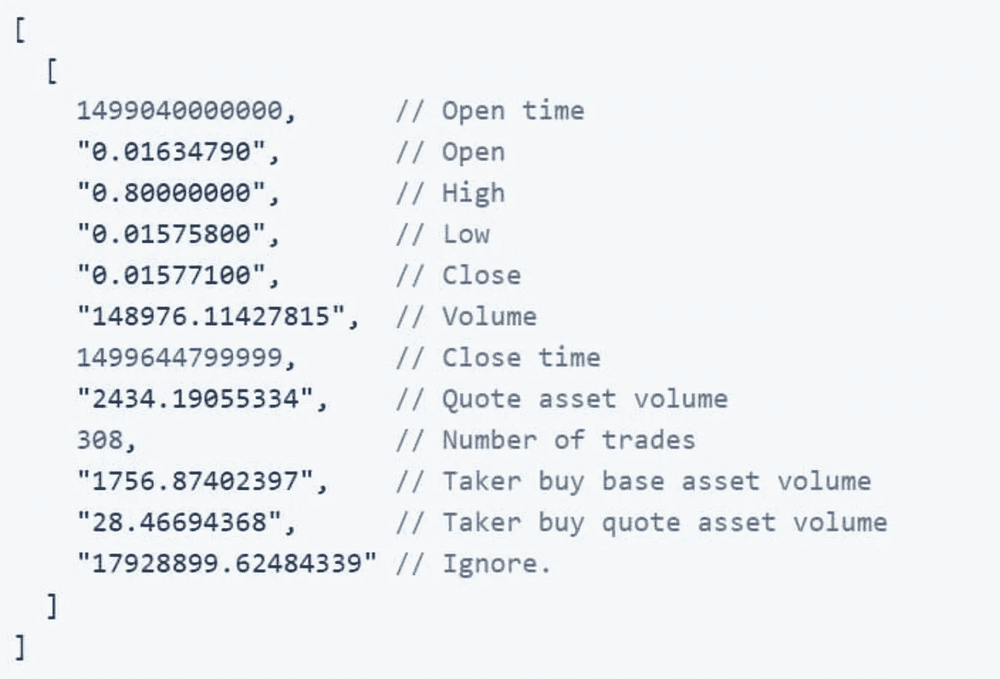
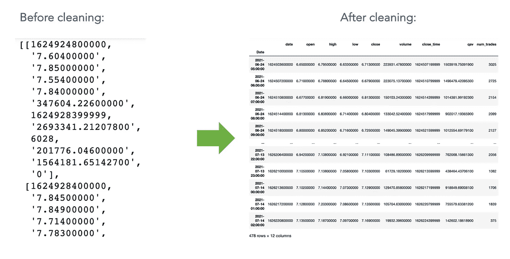
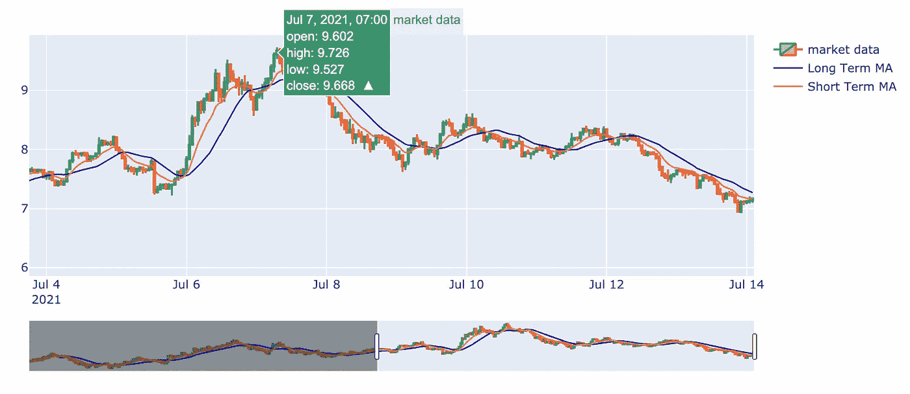

# 为人工智能和数据科学获取实时加密数据的最佳方式

> 原文：<https://levelup.gitconnected.com/the-best-way-to-get-live-crypto-data-for-ai-and-data-science-ba51adc33bd>

## 用于交易的 Python

## 如果你在标准的获取金融数据的方法不足以分析市场时陷入困境，这里有一个使用代理 API 的替代方法。文末全视频教程。


约书亚·梅奥在 [Unsplash](https://unsplash.com?utm_source=medium&utm_medium=referral) 上的照片

在这篇文章中，我们将从我的角度讨论获取加密货币数据的最可靠的方法。两周前，当我的一个学生想通过交易量分析一些替代硬币时，这个问题突然出现了。我们注意到通常的库(雅虎财经、比特币基地、彭博)不够深入。

> 如果你想争取时间，我自己录制的完整视频教程在最后，你可以通过这个链接下载相关的笔记本。

在本文结束时，您将能够调整加密货币导入，并获得价格、交易量、交易数量和基本面数据等数据。

如果你想扩展你的算法交易知识，并解决一个真实的案例，我强烈推荐这篇文章:

[](/how-i-tripled-my-return-on-bitcoin-using-mathematics-algorithms-and-python-347edd9b5625) [## 我如何利用数学、算法和 Python 让我的比特币回报率翻了三倍

### 利用黄金线算法，我预测了比特币、Ripple、以太坊和 Dogecoin 的价格演变。完整的 Python 代码…

levelup.gitconnected.com](/how-i-tripled-my-return-on-bitcoin-using-mathematics-algorithms-and-python-347edd9b5625) 

好，我们开始吧。

# 开始前

首先，如果你想跟进，你需要满足这两个标准:

1-拥有一个[账户](https://www.binance.com/en/register?ref=SSIA5GDE)

2-已经安装了下面列出的 Python 库

所以在开始之前，你必须确保你已经在你的机器上安装了 **Python 3** 和以下软件包:

*   熊猫
*   **数字价格**
*   [**Python-币安**](https://python-binance.readthedocs.io/en/latest/)
*   **plottly**(*非强制，但对绘图*有用)

如果这些包中的任何一个丢失了，您可以使用 pip 命令，如下所示。

```
pip install python-binance
pip install plotly
```

一旦您确保安装了以下软件包，我们就可以开始了。

> ***如果你已经有了使用 Python 和币安 API key 进行交易的经验，可以跳到第三步。第一步是导入包，第二步是获取 API 密匙。***

# 第一步:导入包并连接到币安。

第一步将包括导入必要的包，并使用简单的命令行连接到币安。

首先，您将使用以下代码行导入先前安装的软件包:

上面的行查询 numpy，熊猫，币安，客户端& plotly 要导入。

一旦我们成立了，让我们进行下一步。

既然库已经导入，我们必须创建一个 API 键(如果还没有创建的话)并在我们的 Python 脚本和币安之间建立连接。

## 如何获得币安 API 密钥

连接到 API 密钥的两个步骤。

第一步是将您自己连接到您的币安帐户。

> ***如果你觉得迷茫，可以在本文末尾有一个直播的循序渐进教程记录或者以下这个*** [***链接***](https://youtu.be/OQI-7ogD6YY) ***。(时间 08:28 至 09:10)***

登录后，单击屏幕右上角的个人资料图标。在那里，选择 API 管理。



在这一步，您必须单击 API 管理。

接下来，您将被要求为 API 键创建一个标签。如果您计划创建多个键，最好使用一个描述性的名称。



选择正确的名称并创建 API

一旦你创建了 API，你将拥有一个 ***API 密钥*** 和一个 ***密钥*** 。将这两个密钥复制并粘贴到你的 Jupyter 笔记本或 Python 脚本中，作为两个变量，我在下面的脚本中称之为 ***密钥*** 和 ***秘密*** :

使用 Python 连接到币安 API 的命令行

复制并粘贴后，在上面的命令行中插入这些变量。此时，我们已经与币安服务器建立了连接。从现在起，你将能够立即访问币安服务器上的大量加密数据。

# 第二步:提出请求

既然所需的不同包已经上传，我们就用我们的密钥连接到币安的服务器。我们将使用 SUSHI usdt(SUSHI 指的是一种叫做 SushiSwap 的替代硬币)作为例子来设置我们的导入。

> *加密货币和对的列表可以扩展。例如，如果您想查看 VeChain(VET) — DogElon (ELON)对，您只需键入 VETELON，而不是上面提到的那对。*

币安的优势在于选择的多样性。币安 API 提供的对子比雅虎财经***API 多两倍，比比特币基地*API 多近 20%。****

*除此之外，您还可以获得数据，比如在所选的时间间隔内操作的**笔交易**以及交易总量，这在某些情况下会很有用。*

*让我们回到 API 结构。*

*币安 API 将需要三个强制参数，顺序如下:*

*   *跑马灯 *(1)**
*   *音程 *(2)**
*   **开始日期+结束日期*或期间 *(3)**

*对于我们的例子，股票代码 *(* ***自变量 1*** *)* 将是一对 **SUSHIUSDT** 。间隔(**自变量 2** )将为 **1 小时**，周期(**自变量 3**)**20 天**。*

*如果你想从币安的服务器调用你的数据，你将不得不使用 API 的结构，如下所示:*

**

*get _ historical _ klines 命令的描述*

*一旦设置了这些参数，我们就可以执行下面的代码行:*

*请求数据的命令行*

*这是输出结果:*

**

*灰色部分是我自己添加的注释，帮助您理解值的含义。*

*如您所见，每个时间间隔的数据都存储在一个列表列表中。每个列表将有 12 个值，指的是上面以灰色列出的每个特定信息:开盘时间、开盘价、最高价、最低价、收盘价、交易量、收盘时间、报价资产量、交易次数。*

*如果你想研究这些数据，做一些清理是必要的。*

# *第三步:数据清理*

*一旦获得了输出，建议在利用这些数据之前进行最后一步。*

*上面的输出格式出现了两个具有挑战性的方面:*

*   *输出不是数据帧。*
*   *日期乍一看不清楚。*

*因此，在继续我们的分析并能够完全使用这些数据之前，我推荐这两个步骤:*

*   ***将我们的列表转换成数据帧**。*
*   ***将日期**转换成引人注目的格式(如 *dd-mm-yyyy hh:mm:ss* )。*

*让我们从将列表转换为数据框开始…*

> **仅供参考:一个完整的教程记录，可在最后。**

## *将列表转换为数据框*

*因此，第一步是将我们的列表转换成数据框架。然而，挑战出现了。我们没有关于列名的任何信息。*

*所以，只有一个解决方案可以解决这个问题；我们需要输入列名来手动处理这个步骤。*

*我们走吧！*

*为此，我们将使用 pandas 库将我们的列表转换为数据框。因此，执行下面一行:*

*如何清除加密输入的数据*

*下一步也是最后一步是获取正确格式的日期。*

## ***转换日期***

*要转换整个列的日期，有多种解决方案。*

*在下面的例子中，我将选择通过循环逐一转换每一行。如果你用另一种方式做了，请在评论中注明。*

*如果你觉得破解它有困难，复制并粘贴我的代码如下:*

*清理日期列的命令行*

*以下是输出:*

**

*初始输出与清洁输出*

*嘣！*

*这是清理后的最后一张桌子，好多了，不是吗？*

# *第四步:现场测试*

*既然数据已经清理完毕，我们可以通过数据可视化来探索市场中发生的事情。*

*我们将使用 Plotly 库来可视化每个密码对发生的事情，这对于算法交易来说是最方便的。*

*我在下面的视频教程中提供了更多信息:*

*关于如何为 Python 使用币安 API 的完整视频教程*

*这是最终的输出。我添加了一些交易指标来分析寿司和 USDT 组合的当前趋势:*

**

*嘣！干得好！如果你能够遵循这个过程。你现在可以访问最广泛的图书馆的数据。否则，随时问我任何问题。*

*我希望你喜欢这些内容。如果你有任何意见或想要进一步的细节，请随意。我很享受写这些文章和帮助社区的过程。*

*如果你想争取时间并下载完整的 Jupyter 笔记本，我把它保存在这个链接里。*

*玩得开心！*

*感谢你的关注*

*快乐编码*

# *学习算法交易:*

*(1) 2021 一天学会算法交易:*

*[](https://www.udemy.com/course/python-for-algorithmic-trading/?couponCode=LOVE_SEPTEMBER) [## 2021 年:一天学会算法交易

### 你好，我是赛义德·赫萨尼。我一直在伦敦的多家银行担任数据科学家，是一名…

www.udemy.com](https://www.udemy.com/course/python-for-algorithmic-trading/?couponCode=LOVE_SEPTEMBER)* 

# *完整的 python 代码:*