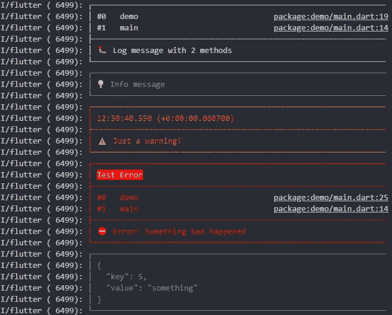

# 在 Flutter 中调试代码的更好方法

> 原文：<https://levelup.gitconnected.com/the-better-way-to-debug-your-code-in-flutter-a53df472bc8>


作者图片

有没有试过用 VS 代码调试器调试 Flutter 中的代码？如果是，那你就知道调试有多痛苦多困难，如果不是，那我来告诉你。当你试图一行一行地调试你的代码时，调试器有时倾向于调用 Flutter SDK 提供的方法/函数并执行它们。当然，这不是一个 bug，而是任何调试器都会做的正常事情，因为有时您编写的代码倾向于调用用 Flutter SDK 编写的方法/函数来完成程序的执行。但是调试每一行你没有写的和你不知道的代码有时会很麻烦和浪费时间。想象一个场景，你写了一个方法 **A** 调用写在 Flutter SDK 某处的方法 **B** ，方法 **B** 调用写在 Flutter SDK 某处的方法 **C** ，然后方法 **C** 返回帮助你的方法 **A** 执行的东西。现在，想象你有一棵很深的树。*是不是很忙乱？不是很费时间吗？在这种情况下，你会怎么做？*

我见过的大多数开发人员试图通过不使用调试器来解决这个问题，他们倾向于使用***【print()***函数，以便他们了解函数或方法的执行情况。现在，我假设你使用的是 flutter 2.5 版本，默认情况下它带有包含 Flutter 规则集的 **flutter_lints** 包，Flutter 团队鼓励你在 Flutter 应用、包和插件中使用这些规则集。这个插件在你写的时候分析代码，当你使用 ***print()*** 函数时，它显示一个警告**“避免在生产代码中‘打印’调用”**。现在，这可能看起来没问题，直到您在生产中使用它时忘记删除 ***print()*** 。对此的快速解决方法是使用***debug print()****方法。我试图使用这种方法，但不知何故，有时它会向我显示错误**“方法 *debugPrint()* 未定义”**我的意思是它默认由 Dart SDK 提供，它不应该向我显示此错误，但请相信我，它确实显示了此错误，我一次又一次地编写它，因此错误消失了。*

*我找到了解决所有这些问题的替代方案，事实上是以一种更好的方式。在我文章的剩余部分，我将向您介绍一个名为 [**logger**](https://pub.dev/packages/logger) **的包。***

# *什么是记录器？*

*小，易于使用，可扩展的记录打印美丽的日志。
灵感来自安卓版 [**logger**](https://github.com/orhanobut/logger) 。简单，容易。现在，如何使用它？*

# *如何使用 logger？*

*要使用 logger，您必须实例化 ***Logger*** 类。*

```
*final logger = Logger();*
```

*以下是您可以使用的方法:*

```
*logger.v("[VERBOSE] You don't always want to see all of these")
logger.d("[DEBUGGING] Logs a debug message")
logger.i("[INFORMATION] A method is called")
logger.w("[WARNING] This might become a problem")
logger.e("[ERROR] You got me 👀")
logger.wtf("What a terrible failure log");*
```

# *为什么我推荐你使用记录器*

*要仅显示特定的日志级别，您可以设置:*

```
*Logger.level = Level.warning;*
```

*上面一行隐藏了详细、调试和信息日志事件，因此它只显示警告级别的日志。*

# ***您也可以自定义记录器***

*创建记录器时，您可以传递一些选项:*

```
*final logger = Logger(
  filter: null, // Use the default LogFilter (-> only log in debug mode)
  printer: PrettyPrinter(), // Use the PrettyPrinter to format and print log
  output: null, // Use the default LogOutput (-> send everything to console)
);*
```

*现在，当您使用上面的方法来记录日志时，它做得很好，但这里的一个问题是它显示了所有的堆栈跟踪，这是我个人不喜欢的。而且，有时，日志的输出很长。还是多定制一下吧。*

```
*final logger = Logger(
  printer: PrettyPrinter(
    methodCount: 2, // number of method calls to be displayed
    errorMethodCount: 8, // number of method calls if stacktrace is provided
    lineLength: 120, // width of the output
    colors: true, // Colorful log messages
    printEmojis: true, // Print an emoji for each log message
    printTime: true // Should each log print contain a timestamp  ),
);*
```

*我们可以使用一个接受***pretty printer()***作为参数的 ***打印机*** 。上面的代码通过设置 ***错误方法计数*** 只会显示最多 8 条栈迹，你也可以通过提供 ***线长*** 来控制输出的宽度。如果我们能有某种视觉效果来更好地理解我们的日志，这不是很好吗？我的意思是红色代表错误，黄色代表警告，蓝色代表信息。将颜色设置为 true 来实现这一切。区分错误、警告、信息和详细信息对我帮助很大。*

*我是那种用表情符号来表达自己的人。所以我喜欢用表情符号来表达我的代码和日志。是的，我可以用 **logger** 和***pretty printer***类做到这一点，只需将 ***print 表情符号*** 设为 true。*

*flutter 中的状态管理是至关重要的，有时你必须跟踪你的部件何时重建以及为什么要重建。你如何跟踪你的部件重建？通过记录小部件构建和重建的时间。通过使 ***打印时间*** 为真，我不仅可以知道我的方法/函数在什么时候被调用，还可以知道方法在什么时候被调用，我的状态在什么时候被更新。最棒的是它还能以毫秒显示时间。现在，我可以真正跟踪我的小部件重建，并提高我的应用程序性能。*

**

*来源:[记录者](https://github.com/leisim/logger)*

# *记录的不仅仅是一个字符串！*

*每次记录时，没有必要总是记录一个字符串。有时您需要记录列表、地图或集合。 ***print()*** 和 ***debugPrint()*** 方法限制您只能使用 string，因此每次您需要记录列表、映射或集合时，您都需要将这些数据结构转换为 string。这个包最大的优点是你不仅可以记录字符串，还可以记录列表、映射或集合。*

*最后但同样重要的是，这是我个人更喜欢的代码片段，我在所有的 Flutter 项目中都使用了它*

*我将上面的代码添加到我的 **constants.dart** 文件中，这样我就可以在整个项目中的任何时候任何地方使用它。*

# *提示和技巧*

*你写的代码越多，添加的日志越多，你在执行程序时肯定会感到困惑。您会对所有这些日志的来源感到困惑。哪个班？又是从哪种方法？*

```
*logger.e("[ClassName] Method Name: This is how I debug!")*
```

*我个人更喜欢上面的记录方式，我在[括号]中添加消息，然后是方法名，最后是类名。这对我了解哪个方法来自哪个类很有帮助。*

# *摘要*

*还有更多关于日志包的东西我没有提到，因为上面提到的东西已经足够了。更专注于代码。logger 只是帮助我们使调试更容易，这样我们就可以编写更多有用的代码，而不是一个错误。我希望你喜欢我的文章。感谢阅读。*

# *去之前*

*Flutter 2.8 已经发布了，我想写一篇关于它的文章。你觉得我该不该写？请在评论中分享它，或者到我的社交媒体上来。[**LinkedIn**](https://www.linkedin.com/in/jiten-patel-jp/)**，**[**Twitter**](https://twitter.com/thejitenpatel)**，**&[**insta gram**](https://www.instagram.com/thejitenpatel/)*

*[](/the-best-way-to-handle-network-requests-in-flutter-874a606c07b6) [## 在 Flutter 中处理网络请求的最佳方式

### 用 Dio 包发出 HTTP 请求。用拦截器处理网络请求是一种简单的方法

levelup.gitconnected.com](/the-best-way-to-handle-network-requests-in-flutter-874a606c07b6) [](https://medium.datadriveninvestor.com/integrating-apis-in-flutter-897cc6bf3f73) [## 在 Flutter 中集成 API

### 将 Flutter 中的 API 与状态管理集成的简单易行的方法

medium.datadriveninvestor.com](https://medium.datadriveninvestor.com/integrating-apis-in-flutter-897cc6bf3f73)*