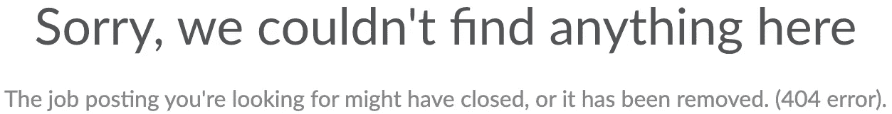

# 最大的求职错误

> 原文：<https://levelup.gitconnected.com/the-biggest-job-application-mistake-88a36c2a9af3>

如果你喜欢看我的 YouTube 视频，你可以在这里看:

在过去的几个月里，就业市场不是很好。公司在全球疫情中苦苦挣扎，这意味着几乎每个行业都在裁员。我知道很多人正在找工作，所以我想写这篇文章来帮助那些正在找工作的人。如果这篇文章有帮助，请考虑[订阅我的 YouTube 频道](http://bit.ly/sub2rahul)或者[在媒体](https://medium.com/@rahulsabnis19)上关注我，以获得更多类似的内容！

> 免责声明:我的大部分内容都集中在如何获得下一份与编码相关的工作上，但是这篇文章和视频对每个人都适用！现在我们已经解决了这个问题，让我们开始吧！

**让我们描绘一下这幅图画:**你正在申请你在网上看到的每一份工作，努力获得下一份全职或实习机会。一周过去了，你收到一封公司的邮件，要求你去面试。你满怀热情地发回了下周的空闲时间，并准备了一份周末的学习计划。当你准备学习计划时，你意识到了解工作细节有助于你确定应该关注哪些技能或问题类型。您导航回到职位发布，但是您没有找到职位描述，而是找到了以下内容:

人们在申请工作时犯的最大错误是在你申请工作时没有保存职位描述。当公司开始面试候选人或你得到工作机会时，招聘信息可能会被删除。确保你提前保存它，这样你就可以用它来理解工作职责和期望。我建议保持简单。你可以使用电子表格或其他应用程序来帮助你追踪你申请的职位。在整个过程中保持有组织有帮助。我在找工作的时候用了一个叫做 [Huntr](https://huntr.co/) 的工具。你可以使用任何你觉得最舒服的工具，但一定要记下信息，如工作描述、地点、面试笔记等。这些都将有助于你面试和评估工作机会。

我希望你发现这个故事内容丰富！请与你认为可能从中受益的朋友分享！如果你喜欢这个帖子/视频，请随意留下掌声/喜欢，并关注/订阅我的媒体和 [YouTube 帐户](http://bit.ly/sub2rahul)以获得更多类似的内容。此外，[在 Twitter](https://twitter.com/sabnis_rahul) 上关注我，了解我何时发布新内容，[在 Instagram](https://www.instagram.com/sabnis_rahul) 上关注我。我希望在下一集看到你们！

 [## 编写面试问题

### 一个完整的平台，在这里我会教你找到下一份工作所需的一切，以及…

技术开发](https://skilled.dev)