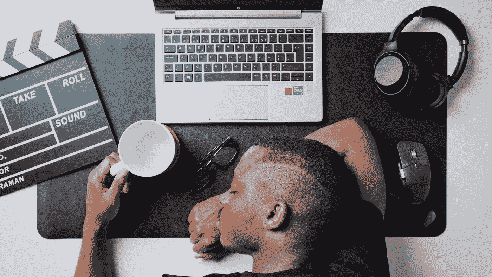

# 软件工程师面临的最大威胁

> 原文：<https://levelup.gitconnected.com/the-biggest-threat-to-software-engineers-e2c292ff250b>

## 做一名工程师不是一份没有风险的工作，那里有严重的危险。

Nubelson Fernandes 在 [Unsplash](https://unsplash.com/s/photos/burnout?utm_source=unsplash&utm_medium=referral&utm_content=creditCopyText) 上的照片

我们，软件工程师，过着奢侈的生活。尤其是根据那些认为肩上扛着斧子，有着强壮的肌肉，甚至可能留着小胡子才能完成艰苦工作的人。我们工程师整天坐在舒适的椅子上，喝着热的新煮的咖啡，在电脑前放松。

即使外面下着倾盆大雨，我们也不需要拿出工作服。我们经常灵活安排工作时间，我们有不错的薪水和津贴。

是的，我同意，我们在某种程度上被宠坏了。让我们保持这种想法，并开始问自己，为什么？

这并不是说公司很蠢，因为好玩就给我们高薪。他们给我们优厚的报酬，对我们也很好，因为对他们来说，我们是物有所值的。从长远来看，任何消除手动劳动需求的自动化都是一个巨大的胜利，它不仅可以让您的员工腾出时间来处理更重要的任务，还可以通过减少日常任务所需的工作时间来节省资金。消除重复无聊的任务也让员工更高兴，一个快乐的员工很有价值。

为什么我要强调软件工程师的重要性？好吧，理解一个公司的工程师有多关键有助于我们理解作为软件开发人员工作的最大危险。

公司开始依赖我们创建的软件，他们重新分配资源，他们开始忘记所需的手动流程。

作为软件工程师，我们需要解决复杂的问题，并为出现的问题找到解决方案。我们解决的问题越多，自动化程度越高，公司就越依赖我们。

这种依赖和期望是我认为工程师面临的一个危险的潜在原因。我遇到过许多工程师和开发人员，他们因为工作带来的精神压力而生病。

除了手臂和手腕疼痛，没有太多与软件开发相关的身体危险。然而，让我们不要忽视心理健康的重要性。

## 倦怠

在我看来，对任何一个开发者来说，最大的威胁就是倦怠。我们创建的软件必须按预期运行和工作，这会给工程师带来巨大的压力，是一个沉重的负担。一些工程师没有这些问题，尽管他们有着同样的负担和期望，但这取决于你作为一个个体如何应对。倦怠更经常发生在具有某些个性特征的人身上，比如完美主义和高昂的工作士气。

如果你工作的公司打电话来说有一个产品缺陷，让他们损失了几百万，你会感觉很糟糕。

如果他们打电话来说软件由于某种原因停机了，钱正在一秒一秒地被榨干，我们将被期望在任何时间快速地工作并解决它。

不仅有许多责任要处理，而且还有压力。压力会把一个人彻底击垮。压力可能是由于截止日期临近，软件没有按照我们告诉它的去做(你们可能都知道这种感觉)。压力也可能是由其他因素、个人生活等引起的，但会蔓延到工作中，或者反过来。压力对一个人的健康有许多负面影响，我想我们大多数人都意识到了这一点。

那么什么是倦怠呢？[倦怠](https://www.mayoclinic.org/healthy-lifestyle/adult-health/in-depth/burnout/art-20046642)通常是由与工作相关的压力引发的。这些症状通常表现为疲劳。你就是感觉不到休息，甚至一个好的长时间的睡眠也不能给你的电池充电。你会发现自己身心俱疲。

另一个主要症状是缺乏工作的动力。但是这种缺乏动力并不仅限于工作，它也会让你平时觉得刺激和有动力的爱好和其他活动变得索然无味。一切只是觉得无聊，消耗更多的精力。

精疲力尽的人经常发现自己处于一个非常向下的螺旋中，失去动力会引发其他症状。许多人报告说，他们在精疲力竭时开始自我怀疑自己的能力，觉得他们的项目是失败的。

消极开始在他们身上滋长，而消极会带来更多的消极。许多人报告说，他们开始质疑自己的工作岗位、工作场所和同事。

有不同程度的疲劳，有时会持续一天，有时几周，有些人甚至会持续更长的时间。

是不是所有的工程师都注定要遭受职业倦怠？

不，不是每个工程师都会受到倦怠的影响，有些人可以承受巨大的压力而不受丝毫影响，有些人则很难适应。

有很多方法可以防止精疲力竭，对一些人来说可能比较难，对一些人来说可能比较容易。如前所述，一些性格特征的风险更大。

一个重要的预防机制是及早发现症状。如果你能在精疲力竭之前发现症状，你就能及时采取对策。这可以只是和经理讨论一下，减轻你的一点工作负担，或者帮助缓解你的压力。

事实证明，体育锻炼也非常有助于增强抗压能力。这也让你有时间思考工作以外的其他事情，这正是你在那种情况下需要的。

## 结论

我，我自己，是一个我称之为微燃尽的专家。我称之为微燃尽，因为它们通常会在几天内过去。我经常发现自己爱上了编程，我写博客，我用它工作，我在业余时间尝试不同的框架。我非常专注于我的工作，等等。

有些星期，我的工作时间远远超过 40 小时，因为我觉得这很有趣，也很刺激。然而，其他几周我发现我甚至懒得在晚上打开我的笔记本电脑，只是看到它就让我恶心。我拖着脚步去上班，几乎不想去那里。我不想工作，不想玩电子游戏等等。

找到平衡很重要，去年我一直在努力寻找这种平衡。我想工作和从事，但我不能从事和工作太多。我很幸运有一个了不起的配偶，当我睡觉前一小时启动笔记本电脑时，他会提醒我，这可能不是最好的主意。

有几件事对我有帮助，体育锻炼是其中之一。离开工作一个小时出去慢跑是一种减压方式，有助于放松你的大脑。它可以让你度过一个超级紧张的一天。我知道当有很多工作要做的时候，反其道而行之可能会很难。

然而，我注意到，体育锻炼让我在剩下的时间里表现得更好。至少这对我很有效。

我最好的减压方式和工作表现助推器是喝咖啡休息时间。不是咖啡，那只是额外津贴，而是离开电脑几分钟。

当我开始作为一名开发人员时，我跳过休息来赢得时间，我认为我赢得了解决问题的时间。我大错特错了，一次又一次，在这件事上，我被证明是错的。

长时间调试同一个问题很少让我解决一个 bug。对我起作用的是调试，直到我用尽所有的想法，但是与其不停地敲打键盘，不如稍微休息一下，让我找到解决方案。

我有朋友从事一些非常危险的体力工作，如果他们出错的话。说做一名开发人员并不是完全没有风险，这听起来可能有点傻，但是我不认为倦怠是一件可以掉以轻心的事情。

无论你做什么，首先要把健康放在首位。我自己也很不擅长这个，但我尽力了。在我的一篇文章中，我表达了我对工程专业的看法，这解释了为什么我经常发现自己精疲力尽。

 [## 软件工程是一种生活方式，而不是一份工作

### 当听到人们抱怨他们的工作时，我突然意识到。他们都不是软件开发人员

better 编程. pub](https://betterprogramming.pub/software-engineering-is-a-lifestyle-not-a-job-16a8b360bd1e) 

如果有任何问题、想法和想法，请随时联系我。我想知道的是，你是否经历过精疲力尽，你是如何注意到的，以及你是如何找到摆脱它的方法的。

如果你喜欢我的作品，请随意给我买咖啡。

# 分级编码

感谢您成为我们社区的一员！**在** [**平台上雇佣令人难以置信的软件工程师**](https://jobs.levelup.dev/) **。**

 [## 提升就业平台

### 软件工程师、数据科学家、经理、设计师、建设者和程序员的最佳角色

作业. levelup.dev](https://jobs.levelup.dev)