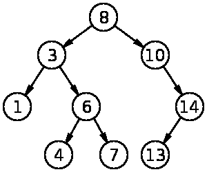
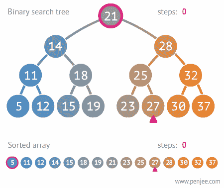
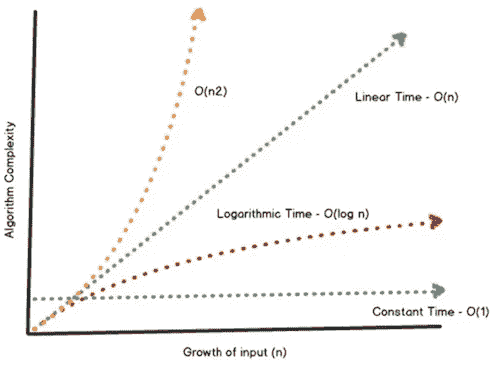
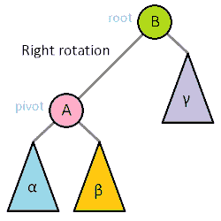

# 找到正确的平衡:二叉查找树介绍

> 原文：<https://levelup.gitconnected.com/the-binary-search-tree-80de5570f88a>

在我编程之旅的开始，我有一长串的问题要问，也有一长串的问题要问*我*。我最喜欢的问题是:“你如何平衡二叉查找树？”我最初对这个问题的回答是，“什么是二叉查找树？会用在什么地方？它的替代品是什么？”最后，“什么时候使用它不是最佳的，甚至是有害的？”这就是我的发现。

二叉查找树(BST)是一种应用二分搜索法算法原理的数据树结构，用于查找目标在分类数据集合中的位置。一个常见的例子是这样的:

[https://en . Wikipedia . org/wiki/Binary _ search _ tree #/media/File:Binary _ search _ tree . SVG](https://en.wikipedia.org/wiki/Binary_search_tree#/media/File:Binary_search_tree.svg)

该树由节点组成，每个节点代表树中的一个点，并且每个节点具有一个*可比较的关键字*；单个节点的连续分支称为其子节点。虽然其他树数据结构的节点可以有任意数量的子节点，但二叉树的每个节点最多只能有两个子节点。此外，BST 不是随机集合；每个*左*子节点小于或等于父节点，每个*右*子节点大于或等于父节点。由于这个原因，BST 也被称为排序树。

## 建筑

用 Javascript 之类的语言以编程方式构建它是一个相对简单的递归函数，它依赖于两个类:一个 Node 类和一个 BST 类。

节点的构造函数有三个属性:节点的*值*，左*值*和右*值*；后两个缺省值为 null，直到其他节点被添加到树中。这就把我们带到了 BST 类:

最基本的，BST 包含两个函数:`constructor()`和`add()`。这些允许我们以树格式构建数据的编程表示。一旦我们的节点被组织在这个架构中，使用 BST 类中的其他函数(例如，`findMin()`和`findMax()`函数分别映射过滤器通过树的左或右分支)对我们的数组进行排序以找到最小值、最大值和目标值在集合中的位置就变得非常容易。

那么什么时候我们会在另一个数据结构上使用 BST 呢？好吧，让我们来看看不同之处…

## 大 O 符号

BST 的一种常见替代数据结构是哈希表。相比之下，哈希表在最坏的情况下是线性的，O(n)，随着数据集的增长，效率变得更低。在最好的情况下，它可以是常数或 O(1)，尽管在 Big-O 符号中，我们通常关心最坏的情况。

然而，BST 是一种对数方法，O(log n)，随着数据集的增长和我们沿着曲线前进，最终会趋于平稳。正因为如此，后者可以被视为在时间和内存方面具有成本效益，只存储需要的内容。

虽然*和*结构都映射为键值对，但是哈希表并不维护数据结构的顺序。因此，当我们想要高效地对大型数据集进行排序并保持有序时，BST 被认为是更理想的结构。但是当我们的 BST 速度慢，效率低的时候呢？我们如何做到这一点？

## 平衡我们的 BST

根据我们插入和删除数据的方式，二叉查找树可能会变得不平衡。让我们考虑一下，如果我们将一个顺序递增的数组中的元素一次一个地添加到一个空的 BST 中，会发生什么情况。假设我们正确地构造了它，结果将是一个完全右侧的树，其高度与项目总数相同。虽然从技术上讲，这种顺序仍然是一种排序结构，但它完全破坏了 BST 的好处和优势，并被认为是最坏的情况，将 BST 简化为 O(n)的线性结构/链表。

你可以想象，如果只有一边有物品，没有东西可以比较，或者更糟的是，如果空的时候两边的重量不一样，秤会变得多么无用。同样的想法也适用于 BST。

为了纠正这一点，我们在插入和移除时采用了一种平衡方法，将高度限制在一个下限的常数因子内。通常，对于节点的分支，该界限或平衡因子(BF)具有[-1，+1]的整数范围。节点的 BF 由其左右分支的高度差决定。如果我们添加或删除一个节点，父节点的左或右高度将需要相应地更新，因此 BF 已经改变。这分别通过树继续向后，直到触及根。

自平衡 BST 的一个常见示例是 AVL 树。例如，在一个 JavaScript AVL 树中，我们可以使用构造函数中的一个`this.depth`属性并设置值等于`1`，一个初始为`0`的左右高度，以及一个递归的`BST.balance()`函数来比较每个分支的高度。当任何节点的左右高度差大于 1 时，BF 超过范围，树*旋转*进行补偿。我们旋转树的方向有两种可能的方式:单次旋转或两次旋转。

例如，如果我们的不平衡是在一个节点的左分支，我们做一个单一的右旋转，旋转我们的树，使不平衡的左子节点现在是父节点；换句话说，如果左边更重，我们向右旋转，反之亦然。

在下面的右旋转示例中，由于 A 小于或等于 B，α小于 A，因此当 A 成为父对象并向上旋转时，它会保留α作为其左子对象。

[https://en.wikipedia.org/wiki/Tree_rotation](https://en.wikipedia.org/wiki/Tree_rotation)

因为在我们的 pivot 中 B 大于 A，所以它现在是正确的孩子。因为γ大于 B，而 B 又大于 A，所以γ仍然是 B 的右子节点。但是请记住，当我们将 A 作为父节点时，它已经有了两个子节点，不能再有第三个了。那么我们用β做什么呢？

我们可以在这里应用一些基本的逻辑:A 小于或等于 B，而β大于或等于 A。这意味着β在这个能力上是有限的，如果它是 A 的子节点，它就不能大于 B。由于 A 以前是 B 的左子节点，现在已经旋转到父节点，B 没有左子节点。这个空间现在被β占据了。如果我们做单次*向左*旋转，我们可以反过来应用同样的逻辑。

然而，如果不平衡在*左*子*右*子树中，简单的单次右旋转将导致另一个不平衡。例如，如果我们如上所述对-2 不平衡执行一次旋转，我们的新父节点实际上以+2 不平衡结束。

为了纠正这一点，我们将执行双旋转或三节点重组:首先向右旋转，然后再次沿着新的不平衡节点旋转树，这次是向左。同样，如果我们做左右旋转，我们可以反过来应用同样的逻辑。

要查看 AVL 树的 JS 实现示例，我们可以参考 Joselito 的以下公开要点:

感谢阅读！