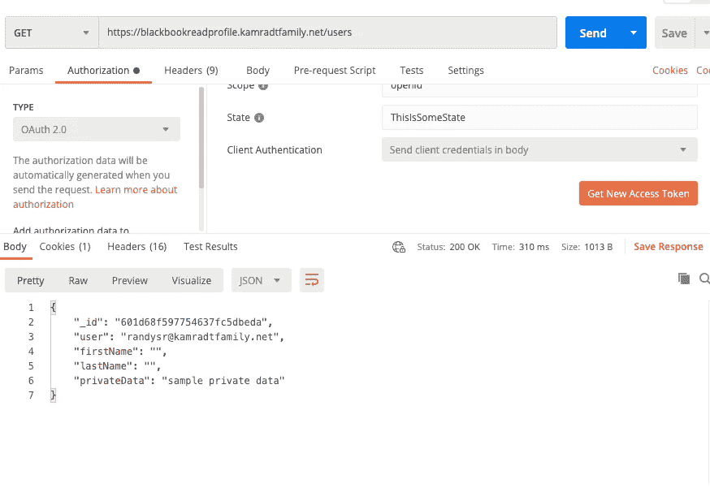
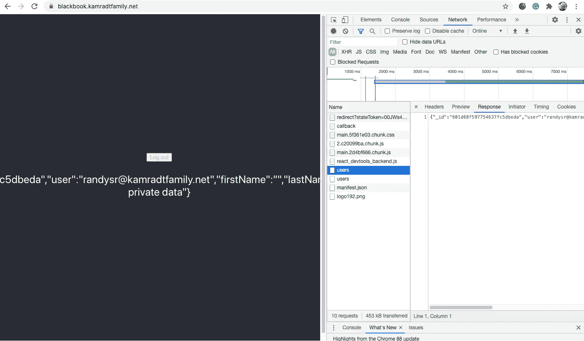

# Blackbook 项目(第三部分)

> 原文：<https://levelup.gitconnected.com/the-blackbook-project-part-3-3bfd4dc72f53>

## 身份验证与授权


图片由 [DarkmoonArt_de](https://pixabay.com/users/darkmoonart_de-1664300/?utm_source=link-attribution&utm_medium=referral&utm_campaign=image&utm_content=3040862) 来自 [Pixabay](https://pixabay.com/?utm_source=link-attribution&utm_medium=referral&utm_campaign=image&utm_content=3040862)

自从我上次写这个项目已经有一段时间了。我的 Kubernetes 服务器崩溃了，我不得不重新设置它。这一次，我坚持使用一个预先准备好的解决方案，如[将您的家庭服务器暴露在恶劣的互联网](/exposing-your-home-server-to-the-big-bad-internet-5cb2878e8a17)中所述的 [MicroK8s](https://microk8s.io/) 。入口直接连接到互联网，SSL 通过 [Cloudflare](https://www.cloudflare.com/) 处理。此外，卷声明是直接磁盘访问，因为 MicroK8s 是一个单节点集群。新的 Kubernetes 描述文件仍然在我的 GitHub 库 [blackbook-deploy](https://github.com/rkamradt/blackbook-deploy) 中。

本系列的第 2 部分结束了，我们让后端服务器简单地返回被破解的 JWT，前端将它显示为基本文本。很难看。JWT 的大部分土地都不会被使用。但是有一个函数，`claims.sub`将用于索引到一个 [MongoDB](https://www.mongodb.com/) 数据库中，以返回一个用户记录。该值是用户的电子邮件地址，并将成为该系统的用户标识符。

我们的 read profile 服务将返回一个包含用户所有基本信息的用户记录，并且只对该用户可用。端点似乎会被错误地命名为“用户”。我选择用户是因为可能还有一类管理用户可以获得所有用户，或者除了他们自己以外的用户。但那将是以后的事。目前，它将只返回登录者的信息。

这是授权的一个重要特征。一旦您通过登录屏幕发送凭证进行了身份验证，系统就知道您是谁，以及您有什么角色。目前，只有一个角色，即用户角色。但是我们仍然需要防止那个用户看到其他人的隐私数据。由于我们不能为每个用户分配一个角色，所以我们将根据用户 id 进行区分，用户 id 是从您进行身份验证(登录)时返回的 JWT 中获得的。

我们将把这些数据存储在 MongoDB 中一个名为 users 的集合中。要让 MongoDB 在我们的系统中运行，我们可以遵循我的文章[如何使用 Kubernetes Cron Jobs 定期阅读新闻](/how-to-use-kubernetes-cron-jobs-to-periodically-read-the-news-8b3b4513f8b7)中概述的过程。如果您一直关注我的 Blackbook 系列，那么您应该已经有了一个名为`blackbook`的 Kubernetes 名称空间。如果没有，您应该现在创建一个，因为所有内容都将放在该名称空间中。在 Kubernetes 主机上将目录更改为 blackbook-deploy，创建一个名为`namespace.yaml`的文件，并输入以下内容:

```
apiVersion: v1
kind: Namespace
metadata:
  labels:
    name: blackbook
  name: blackbook
```

然后你可以创建它:`kubectl create -f namespace.yaml`。

接下来，我们可以为 MongoDB 创建一个秘密。我不打算将它添加到脚本中，因为其中会有一个密码，所以我只打算从命令行运行它:

```
kubectl create secret generic mongo-secret -n blackbook \
    --from-literal=username=mongo \
    --from-literal=password=ognom
```

显然使用更好的密码。

让我们为 MongoDB 设置一些存储。在我的 Kubernetes 主机上，我在`/disk`安装了一个 4tb 的硬盘。因此，通过创建一个名为`pv.yaml`的文件并添加以下内容，在该驱动器上创建一个`PersistentVolume`:

```
apiVersion: v1
kind: PersistentVolume
metadata:
  name: task-pv-volume
  labels:
    type: local
spec:
  capacity:
    storage: 100Gi
  accessModes:
    - ReadWriteOnce
  hostPath:
    path: "/disk"
```

您可以使用命令`kubectl create -f pv.yaml`创建它。注意`PersistentVolume`不属于名称空间，在我的例子中，它已经存在，所以响应说它没有改变。请注意，存储空间仅设置为 100，如果您愿意，可以将其设置为磁盘的最大大小。

然后，您可以使用`PersistentVolumeClaim`在卷上创建一个声明。这将占用单个应用程序使用的`PersistentVolume`的一部分，在本例中是 MongoDB。创建一个名为`pvc.yaml`的文件，并添加以下内容:

```
apiVersion: v1
kind: PersistentVolumeClaim
metadata:
  name: task-pv-claim
spec:
  accessModes:
    - ReadWriteMany
  volumeMode: Filesystem
  resources:
    requests:
      storage: 100Gi
```

该索赔将占用整个`PersistentVolume`。它还允许多个 pod 访问该声明，尽管这对于我们正在做的事情可能是不必要的。从`kubectl create -n blackbook -f pvc.yaml`开始索赔。

现在我们可以启动并运行我们的 MongoDB 了。我将只使用一个副本，尽管设置三个或更多节点相对简单。要创建单个节点，创建一个名为 mongodb.yaml 的文件，并输入以下内容:

```
apiVersion: apps/v1
kind: StatefulSet
metadata:
  name: mongodb
spec:
  serviceName: "mongodb"
  replicas: 1 
  selector:
    matchLabels:
      app: mongodb
  template:
    metadata:
      labels:
        app: mongodb
        selector: mongodb
    spec:
      containers:
      - name: mongodb
        image: mongo:4.0.8
        env:
          - name: MONGO_INITDB_ROOT_USERNAME
            valueFrom:
              secretKeyRef:
                name: mongo-secret
                key: username
          - name: MONGO_INITDB_ROOT_PASSWORD
            valueFrom:
              secretKeyRef:
                name: mongo-secret
                key: password
        volumeMounts:
        - name: mongodb-data
          mountPath: /data/db
      volumes:
      - name: mongodb-data
        persistentVolumeClaim:
          claimName: task-pv-claim 
---
apiVersion: v1
kind: Service
metadata:
  name: mongodb
  labels:
    name: mongodb
spec:
  ports:
  - port: 27017
    targetPort: 27017
  clusterIP: None
  selector:
    app: mongodb
```

这里需要注意一些事情，我们将 MongoDB 作为一个服务来启动。这有时被称为无头服务，因为没有一个单一的 IP 地址来平衡这些 pods 的负载。每个 pod 都有自己的 IP 地址。在您需要多个副本的情况下，可以这样做，您使用 DSN 名称`mongodb-0`连接到主机，在本例中是零，因为只有一个副本，它从零开始计数。但是因为副本的命名是一致的，所以只要知道有多少副本在运行，就可以很容易地推断出名称。

另一个值得注意的事情是，`PersistentVolumeClaim`被挂载为一个卷，该卷被挂载在 MongoDB 通常保存其数据的`/data/db`处。最后，您可以看到如何使用秘密`mongo-secret`来填充初始化 root 用户/密码的环境变量。

## 读取简档服务

接下来，我们将修改 read profile 服务以连接到数据库并读取`users`集合。将目录切换到`blackbook-read-profile`库所在的位置。用这个命令`npm install -s mongodb`将 MongoDB 客户机添加到依赖项列表中。然后我们就可以开始给`server.js`添加一些代码了。首先，我们可以添加 MongoDB 客户端的导入和一些常量:

```
const MongoClient = require('mongodb').MongoClient
const MONGO_USER = process.env.MONGO_USER
const MONGO_PASS = process.env.MONGO_PASS
const MONGO_SERVER = process.env.MONGO_SERVER || 'mongodb-0'
const MONGO_PORT = process.env.MONGO_PORT || 27017const dbName = 'blackbook'
const mongourl = `mongodb://${MONGO_USER}:${MONGO_PASS}@${MONGO_SERVER}:${MONGO_PORT}`;
const client = new MongoClient(mongourl, {
  useUnifiedTopology: true
})
```

我们稍后将从`mongo-secret`中直接在描述符中设置这些环境变量。接下来，我们希望根据 JWT 中的`claims.sub`读入用户数据，我们假设已经读入了用户数据。

```
async function getUser(req, res, next) {
  const client = new MongoClient(mongourl, {
    useUnifiedTopology: true
  }) try {
    const email = req.jwt.claims.sub
    if(!email) {
      console.log('no user in request')
      return next()
    }
    console.log(`Connecting to ${MONGO_SERVER}`)
    await client.connect()
    console.log('Connected correctly to server') const db = client.db(dbName)
    const query = { user: email };
    var user = await db.collection('users').findOne(query);
    if(!user) {
      user = {
        user: email,
        firstName: '',
        lastName: '',
        privateData: 'sample private data'
      }
      const r = await db.collection('users').insertOne(user, {
          w: 'majority',
          wtimeout: 10000,
          serializeFunctions: true,
          forceServerObjectId: true
        }
      )
    } res.json(user)
  } catch (err) {
    client.close()
    console.log(err.stack)
  } console.log('Closing mongoDB connection')
  client.close()
  console.log('Ending')
}
```

我为每个请求打开和关闭连接，这可能是个坏主意，但我会把解决这个问题留给学生做练习，哈哈。否则，这是一个非常简单的实现，几乎直接来自 MongoDB 示例页面。

它已经假设请求中的 JWT 是可用的，这是由`authenticationRequired`方法完成的。如果没有完成，它将只返回文本“没有用户请求”。我永远也到不了那里，然而，`authenticationRequired`方法应该抛出一个错误，并向前端客户端返回一个`401` `Unauthorized`错误。为了将所有这些联系在一起，`/users`路径应该是这样的:

```
app.get('/users', authenticationRequired, getUser)
```

现在，您可以使用提供的脚本构建新的后端:

```
./buildbook
```

这将创建一个 docker 图像并把它放在 DockerHub 上。

为了进行部署，我们需要一个新的描述符文件。在 blackbook-deploy 存储库中切换到您的 Kubernetes 主机并编辑`blackbookreadprofileservice.yaml`。用这个填进去:

```
apiVersion: apps/v1
kind: Deployment
metadata:
  name: blackbookreadprofile-deployment
  labels:
    app: blackbookreadprofile
spec:
  selector:
    matchLabels:
      app: blackbookreadprofile
  template:
    metadata:
      labels:
        app: blackbookreadprofile
    spec:
      containers:
      - name: blackbookreadprofile
        image: docker.io/rlkamradt/blackbook-read-profile:latest
        ports:
        - containerPort: 3000
        env:
          - name: MONGO_USER
            valueFrom:
              secretKeyRef:
                name: mongo-secret
                key: username
          - name: MONGO_PASS
            valueFrom:
              secretKeyRef:
                name: mongo-secret
                key: password
          - name: MONGO_SERVER
            value: mongodb-0
---
apiVersion: v1
kind: Service
metadata:
  name: blackbookreadprofile-service
spec:
  type: ClusterIP
  selector:
    app: blackbookreadprofile
  ports:
  - port: 8080
    targetPort: 3000
```

除了新的 MongoDB 环境变量之外，这就像我们完成第 2 部分时的情况一样。可以用`kubectl apply -n blackbook -f blackbookreadprofileservice.yaml`启动。你可以用 Postman 来试试。您必须获得一个访问令牌，Postman 应该能够指导您完成这个过程(我在以前的文章中描述过)。一旦你有了，点击网址，看看结果:



由于这是我第一次登录，它用一些默认数据创建了一个新记录。如果您仍然运行 blackbook web 应用程序，您也可以从那里运行它，它会稍微好看一点:



我打开了开发者的窗口，这样你就可以看到`/users`的请求。

在本系列的下一篇文章中，我将格式化前端以很好地显示数据，并允许您进行编辑。谢谢你坚持到最后，我希望你学到了一些东西。

GitHub 存储库提到:

[](https://github.com/rkamradt/blackbook/tree/v0.2) [## rkamradt/blackbook

### 脸书，但是有 21 点和妓女。通过在…上创建帐户，为 rkamradt/blackbook 开发做出贡献

github.com](https://github.com/rkamradt/blackbook/tree/v0.2) [](https://github.com/rkamradt/blackbook-read-profile/tree/v0.2) [## rkamradt/black book-read-profile

### Blackbook 的阅读服务。通过在…上创建帐户，为 rkamradt/black book-read-profile 开发做出贡献

github.com](https://github.com/rkamradt/blackbook-read-profile/tree/v0.2) [](https://github.com/rkamradt/blackbook-deploy/tree/v0.2) [## rkamradt/black book-部署

### 将所有 blackbook 代码部署到 Kubernetes 的脚本。为 rkamradt/blackbook-deploy 开发做出贡献，创建一个…

github.com](https://github.com/rkamradt/blackbook-deploy/tree/v0.2) 

提到的其他文章:

[](https://medium.com/swlh/the-blackbook-project-part-1-d93e1c16d1de) [## Blackbook 项目第 1 部分

### 构建现实世界中基于 React 的应用程序

medium.com](https://medium.com/swlh/the-blackbook-project-part-1-d93e1c16d1de) [](https://rlkamradt.medium.com/the-blackbook-project-part-ii-d39301e3d98c) [## Blackbook 项目第二部分

### 添加后端来收集不知情用户的数据

rlkamradt.medium.com](https://rlkamradt.medium.com/the-blackbook-project-part-ii-d39301e3d98c) [](/exposing-your-home-server-to-the-big-bad-internet-5cb2878e8a17) [## 将您的家庭服务器暴露在恶劣的互联网环境中

### 如何不陷入困境

levelup.gitconnected.com](/exposing-your-home-server-to-the-big-bad-internet-5cb2878e8a17) [](/how-to-use-kubernetes-cron-jobs-to-periodically-read-the-news-8b3b4513f8b7) [## 如何使用 Kubernetes Cron Jobs 定期阅读新闻

### 阅读新闻的微服务。

levelup.gitconnected.com](/how-to-use-kubernetes-cron-jobs-to-periodically-read-the-news-8b3b4513f8b7)