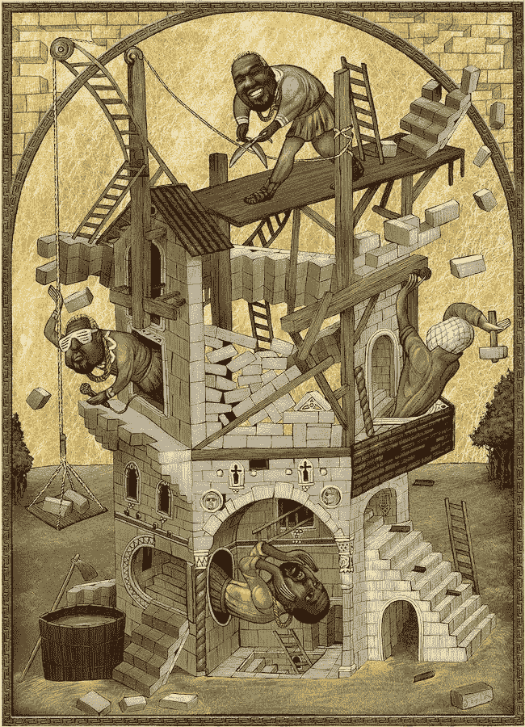
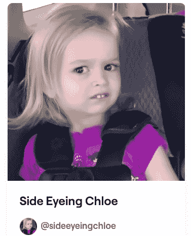
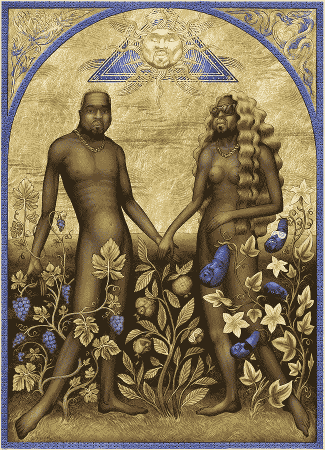

# “叶的书”NFT 项目——由坎耶·韦斯特主演的一系列以圣经为主题的非物质文化遗产

> 原文：<https://levelup.gitconnected.com/the-books-of-ye-nft-project-a-series-of-bible-themed-nfts-starring-kanye-west-62c7e6ba9484>

## 作为模因文化和名人崇拜的一种表达方式

“巴别塔”——叶《计划》中的形象

2015 年，三兄弟参加了一场 Kanye West 的演唱会。

被这场表演的壮观所震撼，被艺术家的存在和自信所鼓舞，兄弟俩决定创作并出售一件概念艺术作品，向这位说唱歌手致敬——*《yee zus 之书*由此诞生。

他们的艺术创作采用了《圣经》中创世纪的定制印刷形式。其中，每一个“上帝”都被替换成了“Kanye”或“Yeezus”。

他们的书是作为对现代宗教狂热和社会倾向的评论而创作的，这种倾向将名人神化和崇拜，就好像他们是现代的神一样。这似乎是反映坎耶渴望将自己塑造成神一样的人物的恰当方式:

来源: [YouTube](https://youtu.be/Ge33hrlN2Uc)

耶祖斯之书一经发行就卖出了数千册。它吸引了主流媒体的广泛报道，也引起了 Kanye 本人是该项目幕后主使的猜测。印刷于 2017 年停止，但该书的二手副本仍售价数百美元。

2022 年，*《叶之书》*背后的创作力量带着一个新项目*《叶之书》*回归。

一群匿名的 2D 和 3D 艺术家之前曾与普拉达、迪奥和阿迪达斯等品牌合作，他们决定，他们的下一个以圣经为主题、融入坎耶元素的创作系列将采用当今最热门的艺术媒体——NFTs。

*《叶的书》*系列是另一个杰出的例子，在这个系列中，知名艺术家和创作者将非传统艺术作为一种媒介，通过他们的艺术与观众互动并传达他们的信息

正如马歇尔·麦克卢汉在 1964 年所说:

> “媒介就是信息。”

# NFT 的兴起和崛起

在过去的几年里，非功能性非技术产品已经进入了公众的视野，并且市场还在继续呈指数级增长。[在 2021 年，超过 220 亿美元](https://www.theguardian.com/technology/2021/dec/16/nfts-market-hits-22bn-as-craze-turns-digital-images-into-assets)被花费在非正规金融服务上，而且没有增长放缓的迹象。

在大量机会的吸引下(或许是 FOMO 的吸引)，源源不断的投资者正在购买他们的第一批 NFT，希望能支持下一批[crypto 朋克](https://www.larvalabs.com/cryptopunks)。与此同时，动画师、插画师、摄影师和电影制作人都在创造和推出他们的 NFT 项目，希望借这股热情和财务成功的浪潮。

对于愤世嫉俗的观察者来说，NFT 的许多最著名的例子可以被恰当地描述为“大规模生产的 JPEGs”。

那些理解 NFTs 原则的人认识到，使用区块链计算机代码的[无聊猿](https://boredapeyachtclub.com/#/)和[外星朋友](https://rarity.tools/alienfrensnft)等集合的生成铸造，使得有限系列中的每个例子比它们乍看起来更复杂和错综复杂。每一件 NFT 的稀有性，以及随之而来的效用、利益和奖励，赋予了它价值，也让它受到收藏家的青睐。

NFT 收藏背后的创意团队经常隐藏在网上的假名和头像后面，对收藏者隐瞒他们的真实身份。对于宇迦实验室的创始人来说，情况确实如此——无聊猿游艇俱乐部背后的力量，直到最近，其创始人戈登·戈纳和格格巫被揭露是来自佛罗里达州的两个年轻人。

来源:[推特](https://twitter.com/GordonGoner/status/1489764541084930048?s=20&t=TN1W0nldpfhPgXHRCpPacw)

对于每一个试图模仿前人(并取得成功)的项目(见 CyberKongz、Prime Ape Planet 或大量其他以猿为主题的 NFT 系列，它们似乎是 Bored Ape Yacht Club 的衍生品)，都有一些很好的例子，一些知名的成功艺术家和固定的追随者正在接受 NFTs 作为表达他们创造力和传达他们信息的媒介。

叶的书似乎就是如此。

# 作为模因文化表达的非功能翻译

现代社会将因许多事情而被铭记，有好有坏。现代生活的一个不可否认的方面是涌入我们意识的前所未有的信息量和观点。

其中一些来自传统来源——我们对主流媒体提供的信息的质量、可靠性和公正性的集体信念和信任似乎正在迅速减少。与此同时，有影响力的人和名人也产生了看似源源不断的内容。

迷因从这两种信息来源中产生，而且往往比产生它们的事件或时刻更令人难忘。

可以说，唐纳德·特朗普(Donald Trump)的整个总统任期都展示了迷因的力量。这四年中许多更有意义、更令人生厌的片段已经被浓缩成可记忆的瞬间、视频和片段。

来源:[推特](https://twitter.com/TrumpDraws/status/826542931112660992?s=20&t=z1ngDtZv5qT638WctAlgRQ)

像 [GameStop](https://medium.com/makingofamillionaire/the-gamestop-and-wallstreetbets-episode-has-helped-normalise-bitcoin-133bbcc00192) 和 AMC cinemas 这样的所谓迷因股的兴起(以及最终的下跌)是因为互联网在完全陌生的人之间实现交流、合作和共谋的潜力。

名人影响者因出名而出名，但却没有魅力或明显的技能来证明许多人积累的曝光率和追随者。要获得追随者并影响大量的人，似乎需要的是驾驭集体情绪的能力，并以抓住他们想象力的方式利用这种能力。迷因是达到这一目的的完美手段。

毫不奇怪，模因文化和非功能性语言世界之间有如此明显的交集。当许多[互联网最知名的迷因](https://medium.com/gitconnected/side-eyeing-chloe-is-now-an-nft-an-internet-meme-sells-for-75-000-65b820ef1eed)的明星认识到这种潜力，并选择为这些历史时刻制作和销售非功能性传播媒介时，这一点得到了证明，通常会获得大笔金钱。

《侧目克洛伊》的截图，这部电影以 7.5 万美元的价格获得了 NFT 奖:[Foundation.app/@sideeyeingchloe](https://foundation.app/@SideEyeingChloe)

更进一步，叶的书展示了如何利用非功能性翻译作为表达模因文化的艺术媒介。

# 媒介和艺术本身一样重要

艺术也是如此。无论你是否认同各种艺术创作真正配得上艺术的标签，创作者总是在拓展大众接受和欣赏的界限。

很可能有一段时间，画在宗教建筑和宫殿天花板上的壁画被认为是轻浮的、不切实际的或过于华丽的。然而，很少有人有幸看到米开朗基罗在西斯廷教堂天花板上的画作，他的影响不仅在于画作本身，还在于媒介和背景。那幅作品的崇拜者凝视着天空，因为他们接受了这幅图像，对它的规模和耗时数年完成的作品的复杂性感到困惑。

历史上的艺术作品也是如此——它们的影响不仅在于创作过程中的主题或技巧和艺术性，还在于创作它们的媒介以及展示和体验它们的环境。

这似乎就是为什么*的叶*的书选择了 NFTs 作为他们的艺术媒介的根源；采用尖端的区块链技术来表达其最著名和最臭名昭著的迷因名人之一的精神气质。

# 叶的书

《叶的书》中的 NFT 反映了《叶的书》2015 *背后的原始灵感的演变。*

该项目的创作者已经精心制作了 5 本单独的“摩西之书”——在书中采用 3D 图形的数字 NFT，Kanye West 在整个文本和插图中担任主角。

该项目还将在五个不同的系列中发行 1000 张数字 3D 卡片——每张卡片都有一幅来自《圣经》的插图，再一次突出显示了包含 Kanye 肖像的风格化图像。每个系列的卡片都有颜色编码——金色是最稀有的颜色。

根据《叶的书》网站的说法，的所有者还将获得一个位于区块链的私人阅览空间，他们可以在那里阅读手稿，阅读阐述这一概念的前言；查看精美的全彩插图，描绘他们书中值得注意的场景，并且都有原声配乐支持。

叶 的书 [*内的 NFTs 的图片和 3D 视频可以在项目的网站上查看。在这篇文章的顶部有一张来自非物质文化遗产之一的 2D 的图片——“巴别塔”。*](https://booksofye.com/)

另一个例子——下面的“伊甸园”展示了男孩团队创作的艺术风格，这种风格融入了 NFT 贺卡的数字 3D 版本。

“伊甸园”——叶《计划》中的形象

叶的书是基于原始的数字艺术作品创作的，而不是由计算机算法生成的。因此，NFT 将被预先铸造，并通过 NFT 市场出售，每次 200 个。创作者为潜在买家提供了有限的位置来参加预售，这可能会增加对 NFT 发布的预期和需求。

与通常在一个系列中发行 5，000-10，000 份 NFT 的其他项目相比，该项目背后的创作者选择的系列规模故意较小。这既反映了该系列中每幅 NFT 作品创作中的细致思考和精湛工艺，也反映了创作者希望通过 NFTs 实现的高于通常的底价。每张卡最初将以 0.2 ETH 的价格出售。

该项目最初打算发行更小的 100 只 NFT，目标底价更高，为 4 ETH。经过进一步的考虑，它的创始人认为同样的排他性可以通过以更低的价格铸造和销售 10 倍数量的 NFT 来实现。这也将让更多的买家加入业主专属群体。

# 接下来会发生什么？

NFT 市场正处于一个高速增长的时期，同时也是一个激进创新的时期。感觉好像已经达到了临界质量，足够多的人在概念上意识到了非功能性艺术，我们可以期待这种增长和热情扩展到艺术和区块链爱好者的世界之外。

正如叶的书所展示的，这种增长不仅仅是“更多的相同”——不仅仅是产生和销售猿类主题的 JPEGs 图片的多个项目。

它是关于创作者故意选择 NFT 作为艺术媒介，然后理解和利用它作为一种技术和他们试图通过他们的创作传播的信息之间的协同作用。

我会饶有兴趣地关注着[的进展*叶的书*](https://booksofye.com/) 。在外面的某个地方，我怀疑 Kanye 也会看着！

*您可以通过* [*访问*](https://booksofye.com/) *网站了解更多关于* [*叶*](https://booksofye.com/) *的书籍。*

如果你喜欢阅读这样的故事，并且愿意支持我和媒体上的其他作家，可以考虑注册**成为媒体会员。一个月 5 美元，给你无限的故事。如果你注册使用* [*我的链接*](https://tobyhazlewood.medium.com/membership) *，我会赚一小笔佣金。故事中的其他各种链接也是如此。**

* [## 通过我的推荐链接加入灵媒——托比·黑兹伍德

### 作为一个媒体会员，你的会员费的一部分会给你阅读的作家，你可以完全接触到每一个故事…

tobyhazlewood.medium.com](https://tobyhazlewood.medium.com/membership)* 

*注意:*本文仅供参考。不应将其视为财务或法律建议。在做任何重大财务决定之前，先咨询财务专家。**