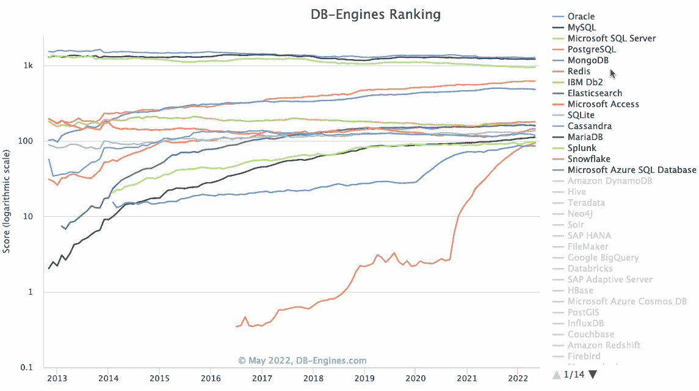

# 婴儿潮一代。网络开发技能升级指南—第 1 部分

> 原文：<https://levelup.gitconnected.com/the-boomer-net-dev-skill-upgrade-guide-part-1-68b4984126ee>

作为一名 40 岁的个人贡献者，第一天走进一家湾区的初创公司。

*这两部分的思考反映了我与一些好朋友和前队友的对话，以及对过去几年我自己的一些观察的反思，因为我准备加入湾区为数不多的几家由风投支持的初创公司之一。NET 在后端。*

说发展格局在过去几年发生了相当大的变化是一种保守的说法。如果你和我一样是婴儿潮一代的开发者，如果你一直在做，走进未知的领域会让人感到畏惧。NET 框架开发，却没有跟上市场的脉搏，也没有不断地提升自己的技能。

我个人认识一些开发人员，他们已经找到了方向，现在发现自己在一个工程领域中寻找方向，这个领域自从他们第一次使用。NET 框架。

对我自己来说，我从。我在 2018 年左右领导了从内部部署产品到。NET Core 运行在 Azure 函数上，带有 Vue 前端和 CosmosDB 数据库。我发现这一旅程在某些方面是值得的(无服务器！)而且对其他人来说有点令人沮丧(我真的，*真的*不喜欢 React——一会儿再谈这个)。

我有机会观察一家 AR/VR 初创公司是如何开发软件的，这家公司获得了 1 亿美元的 C 轮融资，一家网络安全初创公司在 Kubernetes 上过度扩张，一家 YCombinator 初创公司刚刚获得 300 万美元的 ARR，很可能会获得数百万美元的 b 轮融资。

一路走来，我有机会采访许多其他 YC 和风投支持的创业公司(有时成功，有时失败得很惨)。

在这里，我向你展示婴儿潮一代的知识。NET 开发人员分为两部分:

## 第一部分

1.  拥抱。网络 6
2.  学习 TypeScript 和 Python 或 Go
3.  React 很烂，但你必须学会它
4.  获得现代前端工具的实际操作
5.  围绕 NoSQL 范式展开你的思考

## 第二部分

1.  macOS 和 VS 代码
2.  Linux 的工作知识
3.  熟悉命令行(vi、git、npm、yarn 等等！)
4.  码头工人，码头工人，码头工人
5.  无服务器和云

# **1。拥抱。网络 6**

不值得在这方面花费太多时间，因为这是已知的:**你需要拥抱。网 6** 。我指的是从最小的 API 到命令行工具的全部内容；扔掉你的不安全感和偏见，走出你的舒适区。

在第 2 部分的后面，当我们谈到 Linux、Docker 和 VS 代码时，我会涉及到这一点，但是绝对有必要从正确的心态开始，因为。NET 和。NET 开发发生了如此巨大的变化，如果你不能放手，你就不能成为一名. NET 开发人员。

的现在和未来。NET 是多平台的——不仅仅是 Windows，而且经常是 Windows 优先。

# 2.学习 TypeScript 和 Python 或 Go

你没有选择。你必须学习 TypeScript 和 TypeScript 工具链。随着 Blazor 生态系统和采用的增长，如果您可以在前端和后端使用 TypeScript，那么作为全职或兼职的全栈开发人员(企业或初创公司),您的选择将是最广泛的。

在我采访的几乎每一家风投支持的初创公司和我工作过的每一家公司中，Node 上的 TypeScript 是后端的核心，或者该公司正在将 JavaScript 过渡到 TypeScript(在后端使用 Swift、Python 和 Reason 的少数例外)。TypeScript 普遍用于前端。

在某些情况下，有些工作负载使用 TypeScript 会更有意义。例如，有些工作负载，如 E2E 测试、CLI/工具开发、本地脚本编写，在 TypeScript 中比 C#更容易，更符合人体工程学。

我不能更热情地推荐 [**亚当弗里曼的基本打字稿 4**](https://www.amazon.com/Essential-TypeScript-4-Beginner-Pro/dp/148427010X) 。这不仅仅是一本优秀的 TypeScript 技术书籍，它的前两章简明地分解了 JavaScript，之后的每一章都从概述 JavaScript 的缺点以及 TypeScript 如何弥补这些缺陷开始。这是我读过的最好的 语言专业技术书籍之一，完全值得一读。

好消息是，如果你熟悉 C#，TypeScript——在许多方面——是一种温和的过渡；如果你已经是一个合格的 C#开发者，那么成为一个合格的 TypeScript 开发者是非常容易的。查看我的小知识库，突出 TypeScript 和 C#之间的一致性:

 [## GitHub-Charlie digital/js-ts-cs harp:一个展示 C# 10 函数技术的资源库…

### 这个库旨在突出 C#中可用的各种功能技术。点击此处阅读更多内容…

github.com](https://github.com/CharlieDigital/js-ts-csharp) 

在我之前的文章 [**面向对象编程的结构化控制流**](https://medium.com/codex/structural-control-flow-with-object-oriented-programming-part-2-7d18526146de) 中，你也可以看到这两种语言是多么的相似，在这篇文章中，我演示了在 C#中不会感到格格不入的模式。

虽然只有 TypeScript 可能就足够了，但是应该将 Python 或 Go 中的一种添加到您的清单中，以拓宽您的选择。如果你想进入 ML/AI 领域，Python 无疑是当今的必需品。

# 3.React 很烂，但你必须学会它

让我们这样说吧:我 ***憎恨*** 带着激情做出反应。糟透了。很可怕，很啰嗦，很难看，还容易做的很差。在很多方面，它让我想起了经典的 ASP 或 PHP，布局和逻辑交织在一起。最重要的是，**的 React 运行时间是*非常愚蠢的***；[如果你想了解更多，这篇文章将帮助你理解 React 的核心本质，以及它如何迫使开发人员更加努力地工作](https://itnext.io/using-usememo-and-usecallback-to-save-history-from-react-langoliers-8eb7bb72c87)。React 与好的技术选择完全相反，因为*很难做对，很容易做错*。我看到不同的团队犯了太多次错误，所以我能得出的结论是，这是 React 的本性。

但是您别无选择:您必须了解使用 React 的基本知识。它已经成为默认，因为它主导了市场*尽管*它有许多缺陷。

这里有一个全栈回购，展示了如何与. NET 6 后端一起工作，并与 Valtio 前端进行反应(抱歉，我不能让自己拥抱 Redux 的恶臭):

 [## GitHub-Charlie digital/dn6-mongo-react-valtio:一个功能齐全的样本。NET 6 Web API 与…

### 功能齐全的样品。NET 6 Web API 与 MongoDB、React 和 Valtio。为后端的 Google Cloud Run 设置…

github.com](https://github.com/CharlieDigital/dn6-mongo-react-valtio) 

另一方面，Vue 更容易做对并做好。部分原因是生态系统提供了合理且易于使用的默认值。部分原因是默认使用更简单的范例(例如基于代理的状态)。这部分是因为它的生态系统更具凝聚力，同时也有利于吸取 React 和 Angular 的最佳部分。

你也许可以只带走 Vue——这要理智得多。大多数雇佣全栈开发人员的公司会很乐意雇佣 Vue 体验人员，即使他们的栈是 React。但是除了琐碎的例子之外，它们是构建前端和管理状态的完全不同的方法。

# 4.获得现代前端工具的实际操作

虽然许多现有的前端工作流都在使用 webpack，但有越来越多的人转向 [**Vite**](https://vitejs.dev/) ，并且由于它简化了开发体验，它将继续增长。

谢天谢地，我发现 Vite 比 webpack 更容易使用。与 Vue 类似——也是尤雨溪的想法——Vite 提供了合理的默认值，这使得使用工具集变得容易。无论你是使用 React、Vue 还是 Svelte，Vite 都是你的不二之选。

虽然我仍然偶尔渴望“美好的旧时光”和使用香草 JS 的简单性，但使用 Vite 的 hot reload 实在是太好了。

# 5.围绕 NoSQL 范式展开你的思考

DB 排名显示 MongoDB 和 Postgres 稳步上升。

虽然 Postgres、MySQL、SQL Server 和 Oracle 等关系数据库不会去任何地方 ，但创业世界——以及越来越多的企业——由 NoSQL 主导。

原因各不相同，从初创公司基于消费的定价的成本和优势，到经验不足的开发人员在使用 JSON 序列化对象时对象关系摩擦较小。

Firestore 和 CosmosDB 等解决方案承诺功能上无限的容量，而没有管理基础架构和规划复杂分片策略的开销，只要您知道自己在做什么。

与其花时间学习 *n* 数量的数据库，不如花时间了解最常见的不同范例，以及如何考虑使用这些范例构建解决方案，并尝试其中的一些范例:

*   面向文档的数据库如 MongoDB、Firestore、CosmosDB 和 AWS DocumentDB 都是很好的起点。面向文档的数据库解决了对象-关系不匹配的常见问题，但是这些数据库也提出了独特的数据建模挑战。虽然开始使用这些数据库通常很容易，但团队通常会遇到的问题是，易用性通常会导致无法扩展(或扩展成本太高)的不良实践。好消息是，其中每个都有免费或功能免费的层，您可以开始使用。
*   **键值和宽列存储数据库**，如 DynamoDB、Cassandra 和 Redis。当需要巨大的平面数据集时，通常使用这些数据库。
*   **Neo4j、AWS Neptune 等图形数据库**。虽然 graph 仍然是一个利基市场，但由于数据库的利基性质，熟悉用例有助于发掘机会。根据我对 Neo4j 的了解和丰富经验，已经出现了几个机会。
*   **分析数据分析工具**如 Apache Spark、AWS Kinesis 和 Azure Stream Analytics 也是了解数据规模和范围以及摄取和洞察之间预期差距变得越来越小的关键工具。

对于实际工作，我强烈建议您熟悉:

*   **MongoDB** 。这似乎仍然是许多创业公司的首选，因为年轻团队很难克服低对象关系摩擦。它也被认为是“安全的”,因为它可以防止云供应商锁定 Firestore 或 CosmosDB。
*   **Postgres** 。在关系方面，这是我发现初创公司倾向于使用的数据库。熟悉 [**Prisma**](https://www.prisma.io/) 或[**type ORM**](https://typeorm.io/)**，因为这些是使用 TypeScript 访问关系数据的最常见 ORM。**

**在第 1 部分中，我们已经了解了技术环境是如何变化的，以及一些关键技术。NET 开发人员需要吸收。虽然 Blazor 的市场在不断增长(WASM 仍在成熟)，ASP.NET MVC 的市场也在不断增长，但适应主导这一领域的技术堆栈是释放更多机会的关键。**

**我对任何准备进行这种转变的人的建议是，在 GitHub 中构建小项目，并在你的舒适区之外冒险时享受乐趣。将无服务器应用部署到 Azure、AWS 或 Google Cloud 在功能上是免费的(我为运行在 Azure、AWS 和 Google Cloud 上的各种项目每月支付不到 1 美元)，因此没有理由不投入其中。**

**[**第二部**](https://chrlschn.medium.com/the-boomer-net-dev-skill-upgrade-guide-part-2-504f120f988d) ( *订阅或关注获取更新！如果你想在这个不断变化的市场中获得最大的机会，我们将仔细看看开发环境和工具以及我的建议。***