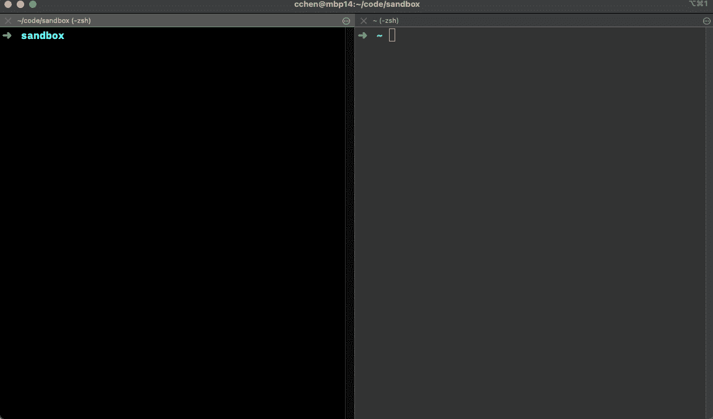
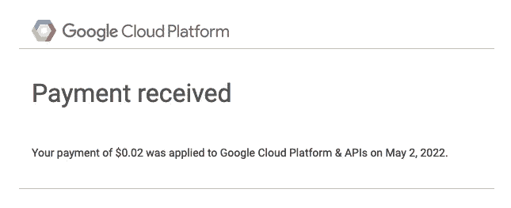
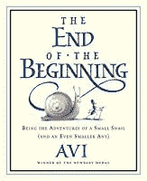

# 婴儿潮一代。网络开发技能升级指南—第 2 部分

> 原文：<https://levelup.gitconnected.com/the-boomer-net-dev-skill-upgrade-guide-part-2-504f120f988d>

*这两部分思考反映了我与一些好朋友和前队友的谈话，以及我对过去几年自己观察到的一些情况的思考，因为我准备加入湾区为数不多的几家由风投支持的初创公司之一。NET 在后端。*

旁注:我在第一部分收到的反馈中有一点是，使用“boomer”只会使软件行业的年龄歧视永久化。虽然我对此很敏感，但我认为这是一种心态，而不是身体特征。“婴儿潮”一词指的是对现状有强烈依恋，或有落伍的感觉，甚至宁愿倒退到“过去的美好时光”的人。很多时候，*这是在特定环境、团队或管理风格下工作的结果，而不是个人的特质。*

在第 1 部分中，我谈到了自 20 世纪 90 年代以来，技术领域发生了多大的变化。NET 框架 。在第 2 部分中，我想重点介绍开发环境和工具。

有很多东西要解开，但关键是现代。NET 不仅仅是一个 Windows 堆栈，通常它甚至不是 Windows 优先。这在很大程度上是由于集装箱化和各种模式的无服务器工作负载的兴起。

适应这种转变意味着开发人员需要精通类似 Unix 的操作系统。

在这里，我向你展示婴儿潮一代的知识。NET 开发人员，第 2 部分:

# 第一部分

1.  拥抱。网络 6
2.  学习 TypeScript 和 Python 或 Go
3.  React 很烂，但你必须学会它
4.  获得现代前端工具的实际操作
5.  围绕 NoSQL 范式展开你的思考

# 第二部分

1.  macOS 和 VS 代码
2.  Linux 的工作知识
3.  熟悉命令行(vi、git、npm、yarn 等等！)
4.  码头工人，码头工人，码头工人
5.  无服务器和云

# 1.macOS 和 VS 代码

在 2021 年开始之前，我——和大多数人一样。NET devs——在 Windows 上的 Visual Studio Professional 的舒适范围内工作，一切都很好。但在 2021 年初，我承诺转而使用 VS 代码，我不知道这会让我走上 macOS 的道路。

这不是部分切换，这是一个完整的硬提交。从今以后，我会用 VS 代码写每一行代码。

一部分原因是我想看看这是否可能。一部分原因是我已经在 VS 代码中完成了大部分的前端 Vue SPA 工作，这些代码有很好的 JavaScript、TypeScript 和前端开发工具。

我发现自己更加熟悉命令行界面和 CLI。好消息是 CLI 已经有了很大的进步，很容易快速使用。这些天来。

启动和测试一个简单的。NET 最小 web API 从命令行。笨重的 msbuild 界面的日子已经一去不复返了。

最初在 VS 代码中学习 OmniSharp 和 C#时有一些困难。*但是这段时间的关键成果是我不再依赖 VS 做任何事情*；我可以从命令行和 VS 代码中完成几乎所有我需要做的事情(你的里程数可能会有所不同)。

> 笨重界面的日子已经一去不复返了

不要误解我的意思:人们真的无法将 VS 代码与 Visual Studio 这样一个全面的 IDE 相提并论，但问题是完整的特性集有多少是在日常生活中使用的。

从 Visual Studio 和 Windows 的分离是一个关键的飞跃，因为我采访的每个初创公司的主要开发平台都是 macOS，而不是 Windows。不必受 Visual Studio 的束缚意味着我不再受 Windows 的束缚；我完全致力于切换到 macOS。

[**我已经写了我在苹果 M1 硬件**](https://chrlschn.medium.com/dev-diaries-net-development-on-a-macbook-pro-m1-75359c25b697) 上工作的经历，如果你的工作量允许，我绝对推荐它的性能、电池寿命和绝对静音操作。尽管我更喜欢 Windows 作为日常使用的操作系统，但苹果的硬件要好得多。

但更重要的是，它让我做好了工作准备。NET 运行在 Linux 容器中。

*(旁注:如果你不想处理 OmniSharp 的怪癖，JetBrains Rider 也是一个很棒的 IDE)*

# 2.Linux 的工作知识

这一点至关重要的原因是，全球部署和扩展软件的方式已经朝着容器化工作负载的方向发生了巨大的转变。对于这些工作负载，Linux 的成本和资源效率明显高于 Windows。

从开发的角度来看，把它看作一个操作系统并不重要，更重要的是把它看作一个低成本、轻量级的应用程序运行时容器。

因为 macOS 本身是一个基于 Unix 的操作系统，所以 macOS 和 Linux 之间的 shell 脚本或多或少是可移植的，这使得在 macOS 中工作比在 Windows 上使用 WSL 更容易一些。

在 macOS 中编写 shell 脚本和使用命令行的简单行为将使您在设置和使用 Linux 容器时具备基本的 Linux 交互能力。否则，[微软的**。NET 运行时 Linux 容器**](https://hub.docker.com/_/microsoft-dotnet/) 已经为。NET，并且通常只涉及很少的 Linux 知识。

就这样🤣。真的。

# 3.熟悉命令行(vi、git、npm、yarn 等等！)

这将我们带回到命令行，熟悉它是绝对重要的。

一部分原因是所有构建现代前端的工具都是基于命令行的。无论您使用的是`npm`还是`yarn`，您最终都会非常熟悉命令行。

部分原因是，在持续集成中，无论是 GitHub Actions 还是 GitLab CI 或 Azure Pipelines，打包和部署都需要开发期间使用的许多相同命令。

部分原因是，与云服务交互的最有效方式通常是通过 CLI。

部分原因是，您偶尔必须对错误的容器进行故障诊断，并且您唯一的交互模式是通过命令行。该容器没有 GUI，所以您需要熟悉任何一个可用的控制台文本编辑器，如`vi`或`vim`。如果你需要检查或更新容器中的配置文件，你将需要基本的操作`vi`(不是每个发行版都有*和* `vim`，但是我没有遇到过没有 `vi`的*)。*

大多数情况下，您可以通过了解如何:

*   打开一个文件
*   进行编辑
*   查找和替换
*   保存文件并退出
*   不保存退出

熟悉一些键盘命令，如`cat`、`grep`、`rm`、`sed`以及其他一些命令。

就是这样！在很大程度上，与 Linux 交互的唯一原因是排除故障和偶尔修改文件，因此熟悉一些关键的命令行工具非常重要。 [**随着无服务器容器即服务**](https://chrlschn.medium.com/thoughtworks-misses-the-mark-re-serverless-vs-kubernetes-9901d1b0f0c6) 的成熟，可以直接从 GitHub 获取代码并代表您进行部署，您现在可以在 Linux *上部署容器化的工作负载，在许多情况下甚至不需要与 Linux 交互*。

# 4.码头工人，码头工人，码头工人

> “Docker 被全球数百万开发者用来构建、运行和共享容器化应用。目前，55%的专业开发人员在工作中使用 Docker”“[**TechRepublic**](https://www.techrepublic.com/article/docker-launches-new-business-plan-with-changes-to-the-docker-desktop-license/)

最近对 Docker 许可的改变已经让一些人寻求替代产品 ，但是 Docker 仍然是使用最广泛、最容易使用的容器工具之一。

因此，也许正确的标题应该是“c *容器，容器，容器*”，因为这是目前在云中部署应用程序的现实。即使是无服务器的功能也不过是被塞进专门的容器中并代表你启动的代码。

我使用 Docker 的切入点实际上是 [**Dapr**](https://dapr.io/) ，我在 2021 年 6 月下旬开始使用它，当时我正在为我正在开发的一个应用程序评估它。Dapr 团队发布了一个参考 eShopOnDapr 应用程序:

 [## GitHub-dot net-architecture/eShopOnDapr:一个示例。NET 核心分布式应用的基础上…

### 一个样本。基于 eShopOnContainers 的. NET 核心分布式应用，由 Dapr 提供支持。附带的电子书 Dapr…

github.com](https://github.com/dotnet-architecture/eShopOnDapr) 

我发现样本 eShopOnDapr 参考应用程序充满了太多的“挥舞魔杖”,并决定从头开始分解如何建立一个完整的 Dapr 应用程序的每一层，并最终在一周的时间里写了一系列博客帖子(GKE 的帖子是在很久以后才出现的):

1.  [Dapr 和 Azure 功能:**第一部分—Hello World**](https://charliedigital.com/2021/07/01/dapr-and-azure-functions-part-1-hello-world/)
2.  [Dapr 和 Azure 函数:**第 2 部分— Azure 函数在 Docker**](https://charliedigital.com/2021/07/02/dapr-and-azure-functions-part-2-containerization-docker/) 中的容器化
3.  [Dapr 和 Azure 功能:**第 3 部分——使用 Dapr** 和](https://charliedigital.com/2021/07/02/dapr-and-azure-functions-part-3-containerizing-with-dapr/)进行集装箱化
4.  [Dapr 和 Azure 功能:**第 4 部分—通过 Kubernetes**](https://charliedigital.com/2021/07/06/dapr-and-azure-functions-part-4-deploy-via-kubernetes/) 部署
5.  [Dapr 和 Azure 功能:**第 5a 部分—使用 ECR 和 EKS 法盖特**](https://charliedigital.com/2021/07/07/dapr-and-azure-functions-part-5a-deploying-to-aws-with-ecr-and-eks-fargate/) 部署到 AWS
6.  [Dapr 和 Azure 功能: **Part 5b** — **与 ACR 和** AKS 一起部署到 Azure](https://charliedigital.com/2021/07/08/dapr-and-azure-functions-part-5b-deploying-to-azure-with-acr-and-aks/)
7.  [Dapr 和 Azure 功能: **Part 5c** — **部署到谷歌与 GKE**](https://charliedigital.com/2021/10/30/dapr-and-azure-functions-part-5c-deploying-to-google-with-gke/)

从零开始构建它帮助我掌握了以下基本知识:

1.  码头工人
2.  Docker 编写(非常有用)
3.  Kubernetes(对于大多数团队和用例来说，[**【YAGNI】**](https://martinfowler.com/bliki/Yagni.html)不太有用，可能是一个惊人的例子)
4.  在每个云提供商上使用容器注册中心和 Kubernetes 产品

我推荐这个练习，因为从零开始采用 Dapr 解决方案到 Kubernetes 部署的所有方法将为您提供一个非常好的基线，以了解几个关键技术以及与 Docker Compose 和 Kubernetes 联网的基础。整个练习花费不到 2 美元(只是一定要清理你的资源！).

*侧注:* ***集装箱！= Kubernetes*** *。我强烈建议您了解 Kubernetes，但是通常避免使用它，除非它对于您的应用程序架构是必需的(例如，您需要运行一个处理 web sockets 的服务器)。每个云提供商现在都有运行容器工作负载的机制，而没有 Kubernetes 的开销。*[*Azure Container Apps 抽象出底层编排***仍然允许 Dapr sidecar 架构**](https://docs.microsoft.com/en-us/azure/container-apps/microservices-dapr?tabs=bash) **。**

*您还将真正接触到每个云提供商的 CLI，并对平台有所了解(我真的很喜欢 GCP)。*

*最后，对我来说，关键的收获是使用容器来打包、运输和运行应用程序是多么的棒。当前提供的无服务器容器— [**Google Cloud Run**](https://cloud.google.com/run) 、 [**AWS App Runner**](https://aws.amazon.com/apprunner/) 和[**Azure Container Apps**](https://azure.microsoft.com/en-us/services/container-apps/)—使得将代码部署到云变得如此简化，并减少了使用无服务器功能的许多缺点和限制，同时提供了许多好处，如自动扩展和扩展到零。*

# *5.无服务器和云*

*毫无疑问，云是现在和未来；这只是时间问题，每个开发人员都需要有使用云的实践经验。*

*我个人认为，过去两年中最大的变化之一是容器即服务(相对于 Kubernetes 即服务)的兴起，因为这提供了运行无服务器工作负载的能力，这些工作负载可以扩展到零，而不必做太多事情，只需在已知端口上侦听传入的请求。用任何编程语言、任何应用服务器编写代码——只要你能把它打包到一个容器中，你就能在云中无服务器地运行它！*

*将您的 React 或 Vue 前端作为一组静态资产部署到任何 blob 存储服务和 boom！即时网络应用！*

*好消息是，这三个平台一开始都提供了充足的信用额度。但老实说，如果您选择了基于消费定价的正确技术，即使在这些平台上全职运行应用程序，每月的成本也不到 1 美元。CosmosDB 就是一个很好的例子，它有 [**无服务器产品**](https://docs.microsoft.com/en-us/azure/cosmos-db/serverless) 以及免费层。*

*我运行了一个 Google Cloud Run 应用程序(**[**的 live 实例**](https://github.com/CharlieDigital/dn6-mongo-react-valtio) )我的示例 dn6-mongo-react-valtio repo**)带有一个免费层 MongoDB 后端，它至少每 2 小时处理一个请求(预定重置)，每月 0.02 美元！*

**

*没有借口！它的功能是免费学习的。*

*在与所有三家云供应商合作之后，我确实认为 Google Cloud 可能是最容易使用的，并推荐它作为切入点(AWS 是最复杂和最不符合人体工程学的，IMO)。特别是，Google Cloud Run 使得利用现有技能变得非常容易。NET 并为无服务器容器构建应用程序，毫不费力——实际上只需在现有的 web API 中添加一个`Dockerfile`,您就拥有了一个超级可伸缩的无服务器 web API。*

*我喜欢把这看作 ***的开始*** 的结束:*

> *蜗牛雅芳和蚂蚁爱德华又回来进行一次有趣的冒险了。他听说，冒险是幸福生活的关键。因此，和他的新朋友蚂蚁爱德华一起，雅芳踏上了寻找生活中缺失的刺激的旅程。*

**

*如果你有小孩，这是一本非常棒的书！*

*对我来说，这无疑是一次冒险。NET 框架甚至。网芯到。NET 6、节点、Docker、无服务器和云。*

*事实上，我觉得这两篇文章只是触及了皮毛，当然还有很多主题我没有提到( *Next.js，Nuxt.js，Nest.js，SSR，SSG，WebAssembly，GitHub Actions 和 CI/CD，mobile，electronic，Cypress，剧作家，Jest，WebSockets，gRPC，GraphQL，以及更多*)，但是我已经尝试将重点放在我自己旅程中真正核心的知识上。*

*我希望这两篇文章为您提供了视角和路线图的轮廓，让您开始自己的冒险之旅，走向未来。NET 和应用开发！*

*如果你喜欢这两篇文章，请在上订阅更多的大脑垃圾。NET、无服务器和软件工程！*