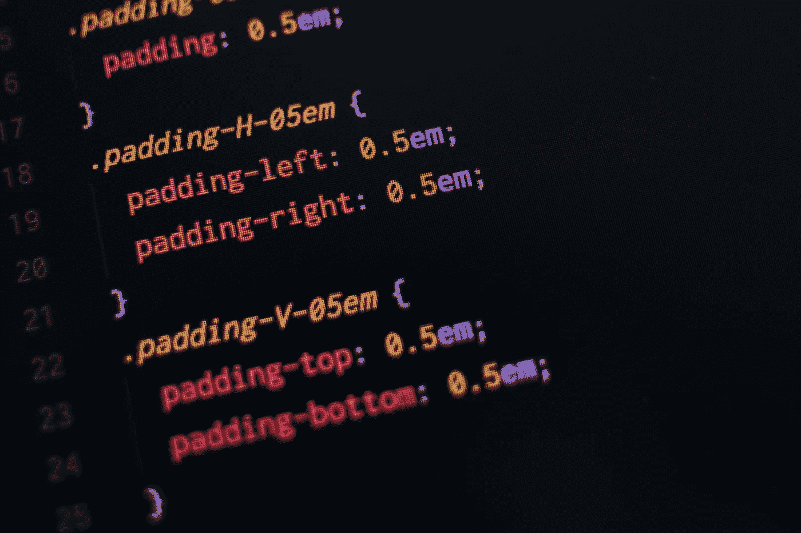

# CSS 中的“C ”:为什么它很重要？

> 原文：<https://levelup.gitconnected.com/the-c-in-css-why-is-it-important-8d3900d6827b>

## 理解级联样式表中的级联。

这是平常的一天。您在自己的办公桌前，创建 UI 人员 Mike 发送的新设计。你想知道为什么 UI 团队必须如此频繁地改变 UI，你是最终为每个屏幕编写媒体查询的人！无论如何，你正在尝试使用某个 CSS 属性，但它似乎不起作用。

太奇怪了🤔。你从屏幕上抬起头，周围的人都在忙着工作。一个邪恶的想法闪过你的脑海，你最终给 CSS 值加了一个`!important`。或者可能是一个`inline` CSS。好了，问题解决了！



照片由[潘卡杰·帕特尔](https://unsplash.com/@pankajpatel?utm_source=unsplash&utm_medium=referral&utm_content=creditCopyText)在 [Unsplash](https://unsplash.com/s/photos/css?utm_source=unsplash&utm_medium=referral&utm_content=creditCopyText) 拍摄

级联样式表中的级联起着极其重要的作用，并影响样式方法如何应用于元素。这个故事将帮助你理解级联是如何工作的，以及它是一个多么美妙的概念！

## CSS 特异性

CSS 特异性是应用于 CSS 选择器(属性)的一组规则，用于确定将哪种样式应用于元素。CSS 样式越具体，就越有可能出现在元素的样式中。

理解 CSS 特异性有很多好处。最重要的是，它帮助你理解为什么你的样式没有被应用，并且帮助你写更少的 CSS 代码。

CSS 特异性由以下因素决定

1.  内嵌样式
2.  类型选择器和伪元素
3.  类、属性和伪类
4.  ID 选择器

这里有一篇很棒的文章[解释了如何计算一个元素的特异性。](https://dev.to/emmabostian/css-specificity-1kca)

## 串联

回到级联，级联关心的是你在哪里以及如何写风格。下图显示了从上到下递减的样式优先级。`!important`关键字具有最高优先级，而继承具有最低优先级。


CSS 优先级

让我们从最低优先级继承开始，逆向分解和理解每个概念。

## 元素可以从它们的父元素继承样式

理解继承的一个简单例子是，你从你的父母那里获得某些属性，比如你的姓。类似地，HTML 元素可以从其他元素继承样式。这是一种父子关系，其中-in 子元素继承其父元素的属性。

在上面的例子中，我们给父 div 分配了一个`color`样式，它被它的`child` div 继承了。换句话说，父级的样式已经级联到了子级。

但是，所有的 CSS 属性都不能被继承。有些属性不能由子元素继承。非继承 CSS 属性的典型示例是 border 属性。

```
p { border: 2px red solid; }<p>I have a <em>red</em> border around me.</p>
```

虽然段落元素有边框，但强调的文本不会继承边框样式，因此没有边框。

[MDN](https://developer.mozilla.org/en-US/docs/Web/CSS/Reference#Keyword_index) 为 CSS 属性提供了一个很好的参考。要查看某个特定的属性是否可以被继承，请在 Specifications 部分中查找(“Inherited: yes”)或(“Inherited: no”)。

继承是 CSS 样式方法中优先级最低的。如果子样式有自己的样式，那么父样式的继承值将被忽略，即使父样式有`!important`关键字，如下例所示。

## 样式表

样式表有两种类型，外部和内部。他们有同样的优先权，但是有一个问题。当优先级相同时，CSS 应用*排序规则*来确定应该应用哪个 CSS。

例如，`background`属性用在所有三个类中。优先级和特殊性是相同的，所以最后声明的样式优先。

## CSS 规则的顺序

CSS 规则遵循一定的顺序，从左到右，从上到下。这意味着 CSS 优先考虑最右边的 CSS 和最下面的 CSS。

这里，最右边的 CSS 应用于 div，这意味着 div 有蓝色边框。

```
<div style="border: 1px solid red; border: 2px solid blue;"></div>
```

类似地，底部的 CSS 应用于 div，这意味着 div 具有蓝色字体。

```
div {     
  color: red;
  color: blue;  
}
```

## 选择器和特异性

您选择元素的方式也将在决定应用哪些 CSS 规则时发挥作用。id(`#myID`)优先于类(`.myClass`)，类优先于标签(`div`)。

```
#myID > .myClass > div
```

考虑下面的例子，文本是`red`，尽管 class 和 div 选择器是在 ID 之后指定的。特异性比排序规则有更高的优先级，所以不管你把 CSS 放在哪里，特异性总是会取代排序规则。

## 内嵌 CSS

*内嵌样式拥有第二高的优先级*，排在`!important`关键字之后。内联 CSS 只能被`!important`关键字覆盖，所以如果你的 CSS 在添加了内联样式后还没有被应用，那么一定有一个`!important`隐藏在你的样式表中。😃

在内联样式中，应用正常的排序规则，从左到右和从上到下，正如我们前面看到的。

```
<div style="color: blue;"></div>
```

## 的！重要关键字

`!important`关键字用于覆盖所有的特殊性和排序规则，并且有足够的能力让前端开发人员夜不能寐。所以要负责任地使用它，就像本叔叔告诉彼得·帕克的那样。

在某些情况下，比如当使用 CSS 框架如 *Bootstrap* 时，使用`!important`关键字来强化你自己的风格是可以接受的。

唷，那是许多新的信息。

理解级联可能看起来有点过头了，但是现在你知道它有多大的威力了，我敢打赌你将会写出更干净、更有组织的 CSS。当你以后重新审视你的 CSS 来改变一些样式时，你未来的自己会感谢你的。😁

编码快乐！