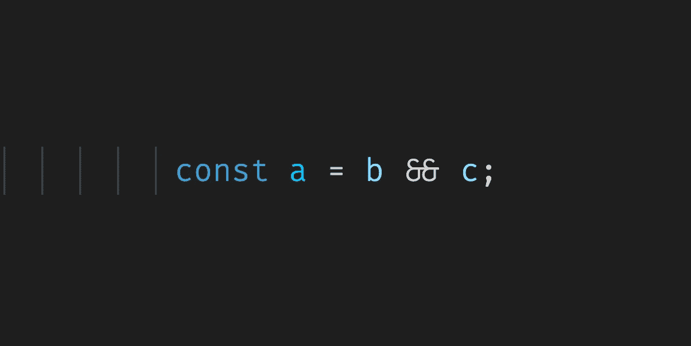
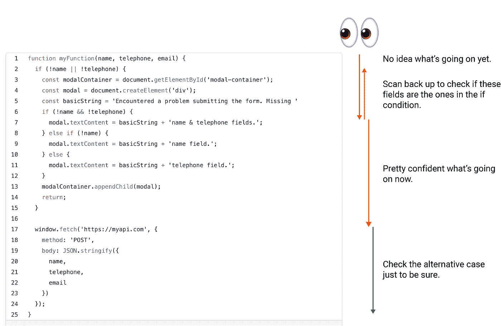
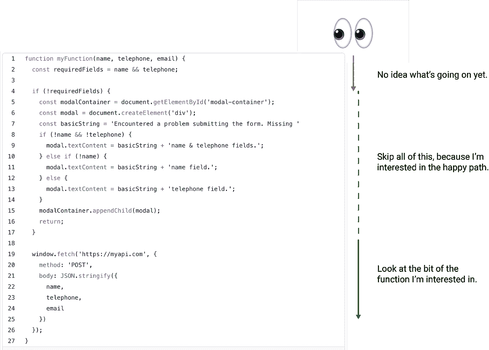

# 声明(看似)无意义变量的理由

> 原文：<https://levelup.gitconnected.com/the-case-for-declaring-seemingly-pointless-variables-d86d22c376ce>

## 有时候更多，就是更多。

看看这个(故意不整洁的)JavaScript 代码示例，并考虑一下`if`条件是什么。试着记住你是如何解决的。

我敢打赌，你已经开始阅读`if`街区的内部了。前两三行并没有告诉您太多，但是当您阅读该语句时，您意识到这是一个正在提交的表单，过了一会儿，您意识到条件中的`name`和`telephone`值是表单的必填字段。如果你和我一样，你也会一直读到函数的末尾，检查那个交替条件是否证实了你的怀疑。

举个简单的例子，人们很容易甚至没有注意到这种情况的发生。在下面的例子中，我去掉了所有杂乱的东西，这样很容易看出它在做什么。这很简单，因为你一眼就能看到两种结果。

但是如果我们能做得更好。如果`if`声明本身可以告诉你它在做什么，而不需要首先分析两种结果，会怎么样？

如果你只对快乐之路感兴趣，你可以跳过第 5-7 行。在顶部的示例中，您可以跳过第 3-15 行。有一行清楚地说明了那个`if`语句到底在做什么。在某些情况下，它允许你跳过整个块。

如果我们重放我上面的扫描方法，我们会得到以下结果:

## 为什么重要？

首先，变量声明携带重要信息。

在第一个例子中，你可以看到一件事:开发者写了什么。

在第二个例子中，你可以看到两件事:开发者写了什么，**和**他们写的时候的意图是什么。

如果您知道`email`实际上也是一个必填字段，您会发现开发人员犯了一个错误，遗漏了它。他们试图检查必填字段，但他们忘记了一个。

回到顶部的第一个例子，最初的开发人员是否试图检查必填字段？他们犯错了吗？或者他们可能没有检查必填字段？如果只有`name`和`telephone`缺失，是否会发生一些独立的行为？你不知道他们想做什么，所以你必须全部阅读，以确保这确实是他们想要检查的所有必填字段。

其次，它从你的大脑工作记忆中移除了一些负荷。对我来说，混淆自己的最快捷径是尝试在我的工作记忆中处理很多事情。

如果你不在代码中写`const requiredFields = name && telephone;`，你就得把`const requiredFields = name && telephone;`保存在你头脑中的工作记忆中。

当它是这样一个简单的映射时，这很好。在现实世界中，您正在调试调用堆栈中的几层函数，并试图在头脑中为应用程序的不同部分保留许多这样的定义。我总是试图减少我需要保存在工作记忆中的数量。

## 争论

以下是我听到的反对这种方法的最常见的理由:

1.  **你向浏览器发送了更多的代码/更多要运行的代码:**猜猜发生了什么？我让它通过一个[缩略器](https://skalman.github.io/UglifyJS-online/)，它把那个变量的声明缩小了。两个例子都缩小到了同一件事上！
2.  **要读的代码多了:**代码多了，你读的却少了。如果您对哪些是必填字段不感兴趣，那么您不必阅读变量声明。根据您想要处理的路径，您可以跳过 if 或 else 条件。这也使你正在阅读的东西更容易理解。
3.  你可以用注释来做到这一点:我从事长期项目的经验是，注释会过时。人们对更新或删除评论没有信心，尤其是当他们不知道为什么会有评论的时候。有些情况下只有一个注释就可以了，但是我把它们作为最后的手段。

## 结论

我坚信我们应该专注于编写人类可读的代码。我非常喜欢罗伯特·c·马丁的下面这句话:

> “的确，花在阅读和写作上的时间比远远超过 10 比 1。作为编写新代码工作的一部分，我们不断地阅读旧代码。…[因此，]让它易于阅读会让它更易于书写。”

任何可以简化阅读的东西——让我们跳过一些——都必须是好东西。

我没有一个严格的规则来定义什么时候创建这样一个命名良好的变量。我目前的方法是，当我写任何逻辑操作符时停下来，考虑是否可以通过先将结果移入另一个变量来使代码更清晰。

这里的关键是复杂性和代码行之间的区别。在一些罕见的情况下，更多的代码可以等同于更少的复杂性，我相信这就是其中之一。

祝一切顺利，
尼克