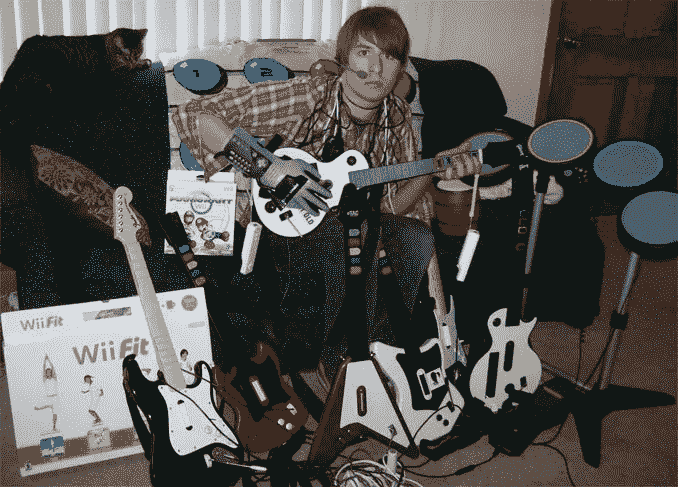

# 作为前端工程师学习数据结构的案例

> 原文：<https://levelup.gitconnected.com/the-case-for-learning-data-structures-as-a-frontend-engineer-4d7643a984fb>

以电视史上最棒的场景之一为特色，在硅谷臭名昭著的“中产阶级”场景

如果你是一个没有 CS 背景的 Jr .开发者(也许你像我一样完成了一个新兵训练营，或者也许你是自学的),你很有可能问过自己类似“为什么我需要学习什么是二叉查找树？我只想设计网站！”我肯定有过这种想法，甚至一开始对学习数据结构的想法很反感。

但问题是。一旦我开始申请全职工作，甚至在我喜欢的公司实习，他们都开始给我发 DSA 繁重的编码挑战。

因此，我不情愿地开始了漫长的艰苦过程，学习深度优先和广度优先搜索到底是什么，或者为什么你需要使用递归。但是后来奇怪的事情发生了，我开始爱上这种解决问题的方式。这些测试极具挑战性，以我从未经历过的方式考验了我的批判性思维能力。我接受了一堆编码挑战，惨败，拼命学习，又失败了几个，很沮丧，想放弃，然后有一天一切都开始运转了。

所以现在我在这里提出一个论点，即每一个工程师，无论你是在构建高级人工智能机器学习神经网络，还是只想使用 JavaScript 和 CSS 让一些东西看起来很漂亮，都应该挑战自己，以便能够粉碎这些“LeetCode”类型的算法和数据结构问题。

## 面谈

让我们从我开始学习 DSA(数据结构和算法)的原因说起。

正如我在介绍中提到的，几乎所有你听说过的雇佣软件工程师的公司都会在某个时候对你进行这方面的测试。我经常听到这样的说法:“我在工作中从来不需要倒二叉树，为什么我要在面试中倒二叉树呢！”它实际上有很多优点。据我所知，很少有行业会对应聘者进行与工作不直接相关的测试。但是，无论你是否认同这一点，都不能改变这样一个事实:用这种方式来测试一个考生的解题能力，已经成为行业标准。

思考这个问题的最佳方式是作为一个标准化的测试。工程师来自许多不同的形状和大小，具有所有不同的背景、经验和编码语言知识。如果没有一个统一的测量系统来测试每一个人，那么要比较数百名候选人就太难了。因此，这就是已经实施的制度，如果你想得到这些工作，你必须遵守游戏规则。把它想象成你大学入学的 SAT 或 GRE 考试。在现实生活中，你永远也不需要计算出从一罐混合颜色的球中取出一个红色球的概率，但是他们这样做的分析能力可能是你将成为哪种类型学生的一个很好的指标。

DSA 的工作方式完全相同。你将如何处理这个你从未见过的问题，你的解决方案有多有效。即使这个问题可能永远不会在工作中出现，但许多不可预见的问题会出现，你处理这些问题并提出有效解决方案的能力是优秀工程师和伟大工程师的区别。

## 扩展您的应用

学习 DSA 时最突出的话题之一是一个叫做 Big O 符号的话题，它有效地测量您的代码的伸缩性。如果你不熟悉大 o，这里有一个很棒的主题为的[博客。](https://medium.com/better-programming/big-o-notation-a-simple-explanation-with-examples-a56347d1daca)

你可能会想，我只是做了一个每天有几个条目的小日历应用程序，为什么我要关心我的数据是在 1 毫秒还是 3 毫秒内加载？

在某种程度上你是准确的。但是一旦有一天你的应用程序上有成千上万的用户，而每个用户没有数万个数据条目。这个执行时间将会增长，并以指数级的速度增长，最终使应用程序对所有人都不可用。

因此，当你第一次开始时，我同意最重要的事情是确保你的代码正确运行，并且在所有边缘情况下都没有错误。但是，要从一名优秀的工程师成为一名伟大的工程师，需要你能够编写优化的代码来扩展和处理大量的输入。最好的方法是通过学习你的数据结构和你的排序算法，以便将它们应用到现实世界中。

## 如今，成为“全栈”势在必行

过去，后端和前端开发之间有更多的分离，但是随着许多这些框架的进步，两者之间的界限变得模糊了。

几乎每个网站/网络应用程序现在都只是在前端呈现数据，但从后端存储和提取所有信息。因此，有效地存储这些数据并将其发送到前端非常重要，这样就可以高效地呈现这些数据。随着这些应用程序变得越来越复杂，需要发送的数据越来越多，现在效率低下的模式到明年可能会完全过时。

在我看来，学习在后端创建干净高效的代码，并将其组织成最佳的数据结构和算法来访问数据的好处远远超过学习和研究这些东西的不便。

## 他们很有趣

我知道，我知道，但是听我说完。做好任何事情都需要你花大量的时间去学习，失败，改进，再失败，最终才有所突破。

以前我经常弹吉他英雄。我在高中时迷上了它，因为我的很多朋友过去都玩它。当我第一次拿起吉他形状的控制器，我完全吸。我甚至连最简单的歌都过不了，不得不一直看哪种颜色对应哪根手指。然后，下一个挑战是掌握划水的时间和尝试弹奏多音符和弦。老实说，我玩这个游戏有几个星期都没有任何乐趣，直到我终于能够打败“Easy”上的歌曲。从那时起，从“容易”到“中等”的跳跃变得更快了。从“中等”到“困难”再到“非常困难”的跳跃比之前的每一次都要快。最后，我玩得很开心，能够轻松击败我所有的朋友(我甚至在《吉他英雄 3 Online》中短暂地跃入全国前 10 名，没什么大不了的)。

"别烦我，妈妈，我在碎纸"

我为什么要讲这个故事？部分是为了吹嘘我学到了一项技能，并花了大量的时间在这项技能上，但这项技能现在已经不再适用了，但也是为了说我一开始讨厌这项技能，直到我真正变得优秀了，这项技能才变得有趣。变好的过程可能是最有趣的部分。这就是我对 LeetCode 上算法的感受。

老实说，有些“简单”的 LeetCode 问题一开始似乎是不可能的。你可以得到正确的答案，LeetCode 仍然可以告诉你“对不起，太慢了。再试一次。”这不仅仅是令人沮丧，而且会让任何人发疯。但是就像生活中所有值得做的事情一样，这并不容易，熟能生巧。我保证，一旦你把简单的放下，跳到中等难度，然后变得越来越容易。尽管如此，一旦你通过了每一项测试，你还没有完成。

在《吉他英雄》中，一旦你通过了这首难唱的歌，你还可以做得更多。你能给这首歌打 5 星吗(意思是你必须在这首歌上达到一定的分数)？你能完美的做到不漏掉一个音符吗？LeetCode 也是这样工作的。你可能过了，但是 50%的人做的甚至比你还快。如何让你的代码变得更好？挑战是令人兴奋的，它肯定会让你成为一个更好的问题解决者和工程师

[这里有一个很棒的 LeetCode 问题列表](https://leetcode.com/discuss/general-discussion/460599/blind-75-leetcode-questions)让你开始 DSA 的每个主题(数组、图形、动态编程等)。

此外，如果你还没有看到我作为这篇文章的标题图片使用的场景。[享受](https://www.youtube.com/watch?v=0rhdOt9bOHE)！

肖恩

# 分级编码

感谢您成为我们社区的一员！ [**订阅我们的 YouTube 频道**](https://www.youtube.com/channel/UC3v9kBR_ab4UHXXdknz8Fbg?sub_confirmation=1) 或者加入 [**Skilled.dev 编码面试课程**](https://skilled.dev/) 。

 [## 编写面试问题+获得开发工作

### 掌握编码面试的过程

技术开发](https://skilled.dev)