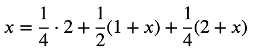
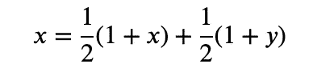
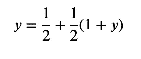

# 抛硬币悖论

> 原文：<https://levelup.gitconnected.com/the-coin-toss-paradox-16a3689749d5>

所以我最近开始阅读这本来自《量子》杂志的奇妙的书，书名为[“素数阴谋”](https://www.amazon.com/The-Prime-Number-Conspiracy-audiobook/dp/B07SXBR9Y3/ref=sr_1_1?dchild=1&keywords=the+prime+number+conspiracy&qid=1628598851&sr=8-1)，它涵盖了现代数学中一些最大的问题，又一次被一个数学问题[的书呆子狙击](https://xkcd.com/356/)。

这本书解释说，如果爱丽丝正在抛硬币寻找前两个连续的头，她将在平均六次翻转后找到它。如果 Bob 翻转寻找正面和反面的第一个实例，他将在四次翻转后平均找到它。


什么鬼东西！？
HH 出现的几率和 HT 出现的几率是一样的。它们是独立的概率！它们怎么会导致如此不同的预期结果呢？

证据并不明显，首先让我们看一下 HH 案例的证据。

所以我们有这个递推关系，由这个马尔可夫链给出，其中



那么这意味着什么呢？我选择的术语顺序很有启发性。看，四分之一的时间我们在前两次翻转中得到 HH，一半的时间我们得到一个 tails 并不得不重新开始(产生 1+x 次翻转)，四分之一的时间我们得到 HT 并不得不重新开始(产生 2+x 次翻转)。

如果你解决这个循环，你会发现 x=6。但结果是 HT 的递归有点不同。它实际上是这样的:



我在这里发现了这个，它有一个很好的解释，但是我想我应该补充一下我的意见。从里到外解释可能更容易，所以让我们定义我们的 y 项，它代表我们得到 t 必须做的翻转次数。



换句话说，如果我们只想知道我们平均需要翻转多少次才能得到 1 的反面，那就是这个，也就是 2。

我发现这是一个很有启发性的想法，为了得到序列 HT，我们需要两个片段，我们需要一个 H 和一个 T，所以不管怎样，每个以 HT 结尾的序列都有这样的形式{一定数量的 T，至少零} {一定数量的 H，至少一个} {正好一个 T}。

所以在第一次翻转时，有一半的时间我们得到了 T，必须重新开始，这就是 1/2(1+x)项。一旦我们找到了第一个 H，有一半的时间我们会得到另一个无用的 H，并且必须再次翻转，这就是 1/2(1+y)项。

如果你解决了这个问题，你就会得到 4。

所以我还有一个贡献要补充，那就是一个实验测试。如果你不相信我，你可以自己试试，我甚至包括了一个理智检查，表明我们平均要翻两次才能得到正面(或反面):

```
import scala.util.Random

val random = new Random()

def flipCoin(): Char = { if (random.nextBoolean()) 'H' else 'T' }

def flipUntilSequence(seq: String, history: String): Int = {
  if(history.endsWith(seq))
      history.length
  else
      flipUntilSequence(seq, history + flipCoin())
}

val hh_es= for (i <- *Range*(1, 1000000)) yield flipUntilSequence("HH", "")
val ht_es = for (i <- *Range*(1, 1000000)) yield flipUntilSequence("HT", "")
val h_es = for (i <- *Range*(1, 1000000)) yield flipUntilSequence("H", "")

*println*(s"Average number of flips to get a heads: **$**{h_es.sum.toDouble / h_es.length}")

*println*(s"Average number of flips to get HH **$**{hh_es.sum.toDouble / hh_es.length}")
*println*(s"Average number of flips to get HT **$**{ht_es.sum.toDouble / ht_es.length}")
```

事实上，我最近一次跑步的结果是:

```
Average number of flips to get a heads: 2.0016590016590015Average number of flips to get HH 6.001767001767002
Average number of flips to get HT 3.9996059996059996
```

那么，有没有简单明了的英语解释来解释为什么会这样呢？嗯，我发现[这个堆栈溢出线程](https://math.stackexchange.com/questions/521130/expected-value-of-flips-until-ht-consecutively)中的许多帖子非常有用，但特别是 e 上的[这个。简单地说，在 HT 情况下，我们可以无限期地停留在状态 H_ 中，任何时候我们遇到 T，我们就完成了，在 HH 情况下，每次我们抛出 T，我们都必须重新开始，直到下一次抛出 H。顺序在这里非常重要。](https://math.stackexchange.com/a/947339)