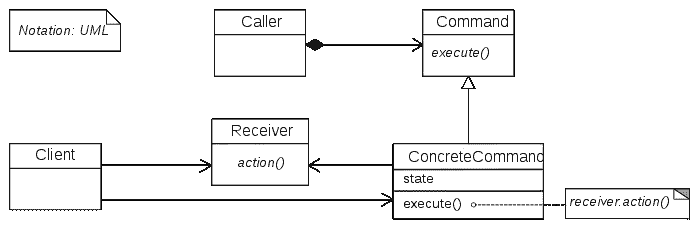

# Go 的命令模式

> 原文：<https://levelup.gitconnected.com/the-command-pattern-with-go-fd5dabc84c7>

简单而强大的面向对象设计模式。


从[Military.com](https://www.military.com/join-armed-forces/the-basics-of-marching.html)

A h，设计图案。它们为任何合适的情况带来了简单性、组织性和可扩展性。事实上，在设计中没有后盾的代码经常会导致严重的问题，并最终导致代码混乱。对我来说，了解灵活的设计模式列表将软件开发人员与软件工程师区分开来。它们允许你为未来做计划和调整，因为事情注定会改变。当他们这么做的时候，你最好做好准备！

所以不做进一步的介绍，让我们来看看我最喜欢的一种模式——命令模式。

**注意！**本文假设您具备以下工作知识:

*   面向对象编程
*   UML 图
*   戈朗

如果您需要复习前两个概念，请随意阅读我以前详述这些概念的文章。如果你想要 GoLang 的教程，我鼓励你在下面留下评论！:)

[](https://israel-miles.medium.com/a-crash-course-on-object-oriented-programming-in-python-a243b35054c0) [## Python 面向对象编程速成班

### 抽象、继承、UML 图等等！

israel-miles.medium.com](https://israel-miles.medium.com/a-crash-course-on-object-oriented-programming-in-python-a243b35054c0) 

# 伟大的想法

命令模式适用于您不关心管道的情况。实际上，这种模式背后的概念经常在日常生活中使用！以电视遥控器为例，你知道点击(+)按钮实际上是如何增加音量的吗？大概不会，也不需要！

命令模式是关于封装和抽象的。在遥控器的情况下，每个按钮被理想地封装，因为每个按钮应该能够彼此独立地工作。从抽象的角度来说，这是最重要的一点，你不需要知道控制器中的任何按钮实际上是如何通过信号和代码与电视进行通信的细节。你只是希望每个按钮能够轻松地执行一项任务或行动，而不必考虑细节。

这个策略几乎适用于我们周围的所有现代物品！你的电话、微波炉或汽车仪表盘都将讨厌的执行细节抽象化和封装，让你这个指挥官专注于更高层次的命令。这就解放了你的时间，让一个对电气工程一无所知的人可以给几百英里外的人打电话。那就是厉害！

# UML 类图

理解统一建模语言(UML)类图将允许我们形式化我们对命令模式的理解。下面这张图表是由维基百科提供的。



来自[维基百科](https://en.wikipedia.org/wiki/Command_pattern)

从左上角开始，调用者类是我们的驱动程序(在这种情况下是我们的主 Go 包)。这个类也可以作为*调用者*被引用，但是它只是负责调用我们的命令。

调用者/调用者与我们的命令接口有关联关系，这要求每个继承 ConcreteCommand 的接口实现 execute()函数。注意 ConcreteCommand 也有一个 state 属性——回到我们的遥控器，这可能是当前的音量级别。

接下来，每个 ConcreteCommand 调用一个执行实际操作的 Receiver 类。虽然 ConcreteCommand 存储状态(比如电视的音量)，但接收器可以是实际与电视通信的逻辑，以便执行音量操作，如增加、减少或静音。客户机类就是您，遥控器本身就是调用者。

# 用 Go 实现命令模式

Go 与其他能够进行面向对象编程的语言有点不同。主要的区别是 Go 中没有继承，也没有类。相反，您可以创建补充接口的结构来设置契约和定义行为。

在这个例子中，我们将创建一个程序来模拟一台可以开/关以及改变音量电视。首先让我们开始我们的新项目。

```
$ cd ~/go/src
$ mkdir command-pattern
$ cd command-pattern
```

现在，命令模式通过抽象代码逻辑来工作。我们将有代表按钮的结构，一直到我们的电视。我们首先需要一个命令和一个设备的两个接口。

## device.go

## 命令开始

到目前为止够简单了。在命令模式中，让每个命令实现一个 execute()函数是很常见的。现在，我们需要创建一个电视，除了要执行的特定命令之外，它还将实现设备接口。让我们首先创建我们的特定命令。

## onCommand.go

如您所见，onCommand struct 接受一个设备。注意，我们可以在第 4 行写“d device ”,但重要的是我们将设备类型定义为结构的一部分。然后，我们将通过编写 execute()函数来实现命令接口，该函数接受一个命令作为它的参数。在这种情况下，我们执行打开设备的命令(我们还没有实现，稍后将在 tv 结构中实现)。

以下是其余的命令:

## 离开指挥部，走

## increaseVolumeCommand.go

## decreaseVolumeCommand.go

现在我们已经准备好了命令，让我们创建一个实现设备接口的 TV 结构。

## tv.go

这是实现实际逻辑的地方，这是有意义的。当我们点击 on 按钮或改变音量(下一节)时，我们不想担心确切的细节。取而代之的是，我们执行一个命令，这个命令沿着信息链向下发送指令。

好了，现在我们有了指令和电视。命令如何与电视结构交互？当然是用按钮了！

## 按钮.开始

这里我们将命令作为按钮的一部分，然后我们有了 press()函数，它接受一个按钮并执行分配给它的命令。现在我们有了所有的部分，我们终于可以编写我们的主要 go 包了。

## main.go

为这个要点上的奇怪缩进道歉..

这里仍然有很多需要改进的地方，但是希望这为命令模式的使用和它的一般设计描绘了一幅图画。改进可能包括添加一个调用器结构或一些方法来创建我们的命令、按钮等。该设备还包括用于改变音量的功能定义，可以认为它们应该是 tv 结构专有的。

在任何情况下，如果您在同一个 director 中创建了所有这些文件，那么在运行它们时，您应该得到以下输出。

```
$ go run *.go
Cannot change volume, tv is off.
Turning tv on
Increased volume to 11
Decreased volume to 10
Turning tv off
$
```

我希望你喜欢这个教程，并且能够理解命令模式以及它在 go 中的实现。尝试上面的代码是最好的学习方法。自己添加的功能可以包括添加要更改的频道列表、添加错误处理，甚至为扬声器添加一个结构并使该结构适应电视。

如果这篇文章有什么值得注意的地方，或者你想得到更多的解释，请在下面留下你的评论！感谢阅读。