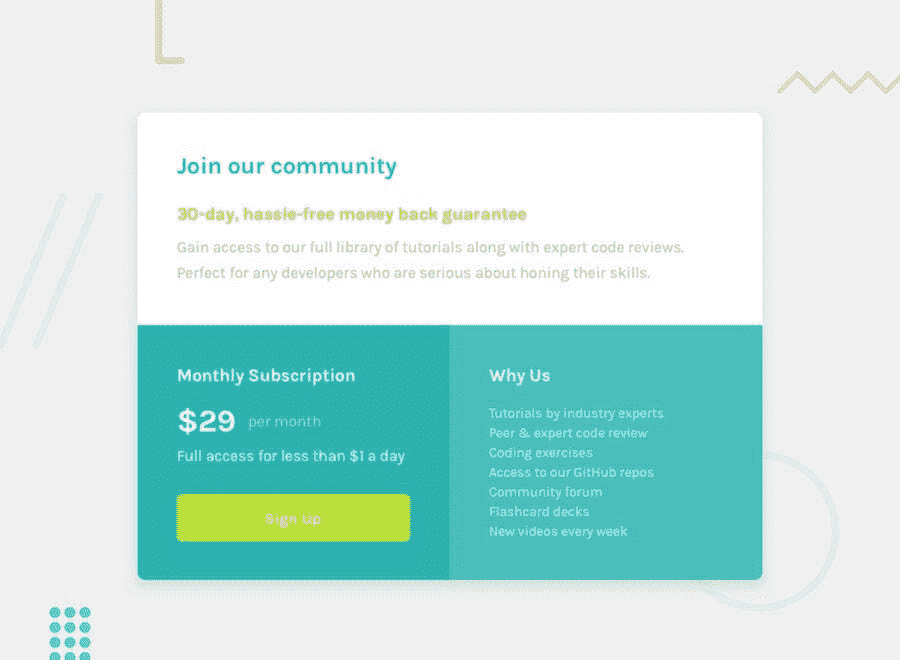
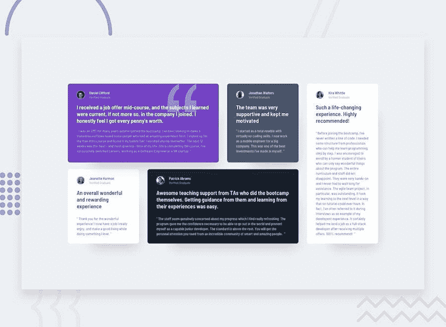
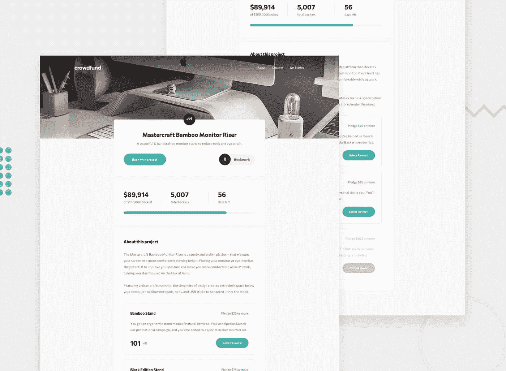
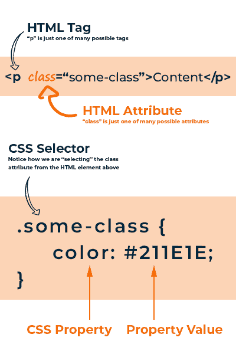
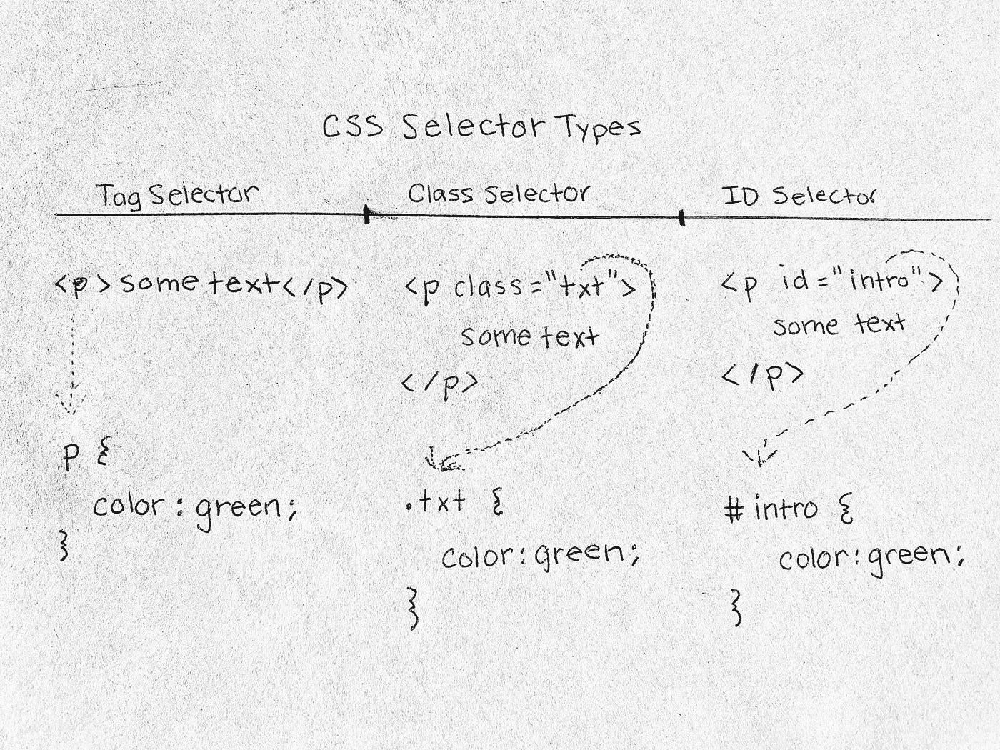
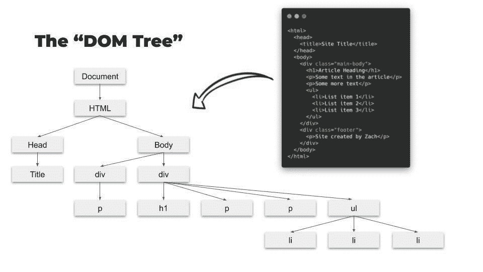
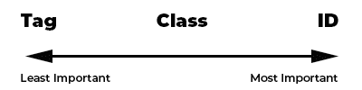
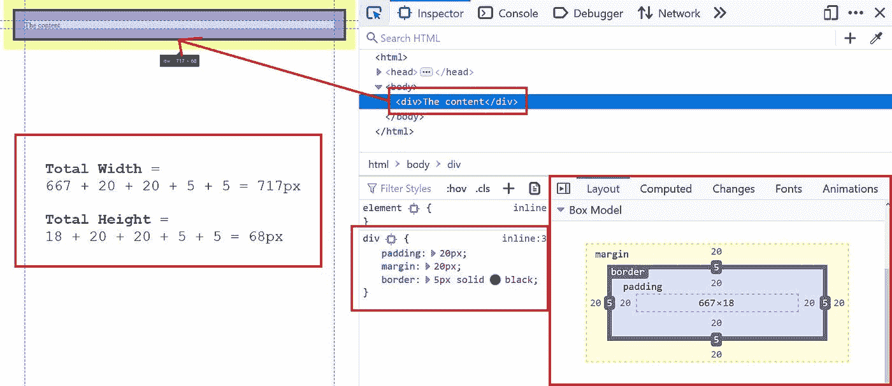
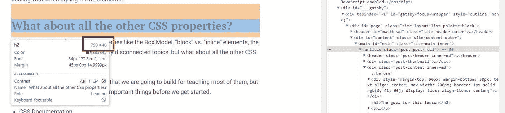

# 初学者的完整 CSS 速成课程

> 原文：<https://levelup.gitconnected.com/the-complete-css-crash-course-for-beginners-b74239785647>

# 先决条件

本教程是为完全的初学者。以下是必需的技能:

*   [对 HTML 的基本理解](https://www.zachgollwitzer.com/posts/2021/fullstack-developer-series/7-html-crash-course/)
*   解决代码挑战所需:[本系列的第 1-7 课](https://www.zachgollwitzer.com/posts/2021/fullstack-developer-series/fullstack-roadmap-toc)。

# 本课的目标是

在 YouTube 上看这个速成班:

*   [第一部分——CSS 基础知识](https://youtu.be/hAD58ej0E4o)
*   [第 2 部分—箱式模型](https://youtu.be/gGjJDEEXFv0)
*   [第 3 部分—必须了解 CSS 属性](https://youtu.be/dqaNvIJ4Fyk)
*   [第 4 部分—电网编码定价挑战](https://youtu.be/zwBoEwUD__0)

到本课结束时，你将从头开始构建这个([前端导师链接](https://www.frontendmentor.io/challenges/single-price-grid-component-5ce41129d0ff452fec5abbbc/hub/single-price-grid-component-7wZJ4lx_U))。

在一些关于响应式设计、CSS 网格和 Flexbox 的简短课程之后，我们将构建这个([前端导师链接](https://www.frontendmentor.io/challenges/testimonials-grid-section-Nnw6J7Un7/hub/testimonials-grid-section-QuSSjaTVM))。

最后，我们将把我们在本课程中学到的所有知识整合在一起，构建这个([前端导师链接](https://www.frontendmentor.io/challenges/crowdfunding-product-page-7uvcZe7ZR/hub/crowdfunding-product-page-7OC236vqP))。不，这不是最后一个项目，但用我们的新技能建造将会非常令人兴奋！

# 我们在这节课中所讲的内容

*   什么是 CSS(层叠样式表)？
*   CSS 的基础
*   什么是“选择器”？
*   什么是 CSS“属性”？
*   “盒子模型”
*   块与行内元素
*   盒子尺寸
*   CSS 中的布局
*   CSS 度量单位
*   通用 CSS 属性
*   字体样式
*   背景样式
*   颜色代码
*   “速记”CSS
*   编写优秀 CSS 和 HTML 的四步系统
*   代码挑战！

# 补充课程

虽然这些不是核心 CSS 速成课程的一部分，但它们是需要了解的极其重要的主题。当我们设计出上面的图片时，我们将会用到这三种方法，我强烈建议你在尝试挑战之前先看看我的教程。

*   媒体查询和响应网页设计(即将推出)
*   CSS Flexbox(即将推出)
*   CSS 网格(即将推出)

# 我们没有涵盖的内容

最后，我们将不涵盖…

*   图形设计和线框图——这些是构建网络产品的重要部分，但是我们的重点是学习网络开发技能；不是平面设计或用户体验设计原则。设计一个视觉上令人愉悦且易于导航的用户界面对构建一个成功的应用程序至关重要，但你还有剩余的职业生涯来学习这些。此外，如果你像我一样是一个平庸的平面设计师，我建议利用专业人士的设计(当然是合法的)。 [Frontend Mentor](https://www.frontendmentor.io/challenges) 将设计步骤从等式中移除，让我们专注于设计编码。不要试图把设计和编码混在一起。你会在你的项目上花费 10 倍的时间。设计，然后编码。
*   CSS 预处理程序(Sass，LESS，PostCSS)——这些对于大型项目和代码库很有用，但是对于像本课程中这样的小型项目来说，通常是过度的。
*   CSS 框架(Bootstrap，Materialize，Tailwind 等。)— CSS 框架和 UI 库会非常有帮助，但是你需要先学习基础知识。我不想把你锁在一个今天流行明天就死的框架里。我学习的时候，Bootstrap 很大。现在，顺风很流行。你可以随时学习这些，所以我会教你一些基础知识，让你根据未来项目的需要自学。

# 有用的系列链接

这是我的 fullstack 开发者系列的一部分，在这个系列中，你将从没有编写过一行代码，到将你的第一个 fullstack web 应用程序部署到互联网上。[点击此链接](https://www.zachgollwitzer.com/posts/2021/fullstack-developer-series/introduction/)了解这个系列的内容。

*   [系列目录](https://www.zachgollwitzer.com/posts/2021/fullstack-developer-series/fullstack-roadmap-toc)
*   Github 库——在这里你可以找到我们在这个系列中编写的所有代码
*   [YouTube 播放列表](https://www.youtube.com/watch?v=ZZJT5uskuvI&list=PLYQSCk-qyTW37zDPzcAyzCsnypFQrhUcq)
*   [系列概述](https://www.zachgollwitzer.com/posts/2021/fullstack-developer-series/introduction/)
*   [100 天的代码挑战](https://www.100daysofcode.com/) —我强烈建议你在阅读本系列时接受这个挑战！

请在 Twitter [@zg_dev](https://twitter.com/zg_dev) 上给我加标签，和 [#100DaysOfCode](https://twitter.com/search?q=%23100DaysOfCode&src=typed_query) 分享这个系列！

# 什么是 CSS(层叠样式表)？

我们已经学习了 CSS 的基本概念。在上一课中，我介绍了“房子”类比，它描述了以下内容:

盖房子的时候…

*   HTML 是结构(即木材、砖块、混凝土、地基)
*   CSS 是风格(即油漆，美化)
*   JavaScript 是功能(即电力、管道、供暖、水)

我们要回答的第一个问题是，“级联”是什么意思？

使用 CSS 时，可以为单个 HTML 元素定义多种样式。因此，CSS 需要知道实际应用哪个规则。当我们说“级联”时，我们指的是这个事实。

假设我有下面的 HTML 片段:

现在，让我们添加三个 CSS 规则(稍后我将解释这些规则是如何工作的):

问题是——“一些文字”会是什么颜色？

答案是绿色的，但是现在，我们对 CSS 的了解还不足以做出这个决定。让我们跳进来。

# 基本 CSS 语法

[这是本节的视频版本](https://youtu.be/hAD58ej0E4o)

那么 CSS 的目的是什么？CSS 的目的是“选择”一个 HTML 元素，并对该 HTML 元素应用某种类型的样式。下面是 CSS 可以为您做的两件事:

1.  更改页面上 HTML 元素的布局(行、列、节、大小)
2.  更改页面上 HTML 元素的样式(字体、颜色)

在下面的代码笔中，我展示了布局和风格。为了达到这个结果，我使用了 CSS 属性，我们将在接下来的几课中看到。

下图显示了 HTML 和 CSS 之间的关系以及两者的基本结构。

正如您在上面看到的，我们使用 HTML 元素的`class`属性来“选择”它，然后将`color`样式应用于该元素。我们给`color`属性赋值为`#211E1E`，这是一个深灰色。实际上，我们把文本变成了深灰色。

在这个例子中，`.some-class`是“CSS 选择器”，`color`是 CSS 属性，`#211E1E`是 CSS 属性值(十六进制代码，我们将在后面介绍)。

此时，还不清楚为什么我要使用这些选择器和属性。比如我为什么在类名前有一个`.`？我是怎么知道用`color`来改变文字颜色的？为了回答这些问题，让我们探索一些用 CSS“选择”HTML 元素的基本方法。不要担心所有可能的属性，我们最终会到达那里。现在，我将尝试使用`color`属性，该属性改变所选元素的文本颜色。

# 3 种主要的 CSS 选择器类型

有三种主要的方法可以“选择”一个 HTML 元素来设计它的样式。

1.  按标签
2.  按类别
3.  按 ID

由于我们在上一课中学习了 HTML，这些应该听起来很熟悉。不管怎样，让我们花点时间来回顾一下。

你能认出这里的标签、班级和 id 吗？当然啦！标签是`p`，类别是`main-text`，ID 是`first-paragraph`。如果您还记得上一课，我们能够通过 JavaScript 使用这些值来“选择”HTML 元素。还记得这个吗？

上面的代码使用 JavaScript 以三种不同的方式选择这个 HTML 元素。我们使用相同类型的语法来选择这个带有 CSS 的 HTML 元素。

这些都是使用 CSS 从上面选择 HTML 元素的有效方法。

现在，我将使用`color`属性和值作为占位符来解释 CSS 选择器和“层叠”概念。这将改变 HTML 元素的文本颜色。在本课的后面，我们将遍历所有不同的 CSS 属性，但是我们还没有完全准备好。

这是我创建的一个有用的小备忘单，帮助你记住这三种最常见的 CSS 选择器类型。属性`color: green`在这里并不重要。这可以是任何 CSS 属性。

# CSS 组合子

我上面写的三种方法是选择和设计 HTML 元素的“教科书式”方法。但是我们已经学习了本系列的第 8 课，到现在为止，你可能已经意识到了这样一个事实:在 web 开发中，总是有更多的方法来做事情。在这个场景中也是如此。

对于 CSS，有“组合子”允许我们“组合”我们的选择器来识别一个 HTML 元素。很多时候，可以通过在元素上放置 ID 或 class 属性来避免这些问题，但是您仍然应该熟悉它们。我们要处理的是:

*   后代选择器
*   子选择器
*   兄弟选择器

嗯…这听起来很熟悉，是吧…

你还记得之前 HTML 课上的这张图片吗？

你还记得我们说过 HTML 文档的结构就像一个由祖父母、父母、孩子和兄弟姐妹组成的快乐大家庭吗？幸运的是，我们可以再次利用这个概念。

让我们看看如何组合一些 CSS 选择器来识别这个 HTML 文档中的各种元素。如果你从照片上看不到它，请再来一次:

## 选择后代

假设我们想在`
`元素中存在的每个`li`元素上放置一个 CSS 样式。我们该怎么做？

为什么不像这样呢？

恭喜你。你所有的`li`元素将会有绿色文本。今天到此为止，喝杯啤酒吧。

没那么快…

如果我们将另一个列表放在`
`容器中会发生什么？

实际上，列表出现在这样的页脚中是很常见的，但是它们的样式通常不同于 HTML 主体中的列表。如果我们使用上面的选择器，即使我们的页脚列表项也会有绿色文本，这可能是我们不想要的！

让我们想出一个更好的解决方案:

使用 CSS，我们可以组合由空格分隔的选择器来标识元素的后代。无论我们向`.main-body` div 添加多少额外的 HTML 元素，它们都将继承这种风格。为了更深入地理解这一点，让我们看一些不同的 HTML。

通过使用上面的“后代选择器”，我们可以将所有的`li`标签定位在多个级别，只要它们存在于“预选器”级别的之下*即可。在这种情况下，第一个选择器`#main`是“预选器”，第二个选择器`li`是该样式的实际目标元素。*

## 选择孩子

有时，您只需要将特定 HTML 元素的子元素作为样式的目标。假设您有下面的 HTML。

如果我们使用 CSS 选择器`#main p`，我们将能够样式化这个 HTML 中的所有`p`元素。但是我们可以使用下面的语法只选择`#main`的直接子节点。

第一、第二和第三段将有蓝色文本，而第四段将有默认的文本颜色。

参见 [CodePen](https://codepen.io/) 上扎克( [@zg_dev](https://codepen.io/zg_dev) )的笔[在 CSS](https://codepen.io/zg_dev/pen/yLVYmNE) 中选择孩子。

## 选择兄弟姐妹

你可以使用的最后一种组合子是兄弟选择器，但是我认为有必要说明一下——我从来不使用它们。其他人可能对此有不同的感受，但是在我编写 CSS 的五年中，我从未遇到过使用这些选择器的令人信服的案例。如果你想出了一个使用这些的好理由，请发表评论或在 Twitter 上联系我。

但是当然，我不能就这么大胆地说出来，还指望你信任我。让我告诉你我在这里的意思。

假设你有这个 HTML 文档。

出于某种奇怪的原因，您只想设计紧跟在列表后面的段落元素的样式(第一段和第四段)。下面是如何使用兄弟选择器实现这一点的方法。

这将遍历整个 HTML 文档，查找紧跟在`ul`元素之后的所有`p`元素(也称为“相邻兄弟”)。如果你想让所有的兄弟都指向`ul`元素，你只需要把你的 CSS 改成这样:

在我看来，`~`和`+`组合子是不必要的。如果您发现自己处于这种情况，请执行以下操作。

1.  找到您想要定位的 HTML 元素
2.  向该元素添加一个类或 ID
3.  使用类或 ID 选择器的样式

当然，这是一些额外的代码行，但更容易理解(未来的你会感谢你编写了易读的代码)。

# 用 CSS 选择 HTML 元素的其他方法？

用 CSS 选择 HTML 元素还有其他方法。例如:

如果您只是使用了`.regular-text`来选择元素，那么您将同时设计`p`和`div`元素的样式。您可以指定您只想要类别为`.regular-text`的`p`元素。

出现这种情况的可能性有多大？非常低。因此，我不会花时间解释所有这些使用 CSS 选择器的细微差别。你可以在需要的时候查找它们。

请记住，这个速成课程和全栈开发人员系列旨在让您熟悉最重要的概念。在 95%的情况下，除了我们到目前为止讨论过的内容，您再也不需要任何其他东西。你可以自己去钻研一些高级的 CSS 教程，但是在你旅程的这个阶段，我相信这样做是浪费你的时间。

# 用 CSS 选择多个 HTML 元素

到目前为止，我们一次只选择了一个 HTML“组”(一个选择器可以针对多个元素)。在某些情况下，您可能希望将一些“通用”样式应用于几个元素，然后单独添加其他样式。假设您有下面的 HTML。

我们还没有谈到 CSS 属性(所以现在不要担心它们是如何工作的)，但是假设我们想让这两个框具有相同的宽度和高度，但是分别设计它们的边框和文本颜色。下面是低效的方法:

如果我们可以一次性分配`width`和`height`属性，而不是为每个元素编写代码，这不是很好吗？好消息，我们可以！我会这样写这个 CSS。

通过用逗号分隔每个选择器，我们可以同时选择多个 HTML“组”。在上面的例子中，我们将`width`和`height`属性应用于*和*两个选择器，然后分别应用`border`和`color`(文本颜色)样式。

我们没有过多地谈论软件工程“最佳实践”，但我们在这里所做的是“重构”我们以前的代码，以坚持“干燥”(不要重复自己)的原则。

这是这个的密码笔。

# 在单个 HTML 元素上使用多个类

在我们刚刚看到的例子中，我们有两个类，并为它们定义了“共享样式”。我们可以用另一种方法达到同样的结果！看一看。

我做的改变是微妙的。我所做的只是在 HTML 中添加了另一个类——确保在`class` HTML 属性中的类之间添加了一个空格。

我们现在有三个类，而不是两个类`box-1`和`box-2`。我们可以使用`box`类来定义我们的共享样式:

然后使用我们的单个类实现独特的风格。

两种方法，相同的解决方案。

# 伪类/元素

除了能够一次选择多个 CSS 组之外，我们还可以使用一种叫做“伪”类/元素的东西。我们不会详细讨论这个，但是你需要知道它的存在，因为当你将来遇到它的时候。

这是这个概念最常见的一个例子。

通过直接在`button`选择器后面添加`:hover`，我们在说，“当鼠标悬停在这个按钮上时，我想对它应用下面的 CSS 样式”。

就像我说的，我们不会在这里详细讨论。这里有一些关于伪元素和类的文档，如果你有兴趣的话可以看看。

这是上面的例子。将鼠标悬停在按钮上以查看它的工作情况！

# 多重选择器与嵌套选择器

在前一个例子中，我们看到了这一点。

在之前的章节中，我们看到了这样的内容:

他们看起来非常相似，不是吗？当您阅读和编写 CSS 时，请注意这种差异。在第一种情况下，您说“我想将这些样式应用于所有具有 box-1 或 box-2 类的 HTML 元素”。在第二种情况下，您说“我想将这些样式应用于所有 p 元素，这些元素存在于 box-1 类的元素中”。

差别很微妙，但很重要。说到这个区别…

# 我们来谈谈 CSS 特异性

CSS 中的“层叠”概念(又名“特异性”)对于初学者来说非常重要。

能够选择 HTML 元素是战斗的一部分。第二部分是确定哪些样式适用于给定的元素。当每个 HTML 元素只有一种 CSS 样式时，这并不困难，但是经常会有几种样式在 CSS 大战中相互竞争。为了演示，让我们看一些 HTML，它有许多选择每个元素的方法。

假设我们的目标是改变`p`元素的文本颜色。我们可以用几种不同的方法做到这一点。

😳

是的，我知道。不是你想看到的。而且越来越糟…

如果你在同一个文件中写所有这些 CSS 代码，它们会互相竞争。

"但是为什么要在同一个 CSS 文件中放置多种样式呢？"

如果你是唯一为你的 HTML 编写样式的开发者，那么你可能不会这样做。但在许多情况下，一个网站或 web 应用程序会有多个样式表，其中一些会由外部生成。换句话说，你可能想要一个预先存在的网站主题，并对其应用你自己的定制风格。在这种情况下，您将编写与已经定义的样式竞争的样式。

在这种情况下，您需要知道哪些样式声明优先于其他样式声明。

这里我们必须考虑两个方面。

1.  CSS 选择器在文件中的位置
2.  CSS 选择器的特异性

# CSS 选择器在文件中的位置

让我们从简单的开始。假设我们有下面的 HTML。

如果我们有下面的 CSS 文件，文本会是什么颜色？

如果您一直关注这个系列，您可能会想，“这不是有效的 CSS！你已经声明过`p`，不能再做了！”。

逻辑不错，但确实是有效的 CSS。与 JavaScript 不同，您可以在同一个文件中声明同一个 CSS 规则两次。知道了这个事实，这里哪种风格优先？

文本将是绿色的，因为这是文件中的最后一条规则。假设选择器具有相同级别的“特异性”，CSS 将总是给予最终规则优先权。

# CSS 选择器的特异性

让我们修改上面的例子。

文本将是什么颜色？答案是红色。在这种情况下，即使我们的`color: green`样式出现在文件的最后，这也没关系，因为按类选择 HTML 元素比按标签选择要“更具体”。

下面是 CSS 选择器“重要性”的连续体:

换句话说，如果给定以下三个选择器的选择，那么无论您以什么顺序放置规则，文本颜色都将被设置为绿色，因为它是“最具体的”。

这很容易，但是当我们开始谈论这样的事情时，这种“特异性”业务就有点令人困惑了:

文本将是什么颜色？答案是红色。

当我们看一个类似于`div .my-text`的选择器时，它基本上是在说，“给我找出所有类名为`my-text`的元素，它们是`div`元素的后代”。然后我们必须问自己...第一段是否有一个`my-text`类和一个`div`祖先(可能是父母、祖父母、曾祖父母等)。)?答案是肯定的，所以段落文字会是红色的。

总之，尽管上面的第二个 CSS 规则在文件的末尾，但这并不意味着它将适用于所有元素。

读完最后几段后，你可能会想这太复杂了。为了帮助我们，让我们来看看两种方法，你总是可以使用来确定哪个 CSS 规则适用于每个 HTML 元素。他们在这里:

1.  测试一下(我最喜欢的方法)
2.  算算吧

最简单的方法是在 Codepen 中放一个例子，看看哪个优先(就像我们上面做的那样)。

第二种方法是实际计算 CSS 规则的“特异性”。这是你怎么做的。

1.  计算规则中 ID 选择器的数量
2.  计算规则中类选择器的数量
3.  计算规则中标签选择器的数量

将步骤 1-3 中的计数按顺序组合，您就得到您的“特异性”值。

让我们为上面的两条规则做同样的事情。请参阅计算的注释。

如你所见，第一个选择器比第二个选择器更具体，因此总是优先(除非它不适用于 HTML 元素，就像我们在上面例子的第二段中看到的那样)。

让我们看最后一个例子来真正确定这个概念。这是计算特异性的 HTML 和 CSS。

下面的所有规则都选择了上面的同一个`p`元素。

文本颜色将是橙色，因为该选择器的总特异性是最大的。再说一次，你可以像我下面做的那样测试它！

# 内嵌 HTML 样式

我们最后要谈的是内联样式。它们看起来像这样。

如果你应用一个内嵌样式，它将优先于所有其他样式，但是通常不推荐使用，因为太多的内嵌样式会使你的 HTML 变得混乱！一些 CSS 框架实现了这样的内联样式，但这是另一天的辩论和话题。现在，只要把这些保持在最低限度。

[下面是一个 Codepen 示例](https://codepen.io/zg_dev/pen/rNWGazo)，展示了内联样式如何覆盖 ID 选择器应用的样式。

# 的！重要关键字

如果我告诉你，通过编写一个单词，你可以覆盖所有的 CSS“特异性规则”(包括内联样式)，会怎么样？

如果你在 CSS 属性的末尾写`!important`，它将优先于其他规则。这里有一个例子。

虽然第二个选择器更具体，但是文本将是红色的，因为我们已经在属性值的末尾添加了`!important`。这可以在逐个属性的基础上完成。例如:

在这种情况下，颜色将是红色，但字体大小将是`16px`。

现在我们来稍微聊一下这个`!important`关键词。虽然它确实为您提供了一种无需过多思考就能让 CSS 样式工作的简单方法，但这通常是一种不好的做法。对于何时可以接受使用这种方法，没有明确的指导原则，但是这里有一个很好的经验法则。

> *使用！如果这样做是设计元素样式的唯一可行方法，这一点很重要*

如果您试图覆盖从外部样式表(CSS 框架、UI 库等)应用的样式，就会发生这种情况。).

# 什么是 CSS 属性？

正如我在本课开始时介绍的，CSS 允许我们实现两个主要目标:

*   样式化 HTML 元素
*   定位 HTML 元素(布局)

如果我想创建一个 HTML 元素，它有蓝色背景，是一个完美的正方形，有黑色边框，中间有一些大的白色文本，该怎么办？我可以用基本的 CSS 属性做到这一点。

这方面的 HTML 很简单:

CSS 是棘手的部分。

如您所见，我使用了各种属性来实现这个结果。从`width`、`height`和`border`到`background-color`、`color`和`text-align`，将这些 CSS 属性结合在一起有助于我们达到预期的效果。

下面是这个例子的现场版本。

# 我如何知道使用什么 CSS 属性？

问得好。

我没有很好的答案。

事实是，知道使用什么属性很大程度上是一个时间问题，还需要大量的经验。一下子研究所有的属性对你没有帮助。制作抽认卡可能会有一点帮助，但我不建议这样做。

当我们深入到盒子模型和一些常见的 CSS 属性时，试着把重点放在概念上；不是记忆。毕竟，如果你忘记了某个东西是做什么的，你总是可以得到 CSS 文档。

# CSS 中的盒子模型是什么？

[这是本节](https://youtu.be/gGjJDEEXFv0)的视频版本

与我们在前一课中探索的文档对象模型(DOM)类似，盒子模型可以简单地解释，或者我们可以深入到大量的细微差别。

最好通过 Firefox 开发人员工具进行可视化描述(我们在之前的课程中讨论了很多)。

也就是说，我们的`p`元素的内容尺寸为 667 像素 x 18 像素，四边都有 20 像素的填充，有 5 像素的边框，四边都有 20 像素的边距。

盒子模型试图描述一个元素在页面上占据多少“空间”。下列属性会影响元素占据的“空间”。我建议浏览一下他们的文档。

*   [宽度](https://developer.mozilla.org/en-US/docs/Web/CSS/width)
*   [高度](https://developer.mozilla.org/en-US/docs/Web/CSS/height)
*   [填充](https://developer.mozilla.org/en-US/docs/Web/CSS/padding)
*   [边框](https://developer.mozilla.org/en-US/docs/Web/CSS/border)
*   [边距](https://developer.mozilla.org/en-US/docs/Web/CSS/margin)

但是，当我们讨论盒模型时，这些并不是唯一起作用的属性。向初学者介绍这种模型通常很困难，因为有几种属性组合会完全改变“游戏规则”。

为了更好地解释这些“规则”，我创建了一个交互式代码笔，我们将使用它来更好地理解盒子模型及其所有细微差别。当你阅读下面的部分时，在另一个标签中保持这个打开，这样你可以实时看到我在说什么。

[”<a](”<a)

https://codepen.io/zg_dev/embed/zYodJYM?height=674&theme-id = dark&default-tab = result" frame border = " no " loading = " lazy " allow transparency = " true " allow full screen = " true ">参见 [CodePen](https://codepen.io/) 上扎克( [@zg_dev](https://codepen.io/zg_dev) )的笔[构建盒子模型 1](https://codepen.io/zg_dev/pen/zYodJYM) 。< /iframe >

# 元素显示类型

CSS 属性可以说是最多样化的 CSS 属性。

以下是您可以为其设置的可能值。

*   `display: none` -隐藏页面中的元素
*   `display: block` -大多数 HTML 元素的默认显示类型
*   `display: inline`-`a`、`span`、`img`、`button`、`input`、[等几个 HTML 元素的默认显示类型](https://www.w3schools.com/html/html_blocks.asp)。
*   `display: inline-block` -混合了`block`和`inline`(稍后将详细介绍)
*   `display: flex` -启用 Flexbox 框架(超出了本教程的范围)
*   `display: grid` -启用 CSS 网格框架(也在范围之外)

`display: none`值很容易掌握。从上面打开代码笔，将“显示类型”下拉菜单更改为“无”。橙色框将会消失。

`block`、`inline`和`inline-block`属性需要一点解释。让我们跳进来。

## 块与行内元素

大多数元素将`display: block`作为它们的默认状态。打开上面的 Codepen 示例并重置所有值。

默认情况下，它具有“块”显示类型。这意味着:

*   橙色段落元素将占据其容器 100%的宽度，因为我们没有显式设置高度或宽度(它们都设置为 auto)
*   橙色段落自成一行

现在，使用下拉菜单将“内容宽度”设置为 400 像素，“内容高度”设置为 200 像素。橙色段落元素应该改变大小。

重置所有属性。

现在将“显示类型”改为“内嵌”。您应该会看到橙色的段落元素跳到了它上面的绿色文本所在的同一行。对于“内联”元素，会发生以下行为:

*   该元素将只占据其中内容的高度和宽度。在这种情况下，内容是文本，“一些内容”。
*   该元素不会换行

现在，再次使用下拉菜单更改高度和宽度属性。什么都不会发生。这是因为当一个元素是“内联的”时，它不考虑它的宽度和高度属性。

在不重置任何内容的情况下，将显示类型更改为“内嵌块”。会发生什么？

显示属性`inline-block`与`inline` *相同，除了*尊重其宽度和高度属性。

# 箱式模型变体

另一个将改变“游戏规则”的属性是`box-type` CSS 属性。它不会像`display`那样影响页面上元素的*流*，但是它会影响元素占用多少空间的计算。这是两个值。

*   `box-type: content-box` -这是默认值
*   `box-type: border-box` -正如您将看到的，这更容易理解，也是开发人员的首选

要查看实际效果，请再次从上面打开 Codepen，重置所有内容，然后选择以下选项。

1.  将内容宽度设置为 400 像素
2.  将内容高度设置为 200 像素

现在，在两个“框类型”下拉选项之间切换。注意橙色段落元素的大小是如何少量变化的？

为了使这更明显，改变“填充”选项为 20px。现在，再次切换框类型。现在，你应该可以看到尺寸上的巨大变化。这是因为当您使用值`border-box`时，元素的总大小将等于其高度和宽度。当使用值`content-box`(默认值)时，元素的大小是其尺寸、填充和边框的总和。

让我们看看之前的截图。

在本例中，我们有以下“规格”。

*   667 像素的元素宽度
*   18 像素的元素高度
*   20 像素的填充(所有边)
*   各边 5 像素的边框
*   20 像素的边距(所有边)

使用`box-type: content-box`，这个元素的总高度是 18 + 20 + 20 + 5 + 5 像素，即 68 像素。这里，我们添加了元素高度、底部填充、顶部填充、底部边框和顶部边框。请注意，我们没有包括保证金。边距*包围*元素，但*不是*元素的一部分。我们也可以将宽度计算为 667(宽度)+ 20(左填充)+ 20(右填充)+ 5(左边框)+ 5(右边框)，得到 717 个像素。

有了`box-type: border-box`，计算就容易多了。元素占据的总“空间”是它的宽度和高度。如果添加填充或边框，它们的大小会减少元素的*内容*区域，但不会减少元素占用的总空间。

`border-box`类型更容易理解，当试图将元素放入父容器时，它让您的工作变得更加容易。在下面的演示中，请注意以下事项。

*   带有“父容器”文本的橙色背景是一个图像，用于帮助您可视化父容器的尺寸。
*   子容器没有背景色，但是有一个 5px 的黑色边框
*   注意在第一个例子(内容框)中，尽管尺寸完全相同，子容器是如何脱离父容器的。这是因为它有一个 5px 的边框，*给它增加了*的空间。在第二个例子中，这个 5px 边框不会导致任何问题，因为它只是减少了总的内部内容尺寸，而不是外部尺寸。
*   当您切换两者的填充时，您会注意到在第一种情况下，它进一步扩展了子元素的大小；将它进一步从父容器中分离出来。在第二个示例中，子容器再次包含在父容器中。添加了填充，但不会改变总尺寸。

因为这个属性使我们的生活变得非常容易，所以在许多 CSS 样式表中，您可能会看到下面的代码。

这是我们称之为“CSS 重置”的一部分。这样做的目的是让网页上的每个元素都有`border-box`框大小。`*`选择器以所有元素为目标。

# 箱式模型评论

有人可能会说盒子模型包含了我们在 CSS 中所做的一切。我想让你知道的主要要点是这些。

*   盒子模型描述了一个 HTML 元素在网页上占据了多少“空间”
*   这个“空间”深受`box-sizing`地产的影响
*   “空间”和布局受`display`属性的影响很大
*   盒子模型最重要的组成部分是高度、宽度、填充、边框和边距
*   所有其他 CSS 属性都是这个盒子模型概念的补充

# 布局属性

这一部分本身就值得上一整节课。在网页上巧妙地定位 HTML 元素并不是一个简单的话题，因为有太多不同的方法来实现它。您可以使用边距、浮动和显示属性来定位元素。可以用 Flexbox。可以用 CSS 网格。最后，你可以使用 CSS 框架来帮助你。

我不想把一个大的主题塞进一个不可能的小部分，而是想把你的注意力吸引到三个你会花很多时间的 CSS 属性上。

*   `position`
*   `display`
*   `float` -随着 Flexbox 和 CSS Grid 的引入，你可能永远也不会用到它，但是你可能会在某人的代码中看到它，因此我们需要覆盖它

# 位置

属性`position`有五个可能的值[，如其文档](https://developer.mozilla.org/en-US/docs/Web/CSS/position)所示。

*   `static` -默认值(最常见)
*   `absolute` -从内容流中删除一个元素，并将其相对于位置为`relative`的最近的父元素“绝对”定位。如果“绝对”元素没有具有“相对”位置的父元素，它将相对于视口定位(与下面的“固定”位置相同)。
*   `relative` -激活`z-index`属性。允许内容相对于自身定位，通常与上面的`absolute`属性值一起使用。
*   `fixed` -从内容流中移除一个元素，不占用任何“空间”(通常用于导航栏)。现在，该元素将相对于视口进行定位。
*   `sticky` -类似于`fixed`，但还不完全支持

由于`static`是默认设置，而`sticky`还没有被普遍使用，我们将重点关注`absolute`、`relative`和`fixed`。我不会详细解释这些，但我创建了一个例子来展示它们是如何工作的。

# 显示

在关于盒子模型的讨论中，我们已经非常广泛地讨论了这个问题，但是我想在这里从一个不同的角度来讨论它。

随着我们在这个系列中继续前进，随着你在职业生涯中的进步，你将会了解到这个`display`属性可能是所有属性中最强大的 CSS 属性。例如，当我们这样做时会发生什么:

通过指定这个`display`属性的`flex`值，我们打开了一个全新的世界。其中的所有元素都将根据 Flexbox 规范进行排列和定位，这本身就是一个完整的教程。同样，我们可以这样做:

通过指定这个值，我们再次打开了一个全新的“CSS 网格”世界。

Flexbox 和 CSS Grid 都是 CSS 非常强大的组件(而且它们都是相对较新的)。它们非常强大，有了它们，我们不再需要 CSS 框架来提高开发效率。

我们将在以后的课程中回头讨论这些问题。

# 必须知道的 CSS 属性

[这是本节的视频版本](https://youtu.be/dqaNvIJ4Fyk)

通过我们对盒子模型和布局的讨论，我相信我们已经触及了一些更重要的 CSS 属性，但是还有几百个。在这一部分，我想按类别分享一些最常见的。

这些记不住也不用担心；我们将在代码挑战中大量使用它们。

*   CSS 测量单位(像素、rem、百分比等。)
*   颜色代码和 CSS 属性
*   字体属性
*   背景属性
*   写“速记”CSS

# CSS 度量单位

CSS 不需要复杂的数学，但是需要数学。

虽然有许多度量单位，但我们将重点关注:

*   像素(和视口单位)
*   百分比
*   rem 和 em 单位

## 像素

先说像素，这是目前为止最容易把握的。你的电脑屏幕是由像素组成的，网页显示在你的电脑屏幕上，因此你的 HTML 元素总是用像素来定义的。

我们可以使用像素来定义字体大小、填充和边距量(记住，框模型！)、元素高度和宽度等等。例如，这里有几个我们将要在行动中讨论的常见属性(使用像素)。

当使用 Firefox(或任何浏览器)开发工具时，当您悬停在 HTML 元素上时看到的数字是以像素表示的，不管您最初是如何定义它们的。

当我们谈论像素时，我想重温一下我们在上一课中讨论的关于 DOM 的内容。还记得我们讨论过这些内置属性吗？

到目前为止，我们只知道如何使用 JavaScript 找到这些数字，但是我们也可以使用 CSS 找到它们！为了在 CSS 中使用这些，我们可以编写下面几行 CSS 代码。

通过使用`vw`(“视口宽度”)和`vh`(“视口高度”)，我们可以指定元素的尺寸等于可见网页的整个宽度或高度。通过把`100`放在前面，我们说，“让这个元素成为当前视窗高度/宽度的 100%”。

你不会经常用到它，但它会派上用场的。

## 百分比

看看这个脑筋急转弯。

通读 HTML 和 CSS，然后问问你自己——如果我们给`.progress-bar` div 指定了 100%的宽度，那么为什么它不等于主容器的宽度？

原因是当使用百分比定义维度时，这些百分比是相对于父元素的。

在这种情况下，`.inner-container`的宽度为`150px`，而`.container`的宽度为`200px`。由于`.progress-bar`是`.inner-container`的子，所以它的宽度将等于 100% * 150px，而不是 100% * 200 px；

但是…

如果父容器没有定义宽度，则百分比将相对于定义了维度的第一个父容器。如果我们从`.inner-container`中移除 width 属性，那么我们的进度条的宽度将等于主容器的宽度。

这看起来很复杂，但是当我们想让我们的 web 应用程序在所有设备上都有响应时，百分比是很常用的。在本教程中，我们不会过多讨论响应式网页设计，但是考虑一下如果你定义一个 HTML 元素的宽度为`900px`会发生什么。移动设备通常在 400-500 像素之间，这意味着当用户在移动设备上看到您定义的元素时，它将溢出可见屏幕(“视口”)。如果我们将这个元素的宽度定义为类似于`90%`的东西，我们就不再有这个问题了。我们稍后会详细讨论这个概念，但现在让我们继续。

# rem 和 em 单位

这些尺寸是特定于字体大小的。我们将很快介绍字体属性，但首先让我们了解如何测量它们的大小。这里有三种方法可以定义字体的大小。

第一种情况很简单，您经常会看到它被用在根元素`html`上。随后的两个方法基于父元素或根元素定义字体大小。假设我们有下面的 HTML 和 CSS。

这个例子虽然是人为的，但却是定义字体大小的一种常见方式。我们将根元素定义为硬编码的像素值(通常为 16 像素)，然后在 html 字体大小中定义与该根字体大小相关的元素。

# 颜色代码和 CSS 属性

我在这里不会说得太详细；只给出基本的概述。

以下是最常见的与颜色相关的 CSS 属性。

*   `color` -定义容器或元素的文本颜色
*   `background-color` -定义元素的背景颜色
*   `border-color` -定义边框颜色

这里有四种定义颜色的有效方法。

*   `green` -内置值
*   `rgb(0, 255, 0)` - RGB 分别代表“红”、“绿”、“蓝”。有效值从 0-255，[等于一个字节](https://stackoverflow.com/a/4986517/7437737)。
*   `#00ff00` -颜色的“十六进制”或[“十六进制”版本](https://stackoverflow.com/a/22239907/7437737)。前两个字符代表红色，后两个代表绿色，第三个代表蓝色。
*   `rgba(0, 255, 0, 0.8)` -与 RGB 相同，但最后一个数字代表透明度值。在这种情况下，我们定义 80%的透明度。

虽然像“绿色”或“蓝色”这样的内置颜色只是 CSS 的一部分，但我们可以轻松地在 RGB 和十六进制之间来回转换。这只是一个将二进制转换成十六进制的问题，反之亦然。有很多在线转换器可以让你做到这一点。

我们在这里还有一件事——看看 Adobe Color[作为一种工具，它可以构建颜色主题并使用这些颜色代码。](https://color.adobe.com/create)

快速回顾一下，如果我们想让所有的段落元素都是天蓝色，我们可以这样做:

或者这个…

或者这个…

# 字体属性

虽然我们已经讨论了`font-size`属性，但是还有几个其他重要的字体属性需要注意。

*   `font-family` -定义您的网页将使用的字体
*   `font-size` -定义字体的大小
*   `font-weight` -定义字体的粗细(即常规、粗体等)。)
*   `line-height` -定义文本行之间的间距

在大多数情况下，您会看到在根元素`html`中定义的`font-family`和`font-size`。

`font-family`属性的第一部分代表实际系列(即“Georgia”)，而第二部分代表通用系列(即“serif”)，在主系列无法正确加载到网页中的情况下(通常是由于某些浏览器上不支持的字体)，第二部分充当后备值。

对于字体系列和备用列表，[这个 W3 页面是一个很好的参考](https://www.w3.org/Style/Examples/007/fonts.en.html)。

但是如果你对内置的浏览器字体不满意怎么办？添加自定义字体有几种不同的方式，但最直接和最常用的方式是在 HTML 文档的`head`中添加一个`link`标签；就像处理样式表一样。

假设我们想在网页上添加 Roboto 字体系列。[前往谷歌字体](https://fonts.google.com/specimen/Roboto?preview.text_type=custom&sidebar.open=true&selection.family=Roboto:wght@400;900)并复制你在页面右侧看到的`link`标签。应该是这样的。

在我们将这些连接到 HTML 文档之前，我想指出一件重要的事情。您可以在`href`属性中看到，我们选择了 400 和 900 的字体粗细。换句话说，我们可以使用值为`400`和`900`的`font-weight`属性来改变文本的粗细。我们现在就开始吧。

现在，我们在样式表中要做的就是:

如果我们想把其中一段加粗，我们可以这样做:

这里有一个代码笔展示了这一点。请注意，在 Codepen 中添加自定义字体系列的过程略有不同，因为 HTML 代码编辑器表示的是`body`而不是`html`文档。只需进入设置- > HTML，将`link`标签粘贴到“头的东西”部分。

# 背景属性

无论我们谈论的是背景颜色，背景图像，还是这些背景是如何定位的，下面这些 CSS 属性放在后面的口袋里真的很有帮助。

这些属性中的每一个都将影响盒子模型的内容区域(包括填充，但不包括边框和边距)。

*   `background-color` -改变 HTML 元素的颜色
*   `background-image` -使用图像作为背景
*   `background-position` -如果使用背景图像，定位图像
*   `background-repeat` -确定背景图像是否重复
*   `background-size` -改变背景图像的尺寸

改变背景颜色非常简单，但是要确保你设计的元素有一个宽度和高度，无论是显式的还是隐式的。毕竟一个没有维度的元素不可能有背景！

添加背景图片有点棘手。如果要添加背景图像，您很可能会处理一张图片，因此，您希望该图片填满整个可见屏幕(“视窗”)。在这篇大篇幅的文章中，我无意向您介绍所有可能的组合，所以让我们来看一个您将会看到和使用的极其常见的例子。

首先，我们需要得到一个高分辨率的图像(至少 1920x1080，但更大的是可取的)作为我们的背景。低分辨率图像在大屏幕上不会好看！这里有一张来自我的高尔夫网站。

我们所需要的是图像链接，我们应该设置！

我知道这里发生了很多事。我希望你关注以下几件事。

*   我已经将`.container`设置为有一个`100vh`和`100vw`。这确保了带有背景的 HTML 元素占据了整个可见网页，或者“视口”
*   我已经将`body`元素的边距和填充设置为 0，以移除浏览器默认样式，这将阻止我们的背景占据整个页面。继续删除 Codepen 中的这段代码，看看会发生什么。
*   每个背景属性都有一组可能的值。这些都是很好的默认值。唯一值得改变的属性是`background-position`属性，这取决于你想显示图像的哪一部分。
*   我没有评论的其他内容将会随着实践成为你的“CSS 词汇表”的一部分(我可能会在本课的代码挑战中涉及到它们)。

这是最终结果。我强烈建议点击这里，一次删除一个 CSS 属性，看看它们对整个网页做了什么。

# 写速记 CSS

最后，我想在这里介绍的最后一件事可能会让你感到困惑，就像我刚出道时一样。我们讨论过的许多 CSS 属性都有“简化”的书写方式。当谈到盒子模型时，我们可以定义一个元素的边界。

这将创建一个 1 像素的黑色虚线作为边框。但是…

我们可以把它写在三个独立的属性上。

换句话说，第一种方式是编写 CSS 规则的“速记”方式。我们也可以用其他属性像`margin`这样做。下面是定义一个元素的边距的长方法。

这里有一个更短的方法来编写相同的 CSS。

如果你想在所有方面都有相同的利润，这就是你要做的。

当你写 CSS 的时候，你会发现这些“速记”的写作方式。我知道现在很混乱，也很难记住什么时候用什么，但是如果你迷路了，记住，[你已经有了可用的文档](https://developer.mozilla.org/en-US/docs/Web/CSS/Reference#index)！

# 有效编写 CSS 的系统方法

根据我的经验，有效使用 CSS 的真正关键是在每次设计网页风格时，按顺序问下面四个问题。这些最终会成为第二天性。

1.  我想如何在页面上排列这些 HTML 元素？
2.  这种排列在 HTML 的形式下看起来怎么样？
3.  如何用 CSS 实现我想象中的布局？
4.  每个元素应该如何样式化？

孤立地谈论 CSS 是没有帮助的。我们也必须考虑 HTML 部分。

我将用一个类似于下面的例子来引导你回答这四个问题。看看我们之前看过的网页:

# 第一步:我想如何排列元素？

在上面的例子中，我的目标是有两个盒子，水平并排排列，里面有文本。

# 第二步:这种排列在 HTML 中是什么样子的？

既然我有两个盒子，我可能需要两个`div`元素。这些`div`元素是这类东西的完美“容器”。我还需要一个“主”容器，所以我将把所有东西包装在另一个`div`中。

此外，我需要一个标题和每个框中的一些段落文本。这种布局在 HTML 中最基本的表示是:

当然，我需要在`h2`和`p`元素中放一些文本，并向元素中添加一些类(这样我就可以用 CSS 轻松地选择它们)，但这代表了我在这一步中试图想象的“框架”。

# 第三步:如何使用 CSS 实现我想象中的布局？

在这一步，我们的重点是让这些 HTML 元素排列在网页上的正确位置。我们还不担心它们看起来有多漂亮。

不幸的是，这一步正是使用 CSS 的经验派上用场的地方。这里有几个“布局”CSS 属性可以使用，实际上我们可以用几种不同的方法达到相同的效果。因为我稍后会浏览这些属性，所以我现在就把它们交给你。

但是我们需要做的第一件事是修改我们的 HTML，这样我们就有必要的选择器可以使用了！我会这样修改它。

当然，我可以使用 ID 属性来代替类，但是在这个例子中，这无关紧要。我们只是需要一些能让我们写 CSS 更容易的东西。这是我们的 HTML 在没有 CSS 布局属性的情况下的外观(我添加了边框，以便您可以更好地将其可视化)。

默认情况下，这些将垂直堆叠在彼此之上(我们稍后将讨论原因)。由于我们希望它们水平排列，所以我们需要添加一些 CSS。有一种方法可以做到:

属性`float`将打破第一个框的“自然”布局，而`width`将使它占据页面的 50%。这是获得我们想要的结果的最简单的方法，但是当你开始写越来越多的 CSS 时，你会意识到使用`float`属性进行布局是非常麻烦的，并且会产生一些意想不到的结果。在下一课中，我们将了解 Flexbox，这也是我希望实现这种布局的方式。先不要担心这是如何工作的。

这是我们添加这个 CSS 后的结果。

至此，我们已经成功地将项目排列在页面上的正确位置。

# 第四步:每个元素应该如何设计？

最后一步在我看来是最容易的。我们现在要做的就是把我们在页面上排列好的元素拿出来，给它们漂亮的颜色、边框、间距等等。让我们将下面的 CSS 添加到我们现有的网页中。

从顶部开始，我们添加了一个`text-align`属性，它将使所有文本元素在我们的`div`容器中居中。我们还添加了`margin`和`padding`(稍后会谈到这一点)，它们只是很好地将事情分隔开。然后我们给`box-1`类添加一个绿色的`border`和`color`(字体颜色)，给`box-2`添加同样的蓝色属性。

这是我们的最终结果。

# 学习 CSS 的项目

像 web 开发中的大多数事情一样，消化这些东西的唯一真正方法是构建一些东西。我们不会给你一个所有可能的 CSS 属性的无聊的概述，我们将使用我们在这一课中学到的东西，并开始构建一些真实的东西。

我们正在做的挑战来自一个名为 Frontend Mentor 的网站，它提供了非常好的 UI 设计(这是我自己无法设计的)，并以 HTML/CSS/JS 挑战的形式呈现出来。

这是我们将要完成的挑战。

既然我们知道如何编写 JavaScript、HTML，现在又知道如何编写 CSS，我们应该能够完成整个挑战！我将发布一些关于响应式 web 设计、Flexbox 和 CSS grid 的补充 CSS 视频，所以我建议用这些视频来补充这个挑战，并自己尝试其中的一部分。我不指望你能自己完成，但你会有很多机会暂停视频，亲自尝试。

祝你好运，[下面是视频解决方案！](https://youtu.be/zwBoEwUD__0)