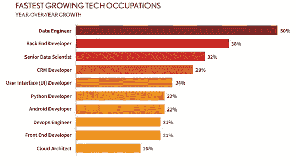

# 初学者完全数据工程面试指南

> 原文：<https://levelup.gitconnected.com/the-complete-data-engineering-roadmap-for-beginners-bc68733bc0b2>

在一个每个数据点都是无价的世界里，数据和使用数据的能力是公司 ***赢得*** 的关键。我们正面临着数据的爆炸，很少有人有足够的技能来妥善处理这些数据。

> *这是十年的数据。*

资料来源:沙尔达大学

> 数据是新的石油。
> 
> 数据智能可以为组织提供赢得竞争所需的优势

每天都有令人难以置信的 2.5 万亿字节的数据被创建，仅在过去两年中就有 90%的数据被创建。这足以说明为什么世界需要更多的数据工程师。

***百万美元问题，*** 如何入门？

我经常收到询问如何进入数据工程角色的请求。是的，没有合适的路线图/指南，很容易迷失在内容的海洋中。

*您可能希望保存此文件，并在整个准备过程中反复查看。*

您需要遵循的路线图:

# ***第一步:针对绝对初学者*** :

1.  ***学习用 Python / Scala 或 Java 编写*** 代码。我推荐 Python，因为它更容易掌握和入门。
2.  ***学习 SQL。*** 在你的系统上安装 MySQL，练习。用 HackerRank 和我写的这个[指南](/advanced-sql-for-data-professionals-e0ef0740e8e1)练习题。
3.  ***使用 python 创建一个项目*** ，在那里你可以抓取一些数据。从一个网站，并张贴在一些仪表板(谷歌 DataStudio/PowerBI/Tableau)。可以试试股票或者天气数据。

# ***步骤 2*** :建立在基础之上:

1.  ***创建端到端的数据工程项目* ct。**为 ex。选择一个数据集/数据源，转换它，然后使用脚本在仪表板上将其可视化。优选作为分批或流动过程。这将教会你数据的基本流程。如果你能现场展示给面试官看就太好了。
2.  ***学习核心星火概念*** 。即 spark 如何进行并行处理、节点与集群、分区、容错等。
3.  ***利用火花学习数据角力*** 。只使用 spark 完成读取-提取-转换-加载数据的复杂任务(避免使用 pandas)。
4.  ***学习 G* it** 的基础知识，关系型& NOSQL 数据库，分布式文件系统，基于列与基于行的数据类型。

# ***第三步* :** 准备面试:

1.  ***学 DSA，做 leetc 上的面试前 100 题* ode** 。*试着理解问题背后的逻辑和模式*。质量比数量更重要。DE 不应该是 DSA 专家，只应该被问到简单到中等水平的问题，这些问题大多与争论数据有关。大多数问题都是标准问题的变体。
2.  成为 ***SQL pro*** 。(参考 [***此链接***](/advanced-sql-for-data-professionals-e0ef0740e8e1?source=your_stories_page----------------------------------------) )
3.  做好被问到棘手问题的准备 ***关于处理数据的火花概念*** 。为此你需要做一些好的练习。

以下是你应该熟悉的火花话题:

*   聚合，分组依据
*   读取不同种类的数据、连接(使用 spark 和 SQL)
*   将 df 从 spark df 转换为 SQL df，这样就可以对它们使用 SQL 函数。
*   Collect_list 和 collect_set(很 imp)。
*   动作 v/s 转换。
*   了解 regexp_extract、regex_replace、split()这类函数，帮助您在不使用 UDF 的情况下完成工作。

4.学习 ***火花基础*** 以及其中比较棘手的部分。棘手的部分将在后面的文章中讨论。

5.对于有经验的人来说:Hive、HDFS、任务调度器、卡夫卡、云服务、NoSQL 和 UNIX 的知识将在面试中帮助你。

# 学习资源

*   Spark 全教程| Spark 初学者教程|学习 Apache Spark | Simplilearn[https://www.youtube.com/watch?v=S2MUhGA3lEw](https://www.youtube.com/watch?v=S2MUhGA3lEw)
*   教程:[https://www.tutorialspoint.com/apache_spark/index.htm](https://www.tutorialspoint.com/apache_spark/index.htm)
*   数据工程子编辑:[https://www.reddit.com/r/dataengineering/](https://www.reddit.com/r/dataengineering/)

> ***就是这样！！您已经涵盖了您需要的大部分数据工程师初学者内容。现在，满怀信心，继续前进。***

关注我的[***LinkedIN***](http://linkedin.com/in/niteshx2)保持联系。我定期分享数据专业相关的职位，你可能会发现有用的。*也可以看看我的* [*其他帖子*](https://medium.com/@niteshx22) *如果你觉得有用的话。*