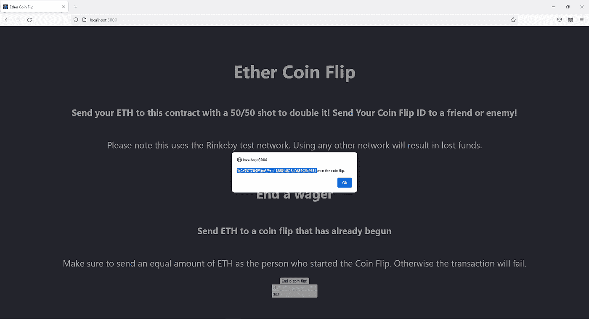

# 建造以太坊的完全指南

> 原文：<https://levelup.gitconnected.com/the-complete-guide-to-building-an-ethereum-dapp-1692976ec4a5>

## 让我们用 React、Solidity、Hardhat 和 Ethers.js 构建一个 Dapp


感谢 [Pexels](https://www.pexels.com/photo/round-gold-colored-ethereum-ornament-730552/) ！

你可以在这里找到这个项目[的完成代码。](https://github.com/MichaelMacaulay/Ether-Coin-Flip)

我们将从头到尾构建一个完整的以太坊 Dapp(去中心化应用)。您应该对 Dapp 开发有一个很好的理解。如果没有，我强烈建议你从这里[开始](/a-brief-introduction-to-blockchain-development-c5fdc038b95f)了解 Dapps 的基础知识。

Dapp 本身很简单。这叫以太抛硬币。玩家 1 向智能合约发送一定数量的以太币。智能合约生成一个 ID，并将其提供给参与人 1。玩家 2 使用该 ID 向智能合约发送等量的以太币。以太硬币投掷随机挑选一个获胜者，并把所有以太币送给他们。

# 区块链上的随机

在区块链上创造可靠的随机性是不可能的。每个指标都可以以某种方式被操纵。这就是为什么使用 [Chainlink 的 VRF](https://docs.chain.link/docs/chainlink-vrf/) (可验证随机函数)很重要。

# 技术堆栈

有很多选择来取代这个项目的每一个单独的部分。然而，我相信这些是创建 Dapps 时使用的最佳技术。

## 反应

React 是一个 JavaScript 库，用于创建用户界面和 web 应用程序。这是最受欢迎的前端库，由脸书维护。

它为一个大型生态系统提供动力，其他子框架如 Next.js 和 Gatsby 都建立在 React 之上。

## 固态

Solidity 是一种编程语言，用于在以太坊区块链上构建智能合约。这段代码由以太坊虚拟机(EVM)执行。

在将代码部署到 mainnet 之前对其进行审计是非常重要的。毕竟，这里有真金白银。一个小小的 bug 就可能造成数百万美元的资金损失。

*本教程中的代码没有经过专业审核。并且您不应该将它部署到 mainnet。*

## Ethers.js

这是一个将智能合同与 React 应用程序结合使用的库。您可以将此视为前端和智能合约之间的桥梁。你可以在这里阅读更多关于它的[。](https://blog.infura.io/ethereum-javascript-libraries-web3-js-vs-ethers-js-part-i/)

## Infura

Infura 帮助你追踪和衡量你的 dapp。它允许你通过简单可靠地访问以太坊和 IPFS 来跟踪许多事情。点击阅读更多相关信息[。](https://infura.io/)

## 建筑工人

安全地构建智能合约非常重要。毕竟，一旦将代码部署到 mainnet，就不能再对其进行更改。

谢天谢地，Hardhat 提供了一种在测试网上测试和调试智能合约的简单方法。安全帽使得建造 Dapps 更加容易。点击了解更多信息[。](https://hardhat.org/)

## 链环

[Chainlink](https://chain.link/) 是一个与以太坊和其他网络协同工作的甲骨文网络。我们将使用他们的[可验证随机函数](https://docs.chain.link/docs/get-a-random-number/)。这将用于选择一个安全的方式随机赢家。

他们也有其他服务，允许您使用来自其他外链来源的数据。你可以在他们的网站上了解更多信息。

## 元掩码

元掩码是一个浏览器扩展，充当加密钱包。它可以容纳你的以太坊，ERC-20 代币，和 NFT。

你可以在这里下载 meta mask。它可以与 Chrome、Brave Browser 和 Firefox 兼容。

## 节点. js

Node 是后端 JavaScript 运行时环境。它在网络浏览器之外执行 JavaScript 代码。

它带有 NPM(节点包管理器),可以帮助跟踪你的依赖关系。你必须[下载节点](https://nodejs.org/en/)到你的电脑上。

# 入门指南

运行以下命令。

```
npx create-react-app ethercoinflip
```

这将创建一个新的 React 应用程序。这是一个基本的 React 模板。你可以把“以太币翻转”改成你喜欢的任何东西。

接下来，我们需要安装一些依赖项。就我个人而言，我用纱代替 NPM，但你可以用任何适合你的。

```
cd ethercoinflipyarn add ethers hardhat @nomiclabs/hardhat-waffle ethereum-waffle chai @nomiclabs/hardhat-ethers
```

我们还需要将 Chainlink 智能合约添加到我们的项目中。为了我们的缘故，我们将添加纱线。运行以下命令。

```
yarn add @chainlink/contracts
```

这将允许你使用来自链链生态系统的任何工具。

# 创造安全帽环境

接下来，我们需要配置 Hardhat。运行以下命令。

```
npx hardhat
```

创建一个基本的示例项目。这应该会在您的根目录中添加一些文件夹。保持项目根目录不变。单击“是”添加。gitignore 文件。你应该可以走了。

您会注意到根目录中有几个新文件夹。

**合同** —存储您的智能合同的位置。这些将是. sol 文件类型的 Solidity 文件。

**脚本** —将保存部署脚本的位置

**测试** —包含样本测试的文件夹

# 智能合同

您的项目中应该只有一个智能合约。contracts/Greeter.sol

它应该看起来像这样。

这是一个非常基本的智能合约。它允许您调用 greet()函数来查看当前问候语设置为什么。它还有一个叫 setGreeting 的功能，可以让你改变它。

注意:如果你得到了一个关于 Solidity 编译器版本的 VS 代码错误，阅读[这篇文章](https://medium.com/michaels-dapp-dev-tips/how-to-change-the-solidity-compiler-in-vs-code-4c2660a856da)如何修复它。

# 更改安全帽设置

Hardhat 允许您将智能合约部署到不同的测试网络。这可以是任何以太坊测试网(Ropsten、Rinkeby、Kivan 等)，或者您可以部署到本地测试网。

在本教程中，我们将部署到 Rinkeby 测试网络。你可以从[这个水龙头](https://faucet.rinkeby.io/)那里得到一些乙醚。确保将元掩码钱包设置为 Rinkeby testnet。应该是这样的。


接下来，我们需要配置 Hardhat，为 Rinkeby testnet 做好准备。

转到目录根目录下的 hardhat.config.js 文件。把它改成这个样子。

接下来，在 [Infura](https://infura.io/) 上创建一个账户。这将让您跟踪项目中的以太坊交易。

登录后，点击以太坊。单击创建新项目。随便你怎么命名。

点击端点下拉菜单，将网络更改为 Rinkeby。然后，复制 https 链接并将其粘贴到您的 hardhat 配置文件中。


接下来，进入安全选项卡。向下滚动到合同地址。添加您的 Rinkeby testnet 地址。这将把你的帐户列入白名单，以便使用 Infura。

然后，您需要将您的私钥导出到 Hardhat.config.js 文件中。

警告:不要将它硬编码到你的项目中。使用. env 文件在本地存储您的私钥。我之前把我的私钥推送到 GitHub，有人偷走了我所有的加密 NFT。使用 [**本教程**](https://medium.com/michaels-dapp-dev-tips/how-to-secure-your-metamask-while-testing-smart-contracts-ca39abc71ac4) **获取更多关于如何在测试 Dapp 时保护元掩码的技巧。**

要访问您的私钥，请打开元掩码。单击右上方的 3 个点。单击帐户详细信息。然后，单击导出私钥。

有了这个文件之后，在项目的根目录下创建一个. env 文件。你的。env 文件应该如下所示。

```
REACT_APP_PRIVATE_KEY=your-private-key
```

就是这样。格式非常具体。所以，密切关注这里的细节。只需复制并粘贴你的私钥到“你的私钥”的地方

接下来，让我们回到 hardhat.config.js 文件，对所有内容进行三重检查。

一切看起来都很好。我们有正确的可靠性版本。我们使用 src 文件夹中的工件。我们部署到 Rinkeby 网络，用我们的 Infura ID 跟踪一切，并使用来自. env 文件内 MetaMask 的私钥。

# 撰写智能合同

你可以把智能合约想象成云中的功能。一旦部署了智能合约，任何人都可以调用这些函数。但是，在部署智能合约后，您不能对其进行更改。这就是为什么在测试中把一切都做好是如此重要。

在本教程中，我们将使用[实度](https://docs.soliditylang.org/en/v0.8.9/)。然而，你也可以使用 [Vyper](https://vyper.readthedocs.io/en/stable/) 来撰写智能合同。

测试智能合约可能很困难。谢天谢地，还有[混音](https://remix.ethereum.org/)。这是一个用于创建智能契约的强大开发环境。我强烈建议你在开始创建前端之前用 Remix 编写你的智能合约。

对于本教程，您可以进入 contracts 文件夹并创建一个名为 EtherCoinFlip.sol 的新文件。解决文件类型的可靠性。

这个 Dapp 的目标是允许两个玩家互相打赌他们的以太坊。它会像这样流动。

*   1 号玩家发送 Eth
*   智能合同生成硬币翻转 ID
*   2 号玩家发送 Eth
*   智能合同使用 Chainlink 的 VRF 随机决定赢家
*   聪明的合同把所有的以太都送给赢家

我尽了最大努力在智能合同中留下有用的注释来解释一切。如果有任何不清楚的地方，发表评论，我可以澄清你需要的任何东西。

# 部署我们与 Hardhat 的智能合同

启动我们的智能合同并在浏览器中使用它有 3 个步骤。

1.  编译智能合同
2.  部署智能合同
3.  将它连接到 React 应用程序

使用环境变量可能会有问题。我做到了。谢天谢地， [dotenv npm 页面](https://www.npmjs.com/package/dotenv)有很棒的文档。

运行以下命令。

```
yarn add dotenv
```

在 hardhat.config.js 文件中添加 require 语句。它可以放在第一个 require 语句的正下方。

```
require(“@nomiclabs/hardhat-waffle”);require(‘dotenv’).config();
```

这样做之后，一切都应该正常了。

接下来，我们需要修改脚本。导航到脚本文件夹，并将名称更改为以下内容:scripts/deploy.js

打开该文件，并将其更改为以下内容。

这是使用 Hardhat 部署智能合约的一种简单方法。如果你想要一个更好的解释，查看文档[这里](https://hardhat.org/guides/deploying.html)。

现在，我们终于可以编译我们的智能契约了。运行以下命令。

```
yarn hardhat compile
```

现在，我们可以将智能合约部署到 Rinkeby testnet。运行此命令。

```
yarn hardhat run scripts/deploy.js — network rinkeby
```

这是一个需要手动输入的较长的命令。每当需要使用该命令时，可以创建一个. txt 文件来保存它。

部署后，您应该会看到类似这样的消息。这是您的智能合同的地址。

```
EtherCoinFlip deployed to: 0x20dfA0b80882951574ea1335B25730961302bd6f
```

省省吧。你马上就会需要它。

您还需要用 Chainlink 令牌为您的智能合约提供资金，以确保随机功能正常工作。你可以在这个水龙头用链条抓住一些[环。一旦您有了它，只需将它发送到您的智能合同的地址。一切都应该正常。](https://faucets.chain.link/rinkeby)

既然我们的智能契约已经在 Rinkeby 网络上运行，我们需要将我们的 React 应用程序连接到它。

这看起来有点吓人。但远没有看上去那么复杂。我们会分解每一行代码。

# 连接我们的智能合约以做出反应

打开 src/App.js

继续删除里面的所有内容。我们可以从头开始写所有的东西。

我们需要进口我们使用的所有东西。

接下来，我们需要存储我们的智能合约地址。使用智能合同的地址。这是我的。别用我的。这将是您部署智能合同时在终端中看到的地址。

然后，继续为整个组件创建函数。

太好了，简单的部分完成了。

接下来，我们需要初始化我们的状态变量。这将允许我们围绕我们的应用程序移动数据。请注意，其他所有内容都在我们的 App()函数中。

现在，我们需要写一个函数来开始抛硬币。首先，我们需要向用户请求帐户。并将他们的 MetaMask 钱包连接到我们的 Dapp。

然后，我们需要创建一个变量来调用智能契约。我们传入智能合同地址 ABI 和签名者。

然后，我们需要创建一个 updatedWager 变量，将用户输入转换为以太坊。Ethers.js 只接受数字作为字符串。不要问我为什么。

然后，我们从智能合约中调用 newCoinFlip 函数，并将更新后的赌注作为对象传入。这确保了用户可以在同一个交互中发送 Ether 和调用 newCoinFlip 函数。

然后，我们从智能合约中检索硬币翻转 id。记得我们的活动吗？然后，我们将它作为警报显示给用户。所有这些都会看起来像这样。

[https://gist . github . com/MichaelMacaulay/9422 BC 741 ab 058 e 8 cf DFD 0 e 68 c 72 E3 c 0](https://gist.github.com/MichaelMacaulay/9422bc741ab058e8cfdfd0e68c72e3c0)

接下来，我们需要编写一个函数来结束掷硬币。这看起来与第一个函数非常相似，只有一些小的不同。

重要的区别在于，我们将把 coinFlipID 状态变量传递给智能契约。并且还传入更新的赌注变量的值。它应该看起来像这样。

接下来，我们必须编写向用户显示的 JSX。我们会让事情超级简单，没有太多的风格。首先，让我们创建一个 div 和 header。

继续把其他的都写在里面。

我们先写开始抛硬币的部分。首先，我们需要在 onClick 上运行 startCoinFlip 函数。我们需要把赌注传递给价值。我们需要创建一个错误函数来改变用户输入的状态变量。

接下来，我们将创建结束下注部分。同样，它看起来非常相似，但有一个重要的区别。它还将接受来自用户的 coinFlipId，并将其设置为状态变量。

这将完成我们的 react 应用程序。请记住，您可能需要注释掉

App.js 的整体应该是这样的。

既然我们已经做好了一切准备工作，我们应该能够启动我们的智能契约到 Rinkeby testnet 并与之交互。

继续运行下面的命令。您应该能够通过 localhost:3000 与智能合约进行交互。

```
yarn start
```


现在，你可以开始抛硬币了。但是请确保您使用的是 Rinkeby testnet！你的元蒙版应该是这样的。


如果你需要测试以太网，看看这个水龙头。

我们将为 0.1 以太开始抛硬币。点击开始抛硬币。并确认元掩码事务。

如果一切顺利，您应该会收到一条消息，告诉您抛硬币 ID。


我们可以使用另一个钱包登录，并使用同一个抛硬币 ID 来结束它。我甚至打算使用不同的浏览器。只要确保运行 localhost:3000，您就可以与您的智能合约进行交互，而不用考虑您的浏览器。

确保你押了等量的乙醚。您应该会收到如下所示的消息。



在我的例子中，看起来像是 2 号玩家赢了掷硬币游戏！

如果到目前为止一切都正常，那么您所要做的就是在线部署您的客户端应用程序，一切都应该正常工作了。任何人都可以使用你的硬币翻转 Dapp！或者你可以在这里查看我的。

# 最后的想法

这是一个相当长的教程。如果你能走到这一步，恭喜你。我真的希望你喜欢一切，学到了很多东西。请务必关注我的更多 Web3 教程，就像这个一样。这可能是你的第一次 Dapp。但希望这将是第一次。

如果你想继续你的 Web3 开发者教育，我强烈推荐 [Austin Thomas Griffith](https://medium.com/u/610daeab315b?source=post_page-----1692976ec4a5--------------------------------) 的 [eth dev speed run](https://medium.com/@austin_48503/%EF%B8%8Fethereum-dev-speed-run-bd72bcba6a4c) 。它可以在很短的时间内教会你很多东西。如果你通过了这个教程，你肯定可以通过那里的一切。

请务必评论你得到的任何错误，我可以帮助你。