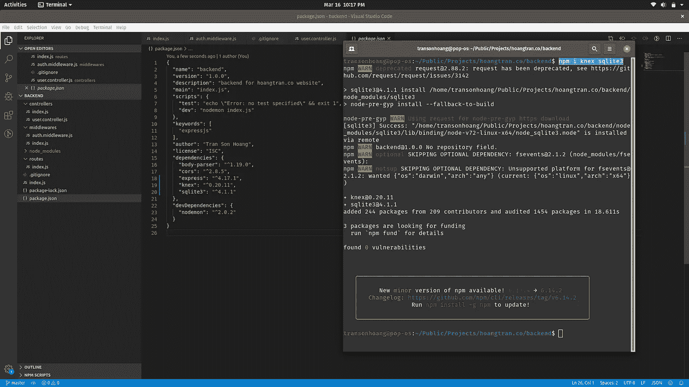
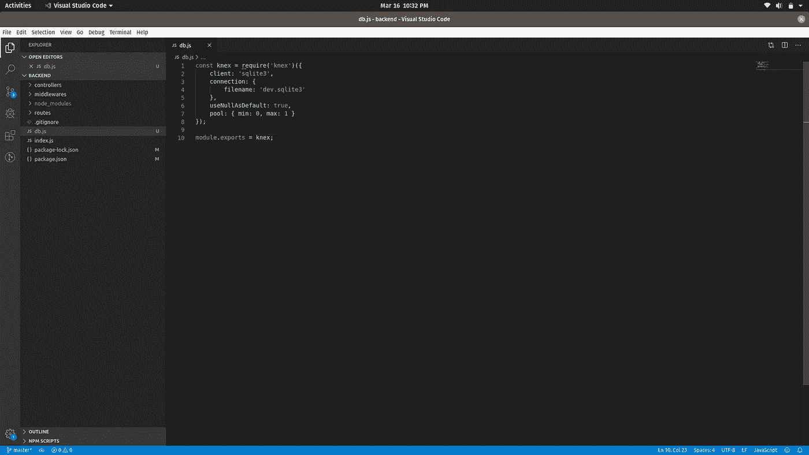
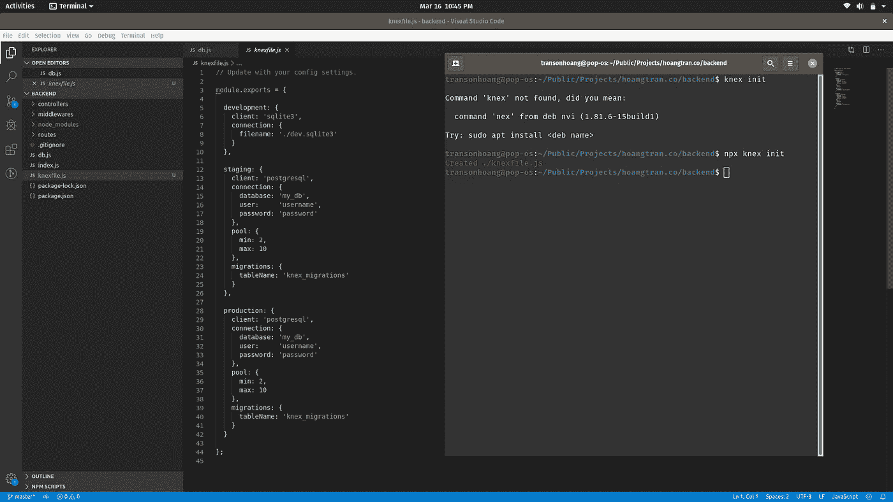
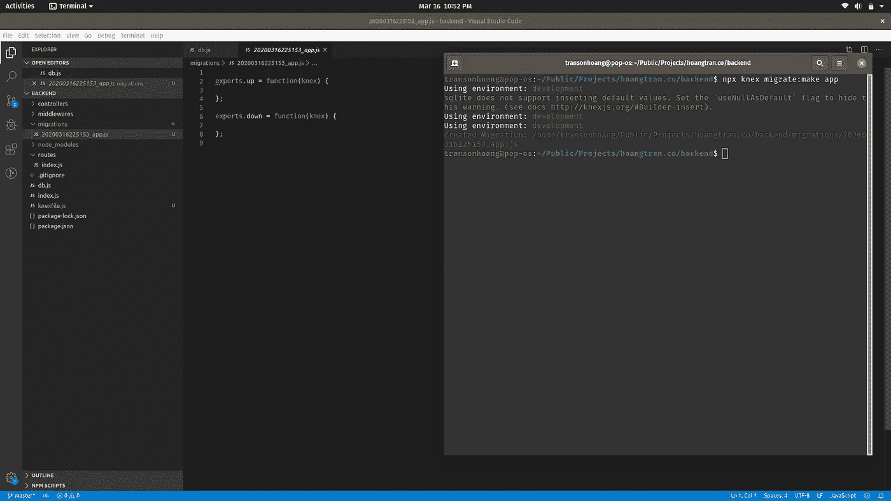
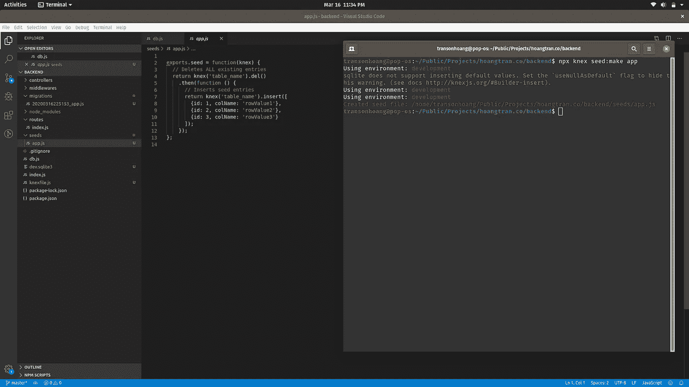
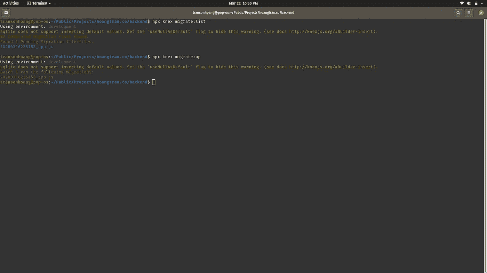
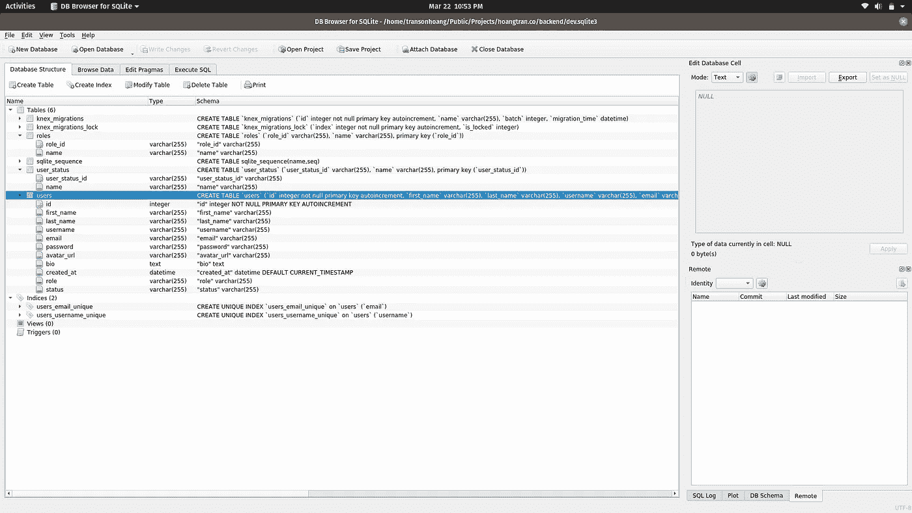
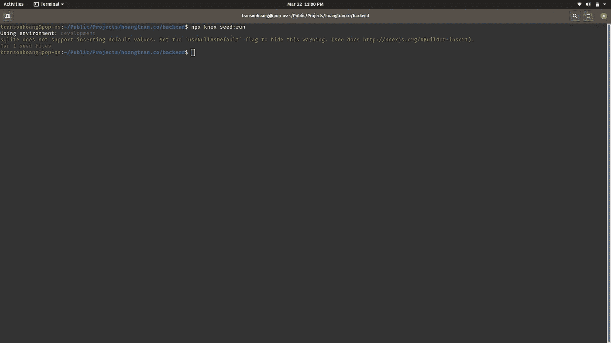
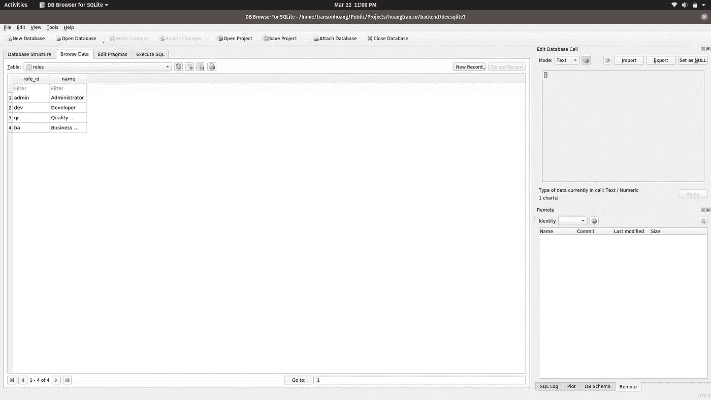

# Node.js 中连接数据库的完整指南

> 原文：<https://levelup.gitconnected.com/the-complete-guide-to-connecting-to-a-database-in-node-js-9c7850235b91>

## Nodejs

## 一个语法用于多个数据库，执行 SQL 迁移，并像专业人员一样在节点应用程序中播种数据。


由[亚历克斯](https://unsplash.com/@worthyofelegance?utm_source=unsplash&utm_medium=referral&utm_content=creditCopyText)在 [Unsplash](https://unsplash.com/s/photos/coffee?utm_source=unsplash&utm_medium=referral&utm_content=creditCopyText) 上拍摄的照片

在这篇文章中，我将分享我使用数据库的方法。我们将使用的主要工具是 [Knex](http://knexjs.org/) 。

查看我以前的文章，了解我在哪里使用 Knex 处理节点项目:

[](/stop-using-a-starter-node-js-project-and-build-your-own-38a97aa723f9) [## 停止使用 Starter Node.js 项目，构建自己的项目

### 这篇文章基于我如何使用 expressjs 设置我的个人网站后端，因为我想将所有 API 从…

levelup.gitconnected.com](/stop-using-a-starter-node-js-project-and-build-your-own-38a97aa723f9) 

下面是这篇文章的内容:

1.  Knex 是什么？
2.  连接到数据库
3.  设置迁移和种子数据
4.  实施迁移和种子数据

*更多类似内容，请查看*[*https://betterfullstack.com*](https://betterfullstack.com)

# Knex 是什么？

[Knex.js](https://github.com/knex/knex) 是为 **Postgres** 、 **MSSQL** 、 **MySQL** 、 **MariaDB** 、 **SQLite3** 、 **Oracle** 和 **Amazon Redshift** 设计的一个“包含电池”的 SQL 查询生成器，旨在提供灵活性、可移植性和使用乐趣。

在 2 个项目之后使用这个库，我最喜欢的是:

1.  很好地支持模式构建器
2.  事务支持和连接池
3.  独立于迁移文件轻松填充数据
4.  在一个命令行中轻松迁移数据库
5.  对承诺友好，因为我使用`async`和`await`

# 连接到数据库

为了使用 knex，您必须首先安装库:

`npm i knex`

根据您使用的数据库，安装正确的库。

```
$ npm install pg
$ npm install sqlite3
$ npm install mysql
$ npm install mysql2
$ npm install oracledb
$ npm install mssql
```

注意:`pg`是针对 PostgreSQL 的

首先，我将安装`knex`和`sqlite3`，因为我更喜欢在小项目中使用 sqlite3 来节省数据库服务器的费用。



通过 npm 安装 knex 和 sqlite3

其次，我将使用`knex`建立一个到我的数据库的连接。

通过 knex 连接到 sqlite

我添加`useNullAsDefault: true`是因为 **sqlite3** 不支持插入默认值。在[文档](http://knexjs.org/#Builder-insert)中:

> 如果喜欢用`NULL`而不是`DEFAULT`替换未定义的键，可以在 knex 配置中给出`useNullAsDefault`配置参数。



使用数据库配置添加新的 db.js 文件

连接池默认时间怎么样？

对于 MySQL 和 PG 库，连接池有一个默认的`min: 2, max: 10`设置，对于 sqlite3 只有一个连接。

可以通过添加`pool: {min: value, max: value}`来控制

# 设置迁移和种子数据

迁移允许您定义模式更改集，并使更改数据库变得轻而易举。这意味着您将创建您的数据表，并从这里更新任何更改。

在开始创建迁移之前，我们需要先创建 knexfile，因为在运行迁移时，迁移使用一个 **knexfile 来**指定各种配置设置。



运行 knex init 创建 knexfile.js

默认的是开发环境，您可以更新其余的用于登台和生产环境。

注意:因为没有找到命令，所以不能直接运行`knex init`。你应该用`npx knex init`。见上图。

## 创建迁移文件

下一步，通过运行`npx knex migrate:make MIGRATION_NAME`创建迁移文件来创建迁移文件。



创建名为 app.js 的迁移文件

这将生成一个包含两个方法的文件，`up`和`down`。

1.  当您运行`npx knex migrate:up`来运行尚未运行的下一个迁移时，会调用`up`。
2.  当您运行`npx knex migrate:down`来撤消上次运行的迁移时，会调用`down`。

注意:要列出已完成和待定的迁移，您可以运行`npx knex migrate:list`。

## 创建种子数据

种子文件允许您用独立于迁移文件的测试或种子数据填充数据库。

运行`npx knex seed:make SEED_NAME`创建种子文件。

种子文件在 knexfile.js 中为当前环境指定的目录下创建。种子配置示例如下所示:

种子配置示例

如果没有定义`seeds.directory`，则在`./seeds`中创建文件。请注意，种子目录必须是相对路径。不支持绝对路径。



创建种子文件

# 实施迁移和种子数据

在这一节中，我将向迁移文件和种子文件添加一些代码，以便添加一些演示表和样本种子数据。

注意:我很快地创建了这个程序来演示如何实现一个迁移文件和种子数据。你应该改变和适应你真实的项目情况。

## 迁移文件

在迁移文件中，有两种方法`up`和`down`。你可以理解:

*   `up`用于对数据库进行迁移或更改，比如添加新表、向特定表添加新列。
*   `down`用于从`up`方法恢复变更。

首先，我将在`up`方法中创建 3 个新表 users、roles、user_status，并将它们放到`down`方法中以恢复更改。

创建了 3 个新表的示例迁移文件

然后，我们可以通过使用这个命令`npx knex migrate:up`来触发`up`方法来运行它。



使用默认环境运行迁移

现在，您可以看到这会为您创建一个表:



表是在运行 npx knex migrate:up 后创建的

首次迁移已完成。从现在开始，任何改变都可以创建一个新的迁移版本并运行它。

注意:当您部署到 UAT 和生产时，您需要在运行 **migrate:up** 时指定环境。

现在，进入下一部分，为新表添加一些初始数据。

## 创建种子数据

初始化新表时，您需要一些初始数据，以便它在开始时运行您的应用程序，或者您可以理解，种子数据是运行新功能所需的强制数据。

以下是种子数据示例:

样本种子数据

正如你在上面看到的例子，我有:

*   对于**用户**，我用用户名和密码创建了第一个管理员用户
*   初始化**角色**和**用户状态**表的数据

接下来，运行`npx knex seed:run`添加数据。



通过 npx knex seed:run 命令运行种子文件

最后，我为我的应用程序创建了一些种子数据。



为具有 4 个默认角色的角色表创建的数据

注意:您可以创建许多不同的种子文件名，并在每次进行部署时运行该文件名。更多文档[此处](http://knexjs.org/#Migrations-CLI)芦苇。

感谢您花时间阅读我的文章！！！

# 结论

在本文中，我重点介绍了如何使用`knex`库处理数据库迁移和创建种子数据。

这个月和下个月，如果您觉得这篇文章有用，我将会写更多关于 Node.js 的内容！你可以在[媒体](https://medium.com/@transonhoang?source=post_page---------------------------)上关注我。我也在推特上。欢迎在下面的评论中留下任何问题。我很乐意帮忙！

示例源代码:

[](https://github.com/hoangtranson/starter-express-js) [## Hoang transon/starter-express-js

### 在 GitHub 上创建一个帐户，为 Hoang transon/starter-express-js 的开发做出贡献。

github.com](https://github.com/hoangtranson/starter-express-js) [](https://betterfullstack.com/stories/) [## 故事-更好的全栈

### 关于 JavaScript、Python 和 Wordpress 的有用文章，有助于开发人员减少开发时间并提高…

betterfullstack.com](https://betterfullstack.com/stories/)