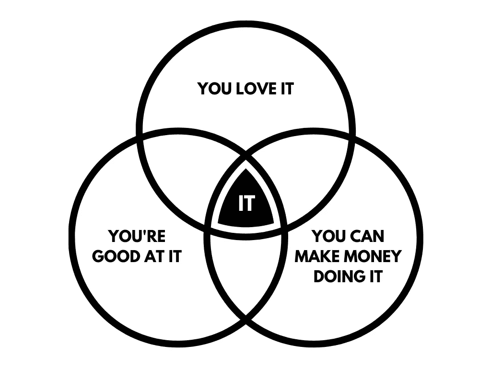

# 开发者从副业项目中赚取 100，000 美元的完整手册

> 原文：<https://levelup.gitconnected.com/the-complete-handbook-for-developers-to-make-100-000-from-side-projects-7bc11ebeb7a3>

## 成功的 5 个步骤

布鲁克·卡吉尔在 [Unsplash](https://unsplash.com?utm_source=medium&utm_medium=referral) 上的照片

十万美元太容易赚了。问题是大多数开发人员不知道如何去做。

如果你有一个老板，每一件小事都要征得他的同意——你可能永远挣不到六位数的工资。

但是副业就不一样了。有了副业，你就不依赖任何人了。你不需要出卖灵魂去为一家科技独角兽公司工作。

我的大部分收入都来自副业。现在，我将向您展示如何做同样的事情。

我们开始吧。

# 做你擅长的事情

许多人认为他们会擅长一些新的东西。

但是我们中的大多数人已经擅长某事了。来之不易的经验带来了许多教训。

当然，你可以学习一项新技能。但是，当你可以利用你已经拥有的技能时，为什么还要花那么多时间呢？

事实是，我们都有擅长的东西。抓住你擅长的，并围绕它建立项目。

> 兼职赚钱的最好方法是做你擅长的事情并获得报酬。

找到自己擅长的了吗？太好了！现在确保你也爱它。这是成功的秘诀。

寻找完美的副业

如果你不喜欢你正在做的事情，你就会放弃。那么你喜欢做你擅长的事情吗？

想想吧。寻找模式。最终，你会找到的。

# 确定有利可图的利基市场

这与你被告知的相反。

有人告诉你要选择一个拥有广泛受众的产品。能被大众接受的产品。

实际上，这很难做到。这也是我不推荐的原因。相反，你应该专注于一个利基受众。

利基受众是喜欢你所做的事情的人。他们忠于你的工作。他们会支持你度过难关。

他们需要你正在开发的产品，因为它能帮助他们。

## 寻找有利可图的利基市场

像 Twitter、Quora 或 Reddit 这样的网站是你开始研究的好地方。然后转到论坛、电子邮件列表和私人聊天社区。

寻找模式:

*   你的顾客谈论什么？
*   他们如何描述他们遇到的问题？
*   他们的痛点是什么？
*   他们在纠结什么？
*   他们兴奋什么？
*   他们需要什么？

找出你的听众关心的一个问题。然后对自己做同样的研究。

*   你的受众是什么？
*   你如何能与你的观众产生共鸣？
*   你能给他们提供什么？
*   你如何让他们的生活更轻松？

重点是找到一个你关心的问题的听众。理想情况下，你能解决的问题。

> 人们在构建边项目时犯的最大错误是为自己构建一个产品。

潜在观众不需要很大。但是需要有足够多的人。

# 决定方向

副业的方向是由你的目标决定的。大多数人都有两个。

*   学习:你正在学习一项新的进化技能。
*   **利润:**你正在学习从副业中赚钱。

如果你太沉迷于从副业中赚钱，这会导致你精疲力尽，想要放弃。

如果你完全忽略了金钱方面，它会导致放弃，因为它不会让你有饭吃。

理想的平衡是找到这两者的交叉部分。

把你的兼职项目当作一次学习经历，感激它能提供的额外收入。

# 想办法赚钱

不要混淆。拥有一个你喜欢做的副业本身就是成功。但是我们也想从中赚钱。

这就是货币化发挥作用的地方。有 3 种主要的方法来赚钱的副业项目:

*   广告(ad 的复数)
*   加入
*   会员资格

[你的策略将取决于你的产品。](https://www.mightynetworks.com/encyclopedia/monetization-model)

你提供有价值的内容吗？你将从广告或代销商佣金中获益。

你提供的是用户日常需要的服务吗？您可以直接销售这项服务，也可以按月收费。

提示:你可以从所有的组合中赚钱。

> 如果你不知道如何将你的项目货币化，它就死定了。

你必须知道如何从你的副业中赚钱。否则有什么意义？

从你的副业项目中赚钱的最简单的方法是出售你创造的资源的使用权。

这叫做“会员资格”

另一个策略是在你的内容中添加附属链接。这样你就可以从你推荐的产品中赚取佣金。

第三种赚钱方式是将流量转化为有价值的资源，并在上面显示广告。

我从这三种方法中都赚了钱:

*   我在[乐观代码](https://www.upbeatcode.com/)上使用广告
*   我在 [Deap Market](https://deapmarket.com/) 上使用附属链接
*   我将在我的下一个项目中使用会员资格

# 睡觉的时候做些副业

为了从兼职项目中赚到 10 万美元，你需要在睡觉的时候继续工作。这是大多数人都忘记的事情。

他们白天做兼职项目，同时努力兼顾朝九晚五的工作。这是失败的秘诀。

你做梦去吧。

阿诺德·马里亚特在 [Unsplash](https://unsplash.com?utm_source=medium&utm_medium=referral) 上拍摄的照片

我吗？我在努力让我的副业独立运作。唯一的方法就是自动化。

每个星期，我都会坐下来看看我为我的副业项目所做的所有过程。然后，我问自己一个问题。

我能自动化什么？

每周，我都试着自动化一个过程。这样，我的副业项目将很快为我工作，而不是我去做它们。

# 最后的话

世界上的许多问题都可以用软件解决。如果你没有解决问题，那你就是在浪费时间。

我不是告诉你去利他或拯救世界。我是在告诉你，用一个小主意，通过解决常见的问题，让你的生活和他人的生活变得更轻松。

**如果你想让你的副业更上一层楼，开始网上赚钱，** [**加入我的快讯**](https://founderstools.substack.com/) **。**