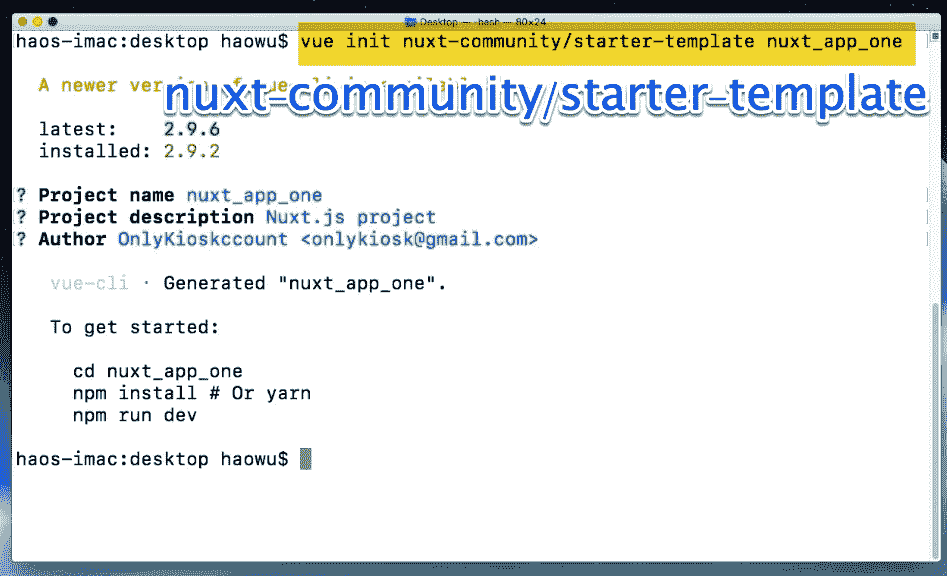
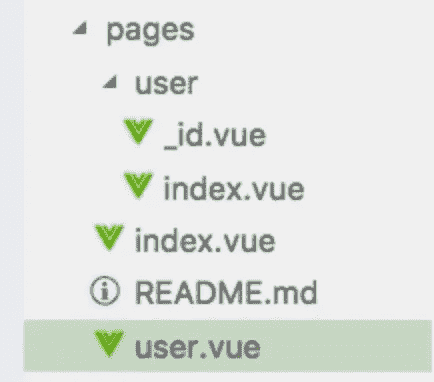
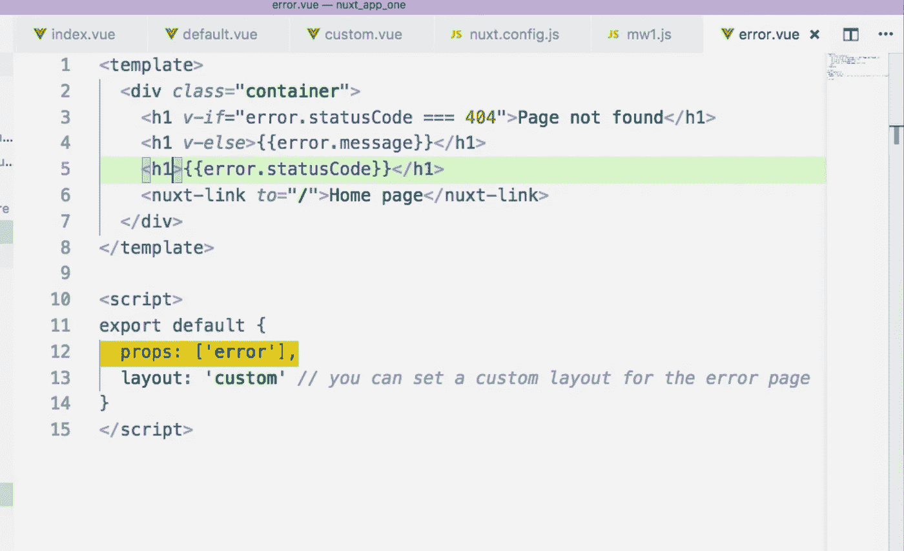
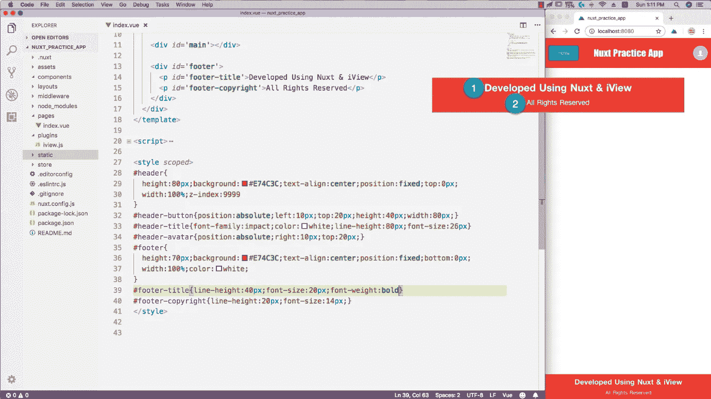
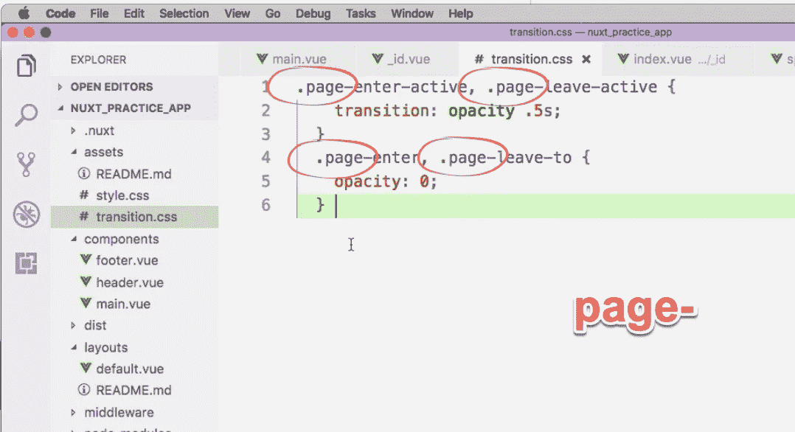
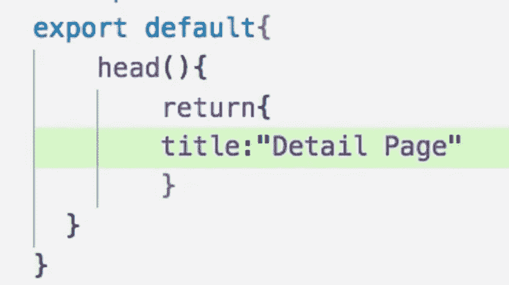
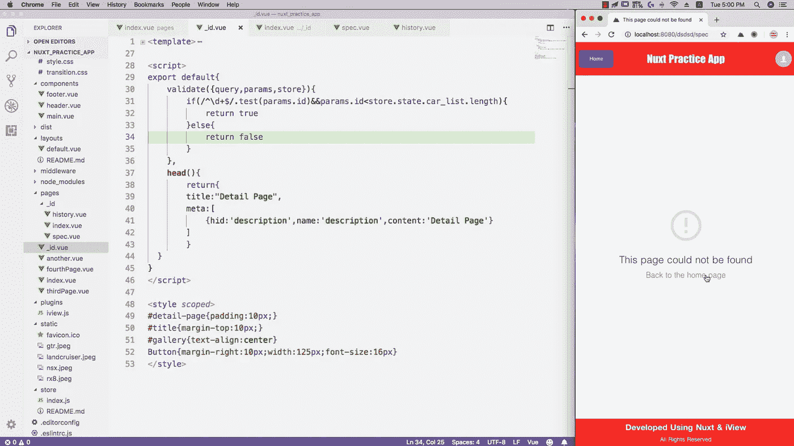

# 完整的 Nuxt 指南

> 原文：<https://levelup.gitconnected.com/the-complete-nuxt-guide-940751e1a6a5>

查看我们的视频课程:

 [## 完成 Nuxt.js 2.4+课程| Udemy

### 作为 Vue 的增强版，Nuxt 有更多的功能，也更容易配置。使用 Nuxt，您可以编码…

www.udemy.com](https://www.udemy.com/complete-nuxtjs-course/?couponCode=MEDIUM_PROMO_CNG) 

查看我们全新的完整 Nuxt 2.4+指南:

[https://medium . com/@ only kiosk/the-new-complete-nuxt-2-4-course-e30a 561 e 6800](https://medium.com/@onlykiosk/the-new-complete-nuxt-2-4-course-e30a561e6800)

**什么是 Nuxt**

Vue 是一个基于 JavaScript 的框架。我们用它来创建客户端应用程序。

Nuxt 是一个基于 Vue 的框架。你可以把它看成是 Vue 的加强版。

它是 vue、vue 路由器、vuex、vue 服务器渲染器和 vue meta 的组合。

Nuxt.js 是由什么组成的

手册上说 Nuxt 是用来创建通用应用的。通用只是客户端和服务器端的一个花哨词。在服务器端工作并不意味着 Nuxt.js 就是 Express 那样的后端框架。服务器端 Nuxt 实际上是一个预配置的 vue 服务器渲染器。它为我们做 SSR。SSR 的意思是服务器端渲染。

**SSR**

SSR 的意思是服务器端渲染。

Vue 应用程序通常是一个 SPA 单页应用程序。我们用它来和用户交流。

数据存储在数据库中。SPA 本身没有任何数据。它也不操作数据库。后端程序位于 SPA 和数据库之间。它接受 SPA 的命令，并据此采取行动。

我们的 Vue 应用程序通过 ajax 与后端程序通信。换句话说，vue app 使用的是异步数据。

这种设计的优点是我们可以将客户端代码与服务器端代码完全分离。程序开发和维护要简单得多。

但是缺点是搜索引擎还不能识别异步数据。搜索引擎不会等待您的 SPA 加载异步数据。这意味着对于搜索引擎来说，你的网站只是一个空白页面。自然，用户将无法通过搜索引擎找到你的网站。

另一个缺点是，由于数据完全是由 ajax 程序获取的，所以在整个程序被加载和执行之前，应用程序页面将是空的。有时，这可能需要一段时间。这只是糟糕的用户体验。

SSR 可以为我们解决这两个问题。

Vue.js 使用 Vue.js 服务器端渲染器处理 SSR。其官方网站如下:

 [## Vue SSR 指南| Vue.js 服务器端渲染指南

### Vue.js 服务器端渲染指南

Vue.js 服务器端渲染 Guidessr.vuejs.org](https://ssr.vuejs.org/) 

**SSR 的权衡**

> 发展制约因素。特定于浏览器的代码只能在特定的生命周期挂钩中使用；一些外部库可能需要特殊处理才能在服务器渲染的应用程序中运行。
> 
> 更复杂的构建设置和部署需求。与可以部署在任何静态文件服务器上的完全静态的 SPA 不同，服务器渲染的应用程序需要一个可以运行 Node.js 服务器的环境。
> 
> 更多的服务器端负载。在 Node.js 中呈现一个完整的应用程序显然会比只提供静态文件更消耗 CPU 资源，因此如果您预计流量很高，请为相应的服务器负载做好准备，并明智地采用缓存策略。
> 
> 在为你的应用程序使用 SSR 之前，你应该问的第一个问题是你是否真的需要它。这主要取决于内容时间对你的应用有多重要。例如，如果您正在构建一个内部仪表板，在这个仪表板中，初始加载额外的几百毫秒并不重要，那么 SSR 将是一个大杀器。然而，在内容获取时间非常关键的情况下，SSR 可以帮助您实现最佳的初始加载性能。

 [## Vue SSR 指南| Vue.js 服务器端渲染指南

### Vue.js 服务器端渲染指南

Vue.js 服务器端渲染 Guidessr.vuejs.org](https://ssr.vuejs.org/#why-ssr) 

如果你的后端程序是用 NodeJS 以外的语言写的，SEO 对你特别重要，那么你就没有必要学习 Nuxt，因为你没有地方去应用它。

点击下面的链接查看我的证明:

 [## Vue SSR 指南|在非 Node.js 环境中的使用

### Vue.js 服务器端渲染指南

ssr.vuejs.org](https://ssr.vuejs.org/guide/non-node.html) 

**Nuxt 模式/生命周期**

Vue 是有生命周期的。

这张图表向我们展示了当我们开始一个 Vue 项目时会发生什么。

Vue.js 生命周期

作为一个扩展的 Vue 框架，Nuxt 也有生命周期。

这个图表显示了当我们启动一个 Nuxt 程序时和 vue 程序启动前发生的情况。

Nuxt.js 架构

把这两个图表放在一起，你会得到一个当你启动一个 Nuxt 程序时会发生什么的全貌。

此时此刻，这张图表可能包含你没听说过的概念。不要担心，你将在后面的课程中了解它们。

**设置新的 Nuxt.js 应用**

要安装 Nuxt，我们还是用 vue cli。我们只需要切换到一个新的模板:nuxt dash 社区斜线 starter dash 模板。

安装完成后，我们使用 npm run dev 打开 dev 服务器。

在项目根文件夹中，您会看到十个子文件夹。第十个是. nuxt。它只会在我们打开 dev server 后出现。默认情况下，此文件夹是隐藏的。如果找不到，请检查您的计算机设置。确保隐藏的文件和文件夹设置为可见。

默认情况下，Nuxt 托管在端口 3000。

但是我们可以重置 port inn package.json。

**Nuxt 根目录**

总共，你会看到十个目录。

静态和资产都用于存储静态文件。图像、视频、音频等。存储在这两个目录中。至于两者之间的区别，我们以后会给你看。

组件目录用于存储 dot vue 文件。您的单列组件存储在这里。

在您未来的开发中，您将主要创建和处理两种类型的文件:。vue 和。js 文件。

插件、商店和中间件是用来存储的。js 文件。

布局、页面和组件用于存储。vue 文件。

Nuxt.config.js 存储配置信息。我们以后会经常编辑这个文件。

**nuxt . js 主页是如何创建的:**

这是默认的 Nuxt.js 程序。它由 starter-template 创建。我们还没有对它做任何修改。

在 pages 目录中，只有一个文件:index.vue。

在组件目录中，也只有一个文件:AppLogo.vue。

Pages/index.vue 创建了我们在浏览器中看到的主页。徽标图像由 components/AppLogo.vue 创建。

Pages/index.vue 导入、声明和安装组件/AppLogo.vue。(如下所示)

在页面目录中，index 是一个特殊的名称。Nuxt 将其视为默认选择。如果不指定文件名，Nuxt 将查找并显示索引文件。这就是为什么我们可以通过 localhost:8080 访问 pages/index vue。不需要在 URL 中指定索引。

在导入 AppLogo 组件时，您可能已经注意到了~字符。~和@代表项目根目录。

**外挂**

页面目录用于存储页面文件。组件目录用于存储可重用的组件。

那么插件目录是干什么的呢？

存储插件配置文件。

我们将以 iView 为例向您展示如何使用它。

iView 是一个 Vue UI 库。它需要一个 JS 文件作为配置文件。我们应该把它的配置文件放在插件目录中。

创建配置文件并将其放入插件目录只是第一步。

接下来，我们需要转到 nuxt.config.js 文件。

我们创建一个插件属性。

它的值是一个数组。每个数组元素都是配置文件的 URL。

现在，iView 已成为一个全球性组件。这里的全局意味着整个 Nuxt 程序。你可以在任何你想去的地方使用它。但是有一个问题。就像我们之前说过的，pages 目录中的每个 dot vue 文件都是一个独立的 SPA。在本例中，我们在 pages 目录中有两个文件。这意味着我们的 Nuxt 计划由两个 Vue SPAs 组成。因此，当我们输出我们的程序时，iView 将被捆绑两次。如果我们定义了很多页面，那么这种重复捆绑的问题会非常严重。为了解决这个问题，我们找到 build 属性并向其中添加一个新属性:vendor。vendor 的值仍然是一个数组。每个数组元素都是插件名。在这里，我们将其设置为 iview

**Nuxt 路线**

在本课中，我们将了解 nuxt 路由器的工作原理。与 vue 路由器不同，您不需要为 nuxt 路由器创建配置文件。Nuxt 将扫描页面目录并自动生成路由规则。

页面目录将被视为根文件夹。里面的文件可以通过 localhost 斜杠文件名直接访问。当 nuxt 扫描一个目录时，它会自动搜索索引文件。因此，我们可以通过 localhost 直接访问 index dot vue 文件。我们不需要在 localhost 后面添加斜杠索引。

但是如果我们创建另一个文件:another.vue，我们需要在 URL 中放入另一个文件。

在 pages 目录中，我们创建一个子目录:user。在用户目录中，我们创建两个文件:index.vue 和 ID.vue。

要访问 pages/user/index.vue，我们需要的 URL 是:localhost:8080/user。

但是要访问 pages/user/id.vue，我们需要的 URL 是:localhost:8080/user/id。

URL 可用于传递值。如果我们在 URL 中存储一个 ID 属性，我们如何访问它？

Nuxt 路由器和 vue 路由器很像。为了访问查询值，我们使用$route 点查询。

URL 也可以通过参数传递值。

接收参数值很简单，我们将查询转换成参数。

但是挑战在于如何在 URL 中传递参数？

我们需要将 id 点 vue 文件重命名为下划线 ID 点 vue。下划线是一个信号，告诉 Nuxt 这个文件是用来处理参数的。

如果不提供任何参数值，Nuxt 将显示索引文件。通常，我们使用索引文件来处理没有提供参数值的情况。

**验证**

所有用户提交的数据都应经过验证。Nuxt 为此提供了验证方法。validate 方法应该安装在 dot vue 文件的导出对象中。你把它想象成一个钩子，就像在 vue 里创造的一样。在 Nuxt 的生命周期中，validate 将在中间件之后、asyncData 之前被调用。

validate 方法应该安装在 _id.vue 中，validate 方法的参数值是一个具有三个属性的对象:params、query 和 store。商店给了我们接触 vuex 的机会。

validate 方法用于验证值，而不是重置值。最后，它必须返回 true 或 false。如果它返回-true，下划线 ID 文件将被正常加载。如果返回 false，Nuxt 将直接显示预定义的错误页面。但是地址框中的 URL 不会改变。

**嵌套路线:**

在 pages 目录中，我们有一个子目录:user。如果我们在 pages 目录下创建一个 user.vue 文件会怎么样？

会发生什么？谁会被选中？User.vue 还是 user/index.vue？

这是结果:

user.vue 将覆盖 user/index.vue。但这并不意味着您应该避免使用相同的文件名和目录名。相反，命名文件和目录会给我们带来非常有用的东西:嵌套路由。

在 user.vue 中，我们添加了一个组件:<nuxt-child>。</nuxt-child>

这是我们将得到的:

user/interface.vue 将显示在<nuxt-child>中。</nuxt-child>

**中间件:**

在这节课中，我们将向你展示如何使用中间件。

本质上，中间件是一个预定义的功能。我们可以将它应用于特定页面或所有页面。在 Nuxt 生命周期中，中间件在 validate 方法之前被调用。因为中间件在很早的时候就被调用了，所以我们可以用它来做很多事情，比如检查登录状态、验证用户提交的数据等等。

应该在一个 JS 文件中定义一个中间件。中间件目录用于存储中间件文件。

如何创建一个微波文件？

首先，我们在中间件目录中创建一个 JS 文件。

在 JS 文件中，我们*导出默认的*匿名函数。

匿名函数将是中间件函数。

Nuxt 将把上下文分配给匿名函数作为它的参数值。

上下文非常有用。它让中间件功能几乎可以完全访问整个程序。

**Context.params 和 context.query 可以获取 URL 中传递的 us 值。**

**Context.store 为我们带来 VueX。**

Context.error()可以帮助我们触发错误页面，并向错误页面发送值。

**如何使用中间件？**

中间件可以绑定到特定页面或所有页面。

如果您想将一个 MW 绑定到一个特定的页面，那么您可以向该页面添加中间件属性。中间件属性的值是一个数组。每个数组元素是一个 MW 名。

如果您想将一个 MW 绑定到所有页面，您可以转到 nuxt.config.js。

首先添加一个新属性:路由器。

路由器的值是一个对象文字。在它里面，你添加中间件。

下图显示了如何设置路由器和中间件属性。

现在，MW1 和 MW2 是绑定到所有页面全局中间件。

**布局:定制视图**

在本课中，我们将向您展示如何自定义页面布局。自然，我们将在布局目录上工作。此时，layouts 目录只有一个文件:default . vue。它控制每个页面文件的当前页面布局。让我们打开它。

乍一看，这个文件没有什么不同。它看起来和其他的一样。vue 文件。

在模板中，有一个<nuxt>。</nuxt>

。pages 目录中的 vue 文件将显示在这里。

如果我们在<nuxt>的顶部添加一个 P 标签，那么每个页面都会自动继承这个 P 标签。</nuxt>

我们还可以定义自己的布局模板。只要确保在模板中添加<nuxt>即可。</nuxt>

创建我们自己的默认布局文件只是第一步。我们需要将它应用于页面文件。这是我们的做法。

**定制错误页面**

在 layouts 目录中，我们创建一个新文件:error.vue。这就是我们如何在 Nuxt 中定义自己的自定义错误页面。

我们可以使用 context.error()触发错误页面。

Context.error()可以将信息传递给错误页面。

但问题是错误页面如何接收 context.error()传递的信息？

自定义错误页面仍然是一个 Vue 组件。Vue 组件通过 props 接收外部信息。所以这是我们应该做的:我们声明 error 为 prop in error.vue。

context.error()的参数值将被传递给错误属性。

**处理静态文件**

在本课中，我们将了解静态和资产目录。这两个目录都用于存储静态文件，如图像、视频、音频、CSS 文件、字体文件等。

但是这两个目录之间有一些细微的差别。

资产文件将由 url 加载器处理。在 nuxt 程序中，应该通过完整的绝对地址来访问资产文件。从 Nuxt 2.0 开始，如果您在 CSS 中链接一个资产文件，例如，在后台 URL 中，您需要删除波浪号和资产之间的斜杠。URL 加载器将为捆绑文件提供一个散列码，以保持其名称的唯一性。小于 1kb 的文件将被内联为 base-64 数据 URL。

静态文件将被直接捆绑到项目根目录中。您可以使用斜杠文件名来访问它们。静态文件将被捆绑到项目根目录中。

但是，如果您通过完整的 URL 链接一个静态文件，那么这个静态文件将被视为资产文件，这意味着这个静态文件将由 URL 加载器处理。

所以总是通过斜杠文件名链接一个静态文件。永远不要通过完整的 URL 链接任何静态文件。

**异步数据**

如果您不想在 Nuxt 项目中使用 VueX，那么 asyncData 方法就是您用来与后端程序和数据库通信的方法。在 Nuxt 模式中，asyncData 将在 validate()之后、Vue 渲染之前被调用。就像 validate()一样，asyncData 也将接收上下文作为其参数值。背景可以打开很多门。

asyncData 的另一个重要特性是它会被自动调用。这使得它成为从后端程序和数据库中检索初始数据的完美候选。

# AsyncData 不具备这一点，因为它在 validate 方法之后、Vue 渲染之前被调用。

这意味着在调用 asyncData 方法时，还没有创建 vue 组件。因此，asyncData 中的*这个*不会为您获取组件实例。Nuxt 手册也强调了这一点。

# asyncData 方法最重要的一点是，它返回的结果将自动与 vue 数据合并。

这解决了*这个*不指向组件实例的问题。asyncData 方法返回的属性可以直接显示在 template 中。

**关于异步数据的总结:**

1.  将自动调用 asyncData。
2.  asyncData 在 Vue 渲染之前被调用，因此，它没有这个。
3.  asyncData 接收上下文作为其参数。Context 为 asyncData 提供对 context.params、context.query、context.store 和 context.error()的访问
4.  asyncData 返回的结果将自动与 Vue 数据合并。这意味着在 asyncData 中定义的属性可以直接显示在模板中。这是一个很棒的功能！

下图显示了 asyncData 方法的实际应用。

我们在 asyncData 中安装了 axios.post 方法，并使用它从后端程序和数据库中检索数据。这里注意，我们必须返回 axios 方法。

然后，我们返回检索结果 car_list。

Car_list 将自动与 Vue 数据合并。因此，我们可以直接在模板中显示 car_list。

如果出错，我们可以使用 context.error()触发错误页面，如下所示:

**Nuxt VueX**

VueX 配置文件应存储在存储目录中。文件名应该是 index dot js。

一个普通的 vuex 配置文件由四部分组成:导入 VueX 包、准备配置对象、实例化存储方法和导出存储方法。

Nuxt 中使用的 config 文件基本上是一样的，除了一点不同:我们不直接导出 store 方法。我们在一个匿名函数中返回它，并导出那个函数。Vue.use()在 Nuxt VueX 配置文件中是可选的。

**fetch()**

你可能想知道，如果我们想把数据处理完全转移到 VueX，我们如何获得初始数据？在 Vue 中，我们使用创建的钩子来检索初始数据。在 Nuxt 中，我们有两个选项:fetch 方法和 nuxtServerInit 方法。这两个方法都将被自动调用。但是它们将在不同的时间被调用。

首先，我们将获取方法。

fetch 方法安装在页面文件中。就像中间件和 asyncData 一样，fetch 方法也接收上下文作为参数值。

Context.params 和 context.query 使 fetch 方法能够访问 URL 中传递的数据。它们允许根据 URL 传递的数据进行提取。例如，我们可以在 URL 中传递一个 ID，fetch 方法可以将这个 ID 发送给后端程序，并相应地查询数据库。

Context.error()使 fetch 方法能够在出错时触发错误页面。

fetch 方法从后端程序和数据库中获取数据后，如何将这些数据发送给 VueX？

Context.store.commit()允许 fetch 方法触发 VueX 突变方法，该方法可以设置 VueX 状态属性。

我们再一次看到了语境的力量。它实际上提供了对 Nuxt 程序每个角落的完全访问。个人觉得比这个好用。

下图显示了 fetch 方法在真实程序中的样子。

它通过 axios 方法与后端程序通信。但是记得返回 axios 方法。

它通过提交方法将检索到的数据发送到 VueX 状态。它可以通过 context.store 访问提交方法。

如果出错，它将调用 context.error()方法来显示错误页面。

**nuxtServerInit()**

fetch()不是检索初始数据的唯一方法。我们也可以使用 nuxtServerInit。

NuxtServerInit 是一个 VueX 操作方法。与普通的 action 方法不同，nuxtServerInit 会被自动调用。在 Nuxt 生命周期中，nuxtServerInit 方法将在最开始被调用。

dispatch 方法调用一个普通的 action 方法，它有两个参数。第一个是 VueX 上下文，第二个是 dispatch 方法传递的值。

既然 nuxtServerInit 是由 Nuxt 调用的，那么 Nuxt 会向它传递什么类型的值呢？或者它的第二个论点是什么？

**就像 fetch 和 asyncData 一样，nuxtServerInit 也会接收上下文。**

**所以 nuxtServerInit 有两个上下文。第一个是 VueX 上下文，第二个是 Nuxt 上下文。**

下图显示了 nuxtServerInit 方法在真实程序中的样子。

它有两个参数:vuex_context 和 nuxt_context。

尽管如此，我们还是使用 axios 方法从后端程序中检索数据，并且需要返回 axios 方法。

我们可以通过第一个参数访问 VueX 突变方法:vuex_context.commit()。

如果出现问题，我们可以通过 error 方法调用错误页面。error 方法可以通过第二个参数来访问:nuxt_context。

**练习**

应用+实践=精通

从现在开始，我们将应用我们所学的关于 Nuxt 的一切，并创建一个应用程序。

我们将要创建的应用程序是专门为帮助你复习你所学的每一个 Nuxt 技术而设计的。你也会学到一些新的东西。

**我们将要创建的应用:**

首先，让我们来看看我们将要创建的应用程序。我们的应用程序由两个页面组成:一个主页和一个详细页面。详细信息页面有三个子页面:简介、规格和历史。

主页和详细信息页

除了主页和详细信息页面，该应用程序还有两个错误页面，一个用于 404 错误，另一个用于其他类型的错误。

错误页面

首先，我们使用 Vue CLI 建立一个新的 Nuxt 项目。

# 那么我们需要的命令是什么呢？

在我们建立了 Nuxt 项目之后，我们打开它。默认情况下，Nuxt 将驻留在端口 3000。我们想换到 8080 端口？

# 怎么换港？

接下来，我们需要安装两个插件:axios 和 iView。我们首先通过 NPM 安装它们。

NPM 安装 axios 和 iView

NPM 安装只是第一步。我们还需要配置插件。

# 如何配置插件？

# 供应商是做什么的？

防止同一个包重复捆绑。

# 如何处理 iView 的配置文件？

两步:
1。在插件目录中创建一个 JS 文件。此 JS 文件将存储 iView 的配置代码。

2.使用 plugins 属性将这个配置文件链接到 *nuxt.config.js* 文件。

现在，我们的 Nuxt 程序已经设置好了。先从主页说起。

主页有三个主要部分:页眉、页脚和中间的正文。

首先，我们将在标题上工作。

我们使用固定位置将页眉定位到页面顶部。我们还给标题一个高的 z-index 值，这样它就可以一直位于其他页面元素之上。

标题

接下来，让我们解决页脚。页脚相对简单。我们使用固定位置将其定位到页面底部。

页眉和页脚都是通过固定位置定位的。这会给我们带来一个小问题:流入的元素会被它们堵住。

这个问题非常容易解决:我们给主体一个上下填充。

现在，每个人都很开心。所有页面元素都应该放在主 DIV 中。

# 主页的 HTML 和 CSS 设置摘要

1.  主页由三部分组成:页眉、页脚和正文。
2.  页眉和页脚通过固定位置定位，这将使它们脱离流程。因此，流入元素将显示在页眉和页脚下。
3.  为了解决这个问题，我们给主 DIV 一个顶部和底部的填充。所有页面元素都应该放在主 DIV 中。

假设我们想要创建一个新页面。将页眉、页脚和正文复制到新页面文件中并不是一个好的解决方案。

# 重复使用页眉和页脚的最好方法是什么？

把它们变成组件。组件文件应该存储在组件目录中。

要使用组件，我们仍然要遵循三个步骤:

1.  导入组件
2.  声明组件
3.  安装组件

接下来，让我们“组件化”主 DIV。Car_list 仍然会存储在 index.vue 中，我们通过 props 将它发送到主组件中。

每当我们创建一个新的页面，我们必须导入，声明和安装页眉和页脚。然后，我们需要创建一个主 DIV，顶部和底部填充。

这还是不够方便。有没有更好的解决办法？

# 使用布局！！！

我们将页眉和页脚导入 layouts/default.vue。

然后我们用页眉和页脚“夹”住<nuxt>。</nuxt>

我们用一个主 DIV 包装<nuxt>。这个主 DIV 生成顶部和底部填充。</nuxt>

现在，所有新页面将自动继承页眉、页脚和#main DIV。因此，创建新页面非常简单方便。我们再也不用担心页眉、页脚和填充了！

# 在 Nuxt 中尝试 VueX

Nuxt 自带 VueX 安装。但是我们需要创建 VueX 配置文件。

# 关于 Nuxt VueX 配置文件，你应该记住三件事

1.  将 VueX 配置文件存储在存储目录中。
2.  在 Nuxt VueX 配置文件中， *vue.use()* 是可选的。
3.  在 Nuxt VueX 配置文件中，你把新的 VueX。在匿名函数中存储(config)并返回它。然后导出默认的匿名函数。

在组件中访问 VueX:

要将初始数据注入 VueX 状态，您有两种选择。

# 这两个选项是什么？

安装在组件中的 fetch 方法和安装在 VueX 操作中的 nuxtServerInit 方法。它们都有上下文作为参数值。Context.store 为他们提供了访问 VueX 的权限。

# **对上下文的一点总结**

中间件函数 fetch()和 nuxtServerInit 都会接收上下文作为它们的参数值。上下文可以让我们完全访问整个 Nuxt 程序。它解决了由于缺少这一点而导致的问题。

Context.params 和 context.query 允许您访问通过 URL 传递的值。

Context.error()允许您触发 Nuxt 错误页面并向其传递值。

Context.store 让您可以访问 VueX。

# 在详细页上工作

每次我们点击一辆汽车，我们都希望被定向到详细信息页面，在那里显示被点击汽车的详细信息。

我们需要将点击的汽车的 ID 传递到详细页面。最好的方法是通过 URL 传递 ID。

这里有两个选项:查询或参数。

我们想要一个短而干净的网址，所以我们会用参数。

详细页面由两部分组成:上部和下部。上半部分由父组件创建，下半部分由子组件创建。

子组件将通过<nuxt-child>显示。</nuxt-child>

我们可以通过$store.state 访问 VueX 状态。我们可以通过$route.params.id 访问 ID。

这是详细信息页面的上半部分。

接下来，让我们解决下半部分或子组件。

这里我们需要使用嵌套路由。

建议您先阅读以下内容:

在 pages 目录中，我们创建一个新目录:_id。

_id 目录和 _id.vue 将生成嵌套路由。_id.vue 为父组件，_id 目录下的文件为子组件，通过<nuxt-child>显示。</nuxt-child>

Localhost/ID 可以为我们获取 _id.vue 文件。默认情况下，<nuxt-child>会在 _id 目录中搜索 index.vue。我们希望介绍页面成为默认页面，因此，我们将其命名为 index.vue。</nuxt-child>

介绍页面:

规格页面:

历史页面:

# 如何创建通用 CSS？

当你使用通用 CSS 时，一定要记住通用 CSS 将首先在 HTML 文件中排列。这意味着通用 CSS 的优先级最低。组件 CSS 将覆盖它。

# 过渡效果:

通用 CSS 为创建过渡效果奠定了基础。

我们将过渡 CSS 代码存储在一个通用 CSS 中，然后将过渡效果应用于所有或选定的页面。

在资产目录中，我们创建一个 CSS 文件:transition.css。

当然，我们需要在 nuxt.config.js 文件中记录 transition.css。

在 Nuxt 中设置过渡类与在 Vue 中相同。所以强烈建议复习一下如何在 Vue 中设置过渡类。

每个类名都以 page 为前缀。页面前缀会将过渡应用到所有页面。

如果您不想对所有页面应用相同的过渡效果，请选择不同的前缀。例如，我们选择褪色。

然后我们去页面文件，我们要添加淡入淡出过渡效果。例如，我们希望将过渡效果添加到 spec 页面。下图显示了您应该在规格页面中做些什么。

在导出的对象中，添加过渡属性。它的值是您在 transition.css 中使用的前缀名称。现在，我们在进入规范页面时将只有一个渐变过渡。

如果想要更花哨的过渡效果，可以引入 animate.css。

它的官网是:[https://daneden.github.io/animate.css/](https://daneden.github.io/animate.css/)

在 assets 目录中，创建一个 CSS 文件来存储 animate.css 的源代码。

然后将这个新的 CSS 文件添加到 nuxt.config.css 中。

接下来，我们转到我们想要添加过渡的页面文件。

在导出的对象中，我们仍然安装转换属性。但是这一次，属性值是一个对象。

持续时间控制过渡效果持续的时间。它以毫秒为单位。

LeaveActiveClass 控制当前页面离开浏览器的方式，enterActiveClass 控制目标页面进入浏览器的方式。

# head()方法

head()方法允许我们在 head 标签中设置内容。它是 Nuxt 的 vue meta 的 API。

正确设置 META 对 SEO 至关重要。

不像中间件 fetch()或者 nuxtServerInit，head()有这个。head()方法的结构与 vue 数据和 asyncData 非常相似。

你在里面返回一个对象。所有设置都存储在返回的对象中。

若要设置页面标题，请添加 title 属性。

使用这个，你也可以设置一个动态标题。

head()方法的另一个重要应用是设置各种元标签，尤其是描述标签。

这是默认的描述元:

它是由存储在 nuxt.config.js 中的 head()方法设置的。

你可能已经注意到了 hid 属性。那么这是为了什么？

每个页面都应该有自己的描述元。但是如果我们处理一个由父组件和子组件组成的页面呢？例如，我们刚刚创建的详细页面。

自然，我们只想保留子组件的描述元。父组件的描述元将用作后备选择。如果子组件没有描述元，父组件的描述元将会出现并保存这一天。

H ID 可以帮助我们删除父组件的元。如果没有它，父组件和子组件的描述元都将被保留。显然，这不是我们想要的。

例如，如果我们从父组件和子组件中删除 h id，猜猜会发生什么？

这是我们得到的结果:

所以，永远不要忘记 h id。

# 验证()

验证的参数值是{params，query，store}。它提供对存储在 URL 和 VueX 中的数据的验证访问。它的参数值非常类似于上下文，但它不是上下文。Validate()无权访问错误方法。

如果你设置了 validate 方法，你必须在某个时候返回 TRUE，否则，你将永远无法访问当前页面。

在细节页面的父组件中，我们安装了 validate 方法来确保用户提供的每个 ID 值都是一个数字，并且不大于 car_list 的长度。否则，我们返回 false 来触发 Nuxt 的默认错误处理机制，即 404 页面。

# 自定义错误页面以及如何触发它

在 layouts 目录中，我们创建一个新文件:error.vue。

这个文件将被用作我们的自定义错误页面。

我们的自定义错误页面可以由 context.error()触发。error 方法可以通过 error prop 向它传递值。

就像我们之前说过的，validate 方法不能访问 context.error()。因此，它只能触发一个 404 页面。如果我们想为非法 ID 显示我们自己的错误页面怎么办？

在这种情况下，我们不能使用 validate 方法来检查 ID。我们使用中间件进行检查。

# 你还记得如何定义和安装中间件吗？

在中间件目录中，定义一个 JS 文件。

在 JS 文件中，导出默认的匿名函数。这个函数是中间件函数，将接收上下文作为它的参数值。

这就是 check-id 中间件的样子。

如果身份证是合法的，我们什么也不做。否则，我们调用 context.error()并将错误消息传递给错误页面。

在错误页面端，我们可以通过 error.message 访问错误消息。

# 如何安装一个中间件？

您可以在全局或本地安装中间件。

要在本地安装它，可以使用中间件属性。

现在，中间件将从 validate 方法中接管 ID 验证工作。如果 ID 值非法，中间件将通过 context.error()触发错误页面。Context.error()可以通过 error prop 将信息传递给错误页面。

源代码可以从这个地址下载:[https://github.com/OnlyKioskAccount/nuxt_practice_app](https://github.com/OnlyKioskAccount/nuxt_practice_app)

# (待编辑完善……)

# 结束了。

如果你喜欢这篇文章，请为^_^鼓掌，并点击下面的链接查看我们的 Nuxt 课程。

【https://www.udemy.com/complete-nuxtjs-course/? couponCode=MEDIUM_PROMO_CNG

查看我们完整的 VueJS 课程:

https://www . udemy . com/vue js-for-students-with-zero-es6-foundation/？couponCode=MEDIUM_PROMO_1

查看我们完整的 web 开发课程:

https://www . udemy . com/we b-development-html 5-css3-PHP-OOP-and-MySQL-database/？couponCode=MEDIUM_WEB_DEV。