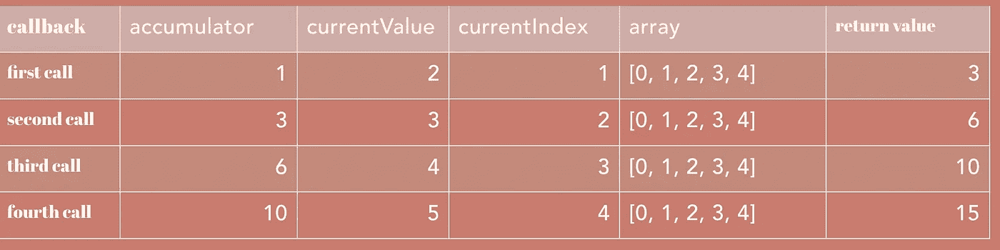
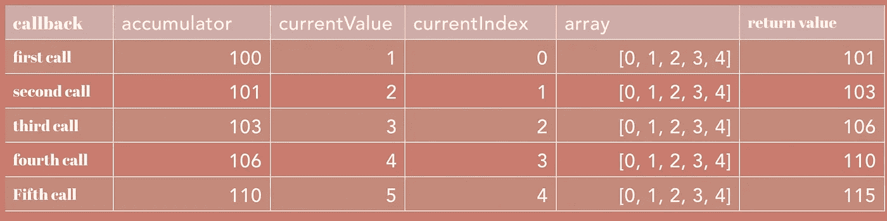

# JavaScript 数组的完整参考

> 原文：<https://levelup.gitconnected.com/the-complete-reference-of-array-in-javascript-90b7e479989e>

## 学习 Javascript 中数组可用的所有方法。


## 创建数组的不同方式

```
var array = [];var array = Array();var array = Array(3); // array of length 3var array = new Array()var array = new Array(3)  // array of length 3
```

# `**1\. Array.from()**`

`Array.from`方法从`array-like`或`iterable`对象创建一个新的浅层副本。

> **浅拷贝**是按位拷贝**一个对象的**。创建了一个新对象，它具有原始对象中值的精确副本**。如果对象的任何字段是对其他对象的引用，则仅引用地址被**复制**，即仅存储地址被**复制。****

语法:`**Array.from(sourceArray [, mapFn [, thisArg] ])**`

**例 1** :字符串数组

```
var str = "123"; //String is iterableArray.from(str); //['1','2','3']
```

**例 2** :复制一个数组

```
var array = [1,2,3,4,5];var newArray = Array.from(array); //[1,2,3,4,5]
```

**例 3:** 用引用复制数组。

```
var array = [{name : 'john'}];var newArray = Array.from(array); **newArray[0].name; //john** array[0].name = "Sam"; **newArray[0].name ; //Sam** The value is change to Sam in the copied array because it is shallow copied.
```

对于数组中的数组，情况也是如此:

```
var array = [[1,2]]var newArray = Array.from(array);array[0][0] = 5;newArray ; [[5,2]]
```

**示例 4:** 从具有重复值的数组中创建一个新的唯一值数组。

```
**var array = [1,2,3,4,5,5,4,3,2,1];****var set = new Set(array); // removes duplicate elements****var uniqueArray = Array.from(set) // [1,2,3,4,5]**
```

**例 5:** 使用`map`功能。

```
var array = [1,2,3,4,5]var doubledArray = Array.from(array, (value, index) => value+value);doubledArray; [2,4,6,8,10];
```

在例 5 中，如果对象具有属性`**length**` **，我们也可以从对象创建一个数组。**如果一个对象有一个长度为`Array.from`的属性，方法认为它是一个可迭代的对象，并创建一个`length`的数组，并将值设置为未定义。

```
var obj = {length : 3}var array = Array.from(obj);console.log(array); // [undefined, undefined, undefined]
```

我们可以在上面的代码中使用`map`函数来创建一个函数，它将生成一个包含数字的数组。

```
function fillArray(length) {

    var obj = {length}; return **Array.from(obj, (val, index) => index);**}fillArray(10); [0,1,2,3,4,5,6,7,8,9]
```

您可以将`this`参数作为第三个参数传递，并在`map`函数中使用它。

如果我们通过`undefined`或`null`，那么它会抛出一个`cannot convert undefined or null to object`错误。

如果传递了一个不可迭代的对象，那么它返回一个`empty-array`。

# `**2\. Array.isArray()**`

此方法检查传递的参数是否是数组。

语法:`**Array.isArray(value)**`

如果是数组则返回`true`，否则返回`false`。

返回`true`的示例值:

```
**Array.isArray([]); //true****Array.isArray([1]); //true****Array.isArray(new Array());//true**// Array.prototype is an array of functions**Array.isArray(Array.prototype);** 
```

返回`**false**` **的值:**

```
// the result of all statement below evaluates to false**Array.isArray();** **Array.isArray({});** **Array.isArray(null);** **Array.isArray(undefined);****Array.isArray(100);****Array.isArray('Array');****Array.isArray(true);****Array.isArray(false);****Array.isArray(new Uint8Array(32));****Array.isArray({ __proto__: Array.prototype });**
```

# 3.的数组()

`Array.of`方法从传递的参数中创建一个新数组。

```
**Array.of(1) .** // [1]**Array.of(1,"str",[1,2],{n:10})** // [1, "string", Array(3), {…}]
```

# 4.Array.concat

这个方法合并传递的`**array or value**`并创建一个新的数组。返回的数组是传递的参数的浅表副本。

```
**array1.concat[array2, arr3, arr4, .... arrN]**
```

**示例 1:连接两个数组**

```
var array = [1,2,3]var newArr = **array.concat([7,8,9],[4,5,6]);** //[1,2,3,7,8,9,4,5,6]
```

**例 2:我们也可以传递原始值或对象作为参数**

```
var array = [1]var newArr = **array.concat("str",100,{obj:100})**//[1,"str", {...}].
```

**例 3:**`**array of arrays**`的串联

```
var arr = [1,2];var arr2 = [[1,2], [3,4]]var newArr = arr.concat(arr2) // [1,2,[1,2],[3,4]]The new Array is the shallow copy of the arguments so if we change the source it affects the copied object.arr2[0][1] = 9; //[1,2,**[1,9]**,[3,4]]
```

# 5.数组.密钥

`**keys()**`方法返回一个包含数组索引的新的`**Array Iterator**`对象。

```
var arr= [1,2,3];var keys= **arr.keys()**; // it returns an Array iterator 

console.log(**...keys**)
```

`Object.keys()`和`Array.keys()`的区别在于`Array.keys()`也以孔为指标；

```
var arr = [1,,3];Object.keys(arr); // [0,2]console.log(**...arr.keys(**)) // 0,1,2 // undefined is not a holevar arr = [1, undefined, 2]**Object.keys(arr)**; // [0,1,2]console.log(**...arr.keys(**)) // 0,1,2
```

# 6.Array.values()

`**Array.values()**`方法返回一个包含数组值的`**Array iterator**`对象。通过使用迭代器，我们可以遍历数组的所有值。

```
var array = ['🚒', '🚐', '🚚', '🚲'];var arrayIterator = array.values(); // Array iteratorconsole.log(**...arrayIterator**) // 🚒,🚐,🚚,🚲// or we can iterate through iterator using for ... offor (**let vehicle of** **arrayIterator**) { console.log(vehicle);}output : 🚒,🚐,🚚,🚲
```

# 7.数组.条目()

`entries`方法返回包含数组的`**index-value**`对的`Array Iterator`。

`key`是数组的`index`，而`value`是该索引处的值。

```
var array = ['a', 'b', 'c'];var iterator = **array.entries();**console.log(...iterator)// [0, "a"]  [1, "b"] [2, "c"]or we can use for..offor (let entry of iterator) {
  console.log(entry);
}//  output
[0, "a"]
[1, "b"] 
[2, "c"]or We can  use destructingfor (**const [index, element] of iterator** )
  console.log(index, element);// output0 "a"
1 "b"
2 "c"
```

# 8.Array.push()

push 方法将元素添加到数组的末尾。它改变了原来的数组。

`push`方法在项目被推送后返回数组的新长度。

语法:`array.push(n1, n2,...n)`

```
var array = ['😀', '😃', '😎', '🤪', '🤩']var newLen = **array.push('😳');** //6// [😀,😃,😎,🤪,🤩, 😳]newLen = **array.push("hi","javascript jeep 🚙", 100)**; //9// [😀, 😃, 😎, 🤪, 🤩, 😳,"hi", "javascript jeep 🚙", 100].
```

# 9.Array.unshift()

`**unshift()**`方法与`push`方法相同，但唯一的区别是它将元素添加到数组的开头。它改变了原来的数组。

`unshift`方法在添加项目后返回数组的新长度。

```
var array = ['😀', '😃', '😎', '🤪', '🤩']var newLen = array.**unshift**('😳'); //6// [😳, 😀,😃,😎,🤪,🤩]newLen = array.**unshift**("hi","javascript jeep 🚙", 100); //9// ["hi", "javascript jeep 🚙", 😳, 😀,😃,😎,🤪,🤩]
```

# 10.Array.pop()

方法从数组中移除最后一个元素。它改变了原来的数组。

`pop`方法返回移除/弹出的元素。

```
var array = ['🚒', '🚐', '🚚', '🚲'];array.pop(); // 🚲
```

# 11.Array.shift()

方法从数组中移除第一个元素**。它改变了原来的数组。**

`unshift`返回移除的元素。

```
var array = ['🚒', '🚐', '🚚', '🚲'];array.shift(); // 🚒
```

# 12.Array.toString()

`**toString()**`方法将数组转换成字符串并返回字符串。

```
var array = [1, 2, '3', 'hi'];array.toString(); //1,2,3,hi"
```

如果其中有任何对象，则转换为`[object Object]`

```
var array = [1, "string", {}, {name: "Javascript Jeep🚙"}]array.toString()**// "1,string,[object Object],[object Object]"**
```

如果数组中有数组，则该数组被展平。

```
var array = [1, "string", [1,2,3]]array.toString(); // **1,string,1,2,3**var array = [1, "string", [1,2,3,[1,2]]]array.toString() // **1,string,1,2,3,1,2**
```

# 13.Array.join()

此方法通过连接数组的所有元素来创建字符串。

语法:`join(separator)`这里的`separator`是一个可选的字符串参数。

字符串被连接，每个元素被提供的`separator`分开。如果分隔符没有通过，那么默认情况下，它与 `,`连接。

此方法返回连接的字符串。

```
var array = ["Javascript", " Jeep", " 🚙"];array.join(); // "Javascript, Jeep, 🚙"array.join("***"); // "Javascript*** Jeep*** 🚙"
```

如果数组只有一个元素，那么该元素将作为不带分隔符的字符串返回。

```
var array = [" 🚙"];array.join("-"); // "🚙"
```

如果数组长度为空，则返回空字符串。

```
[].join(); //**""**
```

# 14。Array.indexOf()

此方法接受一个输入值，并返回该值在数组中的第一个索引。

如果没有找到元素，那么它返回`-1`。

我们还可以指定我们需要开始搜索的索引。

这种方法`**search the element by using strict equality (===)**`检查。

语法:`indexOf(elementToSearch, fromIndex)`

`fromIndex`指定从哪个索引开始搜索。

```
var array = ['🚒', '🚐', '🚚', '🚲'];
```

该索引可以表示为

```
The array index is 🚒 → 0 , 🚐 → 1, 🚚 → 2, 🚲 → 3
```

我们也可以基于负值给出`fromIndex`元素

```
The array negative index is 🚒 → -4, 🚐 → -3, 🚚 → -2, 🚲 → -1
```

如果`fromIndex`是`**positive and greater than the array length then it returns -1**` 而没有搜索。

如果`fromIndex`为负，我们需要计算`computed index`，可以通过`**(arrayLength + negativeIndex)**`计算

如果计算出的索引小于或等于`-1 * array.length`，则将搜索整个数组。

考虑一个长度为 4 的数组

情况 1:如果用户提供`fromIndex`为-2，那么搜索从`**4-2=2.**`开始

情况二:如果用户提供`fromIndex`为-10，那么搜索开始`**4–10=-6**` **。**在这种情况下，搜索整个数组。

示例:

```
var array = ['🚒', '🚐', '🚚', '🚲'];array.indexOf('🚲'); // 3-------------------------------------------------------------------// search an element from index 3array.indexOf('🚲', 3); //3; **because the 🚲 present in index 3**-------------------------------------------------------------------//search an element from negative index -1  towards right.array.indexOf('🚲', -1);//3 **because -1 th index is where 🚲present** -------------------------------------------------------------------array.indexOf('🚲', -2); // 3-------------------------------------------------------------------**array.indexOf('🚒', -1) ;**// this method search for 🚒 form index -1(1 in positive index)  towards right , but the 🚒 present in 0 index so it returns -1------------------------------------------------------------------**array.indexOf('🚒', 10) ;**fromIndex is positive and greater than the array length then it returns -1 without searching.------------------------------------------------------------------
```

`indexOf`方法只测试值，对参考不起作用。

```
**var a = [[1,2,3],3,4,5];****a.indexOf([1,2,3]); // -1****var a= [{},1,2,3];****a.indexOf({}); // -1**
```

# 15.Array.lastIndexOf()

这个方法类似于`indexOf`方法，但是这个方法不是返回传递的元素的第一个索引，而是返回数组中元素的`**last index**`。

这个方法接受一个输入值，并返回`**last index of**`数组中传递的值。

如果没有找到该元素，则返回`-1`。

我们还可以指定我们需要开始搜索的索引。

这种方法`**search the element by using strict equality (===)**`检查。

语法:`lastIndexOf(elementToSearch, fromIndex)`。

这里的`fromIndex`指定了向后搜索的索引。当索引为负时，仍然从后向前搜索数组。

如果我们传递-1，那么它将从数组的最后一个元素开始向第一个元素搜索。

```
var array= [1, 2, 3, 4];array.lastIndexOf(2);     // 1array.lastIndexOf(7);     // -1array.lastIndexOf(4, 3);  // 3array.lastIndexOf(2, 2);  // 1array.lastIndexOf(2, -2); // 1array.lastIndexOf(2, -1); // 1array.lastIndexOf(2,-5); //-1
```

# 16.Array.findIndex()

该方法返回满足传递的测试函数的第一个元素。

如果没有元素满足条件，那么它返回`-1`。

语法:

```
array.findIndex( 
  **testingfunction,
  thisArg(optional)**
);// syntax of texting function**testingfunc(
  value, 
  index(optional),
  array(optional) 
)**
```

示例:查找数组是否包含偶数。

```
var array = [1,3,5,7,10];function containsEven(value)  {return value % 2 === 0;}array.findIndex(containsEven); // 4// we can simplify the above function asarray.findIndex(val => val%2===0 )
```

# 17.Array.includes()

此方法测试数组中是否存在某个元素。如果它在数组中，那么它返回`true`，否则返回`false`。

该方法遵循`Array.indexOf`方法的相同概念。

语法:`includes(elementToSearch, fromIndex)`

```
[1, 2, 3].includes(2);     // true[1, 2, 3].includes(4);     // false[1, 2, 3].includes(3, 2);  // true[1, 2, 3].includes(3, -1); // true[1, 2, 3].includes(3, 3); // false[1, 2, undefined].includes(undefined); // true[1, 2, NaN].includes(NaN); // true
```

# 18.数组. reverse()

这个方法反转数组。这个函数变异/反转原始数组。

此方法返回反转的数组。

```
const array = [1, 2, 3];

console.log(array); // [1, 2, 3]

**array.reverse();** 

console.log(array); // **[3, 2, 1]**
```

# 19.Array.flat()

此方法展平多维数组并返回展平后的数组。

我们可以指定`depth`值，它表示展平应该发生的深度。默认的`depth`值是 1。☝

此方法返回一个新数组，子数组元素串联在其中。

示例 1:

```
var array = [1,2,3,4,[1,2]]var newArray = array.flat(); //[1,2,3,4,1,2]
```

示例 2:

```
var array = [1, 2, 3, 4, **[1, 2, [5, 6]]** ] // here the depth is 1 , so the [5,6] is not flattened var newArray = array.flat(); //**[1,2,3,4,1,2, [5,6] ]**// when we set depth to 2 , it also flatten the [5,6] elementnewArray = array.flat(2); // **[1,2,3,4,1,2,5,6]**
```

示例 3:

当我们平铺一个有孔的数组时，这些孔就被去掉了。

```
var arr = [1,,2,3]var newArray = arr.flat(); //[1,2,3]
```

# 20.Array.flatMap()

这个方法和`flat()`类似，但是不同的是在展平数组之前，数组的每个元素都用映射函数映射，然后再展平。

另一个区别是`flatMap`与`flat`相比只平坦到深度 1。我们不能指定应该发生多深的变平。

语法:

```
var new_array = arr.flatMap(
  mapFunc,
  this(optional)
);// Syntax for the map function
mapFunction(
  **val,  
  index (optional), 
  array (optional)**
)
```

示例:将数组中的所有数字转换为偶数，然后展平数组

```
var array = [1,2,3,4,5,10];function mapFunc(val) { // logic: if val = 3 => 3%2=1 then 3+1-> returns 4 return (val % 2) ? val +1 : val; }var newArray = array.flatMap(mapFunc);
```

在`flatMap`中，只有第一层被夷平。

# 21.Array.some()

`**array.some**` 方法检查数组`return true`中的任意一个元素是否为测试函数所提供。

如果有任何元素通过测试，则`some`返回`true`，否则返回`false`。

```
array.some(**testFunction** , **thisArg(optional)**);
```

示例:

```
function isOdd(value, index, array) {
  return value %2;
}

[2, 6, 8, 0, 4].some(isOdd);  // false[12, 5, 8, 1, 4].some(isOdd); // true
```

如果对空数组执行`**array.some**`方法，它将返回`false`。

```
[].some(isOdd); //false
```

如果我们没有通过`testingFunction`，那么它会抛出一个错误。

# 22.Array.every()

`**array.every**` 方法检查数组`**returns true**` 中的所有元素是否为测试函数所提供。

如果所有元素都通过测试，它返回`true`,否则如果任何一个元素失败，它返回`false`。

```
array.every(**testFunction** , **thisArg(optional)**);
```

示例:

```
function isOdd(value, index, array) {return value %2;}[1, 7, 8, 1, 5].every(isOdd);  // false[11, 5, 9, 1, 7].every(isOdd); // true
```

如果对空数组执行`**array.every**` 方法，则返回 false

```
[].every(isOdd); //true
```

如果我们没有通过测试函数，那么它将抛出一个错误。

# 23.数组.排序()

方法对数组的元素进行排序，并返回排序后的数组。

我们可以通过`compareFunction`来实现数组的自定义排序。

语法:`sort(compareFunction)`

这里作为参数传递的`compareFunction`是可选的。

例:没有通过一个`**compareFunction**` **。**数组的默认排序基于字符串表示。如果这没有意义，请阅读示例中的描述。

```
Example of default sorting.var arr = [1, 2, 3, 200, 100];**arr.sort()**arr ; // [1, 100, 2, 200, 3]The reason for the above result is, by default, sorting is based on strings. It first it converts the value to the string, then values are compared by their sequences of **UTF-16** code units values.
```

例如:通过一个`compareFunction`

比较函数应该返回(0，> 0，< 0)。

如果比较函数返回:

*   0 或小于 0 →保持`a`和`b`不变
*   大于 0 →交换位置

```
function ascendingOrder(num1, num2) {
  if(num1 === num2) return 0;
  if(num1 < num2)  return -1;
  if(num1 > num2)  return 1;
}var arr = [1, 2, 3, 200, 100];**arr.sort(ascendingOrder)** // the above function can be simplified by/* logic : 
     if a > b → (a-b) returns >0, then there is a swap if a === b → (a-b) returns 0 , so no swap     if a < b; (a- b) returns <0 , no swap */**arr.sort((a, b) => a-b );**To sort an array in descending order do it in reversearr.sort( **(b, a)** => a - b)
```

# 24.Array.fill()

此方法用给定范围的给定值替换(变异)数组的值。

语法:`**array.fill(value, startIndex(optional), endIndex(optional))**`

它返回修改后的数组，同时改变源数组。

如果`startIndex`(默认值:`0`)和`endIndex`(默认值:`array.length`)没有通过，则替换整个数组。

```
**var array = [1,2,3,4,5]****array.fill(3, 2, 4) // [1, 2, 3, 3, 5]****array.fill(8,1,2) // [1, 8, 3, 3, 5]**if the start and end index is same then there is no fill takes place**array.fill(9,1,1) // [1, 8, 3, 3, 5]**we can also pass negative index for start and end index argument**array.fill(9,-3,-2) // [1, 8, 9, 3, 5]** if we pass start index < end index then no fill **array.fill(19,4,3) // [1, 8, 9, 3, 5]**
```

使用默认值创建元素数组:

```
**var array = new Array(5).fill(0); // [0,0,0,0,0]**
```

如果我们试图用 objects 对象填充元素，那么引用就会被复制。

```
var array = [1,2,3];var obj = {name : "Javascript heap"};**array.fill(obj);**obj.name = "Javascript Jeep 🥶";array //
**[ {name: “Javascript Jeep 🥶”} 
  {name: “Javascript Jeep 🥶”} 
  {name: “Javascript Jeep 🥶”} ]**array[0].name = "JAVASCRIPT JEEP **🥶**";array //
**[ {name: “JAVASCRIPT JEEP 🥶”} 
  {name: “JAVASCRIPT JEEP 🥶”} 
  {name: “JAVASCRIPT JEEP 🥶”} ];**
```

# 25.Array.reduce()

reduce 函数对数组的每个元素执行 reducer 函数，产生一个单值输出。

该方法返回 reducer 函数返回的值(累加器值)。

```
**syntax:** Array.reduce(reducerFunction, initialAccumulatorValue(opt));**reducerFunction syntax:**reducerFunction(accumulator, value, index(opt), srcArray(opt)) ;
```

累加器是 reducer 函数返回的最终输出。

数组元素总和示例:

```
var array = [1,2,3,4,5]function reducerFunction(accumulator, value) { return accumulator + value;}var sum = array.reduce(reducerFunction) ; //15// the above function can be simplified asarray.reduce( **(acc, val) => acc+val** )
```

如果没有提供`initialAccumulatorValue`，减速器功能从`first index`开始执行。



在上面的例子中，数组的每个元素都被传递给 reducer 函数。在该函数中，每个值都被添加到`accumulator`(最终结果)。

例子有`**initialAccumulatorValue**` **:**

```
var array = [1,2,3,4,5]function reducerFunction(accumulator, value) { return accumulator + value;}var sum = array.reduce(reducerFunction, 100)sum ;// 115// the above function can be simplified as **array.reduce( (acc, val) => acc+val ), 100)** 
```

如果提供了初始值，则减速器功能从`0th`索引开始执行。



# 26.Array.reduceRight()

该方法与`reduce`方法相同，除了 reducer 函数是从右向左对数组元素执行的。

示例:

```
var array = [ " hi ", " from", " Javascript Jeep 🚙 "]array.**reduce**( (acc, val) => acc + val );
output : **hi  from Javascript Jeep 🚙**array.**reduceRight**( (acc, val) => acc * val );
output : **Javascript Jeep 🚙  from hi.**
```

# 27 .Array.filter()

该方法根据提供的函数过滤数组元素。

filter 方法对数组的所有元素执行`testingFunction`,并返回一个新数组，该数组包含测试函数中的`return true`元素。如果测试函数为一个元素返回`false`，它不会出现在新数组中。这个方法不会改变/改变源数组。

语法:

```
syntax : filter
----------------**Array.filter(testingFunction, thisArg(optional))**syntax :testingFunction 
----------------------testingFunction(**value, index(optional), array(optional)**)
```

示例:

```
function **filterEvenNumbers**(value) { return **value % 2 === 0**;}var array = [2, 15, 8, 10, 44];var evenNumbers = array.filter(**filterEvenNumbers**);evenNumbers // [2,8,10,44] // it can be simplified aseven = array.filter( **(val) => val %2 ===0** )
```

# 28.Array.map()

`map`函数针对数组的所有元素执行一个函数，生成一个新的数组并返回该数组。

语法:

```
syntax : map
--------------var new_array = array.map(**mappingFunction ,thisArg(optional)**) // syntax : mappingFunction
----------------------------mappingFunction(**val, index(optional), srcArray(optional)**) ;
```

示例:

```
function square(val) {

   return val * val;}var array = [1,2,3,4,5];var squaredNumbers = array.map(square); //1,4,9,16,25//using arrow functionarray.map(v => v * v);
```

示例 2:映射一个对象数组并以数组的形式获取对象的值。

```
var array = [{name : "brandi love"}, {name : "julia ann"} ];var upperCaseNames = array.map( **(obj) => obj.name.toUpperCase()** );//["BRANDI LOVE", "JULIA ANN"]
```

# 29.Array.forEach()

`forEach`方法针对数组的每个元素执行一次作为参数提供的方法。

语法:`forEach(callback, thisArg(optional))`

它是传统`for`回路的替代品。

```
const numbers = [1,2,3,4,5];const copy = []; // old way
----------**for (let i=0; i<numbers.length; i++) {** **copy.push(items[i]);****}** 
// cool way
------------**items.forEach(function(item){** **copy.push(item);****});**
```

示例 2:

```
var names = ["ironman", "superman", "batman"]names.forEach( (ele) => { console.log( **ele.toUpperCase()** )});// IRONMAN
//SUPERMAN
//BATMAN
```

# 三十岁。Array.slice()

`slice`方法用源数组的一部分返回一个新数组——它返回子数组。

语法:`arr.slice(beginIndex(optional), endIndex(optional))`

`beginIndex is 0`的默认值。

如果`beginIndex`大于数组长度，则返回空数组`[]`。

我们也可以对`beginIndex`和`endIndex`使用负索引。

如果`endIndex`没有被传递或者`endIndex`大于数组长度，那么从`beginIndex`开始切片到数组末尾的所有元素。

它返回数组的浅表副本，原始数组不被修改。

```
var numbers = [1,2,3,4,5,6];var greaterThan3= numbers.slice(3); [4,5,6]greaterThan3= numbers.slice(3,5); [4,5]greaterThan3= numbers.slice(3,6); [4, 5, 6]
```

如果`endIndex`小于`startIndex`，则返回一个空数组。

如果源数组包含一个对象，那么引用被复制。

```
var array = [ {name: "john"}, {name : "stephen"} ];var newArray = array.slice();
//if we don't provide start&end index then whole array is copiedarray[0].name = "JOHN";// newArray has an reference of array[0] so the value at newArray is also changednewArray[0].name ; //JOHN
```

# **31。Array.splice()**

`**splice()**`方法`**alters or removes or replaces or add elements**`到**源数组。这是对原始数组的一种变异操作。**

语法:

```
var DeletedItemsArray =            array.splice(start, deleteCount, item1, item2,...itemN);**startIndex** index from which the delete or add should take place.**deleteCount** number of elements to be deleted If deleteCount is omitted, or if its value is equal-to or larger than **array.length - start, ** then all the elements from start to the end of the array will be deleted. item1,...--> . elements to be added from the startIndex provided here **deleteCount, items** value are optional.
```

此方法返回包含已删除项目的数组。

示例:

```
var array = [1,2,3,4,5]var deletedItems = array.splice(0,0)**//doesn't delete any element because delCount-->0**-------------------------------------------------------------------var array = [1,2,3,4,5]var deletedItems = array.splice(0,1); //[1] **deletes 1 element from 0th index**-------------------------------------------------------------------var array = [1,2,3,4,5]var deletedItems = array.splice(0, 1, 2, 4); //[1]**deletes 1 element from 0th index and insert 2, 4**array; //[2, 4, 2, 3, 4, 5]-------------------------------------------------------------------
var array = [1,2,3,4,5]var deletedItems = array.splice(2); //[3,4,5]**deletes from index:3 to last element 
         because default delCount : arrayLength**array; //[1,2]-------------------------------------------------------------------
var array = [1,2,3,4,5]var deletedItems = array.splice(-3, 1, 2, 4); //[3]**deletes 1 element from -3rd index and insert 2, 4**array; // [1, 2, 2, 4, 4, 5]
-------------------------------------------------------------------var deletedItemsArray = array.splice(); //[]deletedItemsArray = array.splice(undefined); // [1,2,3,4,5]
```

跟随 [Javascript 吉普🚙](https://medium.com/u/f9ffc26e7e69?source=post_page-----90b7e479989e--------------------------------) 🥶.