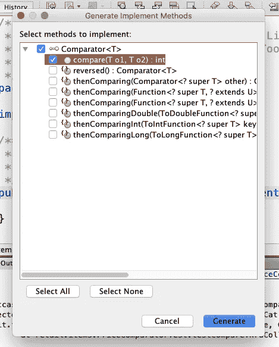

# Java 比较器的复杂性和 Scala 排序的简单性

> 原文：<https://levelup.gitconnected.com/the-complexity-of-java-comparators-and-the-simplicity-of-scala-sort-by-f34f44d4b759>


本·汉森在 [Unsplash](https://unsplash.com?utm_source=medium&utm_medium=referral) 上的照片

根据可用的标准对一组对象进行排序是如此常见的操作，以至于我们认为这是理所当然的。

例如，当您在网上购物时，您可能会运行一个查询来显示几页的产品。

你希望网站能给你一些不同的排序方式，比如按价格、按平均星级、按销售排名等等。在后面，员工可以访问更多的排序选项，比如按库存单位(SKU)、最后订购日期等。

对于 Java 和 Scala 来说，这可能不像是一个现实的例子，因为这种前端排序通常是由 JavaScript 处理的。

但是我确实认为理解这个例子的容易性超过了它明显的不现实性，所以我会继续下去。

为了用 Java 实现它，我们可能会创建一个名为`Item`或`Product`之类的抽象类。我们不太关心派生类，只要超类拥有我们可能想要用作排序标准的所有字段。

在我的系统上，我的确把`Item`抽象化了，把“具体”的子类做成`PetSuppliesItem`、`ElectronicsItem`和`MiscellaneousItem`。你可以选择不做所有的事情，仍然很容易地跟着做。

我们需要一个字段来保存项目的价格。实际上，在真实的用例中，我们可能需要几个价格字段:批发价、学生折扣价、老年人折扣价、特价等。

让我们暂时忘记这些，假装每件商品只有一个价格让我们担心。让我们假设每个 SKU 只对应一个 UPC(现实生活中经常是这样，但不总是这样)。

用浮点数表示一笔钱通常不是一个好主意。但至少我们可以很容易地比较浮点数。

除了一些深奥的注意事项(比如[关于 NaN](https://medium.com/engineering-housing/nan-is-not-equal-to-nan-771321379694) 的注意事项)，我们通常可以发现一个浮点数是小于、等于还是大于另一个浮点数。

我们可以使用整数类型将金额表示为美分(例如，$1 等于 100)。比用浮点数好，但不如用专门为钱设计的类。

整数原语不能比浮点原语携带更多关于货币的信息。一个数字原语可能代表，比如说，12.25，但是 12.25 是什么？美元？欧元？瑞士法郎？一些其他的货币？

由于标准 Java 开发工具包(JDK)不包含货币类，我们应该自己创建或者使用第三方库中的货币类。如果你自己做，确保它实现了`Comparable<T>`接口。第三方库应该已经解决了这个问题。

这样，如果我们在一个标准的 Java 集合中有一堆 money amount 对象，我们可以使用`Collections.sort()`以升序对它们进行排序(例如，$5.29，$10.28，$255.73，$499.89，等等。)或降序排列。

你可以使用我的`CurrencyAmount`类([从 GitHub](https://github.com/Alonso-del-Arte/toy-examples/blob/master/src/currency/CurrencyAmount.java) 下载并带入项目)。它没有 Joda Money 的所有特性，但是它有我们在这个练习中需要的所有特性。

如果我们将`CurrencyAmount`写成一个实现了`Ordered[CurrencyAmount]`特征的 Scala 类，我们将能够写出这样的东西

```
 if (shoppingCartSubTotal >= MINIMUM_FOR_FREE_SHIPPING) {
      chargeShippingTo(store)
    }
```

但是由于`CurrencyAmount`是一个实现`Comparable<CurrencyAmount>`接口的 Java 类，我们不得不使用`compareTo()`函数，将免费送货的例子变成类似于

```
 if (shoppingCartSubTotal.compareTo(MINIMUM_FOR_FREE_SHIPPING)
                            >= 0) {
        chargeShippingTo(store);
    }
```

`compareTo()`函数是`Comparable<T>`接口要求我们实现的唯一东西。

其工作方式是，如果`a`小于`b`，则`a.compareTo(b)`返回一个负整数(最好是 1)，如果`a`等于`b`，则返回 0，如果`a`大于`b`，则返回一个正整数(最好是 1)。

如果对你来说这似乎比它需要的更复杂，你会更不喜欢我们在 Java 中按字段进行比较的做法。

对于这个例子来说，平均星级和销售排名可能只是数字原语。但是在现实生活的用例中，为这两个字段拥有对象可能是有益的。然后你还需要让他们实现`Comparable<T>`。

我们的`Item`类可能还包括一个向最终用户显示产品图像的字段。但是这对于我们这里的排序无关紧要。也没有用于在收据上打印可选注释的字段。

我们的`Item`类是否像 money amount 对象一样*而不是*具有“自然排序”。例如，一袋狗粮可能比一个狗粮碗重，但是狗粮碗可能更贵。

所以很明显我们不应该让`Item`实施`Comparable<Item>`。这充其量是一种误导。

但是如果我们有办法使用`Collections.sort()`根据一个字段，比如价格或星级，对一组`Item`对象进行升序或降序排序，那就更好了。

有一种方法，但是有点复杂。不过，在此之前，我们需要一些虚构的物品来玩玩。这些项目可能会以某种方式一起出现在搜索结果中。也可能不是。

*   大型犬的食物碗，18.99 美元，★★★☆(准确的说是 4.2)基于 403 次确认购买。宠物用品排名第 20，整体排名第 528。SKU: 67890，刚果爱国者联盟:0 12345 67890 5
*   通用品牌电池，4 节 AA，3.49 美元，★★★☆☆基于 20 次确认购买。电子学排名第 348，综合排名第 1043。SKU: AA447，刚果爱国者联盟:0 99999 01234 7
*   猫粮，5 磅。包，4.98 美元，★★★☆基于 22 次确认购买。宠物用品排名第 22，整体排名第 548。SKU: 67895，刚果爱国者联盟:0 12345 67895 0
*   狗粮，5 磅。包，6.98 美元，★★★★基于 13 次确认购买。宠物用品排名第 19，整体排名第 503。SKU: 67889，刚果爱国者联盟:0 12345 67889 9
*   免费样品，购买任何其他项目免费。总体排名第一。SKU: 99999，刚果爱国者联盟:0 12345 99999 4
*   宠物食品碗，$10.99，★★★☆☆ (3.1)基于 943 次确认购买。宠物用品排名第 43，整体排名第 880。SKU: 67878，刚果爱国者联盟:0 12345 67878 3
*   名牌电池，4 节 AA，5.49 美元，★★★☆☆ (3.2)基于 1，210 次确认购买。电子学排名第 199，综合排名第 789。SKU: AA403，刚果爱国者联盟:0 55555 00020 3

正如你所看到的，这些项目是乱序的几乎任何标准，我们可能振振有词地使用。所以让我们把这些放到`Item`对象中，看看如何对它们进行排序。

我的做法是让 NetBeans 在测试包中创建一个`ItemTest`类。我将虚构的项目声明为 package private，并在`ItemTest.setUpClass()`中初始化它们(这样做的原因将在后面说明)。

接下来，在源码包中，我将声明一个实现`Comparator<Item>`接口的`PriceComparator`类。尽管标识符相似，但这与`Comparable<Item>`有很大不同。

```
package retail.items;import java.util.Comparator;public class **PriceComparator implements Comparator<Item>** {}
```

你的 IDE 应该在类声明下面画一条红色曲线，因为这不会覆盖任何需要覆盖的东西。我告诉 NetBeans 去处理它。这个对话框出现了:



NetBeans 生成实现方法对话框

Eclipse 和 IntelliJ 应该有类似的东西。第一次看到这个的时候很迷茫。只选择了`compare()`，没有选择`reversed()`和`thenComparing()`功能。为什么不呢？

我忘记了，从 Java 8 开始，接口可以包含“具体方法”这使得 Java 接口更像 Scala 特征，模糊了接口和抽象类之间的界限。

因此，让我们继续，单击“Generate”按钮，不要选中或取消选中任何内容。NetBeans 生成一个抛出`UnsupportedOperationException`的`compare()`覆盖。用`return 0`替换抛绳。

```
 @Override
    public int compare(Item itemA, Item itemB) {
        **return 0;**
    }
```

我不喜欢标识符`o1`和`o2`，所以我用`itemA`和`itemB`替换了它们，IntelliJ 会警告我们它们没有被使用(很快就会被使用)。

这应该无法通过我们在`PriceComparatorTest`(测试包中)的第一次测试。确保将`ArrayList<E>`和`Collections`导入到测试类中。

```
package retail.items;**import java.util.ArrayList;
import java.util.Collections;**import org.junit.Test;
import static org.junit.Assert.*;public class PriceComparatorTest {

    **private static final PriceComparator COMPARATOR = new
                                                  PriceComparator();**

    public PriceComparatorTest() {
        **ItemTest.setUpClass();**
    }

    /**
     * Test of compare method, of class PriceComparator.
     */
    @Test
    public void testCompareThruCollectionSort() {
        **ArrayList<Item> unsorted = new ArrayList<>();**
        unsorted.add(ItemTest.LARGE_DOGS_FOOD_BOWL); // $18.99
        unsorted.add(ItemTest.GENERIC_AA_BATTERIES_4PK); // $3.49
        unsorted.add(ItemTest.CAT_FOOD); // $4.98
        unsorted.add(ItemTest.DOG_FOOD); // $6.98
        unsorted.add(ItemTest.FREE_SAMPLE); // $0.00
        unsorted.add(ItemTest.PET_FOOD_BOWL); // $10.99
        unsorted.add(ItemTest.NAME_BRAND_BATTERIES_AA_4PK); // $5.49
        **ArrayList<Item> expected = new ArrayList<>();**
        expected.add(ItemTest.FREE_SAMPLE);                 // $0.00
        expected.add(ItemTest.GENERIC_AA_BATTERIES_4PK);    // $3.49
        expected.add(ItemTest.CAT_FOOD);                    // $4.98
        expected.add(ItemTest.NAME_BRAND_BATTERIES_AA_4PK); // $5.49
        expected.add(ItemTest.DOG_FOOD);                    // $6.98
        expected.add(ItemTest.PET_FOOD_BOWL);              // $10.99
        expected.add(ItemTest.LARGE_DOGS_FOOD_BOWL);       // $18.99
        **ArrayList<Item> actual = new ArrayList<>(unsorted);
        Collections.sort(actual, COMPARATOR);
        assertEquals(expected, actual);**
    }

}
```

测试的第一次运行应该会失败，让我们放心，一旦我们让价格比较器正常工作，测试就会通过。

```
Testcase: testCompareThruCollectionSort(retail.items.PriceComparatorTest): FAILED
**expected:**<[Free sample, Generic brand batteries 4-pack AA, Cat food 5-lb. bag, Name brand batteries 4-pack AA, Dog food 5-lb. bag, Pet food bowl, Food bowl for large dogs]> **but was:**<[Food bowl for large dogs, Generic brand batteries 4-pack AA, Cat food 5-lb. bag, Dog food 5-lb. bag, Free sample, Pet food bowl, Name brand batteries 4-pack AA]>
... at retail.items.PriceComparatorTest.testCompareThruCollectionSort(PriceComparatorTest.java:55)
```

我们将`PriceComparator`中的`compare()`改写为:

```
 @Override
    public int compare(Item itemA, Item itemB) {
        return **itemA.getPrice().compareTo(itemB.getPrice())**;
    }
```

测试现在应该通过了。

但是，如果我们想按价格对商品进行排序，但是是降序的，该怎么办呢？我们不需要写一个新的比较器。还记得`reversed()`是我们可以覆盖的“方法”之一吗？也许在这里会有用。

```
 @Test
    public void testCompareDescendingOrder() {
        ArrayList<Item> unsorted = new ArrayList<>();
        unsorted.add( ...same as the previous one...
        ArrayList<Item> **expected** = new ArrayList<>();
        expected.add(ItemTest.LARGE_DOGS_FOOD_BOWL);       // $18.99
        expected.add(ItemTest.PET_FOOD_BOWL);              // $10.99
        expected.add(ItemTest.DOG_FOOD);                    // $6.98
        expected.add(ItemTest.NAME_BRAND_BATTERIES_AA_4PK); // $5.49
        expected.add(ItemTest.CAT_FOOD);                    // $4.98
        expected.add(ItemTest.GENERIC_AA_BATTERIES_4PK);    // $3.49
        expected.add(ItemTest.FREE_SAMPLE);                 // $0.00
        ArrayList<Item> actual = new ArrayList<>(unsorted);
        Collections.sort(actual, **COMPARATOR.reversed()**);
        assertEquals(expected, actual);
    }
```

但是，为了确保我们的测试工作正常，请在`compare()`中恢复`return 0`。两个测试都应该失败。

```
Testcase: testCompareDescendingOrder(retail.items.PriceComparatorTest): FAILED
**expected:**<[Food bowl for large dogs, Pet food bowl, Dog food 5-lb. bag, Name brand batteries 4-pack AA, Cat food 5-lb. bag, Generic brand batteries 4-pack AA, Free sample]> **but was:**<[Food bowl for large dogs, Generic brand batteries 4-pack AA, Cat food 5-lb. bag, Dog food 5-lb. bag, Free sample, Pet food bowl, Name brand batteries 4-pack AA]>
... at retail.items.PriceComparatorTest.testCompareDescendingOrder(PriceComparatorTest.java:83)
```

恢复正确的价格比较，两个测试都应该通过。

我们确实需要一个全新的比较器来比较平均星级。姑且称之为`StarRatingComparator`。我们也只重写`compare()`，用一个只返回 0 的存根，这样第一次测试就失败了。

我们对`StarRatingComparator`的测试非常相似。我们将再次使用`ItemTest`中的物品，而不是想出一套全新的虚拟物品，或者重复之前的虚拟物品。

```
package retail.items;import java.util.ArrayList;
import java.util.Collections;import org.junit.BeforeClass;
import org.junit.Test;
import static org.junit.Assert.*;public class StarRatingComparatorTest {

    **private static final StarRatingComparator COMPARATOR = new
                                             StarRatingComparator();**

    @BeforeClass
    public static void setUpClass() {
        ItemTest.setUpClass();
    }

    @Test
    public void testCompareThruCollectionSort() {
        **ArrayList<Item> unsorted = new ArrayList<>();**
        unsorted.add(ItemTest.LARGE_DOGS_FOOD_BOWL); // 4.2
        unsorted.add(ItemTest.GENERIC_AA_BATTERIES_4PK); // 3.0
        unsorted.add(ItemTest.CAT_FOOD); // 4.0
        unsorted.add(ItemTest.DOG_FOOD); // 5.0
        unsorted.add(ItemTest.PET_FOOD_BOWL); // 3.1
        unsorted.add(ItemTest.NAME_BRAND_BATTERIES_AA_4PK); // 3.2
        **ArrayList<Item> expected = new ArrayList<>();**
        expected.add(ItemTest.GENERIC_AA_BATTERIES_4PK);      // 3.0
        expected.add(ItemTest.PET_FOOD_BOWL);                 // 3.1
        expected.add(ItemTest.NAME_BRAND_BATTERIES_AA_4PK);   // 3.2
        expected.add(ItemTest.CAT_FOOD);                      // 4.0
        expected.add(ItemTest.LARGE_DOGS_FOOD_BOWL);          // 4.2
        expected.add(ItemTest.DOG_FOOD);                      // 5.0
        **ArrayList<Item> actual = new ArrayList<>(unsorted);
        Collections.sort(actual, COMPARATOR);
        assertEquals(expected, actual);**
    }

}
```

因为这里星级是作为数字原语实现的，所以我们可以在`StarRatingComparator`的`compare()`函数中使用大于和小于运算符。

```
 @Override
    public int compare(Item itemA, Item itemB) {
        if (itemA.getAverageStarRating() <
                                     itemB.getAverageStarRating()) {
            return -1;
        }
        if (itemA.getAverageStarRating() >
                                     itemB.getAverageStarRating()) {
            return 1;
        }
        return 0;
    }
```

这通过了测试。然而，使用适当的原始包装器中的静态`compare()`函数会更有效。

```
 @Override
    public int compare(Item itemA, Item itemB) {
        return Double.compare(itemA.getAverageStarRating(),
                              itemB.getAverageStarRating());
    }
```

如果您想先按一个标准排序，然后再按另一个标准排序，该怎么办？例如，假设您想按价格升序排序，然后按平均星级降序排序。

对于上面的示例项目，我想避免在我们用作排序标准的任何字段中有任何项目相等。如果两个项目在一个字段中相等，我们使用另一个字段的比较器对它们进行排序，那么这些项目可能会保持相同的顺序。

例如，假设三个项目具有相同的价格，但是原始列表中的第一个被评为三星，第二个被评为五星，第三个被评为两星。

然后，在应用价格比较排序后，这三个项目将一起结束，但按照以下星级顺序:三星，五星，两星。很明显他们没有按星级排序。

在这里，我们可能需要一个按价格排序的比较器，但是当商品价格相同时，它们会按星级或我们希望的任何其他标准进一步排序。

我们当然可以从头开始创建一个全新的比较器，但是使用`thenComparing()`可能更有意义。这样，如果我们拥有所需的所有单字段比较器，就可以通过组合两个相关的单字段比较器来创建任何双字段比较器。

但是在我们尝试之前，我们还需要一些虚拟物品。这些额外的虚构物品应该至少在一个标准上与我们现有的虚构物品相匹配。

*   狗锁骨魅力，10.99 美元(与宠物食品碗价格相同)，★★★☆(高于宠物食品碗)基于 803 次确认购买。SKU: 67870，刚果爱国者联盟:0 12345 67870 7
*   512MB 盘，10.99 美元(与宠物食品碗价格相同)，★★☆☆(低于宠物食品碗)基于 20 次确认购买。SKU: FD527，刚果爱国者联盟:0 99999 00512 7
*   以狗为主题的扑克扑克牌，$6.98(与那袋狗粮价格相同)，★★★☆(低于那袋狗粮)基于 5 次确认购买。SKU: P0052，刚果爱国者联盟:0 99999 00052 8

在`ItemTest`中，我将把这些放在一个非常窄的范围内。然后，我们的`unsorted`和`expected`数组列表非常类似于价格比较器测试中的列表，但是增加了一些关键的内容:

```
 ArrayList<Item> unsorted = new ArrayList<>();
        unsorted.add(LARGE_DOGS_FOOD_BOWL); // $18.99
        **unsorted.add(usbDrive); // $10.99, 2 stars**
        unsorted.add(GENERIC_AA_BATTERIES_4PK); // $3.49
        unsorted.add(CAT_FOOD); // $4.98
        **unsorted.add(boneCharm); // $10.99, 4 stars**
        unsorted.add(DOG_FOOD); // $6.98, 5 stars
        unsorted.add(FREE_SAMPLE); // $0.00
        **unsorted.add(dogPokerCards); // $6.98, 4 stars**
        unsorted.add(PET_FOOD_BOWL); // $10.99, 3.1 stars
        unsorted.add(NAME_BRAND_BATTERIES_AA_4PK); // $5.49
        ArrayList<Item> expected = new ArrayList<>();
        expected.add(FREE_SAMPLE);                 // $0.00
        expected.add(GENERIC_AA_BATTERIES_4PK);    // $3.49
        expected.add(CAT_FOOD);                    // $4.98
        expected.add(NAME_BRAND_BATTERIES_AA_4PK); // $5.49
        expected.add(DOG_FOOD);                  // $6.98, 5 stars
        **expected.add(dogPokerCards);             // $6.98, 4 stars
        expected.add(boneCharm);                // $10.99, 4 stars**
        expected.add(PET_FOOD_BOWL);            // $10.99, 3.1 stars
        **expected.add(usbDrive);                 // $10.99, 2 stars**
        expected.add(LARGE_DOGS_FOOD_BOWL); // $18.99
        ArrayList<Item> actual = new ArrayList<>(unsorted);
```

然后我们需要设置比较器。

```
 Comparator comp = (new PriceComparator()).**thenComparing**((new
                                StarRatingComparator()).reversed());
```

然后是实际的排序，接着是断言项目如我们预期的那样排序。

```
 Collections.sort(actual, comp);
        assertEquals(expected, actual);
```

这比从头开始编写两个场比较器要好。但我仍然无法摆脱这样的感觉，这不是最好的解决方案。

仅使用我们目前拥有的两个单字段比较器，结合`reversed()`和`thenComparing()`功能，我们就可以创建四个不同的双字段比较器。

如果我们有另一个单场比较器，那么组成比较器的可能性就更多了。但是这些可能性中只有一部分有实用价值。

这仍然给我们留下一个问题，要创建双场比较器，我们必须为任何可能要使用的场提供一个单场比较器。

例如，如果我们想按批发价格升序排序，然后按最近的订购日期排序，我们将需要一个批发价格的单字段比较器和另一个订购日期的比较器。

我们可能希望用于排序的另一个标准是根据最终用户的搜索项的相关性。

例如，如果用户搜索“狗食碗”，那么，根据目前呈现的虚构项目，大狗的食物碗应该是顶部结果，具有 100%的相关性，狗食袋和宠物食物碗应该各具有 80%的相关性。

也许狗锁骨符咒和以狗为主题的扑克扑克牌应该只有 40%或 30%的相关性。猫粮可能有 20%的相关性，假设“狗”比“食物”给出更多的相关性权重，因为它首先出现在搜索词中。

电池和 USB 驱动器的相关性应该为 0%，甚至不会出现在“狗粮碗”的搜索结果中

因此，我们将在`Item`中放入一个`relevance()`函数，该函数接受一个`String searchTerm`参数并返回某种数字相关性评级，比如一个百分比，或者一个介于 0.0 和 1.0 之间的数字，1.0 表示非常相关，0.0 表示不相关。

在现实生活的用例中，我们必须弄清楚如何让`relevance()`给任何给定的`searchTerm`一个合适的结果。不过，在这里，我们只是通过一个 setter 硬编码必要的相关性值，我们不会在实际零售应用的程序中使用它。

无论哪种方式，我们的相关性比较器都需要某种方式来知道搜索项是什么。也许通过构造函数？

```
package retail.items;import java.util.Comparator;public class RelevanceComparator implements Comparator<Item> {

    **private final String searchTerm;** @Override
    public int compare(Item itemA, Item itemB) {
        return 0; // FAIL THE FIRST TEST
    }

    **public RelevanceComparator(String term) {
        this.searchTerm = term;
    }**

}
```

让这种比较器成为不可变的似乎有些浪费，但我们谈论的是计算机中的一个抽象概念，而不是一个必须制造并可能产生碳足迹的实际物理项目。

有些人可能更喜欢让搜索词成为可以通过 getter/setter 对访问的可变字段。然后，在使用相关性比较器之前，您必须确保搜索词 setter 被调用。

此时`RelevanceComparatorTest`应该很容易编写。尽管我建议把免费样品、u 盘和电池放在外面。

在第一次测试失败后，我们修改`compare()`如下:

```
 @Override
    public int compare(Item itemA, Item itemB) {
        return Double.compare(itemA.relevance(this.searchTerm),
                              itemB.relevance(this.searchTerm));
    }
```

测试应该会通过。很简单，对吧？现在，对您可能想要用作排序标准的所有其他字段执行此操作。为了编写非常相似的比较器和比较器测试，做好复制和粘贴的苦差事。

一定有更好的方法。本质上，我们用`Comparator`所做的是将一个函数包装在一个对象中，这样我们就可以传递这个函数。也许如果我们使用像 Scala 这样的函数式编程语言，我们可以直接传递函数，而不需要将它们包装在对象中。

虽然可以在 NetBeans 中编写、编译和运行 Scala 程序，但是设置起来很困难，我还没有做到。使用 IntelliJ，下载和安装 Scala for IntelliJ 插件是一件简单的事情。所以在本文的剩余部分，我将使用 IntelliJ。

一旦将`CurrencyAmount`定义为实现`Ordered[CurrencyAmount]`特征的 Scala 类，并且将`Item`类定义为我们虚构项目的所有适当实例，我们*就可以*编写基于`java.util.Comparator`接口的比较器。但是我们实际上不需要。

我们也不需要使用`java.util.ArrayList`或`java.util.Collections`。Scala 确实有可变集合，但是不可变集合使用起来更加简单和直观，我们通常不需要显式地导入任何东西来使用它们。

因此，我们将在`ItemTest`中按照不同的标准进行分类测试。我们将把虚构的项目放在测试包中的一个`FictItems`对象中(IntelliJ 不使用这个术语)。

我还决定不在 Scala 版本的`Item`中使用 Java getter/setter 语义。这意味着，例如，要改变一个商品的价格，我们不需要调用`getPrice()`，我们只需访问`price`字段并相应地设置它。

您当然可以将`price`视为一个带有隐含括号的无参数方法。这样想不会有任何问题，因为在 Scala 中，需要的时候就可以这样。

SKU 字段应该标记为 final(在 Scala 中，这意味着用`val`声明它)。任何需要更改的字段都应该用`var`声明。

这些虚构的条目将用与本练习的 Java 版本中相同的属性来定义，并放入不可变的列表中。

```
 @Test def testSortByPrice(): Unit = {
    val **unsorted** = List(FictItems.LARGE_DOGS_FOOD_BOWL,
      FictItems.GENERIC_AA_BATTERIES_4PK,
      FictItems.CAT_FOOD,
      FictItems.DOG_FOOD,
      FictItems.FREE_SAMPLE,
      FictItems.PET_FOOD_BOWL,
      FictItems.NAME_BRAND_BATTERIES_AA_4PK)
    val **expected** = List(FictItems.FREE_SAMPLE,
      FictItems.GENERIC_AA_BATTERIES_4PK,
      FictItems.CAT_FOOD,
      FictItems.NAME_BRAND_BATTERIES_AA_4PK,
      FictItems.DOG_FOOD,
      FictItems.PET_FOOD_BOWL,
      FictItems.LARGE_DOGS_FOOD_BOWL)
    val actual = **unsorted.sortBy(_.price)**
    assertEquals(expected, actual)
  }
```

原来`scala.collection.immutable.List`实际上是一个抽象类。我们不需要担心这些`List[Item]`实例的实际运行时类，因为无论它是什么，我们都能够在它上面使用`sortBy()`。

就是这样。在 IntelliJ: backspace 中尝试删除“`.price`”，再次键入点，您将看到您可以选择任何可访问的可比较字段(或者“有序的”，使用 Scala 术语)。

实际上，IntelliJ 会让你选择不可比较的字段，如果你试图运行它，它会传递一个来自 Scala 编译器的错误。例如，尝试使用 product image 字段(类型为`java.awt.Image`)将会给出错误“没有为 java.awt.Image 定义隐式排序”和“没有足够的参数用于方法 sortBy”

但是，嘿，我更喜欢犯这种错误，而不是为我想排序的每个字段编写一个全新的比较器。

要按降序排序，我们可以只使用`sortBy`按升序排序，然后反转列表。

```
 @Test def testSortByPriceDescending(): Unit = {
  val **unsorted** = List(...same as the previous one...)
  val **expected** = List(FictItems.LARGE_DOGS_FOOD_BOWL,
    FictItems.PET_FOOD_BOWL,
    FictItems.DOG_FOOD,
    FictItems.NAME_BRAND_BATTERIES_AA_4PK,
    FictItems.CAT_FOOD,
    FictItems.GENERIC_AA_BATTERIES_4PK,
    FictItems.FREE_SAMPLE)
  val actual = **unsorted.sortBy(_.price).reverse**
  assertEquals(expected, actual)
}
```

理解我们传递给`sortBy()`的是一个函数是很重要的。函数可以带参数。例如:

```
 @Test def testSortByRelevanceDescending(): Unit = {
    val **unsorted** = List(FictItems.LARGE_DOGS_FOOD_BOWL,
      FictItems.CAT_FOOD,
      FictItems.DOG_FOOD,
      FictItems.PET_FOOD_BOWL)
    val **expected** = List(FictItems.LARGE_DOGS_FOOD_BOWL,
      FictItems.DOG_FOOD,
      FictItems.PET_FOOD_BOWL,
      FictItems.CAT_FOOD)
    val actual = **unsorted.sortBy(_.relevance("dog food
                                                     bowl")).reverse**
    assertEquals(expected, actual)
  }
```

此外，函数可以与其他函数“组合”。也许以后我会想出一个更实际的例子，所以现在我会满足于这个不太可能的例子，希望根据产品的 UPC 校验位对产品进行排序。

所以我们必须用模函数来构造 UPC 函数。大概是这样:`unsorted.sortBy(_.upc % 10)`。

在需要按 UPC 校验位(如果有的话)排序之前，您可能需要按两个通用标准排序，如普通价格和星级。

Scala 中至少有两种不同的方法来按照两个标准进行排序。我认为最简单的方法是用`sortBy()`简单地通过管道进行排序。

然后，要先按价格升序排序，然后按星级降序排序，我们需要采取以下步骤:

1.  按星级将项目按升序排序
2.  反转列表，使他们按星级降序排列
3.  按价格升序对项目进行排序

这应该行得通。还记得之前关于价格相同但星级不同的三种商品的假设吗，它们会因为价格相同而结束，但根据星级相对于彼此保持相同的排序。

的确`[List](https://www.scala-lang.org/api/current/scala/collection/immutable/List.html)`的 Scala 文档支持这个假设:

> 排序是稳定的。也就是说，相等的元素(由`ord.compare`决定)以与原始元素相同的顺序出现在排序后的序列中。

让我们编写一个测试，确保它如我们预期的那样工作。我将使用我在 Java `thenComparing()`示例中使用的相同的额外虚构项目。

```
 val **unsorted** = List(FictItems.LARGE_DOGS_FOOD_BOWL,
      usbDrive,
      FictItems.GENERIC_AA_BATTERIES_4PK,
      FictItems.CAT_FOOD,
      boneCharm,
      FictItems.DOG_FOOD,
      FictItems.FREE_SAMPLE,
      dogPokerCards,
      FictItems.PET_FOOD_BOWL,
      FictItems.NAME_BRAND_BATTERIES_AA_4PK)
    val **expected** = List(FictItems.FREE_SAMPLE,
      FictItems.GENERIC_AA_BATTERIES_4PK,
      FictItems.CAT_FOOD,
      FictItems.NAME_BRAND_BATTERIES_AA_4PK,
      FictItems.DOG_FOOD,
      dogPokerCards,
      boneCharm,
      FictItems.PET_FOOD_BOWL,
      usbDrive,
      FictItems.LARGE_DOGS_FOOD_BOWL)
    val **actual** =
            **unsorted.sortBy(_.avgStarRating).reverse.sortBy(_.price)**
    assertEquals(expected, actual)
```

它工作起来没有任何问题。

所以你有它。在 Java 中，按字段对对象进行排序并不十分困难，但也不简单，需要做一些艰苦的工作。相比之下，在 Scala 中按照字段对对象进行排序非常简单和直观。