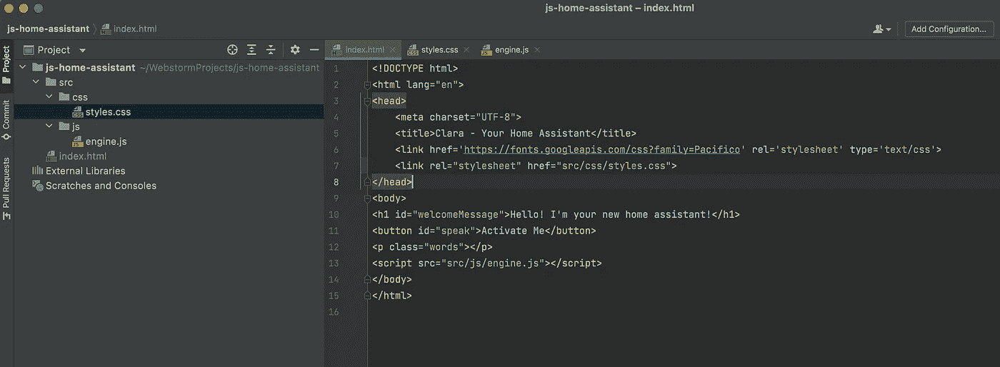

# 史上最酷的代码编辑器功能！

> 原文：<https://levelup.gitconnected.com/the-coolest-code-editor-feature-ever-6c05ea96b2a8>

## 我发现它只是因为我懒…

科林·阿姆斯特朗在 [Unsplash](https://unsplash.com?utm_source=medium&utm_medium=referral) 上拍摄的照片

几年前，我曾经是一个编程狂人。你会问，那是什么？一个想尽可能少依赖工具的人，一切都必须是硬核代码，没有快捷方式，没有自动帮助，什么都没有，只有好的过时代码。几年过去了，虽然我仍然会说是的，但这一次是以威士忌的形式。当涉及到代码时，我会采取任何能加速我工作的方法。

> 我想把精力花在解决问题上，而不是像疯子一样打字。

不出所料，前几天，当我开始我的一个小小的业余项目时，完全是为了我自己的娱乐和启发，我突然意识到，在我的想法中有一些东西我从未尝试过。我使用 WebStorm，这个功能是 WebStorm 特有的。我试图在 VsCode 上复制它，但不能，所以如果你不使用 WebStorm，你就不走运了。所以。😞

因为这是一个普通的 JavaScript 项目，这意味着我有一个`index.html`后跟一个`styles.css`和一个`someName.js`文件。我一直讨厌在 HTML 文件中输入所有的导入和依赖项。我的意思是，当然，这是必要的，但手动操作很繁琐。我把文件夹嵌套错的次数证明了这是我真的不喜欢做的事情。

## 然后我有了一个想法…

如果我把文件拖到 HTML 文件中会怎么样？从左边的文件结构面板进入实际的`index.html`文件。所以，我就是这么做的。我差点从椅子上掉下来！成功了！它甚至不在乎你把它拖到 HTML 的什么地方，它会把正确的标签和文件路径放到 `**<head>**` **中！**😮

如果你拖动一个`.css`文件，它会生成一个标签，如下所示:

`<link rel="stylesheet" href="src/css/styles.css">`

如果您碰巧拖动了一个`.js`文件，那么它将是一个脚本标记，如下所示:

``

如果你问我，我会觉得很酷！在我的`<head>`导入中不再出错。值得一提的是，这个技巧总是将标签附加到 HTML 文件的`<head>`中。例如，你想把你的`.js`文件放在页面的底部，你必须手动移动它们，但至少你不必花费精力来获得正确的路径！😁

## 这里还有几个你可能会喜欢的编码故事…

 [## 10 分钟学会 Scala 基础知识

### 你还不会成为 Scala 大师，但是你会一路走好的。

levelup.gitconnected.com](/learn-scala-basics-in-10-minutes-7a16d6597a51)  [## 我编码时听的 5 张唱片

### 因为我不知道除了分享我最喜欢的专辑，还有什么别的方式！

levelup.gitconnected.com](/5-records-i-listen-to-while-coding-597676951c27)  [## 如何在没有任何连接的情况下在两个 Flutter 应用程序之间传输数据

### 没有网络。没有任何形式的连接，但仍然有一种方法来传输数据…

levelup.gitconnected.com](/how-to-transfer-data-between-two-flutter-apps-without-any-type-of-connection-ae808e78a00a)  [## 通过我的推荐链接加入 Medium-Attila vágó

### 作为一个媒体会员，你的会员费的一部分会给你阅读的作家，你可以完全接触到每一个故事…

attilavago.medium.com](https://attilavago.medium.com/membership) 

**阿提拉·瓦戈**——*软件工程师一次改进一行代码。永远的酷呆子，代码和博客的作者。网络无障碍倡导者，乐高迷，黑胶唱片收藏家。喜欢精酿啤酒！*