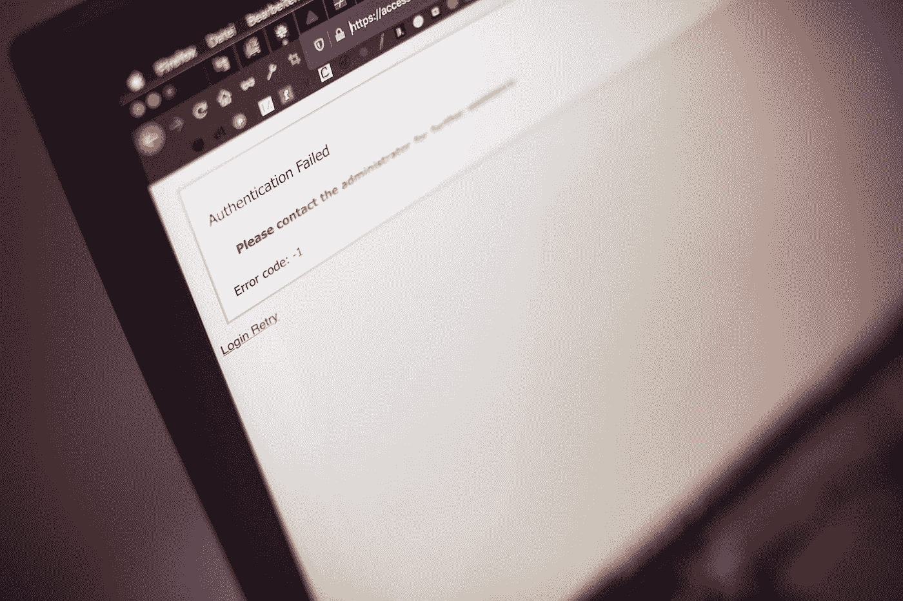
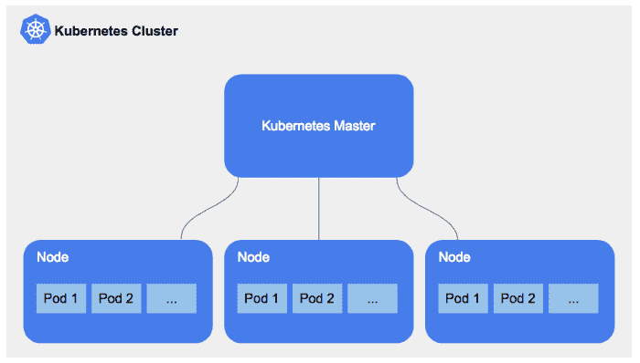
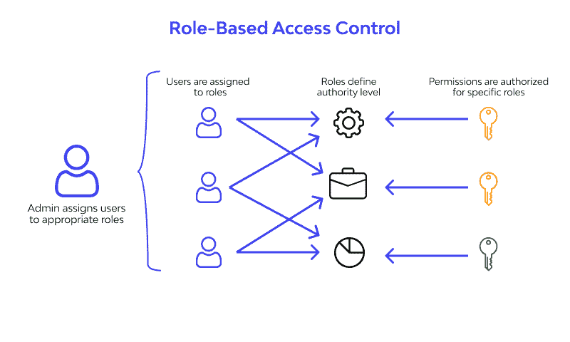

# Kubernetes 安全性的核心:集群

> 原文：<https://levelup.gitconnected.com/the-core-of-kubernetes-security-clusters-5d9a69f1dba4>

马库斯·斯皮斯克在 [Unsplash](https://unsplash.com/s/photos/deploying-code?utm_source=unsplash&utm_medium=referral&utm_content=creditCopyText) 上的照片

Kubernetes 集群是一组节点，最基本的形式是负责 Docker 等容器化应用程序的操作。容器化应用程序在很大程度上是自给自足的，因为它们将应用程序与其依赖项以及成功运行该应用程序所需的基本服务捆绑在一起。除了比虚拟机更轻量级和更通用之外，它们比虚拟机的资源密集程度低得多。

通过这种方式，Kubernetes 集群使得应用程序的构建、传输和管理变得更加容易。Kubernetes 集群使得容器可以在许多不同的机器和各种不同的环境中同时运行。这意味着您不仅可以在虚拟机上部署容器，还可以在云上部署容器。

与虚拟机不同，Kubernetes 容器不局限于任何特定的操作系统。相反，它们能够在任何环境中运行，并在它们之间共享操作系统。

Kubernetes 管理的集群由作为主节点的单个节点和作为工作节点的多个****节点组成。保护集群至关重要，因为集群处理运行容器化应用程序的所有节点。这意味着，如果一个群集受到威胁，那么由该群集管理的所有节点也会自动受到威胁。有必要保护群集免受未经授权的访问，并对群集中节点之间的数据流量进行加密。****

****Kubernetes 提供了一些安全指南和工具。Kubernetes 准入控制器是 Kubernetes 安全框架的新成员。这个插件管理和强制集群的使用方式。因此，它可以用来保护集群。****

# ****为什么我们需要保护 Kubernetes 集群****

********

****[来源](https://medium.com/@tomerf/so-you-want-to-configure-the-perfect-db-cluster-inside-a-kubernetes-cluster-a4d2c26aca7a)****

****Kubernetes 集群由许多链接在一起的节点或机器组成。这些是为集装箱提供动力的机器。如果集群运行在云上，组成集群的机器就是虚拟机；但是，如果集群在本地运行，服务器可能是物理的。这些机器和服务器可能拥有敏感信息。因此，有必要保护这些细节。****

****在大多数情况下，除了至少一个工作节点之外，一个集群至少包含一个主节点。Kubernetes 控制平面是工作节点与主节点交互的环境。Kubernetes 控制平面由主节点管理，它充当集群的主要控制单元。****

****Kubernetes 应用程序编程接口(API)由控制平面提供，因此 Kubernetes 可以管理承载您的应用程序的节点和容器。因此，保护 Kubernetes API 是绝对必要的，因为可能会有大量敏感信息被传输。****

****Kubernetes 集群中有许多需要保护的附加组件，比如 etcd、调度器和控制器管理器。这些组件都必须受到保护。如果这些组件中的任何一个暴露出来，都有可能破坏集群的安全性。因此，不仅需要保护群集，还需要保护其所有组件。****

# ****如何保护 Kubernetes 中的集群****

****如前所述，一个集群由许多不同的内容组成。为了保护集群，有必要保护其每个组件以及组件之间的通信。这包括保护 kube-api 服务器、 [etcd](https://www.ibm.com/cloud/learn/etcd) 等等。我们来谈谈这个。****

# ****实施适当的基于角色的访问控制****

********

****[来源](https://www.wallarm.com/what/what-exactly-is-role-based-access-control-rbac)****

****身份验证是 Kubernetes 的一个关键组件，在访问任何系统资源之前，您首先需要通过身份验证过程来证明您是合法用户。****

****Kubernetes 通过使用其 API 服务器来授权 API 请求，该服务器将所有请求属性与已经设置的策略进行比较。基于这种比较的结果，API 服务器要么同意要么拒绝该请求。开始时，默认情况下不授予任何权限。我们能够通过使用一个叫做基于角色的访问控制( [RBAC](https://www.upguard.com/blog/rbac) )的系统来控制谁可以访问组成集群的许多节点和机器。****

****RBAC 已经融入了 Kubernetes。该组件将传入的用户或组请求与角色中定义的一组权限进行匹配。****

****为了做出许可决定，RBAC 授权使用 rbac.authorization.k8s.io API 组。这使您能够通过 Kubernetes API 动态配置策略。使用这个简单的命令将使启用 RBAC 对您来说轻而易举。****

****kube-API server-authorization-mode = Example，RBAC-其他选项-更多选项****

# ****限制访问 etcd****

****Kubernetes 集群还包括一个组件 etcd，这也是必不可少的。etcd 是一个保存状态信息和秘密的数据存储器。因此，它需要以不同于其他集群的方式进行保护。如果用户被授予对与 API 服务器相关联的 etcd 数据库的写访问权限，这仅仅表明该用户对该集群具有完全的管理权限。****

****我们总是建议您使用强凭据来访问 etcd 服务器。强证书的一些例子包括使用 [TLS 客户端证书](https://medium.com/demystifying-security/understanding-tls-certificates-76bdd5815d95)的相互授权，这是极难伪造或泄露的。将 etcd 服务器隔离在仅允许 API 服务器访问的防火墙之后，并禁止与 API 服务器的直接连接，是确保 etcd 安全的最有效措施。****

# ****结论****

****该集群是构成 Kubernetes 的众多组件之一。但是，由于它包含一组负责运行容器或机器的节点，这些容器或机器可能会传输或存储敏感数据，因此这些节点必须得到适当的保护。因为集群管理节点，所以它被称为 Kubernetes 安全系统的核心。****

# ****分级编码****

****感谢您成为我们社区的一员！在你离开之前:****

*   ****👏为故事鼓掌，跟着作者走👉****
*   ****📰更多内容请查看[升级编码刊物](https://levelup.gitconnected.com/?utm_source=pub&utm_medium=post)****
*   ****🔔关注我们:[推特](https://twitter.com/gitconnected) | [LinkedIn](https://www.linkedin.com/company/gitconnected) | [时事通讯](https://newsletter.levelup.dev)****

****🚀👉 [**加入升级人才集体，找到一份神奇的工作**](https://jobs.levelup.dev/talent/welcome?referral=true)****