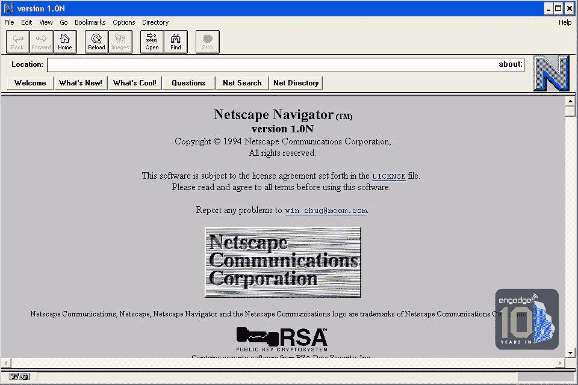
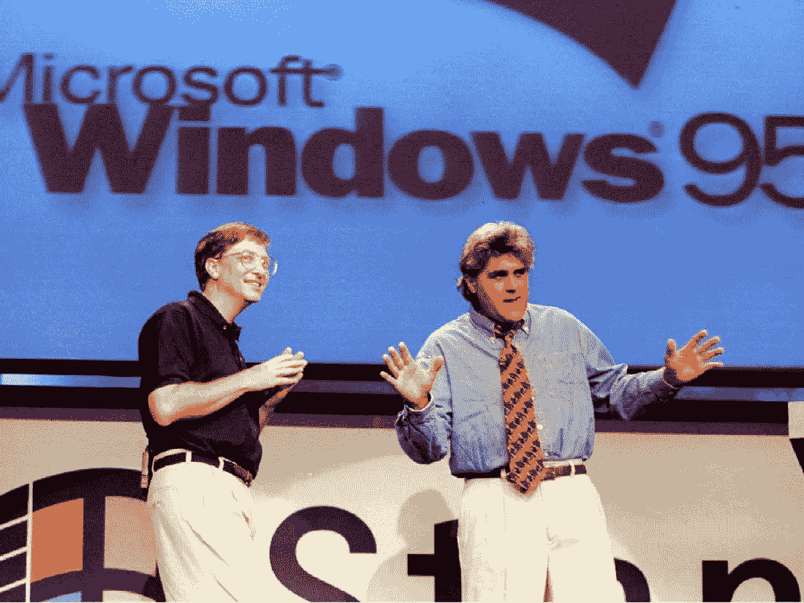
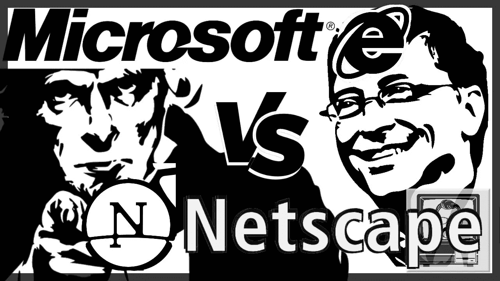
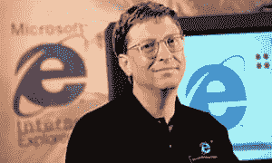
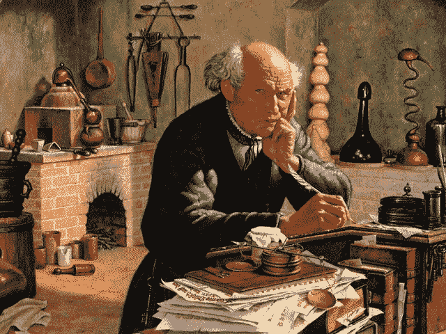
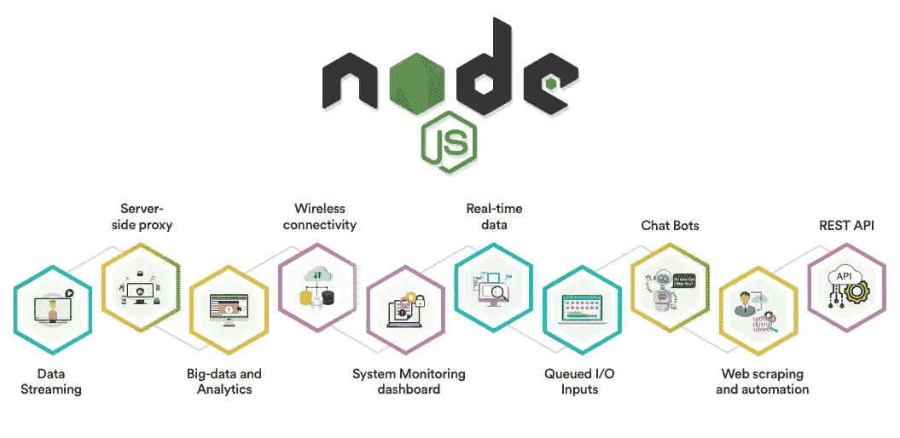

# JavaScript 的创建以及您为什么应该关注它

> 原文：<https://levelup.gitconnected.com/the-creation-of-javascript-b3373824c358>

它渗透到你做的每一件事。

JavaScript 是世界上最容易被误解的编程语言，也是最流行的语言之一。事实上，世界上每台个人电脑上都安装了 JavaScript 解释器，并且在积极使用。

1995 年，三十多岁的布伦丹·艾希坐在网景公司总部的办公桌前，开始了为期十天的编码冲刺。其结果是一种新的语言。

10 天内学会一门新语言？天哪！

一些编程语言塑造了软件开发的世界。当然，JavaScript 做到了这一点，但也塑造了每个使用互联网的人的生活。

像大多数有趣的故事一样，JavaScript 的诞生始于一场战争。是的，我说的是 20 世纪 90 年代的浏览器大战。90 年代似乎很遥远，但我们今天所享受的许多东西都是在那时形成的。

一边是网景，另一边是微软，当时占主导地位的软件权威。

**网景通信公司**，原名马赛克通信公司，是第一家试图利用新兴的万维网的公司。该公司的第一个真正的产品是网络浏览器，名为*马赛克网景 0.9。*然后是*网景浏览器*，它看起来像这样:

网景公司宣称“ ***网络是为每一个人*** ”的，并声明其目标之一是“ ***”通过在不同的操作系统之间提供一致的网络浏览体验，在不同的操作系统之间建立公平的竞争环境。***

你刚才是不是说，在操作系统之间“公平竞争”？不，不，不，这不适合微软这样的公司。没有。

你现在可以想象网景公司和微软公司可能在争夺什么。这实质上是一场战争，胜利者将成为互联网的看门人，并活着去创造一个如何使用互联网的新故事。

我是说这是 1995 年，手机看起来是这样的:

非常适合 Instagram 1995 诺基亚

杰·雷诺主持了 Windows 95 的发布会…

…

我们可能渴望能有所改变…

所以一端是网景公司，它意识到浏览器是人们上网的关键软件。另一方面，微软完全专注于商业模式，即所有东西都必须塞进 Windows，这就是人们应该做的任何事情。咄！

世界正在向网上移动，微软当时并不真正关心浏览器，当然，直到他们看到了网景提供的东西:一条通往互联网高速公路的道路，一条通往高速公路的支线，一条通往……

数百万人使用网景浏览器以一种图形化的方式使用互联网。人们开始承认网景浏览器可能是互联网的未来。

就在那一刻，正如故事所述，这场浏览器大战开始了。在郁郁葱葱的西雅图总部，当微软眼睁睁地看着互联网溜走时，一些大警报正在响起。但是这个软件巨头有资金、人力和品牌来改变这一切。所以大约一年后，在 1995 年的秋天，他们发布了一款浏览器:**Internet Explorer**。

**网络浏览器** VS **网景浏览器——“第一次浏览器大战”**

这两家公司的战争艺术完全不同。网景公司的开发速度很快，每隔几个月就推出一款新的浏览器。它从一个基本的导航系统发展到在浏览器中集成电子邮件，几个月后，它有了一个搜索栏，等等。它不断地变得更好，人们很快开始体验他们可以在网上做的所有不同的事情。

然而，微软习惯于缓慢发展。下面是你的**长达四年的开发过程。这是我们能找到的最完美的作品。把它放在盒子里，拿到商店去卖，我们在接下来的四年里不会发布新的版本。好好享受吧！谢谢！**

“我得到了力量”

**快速的发展步伐确实动摇了微软**。但不会太久。我认为微软意识到了**浏览器具有巨大的文化影响力。这是你在互联网上做的第一件有文化趣味的事情。你可以上乐队的网页，看看他们的帖子和照片。有一种与世界各地的人们联系在一起的真实感觉，这种感觉是你在使用浏览器之前通常享受不到的。这种图形界面浏览器。浏览器让互联网看起来像一本很酷的杂志，这正在渗透到商业、金融、银行、媒体等领域..**

因此，本着这种认识的精神，微软也意识到它非常强大、富有和有影响力。

当全球 80–90%的计算机都安装 Windows 时，很容易将您的软件作为默认软件。这正是所发生的事情。探险家上升到顶部，几乎摧毁了导航。几乎…

这是处于劣势的网景公司抛出漂亮的万福玛利亚的时刻。这最终改变了整个编程世界。

**JavaScript，或者 Mocha，或者 LiveScript，或者后来的 JScript，再后来的 ECMAScript。**

所有这些通过浏览器对互联网的热爱和在浏览器中生活的所有潜力让一件事变得非常清楚。我们需要一种超越 HTML 的新编程语言。我们需要能够推动基于网络的开发，打开互联网上创造力的闸门的东西。

当时，Java 是“酷”语言，人们想知道，Java 会成为 web 开发的语言吗？开发人员真的想要一些轻量级的东西，可以解释而不是编译，并且有吸引力，甚至对非专业程序员也有吸引力。

网景公司理解这种在浏览器中运行编程语言的需要。这将是赋予它生命的东西。他们的 Netscape 2.0 的发布日期即将到来，他们也即将输掉与微软的浏览器大战。在 Netscape 2.0 测试版发布之前，他们还有 10 天时间，机不可失，时不再来。

16 世纪炼金术士在混合物中加入蝎子的雕刻。

**布兰登·艾希出场。还有 10 天。**

艾希在伊利诺伊大学期间，是一个众所周知的语言迷。他过去为了好玩创造新的语言，只是为了玩弄语法。如果有人能在 10 天内完成这件事，那就是他。

第 10 天…

*【你将要读到的一些语言可能看起来太专业、书呆子气、“程序化”，但我保证，没关系，如果你不熟悉，查查也无妨。所有这些编程概念让你可以在互联网上做你想做的事情。]*

JavaScript 的语法显然是受 C 语言大括号和分号的启发。一些字符串模式取自 Java，面向对象的底层模式取自一种叫做 Modula-2 的编程语言——这实际上是第一类函数概念的来源，它可能是 JavaScript 最著名的特性之一。这里可能有更多我没有提到的灵感，但不要介意我。

因此，1995 年 11 月 30 日，JavaScript 和 Netscape Navigator 2.0 一起发布，所有的目光都集中在这种新的神奇语言上。AT & T 的美国在线和其他 28 家公司同意使用它作为一种开放的标准语言。这个版本并非没有评判和质疑。你可以看到已经编程几十年的老前辈俯视着这个闪亮的新东西。实际上，即使在今天，有些人也不认为 JavaScript 是“真正的编程”,认为它只是一种新手用的语言。

听说过 FORTRAN 小子吗…？离开这里！

JavaScript 带着愚蠢、有趣、简单和轻量级的想法潜入了我们的集体意识。这真的是一种非常有趣的语言。而且古怪。同时，它功能强大，几乎可以做计算机科学中的任何事情。也许我将很快写下这种语言的一些特征。

今天，JavaScript 可能是世界上最大的语言。它无处不在！我是说任何地方！如果你进入了软件领域，你就别无选择，只能学习它。

假设你有一个很棒的想法，并且你已经完成了所有的后勤工作。事实证明，如今，如果你想让这个想法到处传播，你必须有某种网络或移动方面的东西。所以你说，“我想建立一个浏览器应用程序，我希望它有各种各样很酷的交互元素，这样我的客户就可以看到我的想法有多棒。”嗯……你必须去学 JavaScript 或者雇一个懂 JavaScript 的人。

即使对于经验丰富的程序员，你可能会问他们最喜欢的语言是什么，他们也必须说“我喜欢 Python[和 JavaScript]。”如今，你再也无法逃避 JavaScript 了。它就在这里，它无处不在，它就在这个页面上，在你的手机里，在你的浏览器上，它是现在大多数人都必须学习的一门语言。

所以我们可以花一点时间感谢网景公司和布伦丹·艾希发明了 JavaScript，我们也可以花一点时间感谢微软推动了这项发明。但最终，网景没有微软的资金、规模和影响力，导航器作为一个严肃的产品消失了。

尽管在浏览器游戏中姗姗来迟，但微软在整个行业的主导地位帮助了他们，但即使是他们也无法跟上网景来世即将到来的范式转变。

21 世纪初，谷歌邮件发布了。正如我们所知的 Gmail。这很可能是第一个真正将 JavaScript 带到下一个层次的应用程序。它用它来动态切换你在浏览器中看到的内容。因此，当你点击收件箱中的一封电子邮件时，**谷歌在后台使用 JavaScript 获取你想要查看的内容，并将其放在你面前，而不是等待一个全新的页面加载。不用再等待一个全新的页面加载。**

这改变了一切。它不仅节省了大量的时间和精力，而且如果你仔细想想，我们工作的本质完全改变了。你可以把引领 web 2.0 革命归功于 JavaScript。不仅速度更快，而且任何拥有 web 浏览器的人都突然拥有了一个开发环境。

到目前为止，我们已经介绍了 JavaScript 是如何成为所有浏览器语言的，这是不可避免的。

为了将事情提升到一个全新的水平，Ryan Dahl 在 2010 年推出了 Node.js，这是一个在浏览器之外执行 JavaScript 代码的运行时环境。现在开发者可以使用 JS 进行服务器端脚本编写了。这实际上是对 Netscape 的 LiveWire Pro Web 的一种重新评估，它是第一个服务器端 JavaScript 环境。

今天，Node.js 是业界的一股巨大力量。Node.js 取得如此成功的原因之一是庞大的开发人员社区为其做出了贡献。你所要做的就是安装 Node.js，然后你就不用编写服务器代码和渲染复杂的 web 应用程序了。

所以首先在浏览器中，然后在服务器上。JavaScript 是一种朴实无华、秘密优雅、有时充满错误的语言。它是第一次浏览器大战的幸存者，被所有人低估了。

您今天的生活依赖于 JavaScript 提供的交互性。如果你真的想看看你有多依赖它，你可以在你的浏览器中禁用 JavaScript 一两天。试一试，你就会知道我在说什么。这是最枯燥、最无聊、最乏味的经历。

当然，你的页面会加载得更快，更干净，广告更少，没有弹出窗口，电脑的电池寿命也会更长。而且网页的某些部分根本无法工作。网飞行不通。YouTube 就不行了。谷歌文档无法使用。谷歌地图无法使用。最终，您会意识到，在某种程度上，您依赖于 JavaScript 来运行。

这种语言渗透到我们所做的一切。

花一点时间来思考这个问题，思考世界的 DNA 是如何被永远改变的。

