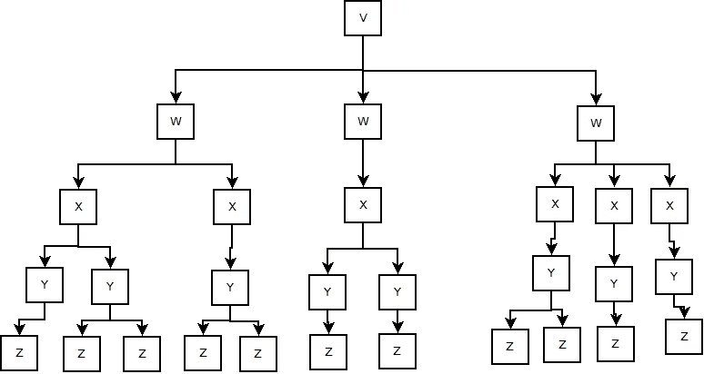
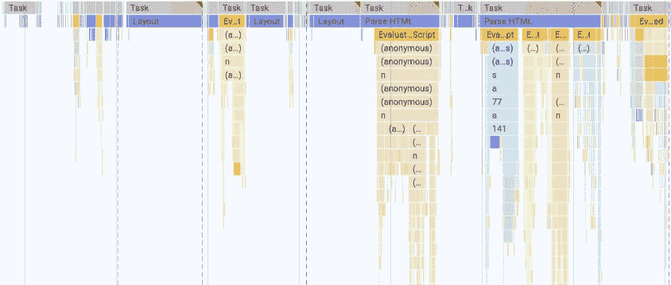

# 关键渲染路径:浏览器如何将 HTML 变成网站

> 原文：<https://levelup.gitconnected.com/the-critical-rendering-path-how-browsers-turn-html-into-a-website-54ddd5dcca0b>

浏览器的工作很艰难。

对于一个典型的页面来说，你的浏览器必须从互联网上加载大约 70 个资源，并把它们变成一个正常运行的网页。图像、脚本、样式和字体都必须在几秒钟内完成。

浏览器通过关键的呈现路径来完成这项任务，这是在空白屏幕和网页第一次绘制之间的时间内发生的五个步骤。

我喜欢把这个过程想象成种四棵树，然后决定在哪里种植它们。对于浏览器来说，树是软件的一种，但是只要它有用，我就继续使用这个比喻。

**什么是树？**

软件中的树就像你在小学时做的那些家谱一样。Web 程序员把这个比喻说得尤其正确，因为每个盒子调用其*父*之上的盒子和其*子*之下的盒子。

现在让我们一棵树一棵树地完成这些步骤:

**树 1:内容(DOM)**

每次访问网站都是从一个 HTML 文件开始的。这个文件包含了所有关于在哪里寻找其他东西以及在页面上显示什么的指令。浏览器抓取[小块](https://www.tunetheweb.com/blog/critical-resources-and-the-first-14kb/)文件，开始逐行查看。

所有的 HTML 只是盒子里的盒子，带有一些文本和图像。浏览器一行一行地拆开这些框，将它们放入第一棵树，即*文档对象模型(DOM)。*

这在现代计算机上发生得非常快，但是当我们接触外部资源时，问题就出现了。当浏览器点击引用外部链接(图像/脚本/样式表)的行时。它停下手头的工作，把树放在一边，开始下载链接。

它现在做什么取决于它发现了什么:

*   **图片:**浏览器让图片在后台下载，然后继续工作。
*   **脚本:**浏览器停止一切，等待整个脚本下载完毕，然后运行它。
*   **样式:**样式也像图片一样在后台下载，只是如果浏览器运行到脚本中，那么浏览器会等到样式完成后再运行脚本。(脚本可能依赖于样式表，所以我们必须等待)。

在多次停止和启动之后，浏览器到达 HTML 文件的底部。DOM 树已经构建好了，现在我们可以继续下一个树了。

**树 2:风格(CSSOM)**

现在我们有了 DOM 树，它告诉浏览器什么将出现在页面上。现在是时候组织页面上的所有样式了。

与我们在构建 DOM 时不停地停止和开始不同，浏览器一次就构建了整个样式树，没有停顿。到目前为止，浏览器找到的所有 CSS 都被组合在一起(与[用户代理样式表](https://developer.mozilla.org/en-US/docs/Web/CSS/Cascade#user-agent_stylesheets))，并且*级联样式表对象模型(CSSOM)* 被构建。

样式选择器中的每一层特性构成了 CSSOM 树中的另一个分支。更特殊的样式会覆盖更普通的样式，这就是 CSS 中级联部分的含义。

浏览器很快就完成了这一部分，但是每当 CSS 改变时，都需要重新计算 CSSOM，这最终会累加起来。

**树 3:两者一起(渲染树)**

这个非常快而且非常简单。只要浏览一下 DOM 树，看看 CSSOM 树对每个部分有什么说法。

**种树:(布局和油漆)**

现在我们有了所有的内容，以及它应该是什么样子，是时候弄清楚它应该去哪里了。从渲染树的底部开始，按照我们从 CSSOM 树中得到的规则，决定每个元素的大小和位置。一个大的渲染树可能会很慢，因为每个盒子都需要单独计算。

每次测量网页的变化(检查元素的大小或位置)，浏览器都必须重新计算布局，如果发生得太频繁，这可能会成为一个称为[布局抖动](https://blog.idrsolutions.com/2014/08/beware-javascript-layout-thrashing/)的问题。布局抖动是一个容易陷入的陷阱(我在几个流行的 WordPress 插件中看到过)。

一旦布局完成，剩下要做的就是把它放到屏幕上。浏览器现在告诉操作系统成品的样子，并改变屏幕上所有像素的颜色。

计算机习惯于每秒显示数百帧，因此应用程序的绘制通常只需几毫秒。

**奖励树 4:脚本(AST)**

到目前为止最复杂和最令人困惑的树，作为运行脚本的一部分，浏览器构建了一个抽象语法树(AST)。这个树记录了每个函数和变量的依赖关系。我将把对 AST 的深入讨论留到以后的文章中，因为它很快就会变得非常专业。

**总之**

现在我们有了。从屏幕上什么都没有到一个网站的第一张画。我省略了大量的边缘案例和复杂性(如果不这样做的话，可能会有数百页)。

这个过程在实践中是什么样子的

在现实世界中，关键的渲染路径可能会非常混乱，需要花费大量时间等待脚本、多次布局重排和样式重新计算，以及巨大的 DOM 树进行排序。这个过程平均需要 [5 秒](https://httparchive.org/reports/loading-speed#fcp)。通过理解浏览器在做什么，这个过程很有可能在不到一秒的时间内完成。

关键渲染路径对于创建干净快速的网站来说很重要，但它似乎并没有被普遍教授。希望这能让你对这个过程有所了解，或者至少在浏览器缓慢加载网站时有所思考。