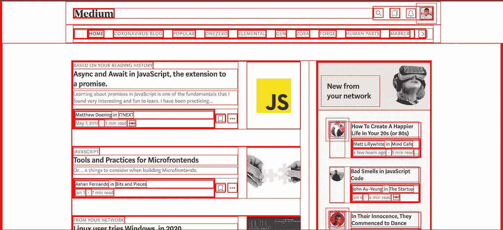
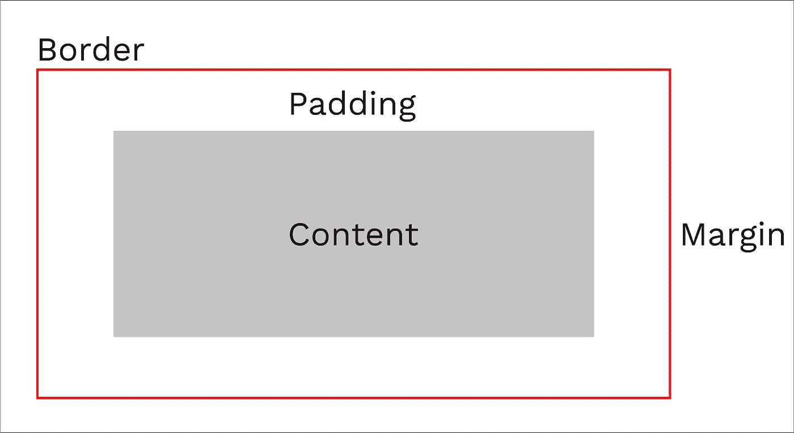
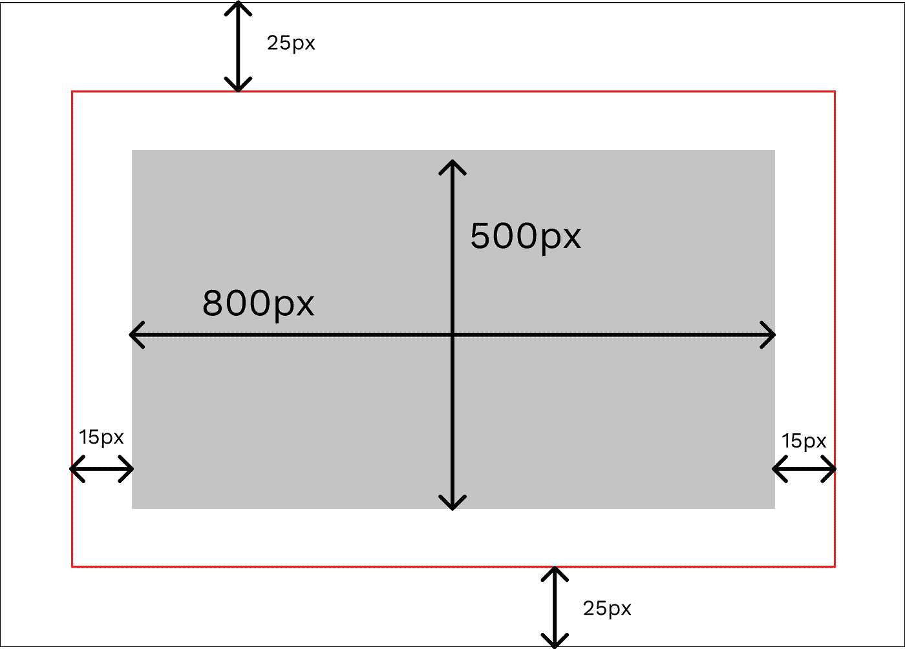
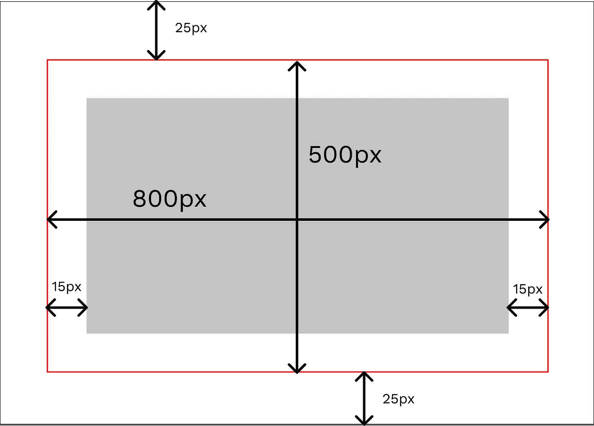
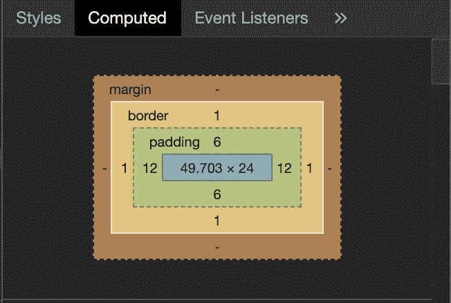

# CSS 盒子模型📦

> 原文：<https://levelup.gitconnected.com/the-css-box-model-8ce9bda94455>

理解这个框是能够用 CSS 创建布局的关键。

CSS 盒子模型的核心非常简单:

> 网页设计中的每个元素都是一个矩形框。

这是 ***顿悟的时刻*** (💡)帮助我理解 CSS 布局，让我更容易进入 Web 开发。在深入讨论定位框及其行为的细节之前，让我们先讨论一下这个框。


在 HTML & CSS 中一切都是一个盒子。照片由 [מתן שגב](https://www.pexels.com/@matansegev?utm_content=attributionCopyText&utm_medium=referral&utm_source=pexels) 从[像素](https://www.pexels.com/photo/photo-of-white-and-brown-cardboard-box-toy-figure-678308/?utm_content=attributionCopyText&utm_medium=referral&utm_source=pexels)拍摄

我做了一个简单的实验来展示 CSS 的本质其实是一个盒子。我去了 Medium 主页，给所有元素添加了边框。

```
* { border: 1px solid red; }
```

这是结果:



完美展示 CSS 盒子的媒体主页。

CSS 中的盒子有 4 个部分:

1.  **内容**:放置内容的区域。这个盒子的大小由它的`height`和`width`属性定义。
2.  **填充**:填充在内容周围添加定义数量的空白。金额由`padding`财产控制。
3.  **边框**:边框包裹内容和填充。它由`border`属性控制。
4.  边距:边距是一个框和它周围的框之间的空白。它是最外层，由`margin`属性控制。



盒子的四个部分。

默认情况下，浏览器遵循*标准盒模型*。

按照标准模型，定义的高度和宽度属性应用于内容框。然后将填充和边框大小添加到框的尺寸中，以获得实际的高度和宽度。

**注:**计算中不加入保证金。虽然它会影响框在页面上所需的总空间，但边距只是框外的空间。考虑如下定义的盒子:

```
.box {
    height: 500px;
    width: 800px;
    border: 1px solid red;
    padding: 15px;
    margin: 25px;
}
```

由标准模型计算的上述盒子的高度和宽度为:

```
Height = 500 + 15 + 15 + 1 + 1 = 532px
Width  = 800 + 15 + 15 + 1 + 1 = 832px
```



但是在给内容框添加边框和填充后，计算实际大小是相当不方便的。这也是为什么引入了替代盒子模型的原因。在这个模型中，高度和宽度应用于盒子，包括边框和填充。因此，替代模型的上述 CSS 将给出以下结果。



由替代模型计算的上述内容框的高度和宽度为:

```
Height = 500 - 15 - 15 - 1 - 1 = 468px
Width  = 800 - 15 - 15 - 1 - 1 = 768px
```

如果你想打开一个元素的替代模型，你可以通过设置`box-sizing: border-box`来实现。通过这样做，你是在告诉浏览器把边框作为你设置的任何尺寸所定义的区域。

通常，我们将`box-sizing`设置为 HTML 中的所有元素。我们可以通过使用通配符符号来做到这一点:

```
* {
    box-sizing: border-box;
}
```

如果填充或边框未声明，它们要么是零(如果使用 CSS 重置)，要么是浏览器默认值。

## 开发者工具

开发工具是你处理 CSS 时最好的朋友。这些工具允许我们检查页面上的元素，查看该元素在 HTML 文档中的位置，并查看对其应用了什么样的 CSS 样式和值。这些工具中的大多数还包括元素的盒模型图。



开发人员工具向您展示了一个计算出的盒子模型图。

我通常让开发者工具保持开放，因为当你使用 HTML 和 CSS 时，它们会给你很大的帮助。通过保持开发工具开放，您可以学到很多关于代码的知识。我有时会检查其他网站，看看他们的 HTML 和 CSS 是如何编写的！

盒子模型是使用 HTML 和 CSS 设计布局时最令人困惑但又最强大的概念之一。但是一旦你理解了它，CSS 中的其他一切都变得简单易学了！

编码快乐！😃