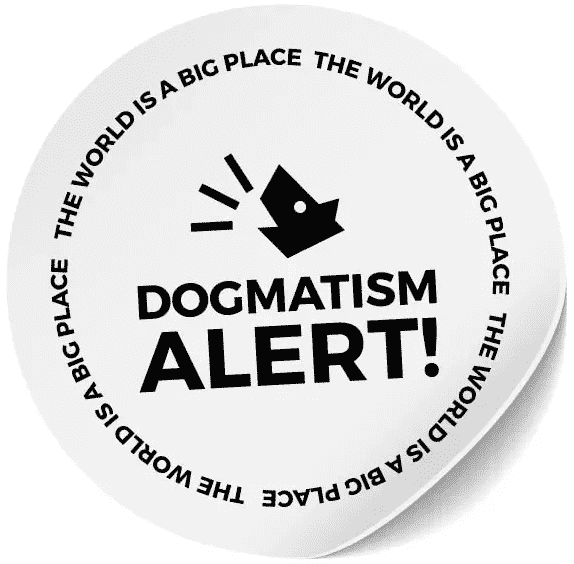

# CSS 圣战&如何超越教条思考

> 原文：<https://levelup.gitconnected.com/the-css-holy-war-how-to-think-beyond-dogma-e2c67692d409>

我们在其中审视了 CSS 的现状以及教条是如何阻碍进步的。

https://unsplash.com/@nstudio

选择 CSS 方法或框架从未像现在这样困难。无论是开始一个新项目，还是认识到现有代码库需要改变，都没有快速的答案。这是因为在网络发展的特殊时期，CSS 处于一个独特的位置。

CSS 解决方案的前景比以往更加多样化。也许你在寻找没有严格执行的规则和指导方针。CSS 方法为你而生！但是你选择了 [SMACSS](http://smacss.com) 、[mainablecss](http://MaintainableCSS.com)、 [BEM](http://getbem.com) 、 [OOCSS](http://oocss.org) 、 [CSS 指南](http://cssguidelin.es)、 [ITCSS](http://itcss.io) 、 [eCSS](http://ecss.io) 、[atomicss](http://acss.io)？或者，也许方法的组合会比任何一种方法都更好(有人知道吗？).

被大量的方法所吓倒？或者也许你更喜欢你的 CSS 固执己见，自带小部件？拯救框架！一些框架仅仅实现了一种方法或者方法的组合。例如，由 [CSSWizardry](https://csswizardry.com) 创建的框架 [inuit.css](https://github.com/inuitcss/inuitcss) 实现了 OOCSS 方法，并有意“不为您提供现成的 UI 和设计，而是为您提供一个坚实的架构基线，在此基础上完成您自己的工作。”

宁愿要那些花里胡哨的东西？总会有令人尊敬的 Bootstrap，它非常受欢迎是有原因的。以免我们忘记多才多艺的[基金会](https://foundation.zurb.com/)作者 [ZURB](https://medium.com/u/5dcb35352a08?source=post_page-----e2c67692d409--------------------------------) 。或者是众多[材质设计](https://material.io/guidelines/)实现中的一个，像[物化](http://materializecss.com/)、[美伊](https://www.muicss.com/)、[材质-UI](http://www.material-ui.com/) (React specific)，或者是[角度材质](https://material.angularjs.org/) (Angular specific)。还有[布尔玛](https://bulma.io/)，[骷髅](http://getskeleton.com/)，[超光速粒子](http://tachyons.io/)，[整齐](https://neat.bourbon.io/) …

或者，也许你喜欢基于组件的解决方案，你正在寻找一个更加模块化的解决方案。多亏了一些先驱开发者，尤其是 React 社区中的开发者，Javascript 的巧妙运用正被用来以令人兴奋的新方式解决 CSS 问题。这种趋势的两个体现是 [CSS 模块](https://github.com/css-modules/css-modules)和 [CSS-in-JS](https://github.com/cssinjs/) 。CSS 模块需要额外的工具和知识(主要是 [PostCSS](https://github.com/postcss/postcss) )，CSS-in-JS 有自己的实现生态系统，其中许多是特定于 React 的。脸书工程师 [Michele Bertoli](https://medium.com/u/cb6b99cd9ea7?source=post_page-----e2c67692d409--------------------------------) [维护了一个 repo](https://github.com/MicheleBertoli/css-in-js) 比较 React 的具体实现，在撰写本文时，它列出了 **57 个不同的项目**。

更糟糕的是，在 CSS 争论中的两个阵营之间发生了激烈的、有时充满愤怒的辩论，这与美国民间传说中的哈特菲尔德对麦科伊没有什么不同。我们的 CSS Hatfields 更喜欢原样的 CSS，我们的 CSS McCoys 更喜欢 Javascript 增强的 CSS。(本文末尾提供了每个阵营的进一步阅读材料。)

哈特菲尔德夫妇认为 CSS 大体上运行良好。Hatfields 指责 McCoy 开发者不理解和正确使用他们的工具集。哈特菲尔德夫妇认为没有必要让 Javascript 这种邪恶的魔法干涉 CSS 的事务。“要是他们能学会正确使用级联*就好了！*”哈特菲尔德大喊。

麦科伊夫妇认为我们的 CSS 规范已经过时了。麦科伊夫妇认为手工编写 CSS 过时且容易出错，并对“泄漏”样式和意想不到的副作用感到沮丧。"要是他们能使用我们的新技术来界定风格就好了！"麦科伊大声回应。

在认真研究 CSS 的当前状态之前，提供主要方法和框架的高级概述似乎是一项可管理的任务，我可以在几个小时内进行研究和编写。然而，事实是，这个话题杂乱无章，难以处理，并引发了激烈的辩论。

但是为什么呢？我们是怎么来到这里的？后退一步，回顾一下*关于级联样式表起源的简短历史，我们可以更好地理解这个有争议的话题。*

**前车之鉴**

1994 年 10 月 10 日，在 Netscape 向公众公布的前三天，在 CERN 工作的科学家发表了 CSS 的第一份草案。[ [W3 的 CSS 历史](https://www.w3.org/Style/CSS20/history.html) ]根据 [W3](http://w3.org) 的说法，大约有 10 个相互竞争的规范试图服务于与 CSS 相同的目的，但 CSS 是不同的，因为“它考虑到了在 Web 上，文档的风格不能由作者或读者自己设计，而是他们的愿望必须以某种方式组合或级联；事实上，不仅仅是读者和作者的愿望，还有显示设备和浏览器的功能。”

kon Wium Lie，1995 年( [W3 的*CSS 简史*](https://www.w3.org/Style/CSS20/history.html) )

Lie 的 CSS 规范的第一个实现包括了用户/作者影响的概念。在 1994 年 11 月规范的第一次演示中，一个虚构的屏幕截图显示了一个滑块，标签用户在一边，作者在另一边。通过调整滑块，用户可以改变自己和作者的偏好组合。”[ [W3 的 CSS 历史](https://www.w3.org/Style/CSS20/history.html) ]这是 CSS 试图灌输的概念的可视化表示。最初的尝试是通过每种风格的明确百分比。正如 [Zack Bloom](https://medium.com/u/af5af901a9d5?source=post_page-----e2c67692d409--------------------------------) 在 [*中所描述的，这些语言几乎都是 CSS*](https://eager.io/blog/the-languages-which-almost-were-css/) *，*“如果以前的样式表将`h2`字体大小定义为`30pt`，拥有`60%`所有权，而这个样式表将`h2` s 定义为`20px 40%`，那么这两个值将根据它们的所有权百分比进行组合，从而得到大约`26pt`的值。”

从我们的角度来看，这种想法似乎注定要失败，它没有成为规范的一部分也就不足为奇了，但它确实指出了 Lie 的理解，即需要允许同一风格的多个定义符合一种理智和一致的方式来将两者融合在一起。从这种理解中发展出[选择器特异性](https://www.smashingmagazine.com/2007/07/css-specificity-things-you-should-know/)，它对每个元素和选择器应用很大程度上任意的数值来保证稳定性，尽管存在潜在的冲突。

在理解一项技术是如何产生的过程中，重要的是要把握两件事:(1)这项技术试图解决什么现存的问题，以及(2)为什么当前流行的技术在竞争中胜出？在 1994 年 CSS 及其竞争对手的案例中:(1)没有办法在 web 上设计文档，以及(2) CSS 赢得了胜利，因为它系统地考虑并解决了当时的需求(认识到作者和设计者在 web 上不可避免地联系在一起，适应显示内容的设备，认识到需要一个优雅的系统来组合多个具有冲突样式的表单)。

[https://unsplash.com/@thepootphotographer](https://unsplash.com/@thepootphotographer)

**规则如何招致教条**

为清晰起见，给出几个定义:

**规则** ( *目标)* : 描述在给定的上下文中什么是可能的。
**规范** ( *目标)* : 给定上下文的相关规则集合。
**指导方针** ( *主观):*在给定背景下促进有效性和效率的建议。
**方法论** ( *主观)* : 相关规则和准则的集合。
**教条** ( *主观作为客观):*指南或作为规范出售的规则和指南的集合。

**规则**描述我们*可以*做什么，**指导方针**建议*做什么可能对*有帮助。我们将相关规则(*例如*选择器特异性)分组为**规范** ( *例如*级联样式表)。当花时间在一个规范上时，我们获得了帮助我们创建**指南** ( *例如*避免过度使用！在你的样式表中很重要)，我们可以彼此共享，这样我们可以避免重复我们的错误，并提高我们的生产力。凭借一定的创造力，我们将既定的规则与学到的指导方针结合起来，创造出连贯的**方法** ( *例如* BEM、SMACC 或 eCSS)，使我们能够在一个思想的涌现系统中工作，这个系统比它们的各个部分的总和还要大。

当指南或方法变得足够流行时，它们往往会呈现出教条的瘴气。教条是当指导方针和方法(主观的)伪装成规则和规范(客观的)时发生的事情。

图片由[克里斯·科伊尔](https://medium.com/u/a789923b5cad?source=post_page-----e2c67692d409--------------------------------)提供。经许可使用。

**教条阻碍前进的动力**

> 教条——a:被认为是既定观点的东西；尤其是:明确的权威信条
> 
> 这种信条的法典
> 
> 无充分根据的权威性观点或信条

— [韦氏词典](https://www.merriam-webster.com/dictionary/dogma)

> 教条主义——一种观点或信仰的表达，就像它是一个事实一样:主张观点的积极态度，尤其是在没有根据或傲慢的时候

— [韦氏词典](https://www.merriam-webster.com/dictionary/dogmatism)

教条本身并不是坏事；有时候，教条通过深思熟虑地采纳一套规则而赢得了登上王位的权利。然而，我们必须警惕教条带来的根本问题——它们本质上被认为是*无可争议的真理*。我们忘记了教条最初设定的目标，这个目标被一大堆一致同意的观点所取代。我们再也不能只见树木不见森林了。

用 [ESLint](http://eslint.org) 的创造者 [Nicholas C. Zakas](https://medium.com/u/77c787f473e5?source=post_page-----e2c67692d409--------------------------------) 早在 2013 年的一条推特上的睿智话语来说:

教条鼓励我们以创造新规则为代价来坚持规则，尤其是那些与当时流行的教条相悖的想法。伟大的思想家会对试图开辟新道路的建议嗤之以鼻。更大的社区卷入了一场激烈的辩论，更像是一场喊叫比赛，而不是一场成熟的讨论。用伽利略的话说，

> 致力于伟大的发明，从最小的开始，不是普通人的任务；发现隐藏在琐碎幼稚事物背后的奇妙艺术是超人才能的构想。— [" [伽利略论批判性思维和相信我们先入之见的愚蠢，“头脑风暴](https://www.brainpickings.org/2015/10/08/galileo-dialogue-critical-thinking/) ]

CSS 模块的创造者 Mark Dalgleish 在今年早些时候的一条推文中表达了同样的担忧:

[CSS-Tricks](https://medium.com/u/a789923b5cad?source=post_page-----e2c67692d409--------------------------------)[和](http://css-tricks.com) [CodePen](http://codepen.com) 的创造者克里斯·科伊尔，在他的文章[我对教条](https://css-tricks.com/increasing-wariness-dogmatism/)越来越多的戒心的结尾给出了实际的建议:

> “当你试图阐明一个观点时，避免教条当然更为罗嗦。但更诚实。更清楚了。这是对做不同事情的人的同情。这样更容易让别人对你产生共鸣。”

让我们都来挖掘我们的*超人天赋*并根据他们如何解决我们作为开发者所面临的问题来判断想法。大家把新的想法分享清楚。更重要的是，让我们带着同理心回顾和讨论来自社区内部的想法。正如 CSS 通过专注于解决它所要解决的问题而脱颖而出一样，我们也可以通过专注于解决问题的目标而不是捍卫既定的规则集来获得成功。

图片由[克里斯·科伊尔](https://medium.com/u/a789923b5cad?source=post_page-----e2c67692d409--------------------------------)提供。经许可使用。

*如果您喜欢这篇文章，请点击👏！您可以* [*关注我*](https://medium.com/@warlyware) *获取更多关于 web 开发的文章，或者在*[*gitconnected.com*](http://gitconnected.com)*加入我们成长中的开发者社区。*

**哈特菲尔德文章精选:**

*   [CSS 在不破](https://keithjgrant.com/posts/2017/03/css-is-not-broken/)由[凯斯·j·格兰特](https://keithjgrant.com/)
*   [CSS 如果没事，只是真的很难](https://hackernoon.com/css-is-fine-its-just-really-hard-638da7a3dce0)通过[乔丹秤](https://medium.com/u/3e9a31fdc4d4?source=post_page-----e2c67692d409--------------------------------)
*   [为 CSS](https://deardesignstudent.com/in-defense-of-css-7d7eb198df73) 辩护[利亚姆·坎贝尔](https://medium.com/u/b390872a75de?source=post_page-----e2c67692d409--------------------------------)

**McCoy 文章选择:**

*   [CSS 被](https://medium.com/@zamarrowski/css-is-broken-5138773e17a5)[塞尔吉奥·扎马罗](https://medium.com/u/850590835c5c?source=post_page-----e2c67692d409--------------------------------)破解
*   [CSS 被](https://medium.com/@shaunbent/css-sucks-9a4471ede74b)[肖恩本特](https://medium.com/u/896b7a497a5e?source=post_page-----e2c67692d409--------------------------------)吸住
*   [CSS 注定要永远吸下去吗？](https://medium.com/carwow-product-engineering/is-css-condemned-to-suck-forever-64aeee146d36)作者[文森特·纳韦塔](https://medium.com/u/505cadc906b8?source=post_page-----e2c67692d409--------------------------------)
*   [CSS 被打破:我的多如牛毛的意见](https://jeremywagner.me/blog/css-is-broken-my-dime-a-dozen-opinion)作者[杰瑞米·瓦格纳](https://jeremywagner.me/)

*其中一些选段摘自* [*克里斯蒂亚诺·拉斯特利*](https://medium.com/u/d17e82adb7e1?source=post_page-----e2c67692d409--------------------------------) *的精彩演讲*[让 CSS 有和平](https://www.youtube.com/watch?v=bb_kb6Q2Kdc)，*其中还引用了更多 CSS 社区分裂的例子。*