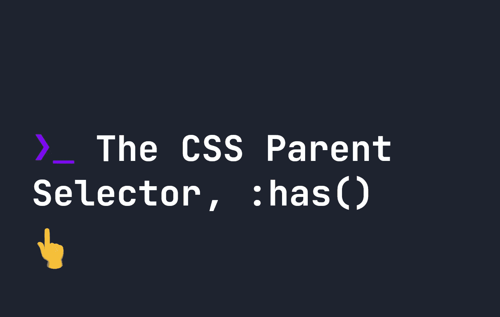
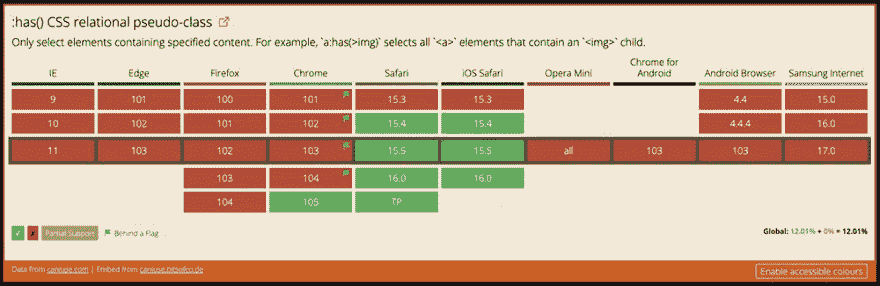

# CSS 父选择器:具有()

> 原文：<https://levelup.gitconnected.com/the-css-parent-selector-has-e0848d3644fc>



CSS 代表**级联样式表**，这基本上意味着页面中后面的内容优先于前面的内容(有一些主要的注意事项[)。这也适用于我们如何选择元素——从父元素到子元素，没有办法选择父元素，**直到现在**。](https://fjolt.com/article/css-selectors-guide%5D)

在 [CSS 选择器 4](https://fjolt.com/article/css-selectors-level-4) 规范中，CSS 引入了一个名为`:has()`的新选择器，最终让我们选择父母。这意味着我们将能够定位一个 CSS 元素，这个元素中有特定的子元素。这在 **Safari** 中已经支持，在 **Chrome 105** 中也有。完整的支持表如下所示:



随着支持的增加，在这篇文章中，我将重点介绍 CSS 父选择是如何工作的，以及在支持可用的情况下，您可以如何做。与此同时，如果你需要在所有浏览器中得到完全支持，你也可以[实现这个 polyfill](https://www.npmjs.com/package/css-has-pseudo) 直到本地 CSS 支持可用。

# CSS 中父选择器的工作方式

在 CSS 中，如果我们想要选择一些东西，我们使用选择器来降低 DOM。例如，在`div`标签中选择一个`p`标签，如下所示:

```
div p {
    color: red;
}
```

直到现在，我们还不能真正选择包含`p`标签的`div`标签，这意味着我们必须求助于 Javascript。这没有在 CSS 中实现的主要原因是因为这是一个相当昂贵的操作。CSS 解析起来相对较快，但是选择父标签需要相对大量的处理。

使用`:has`选择器，我们现在可以选择有`p`子元素的`div`元素，或者选择器的任何正常组合。例如，选择一个带有子节点`p`的`div`现在看起来像这样:

```
/* Makes the div color: red; */
div:has(p) {
    color: red;
}
```

这将使任何带有子`p`的`div`变红。

# 将父选择与其他选择器相结合

就像任何其他 CSS 选择器一样，我们可以在特定的情况下组合使用它。例如，如果您只想选择有直接`span`子标签的`div`标签:

```
div:has(> span) {
    color: red;
}
```

正如`:has`的词汇所暗示的，它不仅仅局限于父母选择。例如，下面我们可以选择一个`span`它与`:has`的一个兄弟`div`:

```
span:has(+ div) {
    color: red;
}
```

甚至，通过使用`:not()`选择器选择**没有**子元素的元素。例如，下面将选择任何一个**没有**子节点的 div:

```
div:not(:has(p)) {
    color: red;
}
```

# 选择 CSS 中只包含文本的元素

CSS 中一个很常见的问题是`:empty`标签不选择包含任何文本的元素——所以有时一个元素可以包含一个空格，而`:empty`将不适用。`:has`选择器让我们能够选择只包含文本节点的元素，而不包含其他子元素。

虽然这对于简单的带有空格的`:empty`元素来说并不是完美的解决方案(因为这将选择任何只有文本而没有额外的 HTML DOM 元素的元素)，但是它确实给了我们选择只有文本节点的 DOM 元素的能力，这在以前是不可能的。我们可以通过下面的代码实现这一点:

```
div:not(:has(*)) {
    background: green;
}
```

# 结论

随着 Chrome 105 中添加了`:has()`选择器支持，父母选择很快成为现实，我们很快就可以在现实生活项目中使用。到目前为止，有了 Safari 的支持，很容易测试并了解它在未来的工作情况。这有一个额外的好处，那就是让我们减少在很多应用程序和产品中很常见的 Javascript 父母选择解决方案。

你甚至可以今天就开始使用`:has`，如果你也实现了[这个 polyfill](https://www.npmjs.com/package/css-has-pseudo) ，然后一旦 Chrome 和其他浏览器有了原生支持就移除这个 polyfill。

我希望你喜欢这篇文章。[要了解关于 CSS 的更多信息，请点击此处](https://fjolt.com/category/css)。

# 分级编码

感谢您成为我们社区的一员！更多内容见[级编码出版物](https://levelup.gitconnected.com/)。
跟随:[推特](https://twitter.com/gitconnected)，[领英](https://www.linkedin.com/company/gitconnected)，[通迅](https://newsletter.levelup.dev/)
**升一级正在改造理工大招聘➡️** [**加入我们的人才集体**](https://jobs.levelup.dev/talent/welcome?referral=true)