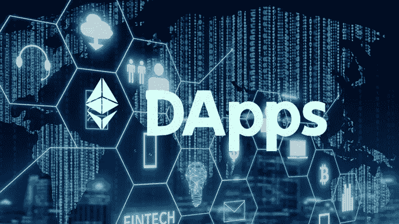
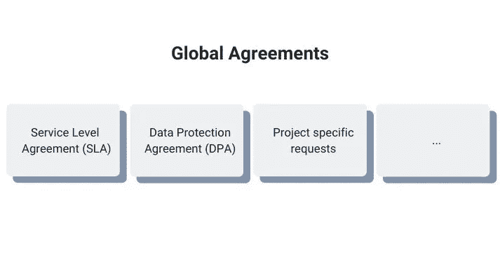
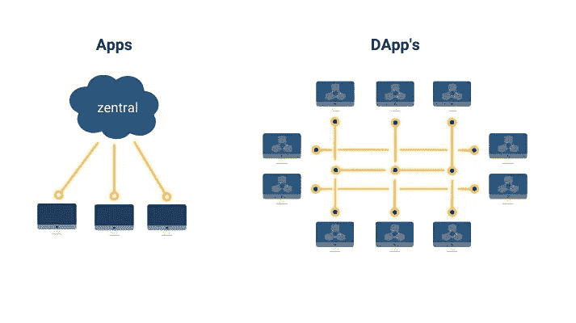
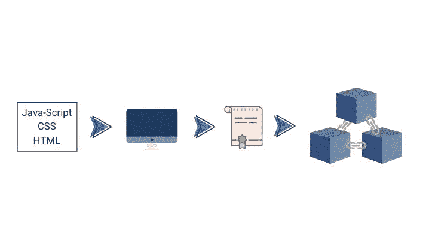

# 简单解释了分散式应用

> 原文：<https://levelup.gitconnected.com/the-decentralized-application-simply-explained-c2bab7081bb>

在本文中，我们解释了什么是分散式应用程序以及它是如何工作的。分散式应用程序(DApp 的简称)运行在对等网络上。在我们的例子中，它可以在以太坊这样的区块链上运行。由于区块链的技术，民主行动党不是由任何中央政党管理。这也意味着我们的 DApp 不需要中央服务器。

# 什么是分散式应用程序(DApp)？

分散式应用程序(DApp 的简称)由在前端可视化并在对等网络上执行的智能合同组成。前端可以是一个网站，由 HTML、CSS 和 JS 代码组成。例如，后端由用 solidity 编写的智能合同组成。我们的 DApp 可以在以太坊区块链上运行，因为它是一个点对点网络。因为分散的应用程序使用区块链技术，所以它们不受中央机构的控制。这意味着我们的 DApp 不需要中央服务器。

# 分散应用的标准

## 1)区块链作为标准

下面的例子应该有助于您理解 DApps 是如何工作的。你可能知道汽车制造商大众。在我们的示例中，他们正在与一家轮胎制造商谈判新合同。建立了像全球协议(GVA)、数据保护协议(DPA)或服务水平协议(SLA)这样的合同。如你所见，有许多政策和合同。因此，这往往会导致合同谈判期间出现分歧和问题。因此，谈判可能需要几个月的时间，并导致高成本。现在让我们比较一下大众和 DApp 的例子。

我们所知的合同谈判是:

**不透明:**由于大量的文档和版本，没有概览。
**不安全:**第三方可以轻易获取通过电子邮件发送的文件。
**不信任:**没有人知道文档是否被更改过

## 与 DApp 的合同谈判

有了 DApp，我们可以轻松解决这些问题。以太坊为此提供了基础。你可以把它比作一个 dropbox。这样，多方可以同时处理一个文档。与 Dropbox 不同，这些文件不在中央服务器上，而是在一个分散的服务器上。结果，每个人都有一份合同。这可以防止未经授权的人在不被注意的情况下更改文件。

借助 Dapp，我们可以实现以下目标:

**透明:**所有参与者都可以处理相同的文档。
**安全性:**区块链的每个人都可以获得文档，并且文档以加密形式存储。

**信任:**为每个文件生成一个哈希。我们信任这个系统，因为文件不会被人不注意地更改。

现在，我们可以使用 DApp 为每个人提供更多的控制和安全性。

# 2)开源作为一个标准

我相信你以前听说过“开源软件”这个术语。该软件有源代码，可以免费获取。这意味着每个人都可以影响软件。所以任何人都可以看到软件并重新编程。

DApp 也有开源代码。这独立于中心实例工作。所以没有管理员决定未来的发展。因此，DApp 必须适应变化或市场反应。只有拥有令牌的选定开发人员才能访问源代码。

# 3)作为标准的表征

令牌是一个数字单位。该单元代表区块链中记录的副本。单词 token 在这个上下文中可以有多种含义，从而实现多种功能。所以函数取决于我们想如何使用令牌。要对 DApp 进行更改，您需要这样一个令牌。

# 4)作为标准的加密

DApps 也需要得到保护，矿工们希望他们的工作得到回报。使用工作证明算法，我们可以创建令牌来奖励矿工。

## 三种类型的分散式应用

第一类:居住在自己区块链上的 DApps。

**2 型:**使用 1 型区块链的 DApps。

**和类型 3:** 当我们使用类型 2 协议时(源代码)。

这三种类型在逻辑上相互依赖。举个例子，让我们用乙醚。它符合 DApp 的所有四个标准。所以它是开源的，有自己的区块链。它使用令牌，也可以生成令牌。

以太坊提供了使用智能合约的可能性。我们用它们来设定某些条件。在他们的帮助下，创造 DApps 是可能的。这方面的例子有天蓝色，假人，或有趣的公平，所有这些都被归类为类型 2。例如，Type 3 是一款使用 Azure 基础设施的应用。在了解了不同的标准和类型之后，我们仍然需要知道分散式应用程序是如何工作的。

# 分散式应用程序是如何工作的

我们可以通过智能合同提供我们自己的 DApp。它们基于以太坊。

DApp 是一种工具，智能合约允许我们连接到区块链。

我们用一个简单的例子来解释。网站通常使用 HTML、Java 或 CSS 等编程语言来显示页面。我们还需要来自数据库的数据来使用 API。例如，当你访问脸书时，网站调用一个 API。然后它会显示您需要的信息。

DApps 的工作方式类似于网站。主要区别在于没有连接到数据库的 API。相反，您有一个连接到区块链的智能合约。

# Dapp 的优势

一旦你开发了一个 Dapp，你就不能删除它。这是因为它运行在区块链上，因此可以在每一台计算机上运行。
这也意味着别人不能就这样关掉你的 Dapp。
此外，由于 Dapp 运行在 P2P 网络上，因此它不能由单一方控制。因此，你只能在多数人同意的情况下做出改变。
因为 Dapp 不在中央服务器上，所以它也没有停机时间。
另一个优势是 Dapp 通过代币自我维持。共识机制确保一切正常运行。

Dapps 的行业

*   银行业务
*   人工智能
*   物联网
*   增强现实
*   社会化媒体
*   旅行
*   医学的
*   政府
*   众筹
*   贸易

# 总结:分散应用

DApps 运行在对等网络上。标准是区块链、开源、加密和令牌。代币奖励矿工的工作。有三种不同类型的 DApps。智能合约连接到区块链。因此，它构成了分散应用程序的基础。

我在每月一期的[时事通讯中分享了更多私密的想法，你可以在这里查看](https://mailchi.mp/bf8f8e8ed697/keep-in-touch-with-lukas)。请在评论中告诉我，让我们通过 [Patreon](https://www.patreon.com/lukaswiesflecker) 构建你的密码世界。在各种社交媒体平台上加入我:

[Twitter](https://twitter.com/WiesfleckerL)●[insta gram](https://www.instagram.com/lukaswiesflecker/)●[Patreon](https://www.patreon.com/lukaswiesflecker)●[脸书](https://www.facebook.com/lukaswiesfleckerr)●[Snapchat](https://www.snapchat.com/add/luggooo)●[LinkedIn](https://www.linkedin.com/in/lukas-wiesflecker-1b11251a5/)