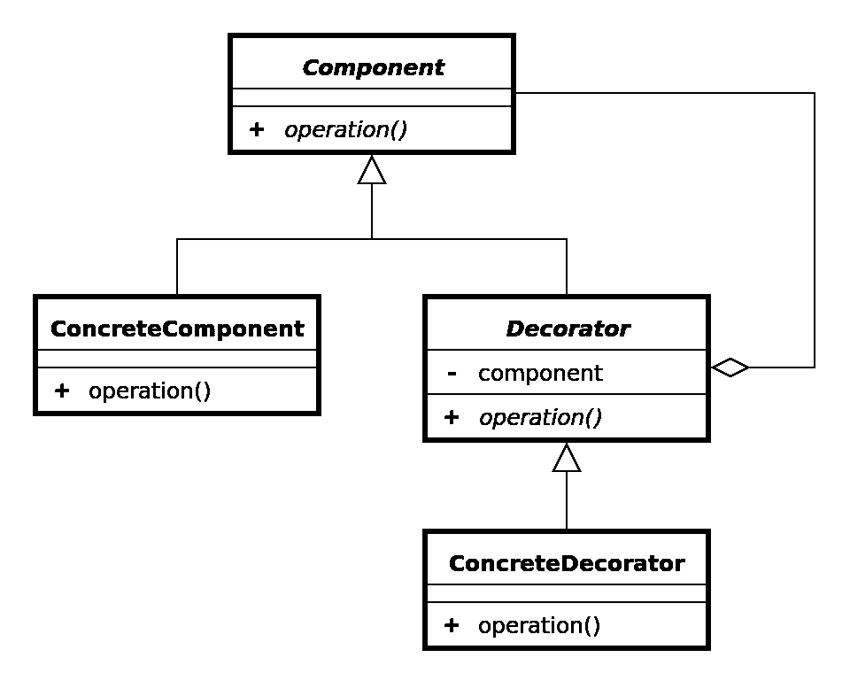

# Go 中的装饰模式

> 原文：<https://levelup.gitconnected.com/the-decorator-pattern-in-go-66ed951b0f7c>

最终产品出奇地令人满意。


装饰模式是创建前瞻性代码的一种非常有用和灵活的技术。它允许您在运行时而不是编译时动态地向对象添加功能。这意味着您不必手动编写新代码来扩展对象的特性集，您可以简单地使用 decorator 模式来添加您需要的行为！

它还解决了被广泛的子类架构所限制的问题。装饰模式没有迷失在继承中，而是使用了许多更小的类(在 Go 的情况下是 structs ),以便将功能包装在其他对象周围。这样，我们可以拥有许多具有不同功能的对象，而不必定义每个单独的类。

我们将把这篇文章分成三个部分，包括用例、UML 图和装饰模式的实现。

## 用例

装饰器模式可以应用于各种各样的情况和场景。其中包括:

*   购物车——每个商品都可以包装在一个中央客户订单对象上，以便跟踪总订单价格。
*   数据流—当您传输数据时，您可能会发现您需要加密、压缩或格式化行为的各种组合，这取决于客户端的需求。
*   遗留代码——如果您有一个无法更改但需要扩展其功能的对象，那么您可以使用 Decorator 模式来实现。

## UML 图

这种模式需要一个非常紧凑的图表。从顶层开始，组件接口需要实现方法`operation()`。这是由 ConcreteComponent 和 Decorator 对象本身完成的。注意 Component 和 Decorator 之间的聚合关系，这意味着一个组件可以有零到多个 Decorator，但是一个 Decorator 不能没有 Component 而存在。



本质上，我们有一个组件接口，其最基本的形式是由 ConcreteComponent 实现的。然后装饰器可以由 ConcreteDecorator 实现，并包装在 ConcreteComponents 周围。

## Go 中的实现

想象一下，你拥有一家比萨饼店，必须处理任何一种比萨饼的价格。你能定义每一种可能的比萨饼并决定每一种的价格吗？不要！你可能会在一个普通比萨饼上标明价格，然后根据添加的配料提高价格。这就是 Decorator 成为一个非常有用的模式的原因。

让我们构建我们的项目结构。

```
$ mkdir decorator-pattern-go
$ cd decorator-pattern-go
$ touch main.go pizza.go toppings.go
```

## 披萨，去吧

首先，我们用`getPrice()`和`getCalories()`方法定义了一个`pizza`接口，作为我们的组件。然后，我们定义了代表具体组件的`cheesePizza`结构。这是我们将要制作的比萨饼的最基本版本。

然后，我们用`newCheesePizza()`创建 Go 版本的构造函数，该构造函数返回对一个`cheesePizza`的引用，该引用包含卡路里数及其价格的初始值。

最后，我们通过将对`cheesePizza`的引用传递给`getPrice()`方法来实现`pizza`接口。由于`cheesePizza`是我们的基本具体组件，我们只返回它的价格(我们稍后将添加它)。

## 浇头，开始

接下来我们定义浇头。这里没有发生太多的事情，实际上只是一些我们一遍又一遍重新定义的操作。

首先，我们定义给定配料的不变价格和卡路里数。接下来，我们将 topping 定义为一个结构，并从它扩展`pizza`接口。

最后，我们通过向`getCalories()`和`getPrice()`方法传递一个 toppings 引用来实现`pizza`接口。它们只是返回基本的比萨饼价格/卡路里数，然后添加我们定义的常数。很简单吧？

## main.go

为了完成我们的项目，我们可以实现作为客户端的 main.go 文件。你看到我们是如何从底部开始，然后用浇头包裹它的吗？每次我们这样做，我们就增加了比萨饼的总热量和价格。这是装修！

注意，当我们用浇头包装`cheesePizza`时，`getPrice()`和`getCalories()`方法执行添加到基础价格和卡路里值的调用链。

如果我们运行这个项目，我们将得到以下输出。

```
$ go run *.go
Price of theBombPizza is $15.25 with 1050 calories.
Price of pepperoniPizza is $11.75 with 700 calories.
```

我个人认为，当你得到最终结果时，装饰者模式是如此令人满意。:)

装饰模式允许我们动态地向对象添加功能。这避免了我们需要定义无数特定的结构/类类型，并允许我们的代码更加动态。然而，某些缺点可能包括大量的辅助对象和重复代码，所以明智地选择您的模式吧！

我希望你喜欢阅读这篇文章，并学到一些新的东西。如果有你喜欢的或想听更多的部分，请在下面留下评论！感谢阅读。