# 为 Visual Studio 项目编译和链接 Boost C++库的权威指南

> 原文：<https://levelup.gitconnected.com/the-definite-guide-on-compiling-and-linking-boost-c-libraries-for-visual-studio-projects-c79464d7282d>


这就是路，我们的路……—照片由 [Unsplash](https://unsplash.com/s/photos/river-path?utm_source=unsplash&utm_medium=referral&utm_content=creditCopyText) 上的 [Fotis Fotopoulos](https://unsplash.com/@ffstop?utm_source=unsplash&utm_medium=referral&utm_content=creditCopyText) 拍摄

最近，出现了将包含相当多自定义实现功能的遗留 C++代码库迁移到更健壮的架构中的需求。在搜索了一段时间后，我们决定包含 Boost 库，因为它们提供了大量的实用工具。

大多数 C++ Boost 库都是只有头文件的；它们完全由头文件组成，不需要单独编译的库二进制文件。但是，有一些库需要单独构建。Boost 网站上的“[入门](https://www.boost.org/doc/libs/1_76_0/more/getting_started/windows.html)”指南信息量很大，但没有提供如何针对多种架构和目标进行构建(调试/发布)的明确指导。我们使用 Visual Studio 作为我们的 IDE，寻找构建这些二进制文件的最佳方式是相当累人的。

**出于这个原因，我们专门介绍了如何在 Visual Studio 项目中构建和链接 C++ Boost 库。**

# 下载 Boost 库

要获得 Boost 的最新版本(或任何其他版本)，请前往[官方下载页面](https://www.boost.org/users/download/)。我们的目标是 Windows 平台，所以我们需要选择各自的版本。“入门”指南建议下载 [7-Zip](http://www.7-zip.org) 归档文件。

> 我们不再推荐。zip 文件，因为它们是等效的. 7z 文件的两倍大。我们不建议使用 Windows 的内置解压缩，因为它对于大型归档文件来说非常慢。—“[Windows](https://www.boost.org/doc/libs/1_76_0/more/getting_started/windows.html#zip)入门”，[www.boost.org](http://www.boost.org)

目前的版本是 1.76.0，但是我们将遵循的方法适用于任何版本。

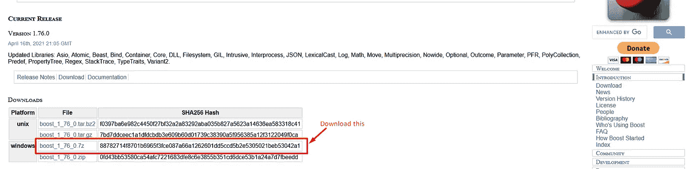

成功下载归档文件后，我们需要将包含它的文件夹解压缩到所需的位置。

文档假设任何库版本的路径都在`C:\Program Files\boost`中，所以我们会尊重这一点。在`C:\Program Files\`中创建一个名为`boost`的目录，并在那里解压文件。

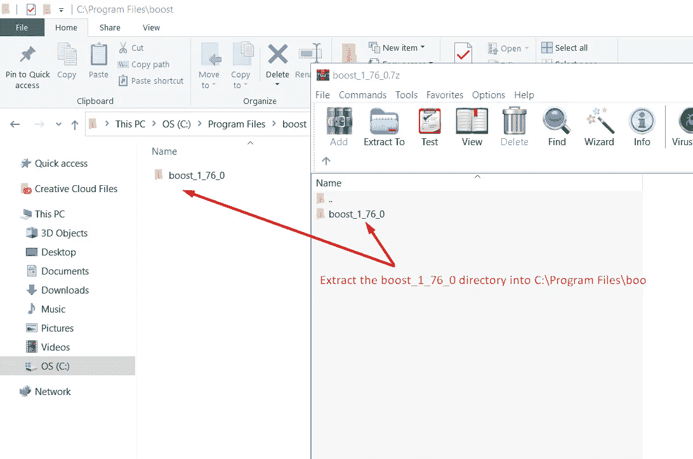

# 构建二进制文件

Boost 库包含了一个非常好的构建系统，我们肯定会使用它。构建系统是从命令行触发的。首先，我们必须打开`cmd`窗口，导航到 Boost 库的根文件夹。

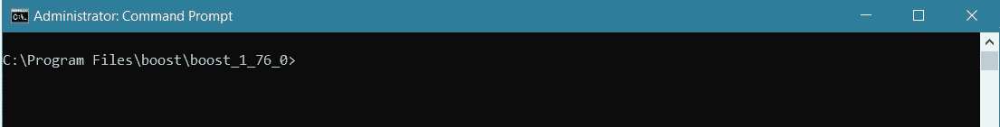

然后我们必须通过运行`bootstrap.bat`文件来初始化构建系统。

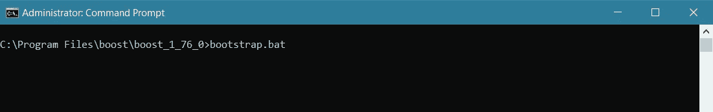

引导完成后，就该构建实际的二进制文件了。记住我们之前说过的:我们必须建造

*   x64 架构的工件
*   x86 架构的工件
*   工件进行静态链接(即`.lib`文件)
*   用于动态链接的工件(即`.dll`文件)
*   发布工件
*   调试工件

一般来说，我们需要触发 8 个构建。幸运的是，build 命令允许我们在一个构建中指定多个目标。最后，我们将只触发两个构建，每个架构类型一个。

## 面向 x86 架构的构建

在您的终端中运行以下命令:

```
b2 --build-dir=build\x86 address-model=32 threading=multi --stagedir=.\bin\x86 --toolset=msvc -j 16 link=static,shared runtime-link=static,shared --variant=debug,release
```

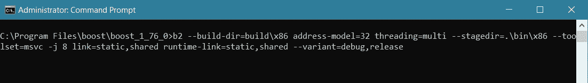

这个命令将构建二进制文件并放入`C:\Program Files\boost\boost_1_76_0\bin\x86\lib\`。输出将包含我们大多数项目可能需要的所有必需文件。

## 为 x64 架构构建调试

在您的终端上执行以下命令:

```
b2 --build-dir=build\x64 address-model=64 threading=multi --stagedir=.\bin\x64 --toolset=msvc -j 8 link=static,shared runtime-link=static,shared --variant=debug,release
```

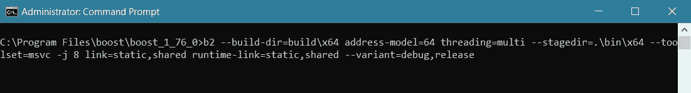

该命令将构建二进制文件并将其放入`C:\Program Files\boost\boost_1_76_0\bin\x64\lib\`中。和以前一样，输出将包含我们大多数项目可能需要的所有必需文件。

# 解释构建命令参数

让我们快速看一下前两个命令中使用的参数。

*   `--build-dir`:指定构建时放置所有中间文件的目录。
*   `address-model`:指定目标地址模型。
*   `threading`:编译 Boost 以支持线程。(更多信息请参见[stack overflow](https://stackoverflow.com/questions/20859761/what-exactly-does-threading-multi-do-when-compiling-boost)上的这个问题。)
*   `--stage-dir`:放置二进制文件的目录。
*   `--toolset`:将用于构建工件的编译器和链接器。我们选择了`msvc`；这应该是 Windows 上的默认设置，但是如果我们在系统上安装了更多的编译器，最好显式地定义它。
*   `-j`:构建要用多少线程。这可以极大地改善多线程环境(即大多数现代机器)的构建时间。
*   `link`:声明一个库目标。
*   `runtime-link`:静态/动态链接到 C++标准库和编译器运行时支持库。
*   `--variant`:编译调试或者发布二进制版本。

# 包括 Visual Studio 上的 Boost 库

为了能够在 Visual Studio 中使用 Boost 库，我们必须在每个单独的项目属性中定义根路径，即`C:\Program Files\boost\boost_1_76_0`。在本指南中，我们使用 Visual Studio 2019，但这一过程也可以应用于旧版本。要包含库，请执行以下操作:

**在 Visual Studio 解决方案上** → **选择要添加库的项目到** → **右键** → **“属性”**

现在应该会打开“属性”窗口。下面附有一个例子:

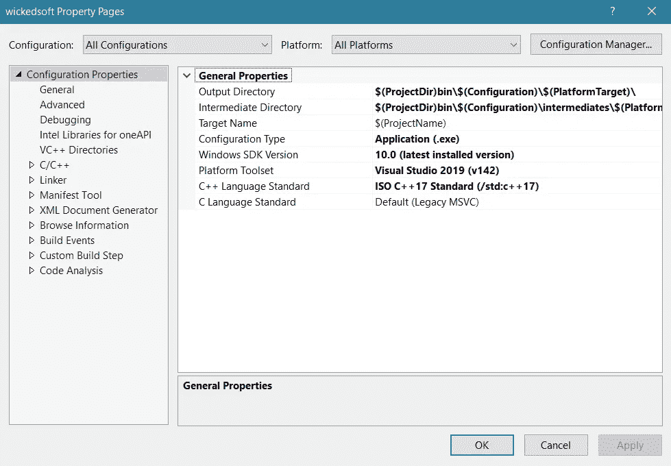

在我们继续之前，花点时间确保“*配置*”和“*平台*”值都被选中，如下图所示。这将应用我们将要对所有平台进行的更改。

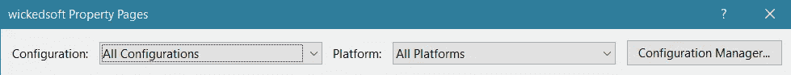

我们将修改**“C/c++”→【常规】**属性的“**附加包含目录**”选项。

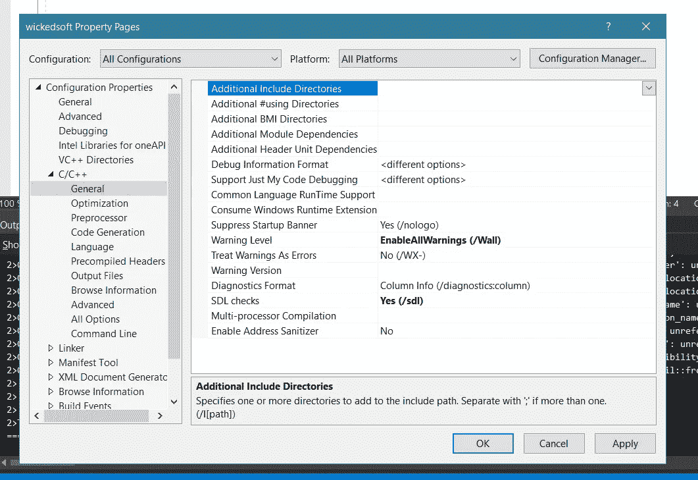

选择下拉按钮然后点击**编辑<..>T25。**

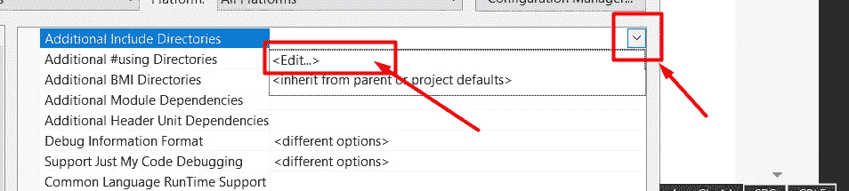

现在我们必须添加库路径并点击 OK。

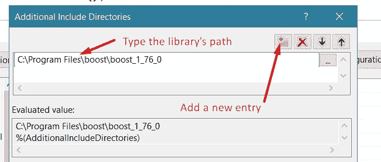

选项值应该更新，如下图所示。

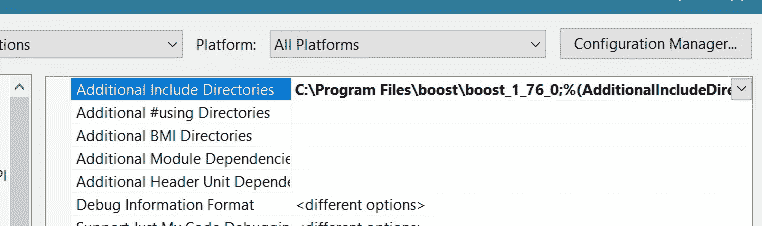

注意`%(AdditionalIncludeDirectories)`宏自动包含在值中。这是意料之中的，包括系统指定的一些默认值。

我们已经准备好使用大多数 Boost 库。我们可以毫无问题地将它们包含在源代码中。然而，如果我们使用需要链接的库(如`boost/chrono`、`boost/thread`等)，我们必须将之前构建的二进制文件链接到链接器。

# 在 Visual Studio 上链接 Boost 库

这是我们旅程的最后一步。我们唯一要做的就是告诉链接器包含我们的二进制文件。像以前一样，打开属性窗口:

**在 Visual Studio 解决方案上** → **选择你想要添加库的项目** → **右键** → **【属性】**


在我们继续之前，花点时间确保“*配置*”和“*平台*”值被选中，如下图所示。这将应用我们将要对所有平台进行的更改。


我们将修改**“链接器”→“常规”**属性的“**附加库目录**”选项。

*(注:如果您的项目构建了一个静态库，那么“* ***链接器*** *”菜单将显示为“* ***库管理器*** *”。)*

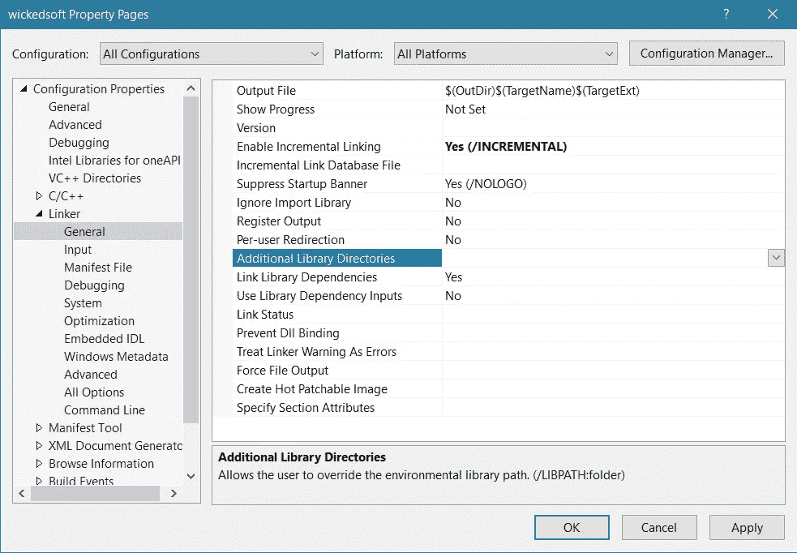

选择下拉按钮然后点击**编辑<..>。**

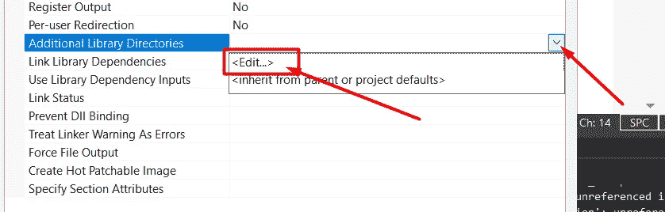

添加以下值:`C:\Program Files\boost\boost_1_76_0\bin\$(PlatformTarget)\lib`，并点击 OK。

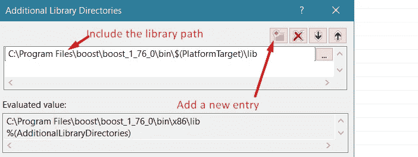

属性值应该更新，如下面的屏幕截图所示。

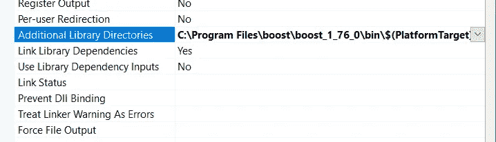

快速记下`$(PlatformTarget)`宏。回想一下，当我们构建目标并创建两个目录时，每个架构一个目录。该宏根据所选的构建平台定义要使用的正确文件夹。

注意`%(AdditionalLibraryDirectories)`宏被自动包含在值中。这是意料之中的，包括系统指定的一些默认值。

# 测试 boost 库

我们现在应该能够在 x86 和 x64 架构中构建和运行我们的项目，目标是调试和发布版本。如果你想要一个快速的测试程序，我们从`boost/chrono`库中提供了下面的例子。

下面是使用*调试*和 *x64* 的运行示例截图:

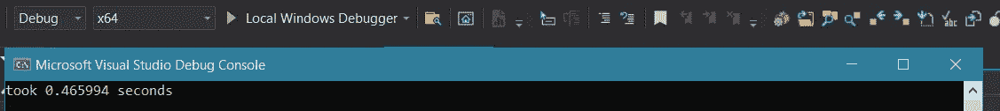

# 结论

在本指南中，我们描述了如何在 Windows 中设置 Boost C++库并将它们链接到 Visual Studio 项目中。我们试图尽可能详细地解释。我们想为将来可能遇到和我们一样问题的读者提供一个统一的参考。

最后，我们通知读者，我们在多个项目上测试了本文提供的所有步骤，没有任何问题。但是，如果您有不同的设置，这可能会也可能不会导致问题。如果是这种情况，请随意评论您的问题或指出您遇到的任何模糊之处。

我计划将来写更多关于项目组织和软件开发的文章。随意发表你可能想阅读的建议和文章想法。